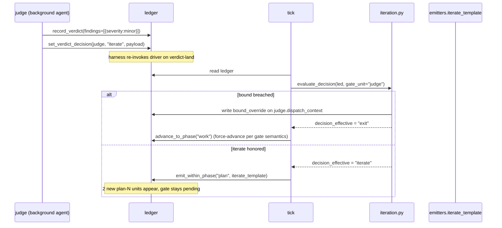

# auto v0.3.0 — Outcomes-Gated Emission

## Overview

v0.3.0 ships **iterate-until-predicate as a generalized verb** for auto recipes. A recipe declares an iteration block; the gate unit's verdict carries a `decision: "advance" | "iterate" | "exit"` enum the engine reads directly; the engine enforces bounds (max_attempts + optional max_wall_seconds, pause-aware); re-emission uses recipe-declared templates with a `reset_for_iteration` mutator that cycles the gate unit back to pending atomically with the emit. A2 (Parallel Theories + Judge) and A4 (Adversarial Pair + Comparator) convert from round-gated to outcomes-gated.

A3 (Build-First Feedback) and the a1 description rename defer to v0.3.1 — research falsified the brainstorm's phase-grammar assumption for A3, and the doc-review surfaced the a1 rename as a marketing-truth fix unrelated to v0.3.0's identity bet. v0.3.0 stays tightly scoped to the iteration primitive on existing phase orderings.

**Three load-bearing architectural decisions** the round-2 doc-review made explicit (previously deferred, now pinned in Key Technical Decisions):
- **A. Iteration check fires BEFORE the predicate-met short-circuit** in `_tick_body`, and suppresses the short-circuit when iteration is pending. Otherwise the work-loop's `met=True` after the gate writes verdict-returned would exit as "done" before iteration logic runs.
- **B. The predicate composes with iteration via a new `iteration_pending` field** on `exit_predicate_result`. `met = met AND NOT iteration_pending`. Without this, new plan-N units emitted while loop_phase=work don't block work-phase met.
- **C. The gate unit cycles back via `reset_for_iteration(gate_unit_id, new_depends_on)`** — an atomic mutator that flips state pending and extends depends_on to include newly-emitted siblings. Without this, the work-loop closure pattern's "re-review the same unit" doesn't generalize to iteration's "spawn siblings + re-engage gate."

---

## Problem Frame

v0.2.0's A2 and A4 are **structurally round-gated**: their `units[]` arrays bake cardinality into the recipe at init. If A2's judge finds all 3 theories weak, the engine cannot spawn 2 more theories and re-judge. If A4's comparator is undecided, the engine cannot add a third bias dimension. This cuts against auto's identity — auto's whole value proposition is durability + outcomes-gating, and the work-loop's closure pattern (verdict → fix → re-review → … until only minors remain) already proves the engine can iterate-until-predicate. v0.3.0 lifts that pattern UP a level to the plan/judge/comparator layer.

The v0.2.0 round-2 review explicitly flagged this as "dynamic emission has no producer" (per [[feedback_ce_plan_round2_exposed_producer_gap]]) and deferred A3 because it drove ~40% of engine surface. v0.3.0 closes the producer gap.

---

## Requirements Trace

- R1. A gate unit's verdict carries a `decision: "advance" | "iterate" | "exit"` enum. Engine reads it directly (no string DSL, no CLI override). (origin R1)
- R2. Recipes declare iteration via a new top-level `iteration: {gate_unit, emit_template, bound}` field. (origin R2)
- R3. Recipes declare `emit_templates: {<name>: {phase, invokes, id_prefix}}` parallel to `units`. (origin R3)
- R4. The engine enforces bounds BEFORE honoring `decision: "iterate"`. Bound breach overrides to `exit` and surfaces the override in the run report. (origin R4)
- R5. Active wall-time accounting: `max_wall_seconds` counts active time only. New ledger fields `active_wall_seconds` + `last_active_at`. Pauses do not burn budget. (origin R5)
- R6. The new iteration loop composes with the existing exit predicate — both can fire, they operate on different units and at different times. (origin R6)
- R7. Backward compatibility: a1 and W keep their current behavior unchanged. `iteration` and `emit_templates` are ADDITIVE. (origin R7)
- R8. **Deferred to v0.3.1.** A3 (Build-First Feedback) does NOT ship in v0.3.0 — research falsified the brainstorm assumption that A3 needed no engine changes beyond `transition_and_emit`. Phase-grammar generalization (whitelist relaxation + LOOP_PHASES + string-literal audit) becomes a v0.3.1 scope. (origin R8, reshaped)
- R9. Operator-facing diagnostics: `tick.py::_operator_guidance_for` gains iteration-aware messages (last-attempt warning; bound-override naming). (origin R9)
- R10. Every iteration-aware recipe ships with GREEN + ITERATE + BOUND integration tests, each with a deliberate-fail control per [[feedback_new_tests_need_deliberate_fail_smoke_check]]. (origin R10)

**Origin actors:** A1 (operator running /auto), A2 (recipe author), A3 (auto engine).
**Origin flows:** F1 (outcomes-gated A2 run), F2 (outcomes-gated A4 run); F3 (A3 build-first feedback) deferred with R8.

---

## Scope Boundaries

- No new adapter ops. Adapter contract is unchanged.
- No new CLI flags (`--max-attempts`, `--until '<predicate>'`). Bounds live in the recipe.
- No predicate-string DSL on the CLI. The recipe is the single source of declaration; the gate unit's `decision` field is the engine's read.
- No A3 in v0.3.0 (see R8). The brainstorm's "full extension" framing is honored for everything EXCEPT A3, which is structurally separable and benefits from iteration usage data first.
- No cost-based bounds (`max_tokens`, `max_cost_usd`) — out of scope; the engine doesn't see Anthropic token counts today.
- No cross-iteration learning (gate units don't see prior iterations' findings beyond what the ledger shows them).

### Deferred to Follow-Up Work

- **A3 (Build-First Feedback) + phase-grammar generalization:** v0.3.1. Relax `_V1_ALLOWED_PHASE_ORDERS` in `lib/recipes.py`, generalize `LOOP_PHASES` in `lib/ledger.py` to be recipe-driven, audit the ~7 remaining string-literal phase comparisons (`lib/ledger.py:348-349, 357, 392-396, 404-408, 455, 703`; `lib/tick.py:565-617`), ship `recipes/a3.json`. v0.3.0 leaves these intact and works WITHIN them.

---

## Context & Research

### Relevant Code and Patterns

- **`transition_and_emit`** (`lib/ledger.py:830-880`) — atomic advance+emit chokepoint. v0.3.0 either generalizes this OR adds a sibling `emit_within_phase()` that appends units atomically without writing `loop_phase`. Re-emission within the same phase is the new shape (see U2 Approach).
- **`set_winner_unit_id`** (`lib/ledger.py`, added in commit `81de3e0`) — the precedent for "engine writes gate-unit metadata via a sibling mutator, NOT through `record_verdict`'s findings normalize step." v0.3.0's `set_verdict_decision` mirrors this shape.
- **`record_verdict`** (`lib/ledger.py:904`) — normalizes findings to exactly `{severity, note}` (lines 929-934). v0.3.0 does NOT extend this normalization. `decision` lives on `dispatch_context`, written by a sibling mutator.
- **`phase-grammar.py` + AST lint** (`lib/phase-grammar.py`, `tests/unit/phase-grammar-ast-lint.test.sh`) — v0.2.0's mechanism for centralizing a load-bearing decision module + forbidding raw string-literal access outside it. v0.3.0 mirrors this exactly via `lib/iteration.py` + a new AST lint.
- **`emitter registry`** (`lib/emitters.py:165`) — `REGISTRY` dict + `resolve(name)`. The new emitter (`iterate_template`) adds here. `recipes.V1_EMITTER_NAMES` (lines 48-54) must add the same name (an existing test asserts the two sets agree).
- **`detect_and_halt_stalled`** (`lib/tick.py:234-267`) — closest precedent for "engine overrides a model-judged transition." Different shape (state grammar move vs payload interpretation) but the pattern of "engine writes the override + records why" carries.
- **`set_loop` accumulator pattern (NEW)** — no existing accumulator on the ledger today (every existing time field is overwrite-on-write). v0.3.0 introduces the first sum-of-deltas field (`active_wall_seconds`). Pattern: read prev, add delta, write — all inside one `_with_locked_ledger` body.

### Institutional Learnings

(`docs/solutions/` does not exist in this repo yet — the v0.2.0 plan is the institutional corpus. Eight code-anchored learnings from the research pass:)

- **Centralize the decision read + AST-lint it** (mirrors `phase-grammar.py` + KTD-3 from v0.2.0). The dominant build-bug class is "prose contract says X, code doesn't enforce X." Wire EVERY iteration-decision read through one module.
- **Reuse `transition_and_emit`, don't fork it.** Round-1 of v0.2.0 tried this work as two locked writes; the torn-state window almost shipped A2 broken. One atomic body.
- **Loud-via-INTENT guidance** (mirrors fix-pass H). The gate unit's `decision` field is invisible-to-operator without guidance. Every iteration-relevant INTENT block should ride a guidance string.
- **Stall-threshold reaper is the closest forced-decision precedent** (`lib/tick.py:234`). Records WHICH bound breached, surfaces it as `last_error.call`. v0.3.0's bound override mirrors this — record `bound_override = {bound_type, original_decision, at}` on the gate unit.
- **Additive schema migration with read-defaults** (`docs/contracts/ledger-schema.md:102-138`). Pattern: missing field reads as `0` or `null`. No migration script. v0.3.0's `active_wall_seconds` defaults to `0`, `last_active_at` defaults to `null`.
- **Deliberate-fail via Edit tool, not in-script** ([[feedback_deliberate_fail_revert_via_edit_not_inscript]]). For every new behavior, hand-Edit a revert that proves the test goes RED.
- **Recipe validator rejects unknown fields** (v0.2.0 KTD-2). New `iteration` and `emit_templates` fields must be added to `_KNOWN_TOPLEVEL` whitelist; all other unknowns still rejected.
- **Harness re-invocation over polling** (fix-pass G). The iteration check fires on the tick that runs after a gate-unit's `record_verdict` lands — same re-invocation seam, no new polling.

### External References

None. The codebase has strong local patterns; v0.3.0 lifts an existing work-loop closure pattern up a layer.

---

## Key Technical Decisions

### A. Control-flow placement (pinned per round-2 doc-review P0)

- **Iteration check fires in `_tick_body` BEFORE the predicate-met short-circuit at `lib/tick.py:564-576`.** The previous "before the phase-keyed switch at line ~584" siting was unreachable because A2's judge writing verdict-returned makes `recompute_predicate` set met=True (work-phase, all_units_terminal=True, no blockers/majors) and the existing short-circuit exits as "done" before any iteration logic runs.
- **The predicate-met short-circuit is conditional on `NOT exit_predicate_result.iteration_pending`.** A new field on the predicate result. When iteration is pending (the gate unit has `decision: "iterate"` with bound not breached), the short-circuit yields to the iteration check; when iteration resolves (decision: advance/exit or bound breached), the short-circuit fires normally.

### B. Predicate composition with iteration (pinned per round-2 doc-review P0)

- **`recompute_predicate` adds an `iteration_pending: bool` field** to its returned dict. Computed inside the locked-body recompute as: `bool(led.get("iteration") and gate_unit.dispatch_context.decision == "iterate" and ledger["iteration_attempts"] < bound.max_attempts and ledger["active_wall_seconds"] < bound.max_wall_seconds)`. Read by the short-circuit (decision A above) and by `/auto-status`. **New `met` rule**: `met = (prior met conditions) AND NOT iteration_pending`. Without this, new plan-N units emitted while loop_phase=work don't block work-phase met (the work-loop branch filters to current-phase units; pending plan-N units are phase=plan, invisible).
- **Naming clarification per round-3 P1-R3-3:** the bound check reads the TOP-LEVEL ledger field `iteration_attempts` (not a unit-scoped `attempts_made`). U1's `evaluate_decision` return dict surfaces it as `attempts_made` for caller convenience, but the storage location is `ledger["iteration_attempts"]`. The two names refer to the same value; the prose uses `iteration_attempts` to anchor on the storage field.

### C. Gate-unit re-engagement contract (pinned per round-2 doc-review P0; tightened per round-3 P0-R3-1 + P2-R3-1)

- **New mutator `reset_for_iteration(repo, run, gate_unit_id, new_depends_on: list[str])`.** Atomic, single owner of the iteration-state-cleanup. In one `_with_locked_ledger` body: (a) gate unit state flips `verdict-returned → pending`, (b) `depends_on` is replaced with `new_depends_on` (union of old deps + newly-emitted siblings), (c) **`dispatch_context.decision` and `dispatch_context.decision_payload` are cleared** (closes round-3 P0-R3-1 — without this, the next tick re-reads the stale `decision: "iterate"` and re-fires the iteration loop before the gate even re-verdicts; iteration_attempts double-increments until bound trip), (d) `verdict_at` cleared, (e) `findings` cleared.
- The `verdict-returned → pending` edge **already exists** in `ALLOWED_TRANSITIONS` (`lib/ledger.py:84`); v0.3.0 doesn't add a state-grammar edge — round-3 P2-R3-1 surfaced this misdescription. What IS new is the atomic combination of {state-flip + depends_on extend + decision clear + findings clear + verdict_at clear} inside `reset_for_iteration`. The mutator is the engine-only caller for this combo; `record_verdict`'s fix-edge stays separate.
- **Why the decision-clear is load-bearing**: the round-3 reviewer surfaced a fresh dimension of `feedback_plan_documents_transition_code_doesnt_wire_it` — engine reads a payload that survives state transitions without explicit clearing. Centralizing the clear at the reset chokepoint (single owner) is cleaner than adding a state guard inside `evaluate_decision` (every read site has to remember the guard).
- **Why the depends_on update is load-bearing:** orchestrator's `ready_units` would mark the gate ready immediately if depends_on still pointed only at original siblings (all already verdict-returned). The mutator extends depends_on to include newly-emitted ids so the gate waits for the new attempts to land verdicts too.
- **No new judge per iteration.** Considered C.2 (per-iteration judge-1/judge-2 units) and rejected — doubles unit count per iteration; complicates the gate-unit lookup.

### D. Core primitive shape (unchanged from round-1)

- **Iteration check lives in a dedicated `lib/iteration.py` module.** Mirrors `lib/phase-grammar.py`. AST lint forbids raw `verdict["decision"]` / `iteration.bound` reads outside this module (and the ledger writer). Closes [[feedback_plan_documents_transition_code_doesnt_wire_it]] mechanically. Adapter files (`adapter-ce.py`, `adapter-native.py`) read decision via `iteration.read_decision(unit)` — never raw-subscript.
- **`decision` is written via a sibling mutator `set_verdict_decision(repo, run, gate_unit_id, decision, payload?)`, NOT through `record_verdict`.** Findings stay `{severity, note}` only; `decision` lives on `dispatch_context.decision`. Mirrors the `set_winner_unit_id` precedent from v0.2.0 round-2 P0 fix.
- **Re-emission uses a new `iterate_template` emitter** that reads a named template from `ledger["emit_templates"]`. The emitter signature stays pure `(ledger, to_phase) -> list[new_unit_dict]` — emit_templates lookup happens via the ledger dict the emitter receives.
- **Re-emission targets a NEW primitive `emit_within_phase()`**, not `transition_and_emit`. The latter advances loop_phase as a side-effect; iteration stays in the gate unit's phase. New primitive shares `_normalize_unit` and `_with_locked_ledger` with the existing one.
- **Active wall-time uses `time.monotonic()` for accumulation, `_now_iso()` for reporting.** Two clocks, two jobs. Resume: monotonic resets per process (durability handled by the persisted `active_wall_seconds`). New mutator `accumulate_active_time(repo, run, delta_seconds)` called from a `finally` clause around `_tick_body` (NOT inline at each of the 6+ return sites — finally guarantees one accumulation per tick including the except path).
- **Bound override is recorded on `dispatch_context.bound_override`**, NOT a separate top-level field. Mirrors the `winner_unit_id` precedent. The operator on `/auto-status` reads from dispatch_context.
- **Bound-override path skips `advance_to_phase`** and writes `loop_phase="done", driver="manual"` directly via `set_loop`. Otherwise the override would re-invoke the emitter (e.g., `judge_winner_to_work_units` raises on missing winner_unit_id). The bound-exit report is built from the gate's `dispatch_context.bound_override` payload.
- **`iteration.gate_unit` drives the lookup; no more hardcoded `id == "judge"`.** Existing emitters generalize via `gate_unit_id = ledger.get("iteration", {}).get("gate_unit", "judge")` — the default `"judge"` preserves v0.2.0 a2 behavior.
- **`iteration_attempts` is a top-level ledger int field** (added to `init_ledger`), incremented by a new `increment_iteration_attempts(repo, run, gate_unit_id)` mutator. Default 0 on fresh runs; legacy ledgers read via `ledger.get("iteration_attempts", 0)`.
- **Iteration kill-switch fence**: `CLAUDE_AUTO_DISABLE_ITERATION` env hatch (mirror task #31 fence shape). When set, `advance_iteration_loop` returns None unconditionally. Operators can disable iteration without rolling back v0.3.0.
- **`emit_template` ID assignment uses a monotonic counter `iteration_emit_count: int`**, NOT recount-on-resume. The counter only increments; deleted units don't free their ids. Prevents collision on resume after a partial-emit crash.
- **A3 and the a1 rename both deferred to v0.3.1.** A3 deferral per OQ5 falsification (phase-grammar generalization needed). a1 rename per round-2 doc-review — marketing-truth fix unrelated to v0.3.0's identity bet; ships separately in 0.2.x or 0.3.0.1.

---

## Open Questions

### Resolved During Planning

- **OQ1 (emit_template JSON shape):** named templates referenced by id. `emit_templates: {<name>: {phase, invokes, id_prefix}}` parallel to `units`. `iteration.emit_template` references one by name.
- **OQ2 (best-so-far on bound-exit):** surface the LAST gate verdict's payload (if any). The gate's most recent advance/iterate decision payload is the best-so-far state. Recorded in the run report alongside `bound_override`.
- **OQ3 (monotonic clock for resume):** `time.monotonic()` for accumulation, `_now_iso()` for `last_active_at` reporting. Resume: new process, new monotonic baseline, durable `active_wall_seconds` continues counting from the persisted value.
- **OQ4 (emit_template ID conflicts):** RESHAPED per round-2 doc-review. Use a monotonic `iteration_emit_count: int` top-level ledger field. The Nth emit reads the counter, writes the new unit with id `id_prefix + (counter+1)`, increments. Never recount-from-existing-units; never re-use ids on resume.
- **OQ5 (A3 phase grammar):** **FALSIFIED by Phase 1 research.** A3 + phase-grammar generalization moves to v0.3.1 (see Deferred to Follow-Up Work).
- **OQ6 (iteration check siting in `_tick_body`):** RESOLVED per round-2 doc-review. Fires BEFORE the predicate-met short-circuit at `lib/tick.py:564-576`; the short-circuit yields when `exit_predicate_result.iteration_pending` is True. See KTD §A.
- **OQ7 (bound_override location):** RESOLVED per round-2 doc-review. Lives on `dispatch_context.bound_override`. Mirrors the `winner_unit_id` precedent. See KTD §D.
- **OQ8 (gate-unit re-engagement):** RESOLVED per round-2 doc-review. New `reset_for_iteration` mutator atomically flips state to pending, extends `depends_on`, and clears `dispatch_context.decision` + `findings` + `verdict_at`. Re-engagement uses the **existing** `verdict-returned → pending` edge in `ALLOWED_TRANSITIONS` (`lib/ledger.py:84`); the iteration-specific contract is the atomic combination wired by `reset_for_iteration`, not a new state edge. See KTD §C.
- **OQ9 (iteration_attempts wiring):** RESOLVED per round-2 doc-review. Top-level ledger int field added to `init_ledger`; new `increment_iteration_attempts` mutator wires the increment. See KTD §D.

### Deferred to Implementation

- **Whether `emit_within_phase` is a new public function on `lib/ledger.py` or a parameter extension of `transition_and_emit`'s API.** The plan favors a new public function (cleaner API surface, smaller diff). The implementer may collapse if the two end up sharing 90%+ of the body. Behavioral test scenarios are the contract; the function shape is mechanical.

---

## High-Level Technical Design

> *This illustrates the intended approach and is directional guidance for review, not implementation specification. The implementing agent should treat it as context, not code to reproduce.*

**Recipe shape (additive):**

```json
{
  "name": "a2",
  "phase_order": ["plan", "seam", "work"],
  "terminal_phase": "work",
  "units": [
    {"id": "plan-1", "phase": "plan", ...},
    {"id": "plan-2", "phase": "plan", ...},
    {"id": "plan-3", "phase": "plan", ...},
    {"id": "judge", "phase": "work", "depends_on": ["plan-1","plan-2","plan-3"], ...}
  ],
  "phase_transitions": [
    {"from": "plan", "to": "work", "emitter": "judge_winner_to_work_units"}
  ],
  "iteration": {
    "gate_unit": "judge",
    "emit_template": "plan-candidate",
    "bound": {"max_attempts": 5, "max_wall_seconds": 1800}
  },
  "emit_templates": {
    "plan-candidate": {
      "phase": "plan",
      "invokes": {"adapter_op": "next_plan_step"},
      "id_prefix": "plan-"
    }
  }
}
```

**Verdict flow on iterate (mermaid):**



**The bound check is BEFORE the emit.** If breached, no new units land; the engine treats the gate as having said `exit` and advances. This keeps the gate's `dispatch_context.bound_override` payload as the audit trail for "we tried to iterate but bound said no."

---

## Implementation Units

- U1. **`lib/iteration.py` + AST lint — the centralized decision module**

**Goal:** Create the single module every iteration-decision read routes through, with an AST lint forbidding raw `verdict["decision"]` or `dispatch_context["decision"]` reads outside this module + `lib/ledger.py` (the writer). Mechanical enforcement of [[feedback_plan_documents_transition_code_doesnt_wire_it]].

**Requirements:** R1, R4, R6.

**Dependencies:** None (foundation).

**Files:**
- Create: `lib/iteration.py`
- Create: `tests/unit/iteration.test.sh`
- Create: `tests/unit/iteration-ast-lint.test.sh`

**Approach:**
- Module exports: `DECISIONS = ("advance", "iterate", "exit")` constant; `read_decision(unit) -> str | None`; `evaluate_decision(led, gate_unit_id, now_monotonic=None) -> dict` returning `{decision_effective, original_decision, bound_breached: bool, bound_type: str|None, attempts_made: int}`.
- AST lint scans `lib/*.py` for `ast.Subscript` where the slice is the string literal `"decision"` AND the value is a name resembling a verdict/dispatch_context. Whitelist: `lib/iteration.py` (reader) + `lib/ledger.py` (writer in `set_verdict_decision`). Mirrors `tests/unit/phase-grammar-ast-lint.test.sh`.
- `evaluate_decision` reads from `dispatch_context.decision` (per the `set_verdict_decision` write path established in U3). NEVER from `findings[]`.

**Execution note:** Test-first on `evaluate_decision`. Write the four behavior tests (advance / iterate-under-bound / iterate-over-attempts / iterate-over-wall-time) before the function exists.

**Patterns to follow:**
- `lib/phase-grammar.py` (centralized phase decision module)
- `tests/unit/phase-grammar-ast-lint.test.sh` (AST lint shape)

**Test scenarios:**
- Happy path — Covers R1. Gate unit has `dispatch_context.decision = "advance"` → `evaluate_decision` returns `{decision_effective: "advance", bound_breached: false}`.
- Happy path — Covers R1. Gate unit has `decision = "iterate"`, `attempts_made = 2 < max_attempts = 5`, wall-time within bound → returns `{decision_effective: "iterate", bound_breached: false}`.
- Bound — Covers R4. Gate unit has `decision = "iterate"`, `attempts_made = 5 == max_attempts = 5` → returns `{decision_effective: "exit", bound_breached: true, bound_type: "max_attempts", original_decision: "iterate"}`.
- Bound — Covers R4. Gate unit has `decision = "iterate"`, `active_wall_seconds = 1900 > max_wall_seconds = 1800` → returns `{decision_effective: "exit", bound_breached: true, bound_type: "max_wall_seconds"}`.
- Edge case — Gate unit has no `dispatch_context.decision` (never set) → `read_decision` returns `None`, `evaluate_decision` returns `{decision_effective: None}` (engine treats as "no iteration in flight").
- Error path — Gate unit id not in ledger → raises clear error.
- DELIBERATE-FAIL — Hand-Edit `lib/iteration.py` to read `verdict["decision"]` (raw subscript) outside the writer/reader whitelist; assert the AST lint catches it. Restore via Edit per [[feedback_deliberate_fail_revert_via_edit_not_inscript]].

**Verification:**
- `bash tests/run.sh all` includes the 7 scenarios above; AST lint includes the deliberate-fail control.
- `grep -rE 'verdict\["decision"\]|dispatch_context\["decision"\]' lib/` returns only `lib/iteration.py` and `lib/ledger.py` (the writer).

---

- U2. **`lib/ledger.py` — emit_within_phase + iteration fields + 5 new mutators**

**Goal:** Extend the ledger with the write paths v0.3.0 needs. Per round-2 doc-review the surface is wider than round-1 priced: in addition to `emit_within_phase`, `set_verdict_decision`, and `accumulate_active_time`, v0.3.0 needs `reset_for_iteration` (gate cycle-back per KTD §C, using the existing `verdict-returned → pending` edge in `ALLOWED_TRANSITIONS` with `reset_for_iteration` as the engine-only caller for the atomic re-engagement combination) and `increment_iteration_attempts` (bound-counter wire per KTD §D). All atomicity-clean via `_with_locked_ledger`.

**Requirements:** R1 (decision write), R2 (iteration field validated against ledger shape), R4 (bound override write + bound-counter), R5 (active wall-time fields), R6 (predicate_iteration_pending field).

**Dependencies:** U1 (the iteration module is the reader these mutators feed).

**Files:**
- Modify: `lib/ledger.py`
- Modify: `docs/contracts/ledger-schema.md` (additive — document the new fields and mutators)
- Modify: `tests/unit/ledger.test.sh`

**Approach:**
- Add four new top-level ledger fields to `init_ledger` (around line 671-688):
  - `active_wall_seconds: int = 0`
  - `last_active_at: str | None = None`
  - `iteration_attempts: int = 0` (per KTD §D; referenced by U4's bound check)
  - `iteration_emit_count: int = 0` (per KTD §D; the monotonic emit-id counter that replaces the recount-on-resume idea from OQ4)
- Backward-compat reads use `ledger.get(<field>, <default>)` everywhere — never raw subscript. Document the convention in `ledger-schema.md`.
- Extend `recompute_predicate` to set `iteration_pending: bool` on the returned dict per KTD §B. Computed inside the locked-body recompute as: `bool(led.get("iteration") and gate_unit.dispatch_context.get("decision") == "iterate" and led.get("iteration_attempts", 0) < led["iteration"]["bound"]["max_attempts"] and led.get("active_wall_seconds", 0) < led["iteration"]["bound"].get("max_wall_seconds", inf))`. The fields are top-level on the ledger (`iteration_attempts`, `active_wall_seconds`), not unit-scoped — per round-3 P1-R3-3. Update the existing `met` rule: `met = (existing met conditions) AND NOT iteration_pending`.
<!-- v0.3.0 does NOT mutate ALLOWED_TRANSITIONS. The `verdict-returned → pending` edge ALREADY exists at lib/ledger.py:84 (`"verdict-returned": {"fixed", "pending"}`). What's new is `reset_for_iteration` as the engine-only caller for the atomic re-engagement combination — see KTD §C. -->
- ALLOWED_TRANSITIONS is UNCHANGED in v0.3.0. The existing `verdict-returned → pending` edge (`lib/ledger.py:84`) is what `reset_for_iteration` uses; no grammar extension needed.
- Add `set_verdict_decision(repo, run, gate_unit_id, decision: str, payload: dict | None = None)` mutator. Writes `dispatch_context.decision` + optional `dispatch_context.decision_payload`. Validates `decision in iteration.DECISIONS` (import from U1). Mirrors `set_winner_unit_id` shape exactly.
- Add `set_bound_override(repo, run, gate_unit_id, bound_type: str, original_decision: str)` mutator. Writes `dispatch_context.bound_override = {bound: bound_type, original_decision, at: _now_iso()}`. Engine-only caller (U4's `advance_iteration_loop`).
- Add `accumulate_active_time(repo, run, delta_seconds: float)` mutator. Atomic read-add-write: `ledger["active_wall_seconds"] += round(delta_seconds, 3)` and `ledger["last_active_at"] = _now_iso()`. Inside one `_with_locked_ledger` body. **CALLED FROM A `finally` CLAUSE** in U4 — NOT inline at each tick-return site.
- Add `emit_within_phase(repo, run, to_phase, emitter)` primitive. Same shape as `transition_and_emit` but does NOT write `loop_phase`. Calls emitter, validates ids, normalizes, appends. Increments `iteration_emit_count` for each emitted unit. The emitter receives the current counter via the ledger dict it reads (so id assignment is `id_prefix + (counter+1)`).
- Add `increment_iteration_attempts(repo, run, gate_unit_id)` mutator. Atomic `ledger["iteration_attempts"] += 1`. Called by U4 on every iterate decision (before the bound check fires for the NEXT attempt).
- Add `reset_for_iteration(repo, run, gate_unit_id, new_depends_on: list[str])` mutator per KTD §C. Atomic, single owner of iteration-state-cleanup. Inside one `_with_locked_ledger` body: (a) `units[gate].state = "pending"` (validates the existing verdict-returned → pending edge; raises if grammar violated), (b) `units[gate].depends_on = list(new_depends_on)`, (c) **clear `units[gate].dispatch_context["decision"]` and `units[gate].dispatch_context["decision_payload"]`** (closes round-3 P0-R3-1 — stale `decision: "iterate"` would otherwise re-fire the iteration loop on subsequent ticks before the gate re-verdicts), (d) clear `units[gate].verdict_at`, (e) clear `units[gate].findings`. Engine-only caller (U4 via the composite helper below).
- Add `atomic_iterate_step(repo, run, gate_unit_id, emitter, new_depends_on)` composite mutator per round-3 P1-R3-1. Wraps THREE writes into ONE `_with_locked_ledger` body: (1) `iteration_attempts` increments, (2) emitter runs and emit-results are appended via the same body (mirrors `transition_and_emit`'s in-locked-body emit pattern; updates `iteration_emit_count` atomically), (3) gate-unit reset (state/depends_on/decision-clear/findings-clear). All-or-nothing: a crash before completion leaves the ledger in pre-iterate state (the locked write is atomic per the I-1 invariant). Replaces U4's earlier "composite atomic boundary" phrase (which described intent, not mechanism). Engine-only caller (U4's `advance_iteration_loop`).

**Execution note:** Test-first on the new mutators. Each should have an atomic-write test proving I-1 (predicate recomputed) holds. Especially `reset_for_iteration` — its atomic combination of state-flip + depends_on + clear-decision + clear-findings + clear-verdict_at is the load-bearing contract (the underlying `verdict-returned → pending` edge already exists; the new contract is the combo).

**Patterns to follow:**
- `set_winner_unit_id` (precedent for sibling-mutator decision writes — sibling mutator pattern from v0.2.0 round-2 P0 fix)
- `transition_and_emit` (the locked-body+emit pattern, minus the loop_phase write)
- `transition`'s state-grammar enforcement at the existing edge sites — `reset_for_iteration` validates the existing `verdict-returned → pending` edge the same way (the edge is already in `ALLOWED_TRANSITIONS`; the mutator just routes through it)

**Test scenarios:**
- Happy path — `set_verdict_decision(led, "judge", "iterate")` → `dispatch_context.decision == "iterate"`. Predicate recomputed (I-1) and `iteration_pending = True`.
- Happy path — `accumulate_active_time(led, 12.5)` → `active_wall_seconds == 12.5`, `last_active_at` populated.
- Happy path — `accumulate_active_time` called twice (5.0, 7.5) → `active_wall_seconds == 12.5`. Idempotent semantics: each call adds delta, never overwrites.
- Happy path — `emit_within_phase(led, "plan", iterate_template_emitter)` adds 2 new units with `phase="plan"`, `loop_phase` UNCHANGED, `iteration_emit_count += 2`.
- Happy path — `increment_iteration_attempts(led, "judge")` → `iteration_attempts == 1`. Two calls → 2.
- Happy path — `reset_for_iteration(led, "judge", ["plan-1","plan-2","plan-3","plan-4","plan-5"])` → judge state == "pending", depends_on == new list, findings cleared, verdict_at == None.
- Happy path — Full predicate composition: after `set_verdict_decision("iterate")` + iteration_attempts < max, `recompute_predicate` returns `{met: false, iteration_pending: true}`. After `increment_iteration_attempts` brings count to max, recompute → `{met: <existing rules>, iteration_pending: false}` (bound breached; not pending anymore).
- Edge case — `set_verdict_decision(led, "judge", "garbage")` → raises (decision not in DECISIONS enum).
- Edge case — `set_verdict_decision(led, "nonexistent", "iterate")` → raises (unit id not in ledger).
- Edge case — `emit_within_phase` emitter returns a unit with an id that collides with an existing unit → raises (mirror `transition_and_emit`'s collision check).
- Edge case — `reset_for_iteration` called on a unit not currently verdict-returned (e.g., still dispatched) → raises with "transition verdict-returned → pending requires source state verdict-returned" (state-grammar violation).
- Integration — Full atomic cycle inside `_with_locked_ledger`: `set_verdict_decision("iterate") + set_bound_override("max_attempts", "iterate") + emit_within_phase() + reset_for_iteration()` all land in one tick with predicate recomputed after each.
- Backward compat — Covers R7. A v0.2.x ledger (no `active_wall_seconds`, no `last_active_at`, no `iteration_*`) read by v0.3.0 code returns defaults via `.get()`. No migration needed.
- DELIBERATE-FAIL — Hand-Edit `accumulate_active_time` to overwrite instead of add; assert "two calls accumulate" test goes RED. Restore.
- DELIBERATE-FAIL — Hand-Edit `reset_for_iteration` to NOT clear findings; assert "iteration starts fresh" test goes RED (findings from prior round leak into next iteration). Restore.
- **DELIBERATE-FAIL — Hand-Edit `reset_for_iteration` to NOT clear `dispatch_context.decision`** (regressing to the round-3-vulnerable state); assert a new "stale-decision livelock" test goes RED — without the clear, a subsequent tick re-reads `decision: "iterate"` and re-fires the iteration loop before the gate re-verdicts. Closes round-3 P0-R3-1 deliberate-fail discipline. Restore.
- **DELIBERATE-FAIL — Hand-Edit `set_verdict_decision` to accept "garbage" (skip the DECISIONS enum check)**; assert the "set_verdict_decision rejects invalid decision" test goes RED. Restore.
- **DELIBERATE-FAIL — Hand-Edit `set_bound_override` to skip writing `at` timestamp**; assert "override carries a timestamp" test goes RED (operator-diagnostic check loses provenance). Restore.
- **DELIBERATE-FAIL — Hand-Edit `increment_iteration_attempts` to be a no-op**; assert "two calls increment by 2" test goes RED. Restore.
- **DELIBERATE-FAIL — Hand-Edit `emit_within_phase` to NOT increment `iteration_emit_count`**; assert the "counter advances with each emit" test goes RED (collisions on subsequent emit because U3's `iterate_template` reads the stale counter). Restore.
- **DELIBERATE-FAIL — Hand-Edit `atomic_iterate_step` to split into two locked-body calls** (e.g., increment first, then emit+reset); assert a "partial-crash mid-step" test goes RED (kill the process between calls; assert ledger is in pre-iterate state on re-read). Closes round-3 P1-R3-1 deliberate-fail discipline.

**Verification:**
- `bash tests/run.sh all` includes the 14 scenarios.
- `grep -E "set_verdict_decision|set_bound_override|accumulate_active_time|increment_iteration_attempts|reset_for_iteration|emit_within_phase" lib/ledger.py | wc -l` ≥ 6 (one definition each, plus call sites).
- Ledger contract doc (`docs/contracts/ledger-schema.md`) lists the four new fields with the additive-default rule. §3 state grammar is UNCHANGED (`verdict-returned → pending` already documented); the doc gains a §3.x note describing `reset_for_iteration` as the iteration-only caller for that existing edge.

---

- U3. **`lib/emitters.py` — `iterate_template` emitter + drop hardcoded `id == "judge"`**

**Goal:** Add the emitter that materializes new units from a recipe-declared template. Generalize `judge_winner_to_work_units` to read the gate unit id from the recipe (via the ledger's `iteration.gate_unit` field), not the hardcoded literal `"judge"`.

**Requirements:** R2, R3 (emit_template referenced by iteration), R7 (a1's existing emitter unchanged).

**Dependencies:** U2 (`emit_within_phase` is what `iterate_template` is called via).

**Files:**
- Modify: `lib/emitters.py`
- Modify: `lib/recipes.py` (add `iterate_template` to `V1_EMITTER_NAMES`)
- Modify: `tests/unit/emitters.test.sh`

**Approach:**
- New emitter `iterate_template(ledger, to_phase) -> list[new_unit_dict]`. Reads `ledger["iteration"]["emit_template"]` → looks up `ledger["emit_templates"][<name>]` → reads `{phase, invokes, id_prefix}` → **reads `ledger.get("iteration_emit_count", 0)` as the monotonic ID base** (the counter U2 increments inside `emit_within_phase`). For N emits requested (validated 1≤N≤10 per round-3 P1-R3-4), produces unit dicts with ids `id_prefix + (counter+1)`, `id_prefix + (counter+2)`, …. **Does NOT recount existing units** — recounting collides after partial-emit crashes when a prior id landed but the next emit re-reads the same N. Pure function per the emitter contract; `emit_within_phase` does the counter increment in the locked body after the emitter returns.
- **`emit_count` validation per round-3 P1-R3-4.** Read from `gate.dispatch_context.decision_payload.emit_count` with default `1`. Validate: must be `int` (not str, not float), must satisfy `1 <= emit_count <= 10`. Out-of-range raises `RecipeError("emit_count must be int in [1, 10]; got …")`. The upper bound prevents a misbehaving gate agent from emitting 1000 units in one tick (DoS surface).
- Register in `REGISTRY` dict at line 165.
- Mirror in `recipes.V1_EMITTER_NAMES` (the test at line 178+ asserts equality).
- Generalize `judge_winner_to_work_units` (line 82): read `gate_unit_id = ledger.get("iteration", {}).get("gate_unit", "judge")`. Default `"judge"` preserves v0.2.0 a2 behavior. Same generalization for any other emitter that consumes a gate unit (audit: only `judge_winner_to_work_units` today).

**Execution note:** Test-first. The behavioral contract is "N existing units with id_prefix + plan-X → emit_count new units numbered correctly."

**Patterns to follow:**
- `judge_winner_to_work_units` (line 82) — the existing emitter that reads from `dispatch_context`
- `plan_output_to_paired_builders` (line 131) — the existing emitter that emits multiple units with structural shapes

**Test scenarios:**
- Happy path — Covers R3. Ledger has 3 plan-* units AND `iteration_emit_count = 3`. Recipe `iteration.emit_template = "plan-candidate"`. Template `id_prefix = "plan-"`. Call `iterate_template(led, "plan")` → emits 1 new unit with id `plan-4`, phase `plan`. (ID derived from counter `3 + 1 = 4`, NOT from recounting the 3 existing units.)
- Happy path — Same setup, gate unit has `dispatch_context.decision_payload.emit_count = 2` → emits 2 units (`plan-4`, `plan-5`).
- Counter-resume — Ledger has `iteration_emit_count = 7` but only units `plan-1` through `plan-4` exist (a prior partial-emit crash deleted plan-5/6/7). Call iterate with emit_count=1 → emits `plan-8`, NOT `plan-5`. Proves monotonic counter prevents resume-after-crash collisions.
- Happy path — Generalized judge_winner_to_work_units: ledger has `iteration.gate_unit = "custom_judge"`, custom_judge has winner_unit_id set, NO unit named "judge" exists → emitter still finds the gate unit and emits.
- Happy path — Backward compat: ledger has NO `iteration` field (a v0.2.0 a2.json shape), unit named "judge" exists with winner_unit_id → `judge_winner_to_work_units` still works (default fallback to literal `"judge"`).
- Edge case — Ledger has no `iteration` field, `iterate_template` is called → raises clear error ("no iteration declared").
- Edge case — `iteration_emit_count` field absent on a v0.2.x-shaped ledger → `.get("iteration_emit_count", 0)` returns 0; first emit is `id_prefix + 1`.
- **emit_count validation — Covers R3, round-3 P1-R3-4.** `emit_count = 0` → raises RecipeError. `emit_count = 11` → raises. `emit_count = "five"` → raises (type check). `emit_count = -1` → raises. `emit_count = 1.5` → raises (must be int, not float).
- Error path — Template id from recipe references an `emit_templates` key that doesn't exist → raises (validator should have caught this; this is defense-in-depth).
- DELIBERATE-FAIL — Hand-Edit `iterate_template` to ignore `emit_count` payload (always emit 1); assert the "emit_count=2 → 2 units" test goes RED. Restore.
- **DELIBERATE-FAIL — Hand-Edit `iterate_template` to recount existing units instead of reading `iteration_emit_count`** (regressing to the round-2 design); assert the "counter-resume" test goes RED (would emit `plan-5` colliding with the post-crash counter state). Closes round-3 P0-R3-2. Restore via Edit.
- **DELIBERATE-FAIL — Hand-Edit emit_count validator to skip the upper bound** (allows emit_count=1000); assert the "emit_count=11 → raises" test goes RED. Restore. Closes round-3 P1-R3-4 deliberate-fail discipline.

**Verification:**
- `bash tests/run.sh all` includes the 12 scenarios.
- `python3 -c "from lib import emitters; emitters.resolve('iterate_template')"` succeeds.
- The `V1_EMITTER_NAMES` ⇔ `REGISTRY.keys()` symmetry test still passes.
- `grep "iteration_emit_count" lib/emitters.py` returns the read call site (counter consumption, NOT recount).

---

- U4. **`lib/tick.py` — `advance_iteration_loop` + iteration-pending short-circuit + active-time `finally` + kill-switch fence**

**Goal:** Add the engine-side iteration check at the load-bearing site (BEFORE the predicate-met short-circuit at `lib/tick.py:564-576` per KTD §A). Wire the full iteration cycle: read decision via U1's `evaluate_decision`, on iterate-under-bound call `increment_iteration_attempts` + `emit_within_phase` + `reset_for_iteration` atomically; on iterate-over-bound or exit, write `bound_override` and skip `advance_to_phase` (write loop_phase="done" directly per KTD §D). Wrap `_tick_body` in a `finally` clause so `accumulate_active_time` fires once per tick including the except path. Add `CLAUDE_AUTO_DISABLE_ITERATION` kill-switch fence per KTD §D.

**Requirements:** R1, R4, R5, R6 (iteration_pending suppresses predicate-met short-circuit), R7 (a1/W early-return), R9.

**Dependencies:** U1, U2, U3.

**Files:**
- Modify: `lib/tick.py`
- Modify: `lib/_bootstrap.py` (extend the existing hatch-fence registration for `CLAUDE_AUTO_DISABLE_ITERATION`; mirror task #31 pattern from commit `041c1ce`)
- Modify: `tests/unit/tick.test.sh`
- Modify: `tests/integration/recipe-parallel-plans.test.sh` (A2 ITERATE + BOUND scenarios)
- Modify: `tests/integration/recipe-adversarial-pair.test.sh` (A4 ITERATE + BOUND scenarios)

**Approach:**

- **New helper `advance_iteration_loop(repo, run, led) -> dict | None`**. Fires in `_tick_body` BEFORE the predicate-met short-circuit at `lib/tick.py:564-576` per KTD §A. Steps:
  1. **a1/W early-return** per round-2 doc-review P0. If `led.get("iteration")` is missing OR `iteration.gate_unit` is None → return None immediately. No call to `evaluate_decision` on these ledgers.
  2. **Kill-switch fence per KTD §D**. If `_bootstrap.test_hatch_enabled("CLAUDE_AUTO_DISABLE_ITERATION")` returns True → return None. Operator can disable iteration without rolling back v0.3.0.
  3. Call `iteration.evaluate_decision(led, gate_unit_id, now_monotonic=time.monotonic())`.
  4. Branch on `decision_effective`:
     - **`None`** (no decision written yet) → return None. Gate unit not yet verdicted; standard flow continues. The short-circuit then evaluates normally.
     - **`"advance"`** → return `{"action": "advance"}`. Engine treats gate as satisfied; the existing post-iteration flow in `_tick_body` calls `advance_to_phase` (existing chokepoint).
     - **`"iterate"`** (under bound) → call `ledger.atomic_iterate_step(repo, run, gate_unit_id, emitter=iterate_template, new_depends_on=<union of gate.depends_on + emit-result ids>)`. The composite mutator (U2) runs increment + emit + reset inside ONE `_with_locked_ledger` body — truly atomic. A crash mid-step leaves the ledger in pre-iterate state per the I-1 invariant. Closes round-3 P1-R3-1's "composite atomic boundary was prose, not mechanism" finding. Return `{"action": "iterate"}`.
     - **`"exit"`** OR **`"iterate" over bound`** → call `set_bound_override(repo, run, gate_unit_id, bound_type=evaluate_decision.bound_type, original_decision="iterate")`. Then write `loop_phase="done", driver="manual"` DIRECTLY via `set_loop` — do NOT call `advance_to_phase` (KTD §D / round-2 P0 fix — `advance_to_phase` would re-invoke `judge_winner_to_work_units` which raises on missing winner). Return `{"action": "stop", "reason": "bound-exit", "report": <built from gate's dispatch_context.bound_override>}`.

- **Iteration-pending suppression of the short-circuit per KTD §A.** The predicate-met short-circuit at lines 564-576 is modified to check `not pred.get("iteration_pending", False)` before exiting. When iteration is pending, the short-circuit yields; when iteration resolves (advance/exit/bound-breach), `iteration_pending` flips to False (per U2's predicate composition) and the short-circuit fires normally. The iteration check from step 1 above WROTE the new ledger state inside its own mutators; by the time the short-circuit is checked, the predicate has been recomputed.

- **Active-time accounting via `finally` per round-2 doc-review P1.** Restructure `_tick_body`:
  ```
  def _tick_body(repo, run, ...):
      t_start = time.monotonic()
      try:
          ... existing body (all return paths) ...
      finally:
          try:
              ledger.accumulate_active_time(repo, run, time.monotonic() - t_start)
          except Exception:
              pass  # never let accounting bury a real error
  ```
  Crashed-tick deltas now land in the ledger because `finally` runs on the except path too.

- **`_operator_guidance_for` gains iteration branches per R9:**
  - `iteration_attempts == max_attempts - 1`: surface "last attempt before bound" warning in INTENT.
  - `dispatch_context.bound_override` just-written on the current tick: surface WHICH bound (`max_attempts` vs `max_wall_seconds`) and the best-so-far state from the gate's last advance/iterate payload.

**Execution note:** Characterization-first on `advance_iteration_loop`. Lock the behavior tests before wiring. Specifically — write the A2 ITERATE end-to-end production-path test FIRST (record_verdict + set_verdict_decision via the harness re-invocation seam) and make it RED before wiring U4. This catches the build-bug class one more time.

**Patterns to follow:**
- `_maybe_seam` (line 835) — the existing pre-phase-switch helper pattern, returns None or an action dict
- `_operator_guidance_for` (line 704+) — the existing INTENT-guidance builder; extend with iteration branches
- `detect_and_halt_stalled` (line 234-267) — the forced-decision precedent: writes the override + records why
- v0.2.0 fix-pass I's production-path test at `tests/integration/recipe-parallel-plans.test.sh:236` — drives the full record_verdict + set_winner_unit_id path with no on-disk sidestep

**Test scenarios:**
- Happy path — Covers R1, F1. A2 ledger primed to plan-done, judge writes `decision = "advance"` with `winner_unit_id`. Tick → `advance_iteration_loop` returns `{"action":"advance"}`, post-helper flow calls `advance_to_phase("work")`, judge_winner_to_work_units emits the winner's units. `iteration_attempts == 0` (never incremented on advance).
- Happy path — Covers R1, F1. A2 ledger primed, judge writes `decision = "iterate"`, `emit_count = 2`, `iteration_attempts = 1 < max_attempts = 5`. Tick → `increment_iteration_attempts(judge)` (count→2), `iterate_template` emits plan-4, plan-5, `reset_for_iteration(judge, [plan-1..plan-5])`. Predicate recomputed: `met=False`, `iteration_pending=True` (since attempts<max). Short-circuit yields. Judge is now pending with extended depends_on.
- Bound — Covers R4. A2 with `iteration_attempts = 5 == max_attempts`, judge writes iterate. Tick → `evaluate_decision` returns `bound_breached=True, bound_type="max_attempts"` → `set_bound_override(judge, "max_attempts", "iterate")` → `set_loop(loop_phase="done", driver="manual")` directly. NO call to advance_to_phase; NO emitter re-invocation. Report built from `judge.dispatch_context.bound_override`.
- Bound — Covers R4. Same with `active_wall_seconds = 1900 > max_wall_seconds = 1800`. Same override path, `bound_type="max_wall_seconds"`.
- R5/finally — Covers R5. `_tick_body` raises mid-flight; assert `accumulate_active_time` was called (active_wall_seconds increased by the partial-tick delta). Verifies `finally` clause fires on except.
- R5 — Covers R5. Seam-paused run: tick fires once, transitions to seam-pause, exits via early-return. `active_wall_seconds` increased by entry-to-pause delta, NOT by subsequent wall-clock time during the pause.
- R6/short-circuit — Covers R6. A2 ledger with judge verdict-returned + decision=iterate. `recompute_predicate` returns `iteration_pending=True`, `met=False` (composed). Short-circuit yields. Without this composition, met would fire spuriously on work-phase work-loop.
- R7/a1 — Covers R7. a1 ledger ticks normally. `advance_iteration_loop` returns None at step 1 (no iteration block). Zero ledger writes from the helper. Behavior identical to v0.2.1.
- R7/W — Covers R7. W ledger ticks normally. Same.
- R9 — Covers R9. Tick with `iteration_attempts = 4 < max_attempts = 5`: INTENT carries "last attempt before bound" guidance.
- R9 — Covers R9. Tick that JUST wrote bound_override: INTENT names the bound type and surfaces best-so-far from dispatch_context.
- Kill-switch — Covers KTD §D. Set `CLAUDE_AUTO_DISABLE_ITERATION=1` env. A2 ledger ticks: `advance_iteration_loop` returns None at step 2 (fence). Decision field on disk untouched. Tick proceeds as if iteration didn't exist.
- Integration A2 ITERATE — Production-path drive: init → primes 3 plan units terminal → judge dispatched → record_verdict + set_verdict_decision("iterate", payload={emit_count: 2}) → tick re-emits plan-4/5 + resets judge. Next tick (harness re-invocation) sees judge pending + 5 plan-* dependents → orchestrator dispatches plan-4/5 → they verdict → judge re-dispatches → judge writes decision="advance" with winner=plan-2 → emitter emits plan-2's units.
- Integration A4 ITERATE — Production-path drive: init → primes 1 plan + 2 builders → comparator dispatched → comparator writes `decision = "iterate"`, `emit_count = 1`, `bias_payload = "safety"` → tick re-emits a third builder via iterate_template + resets comparator with extended depends_on.
- DELIBERATE-FAIL — Hand-Edit `advance_iteration_loop` to skip the bound check; assert "iterate at max_attempts" test goes RED (still iterates instead of forcing exit). Restore.
- DELIBERATE-FAIL — Hand-Edit the short-circuit modification to drop the `not pred.get("iteration_pending", False)` check; assert A2's ITERATE production-path test goes RED (short-circuit fires, tick exits as done before iteration). Restore.
- **DELIBERATE-FAIL — Hand-Edit `advance_iteration_loop` step 2 to ignore the kill-switch (always proceed past the fence)**; assert the "CLAUDE_AUTO_DISABLE_ITERATION=1 → no iteration" test goes RED (iteration proceeds despite the env hatch). Closes round-3 P1-R3-2 deliberate-fail discipline for the kill-switch. Restore.
- **DELIBERATE-FAIL — Hand-Edit `_tick_body` to move `accumulate_active_time` from the `finally` clause inline at the rearm return path only**; assert the "crashed-tick accumulates" test goes RED (the except path now misses accumulation; active_wall_seconds underflows by the partial-tick delta). Closes round-3 P1-R3-2 deliberate-fail discipline for the finally clause. Restore.

**Verification:**
- `bash tests/run.sh all` includes the 16 scenarios.
- A2 + A4 end-to-end integration tests pass against the production write path.
- `env -u CLAUDE_AUTO_DISABLE_ITERATION bash tests/run.sh all` → all green. `CLAUDE_AUTO_DISABLE_ITERATION=1 bash tests/run.sh all` → iteration scenarios SKIP or assert iteration-off behavior; non-iteration scenarios still green.

---

- U5. **`lib/recipes.py` — validate `iteration` + `emit_templates` + tighten gate-unit references**

**Goal:** Extend the recipe validator to accept and validate the new `iteration` and `emit_templates` top-level fields. Reject malformed shapes early, with clear messages.

**Requirements:** R2, R3, R7 (a1/W still validate).

**Dependencies:** U1 (the DECISIONS enum + decision-shape contract).

**Files:**
- Modify: `lib/recipes.py`
- Modify: `tests/unit/recipes.test.sh`

**Approach:**
- Add `"iteration"` and `"emit_templates"` to `_KNOWN_TOPLEVEL` (line 65-76). Unknown other keys still rejected.
- New validation block in `validate()` (after the `phase_transitions` block at line 221-238). Steps:
  - If `iteration` present: validate `gate_unit` references a unit id in `units[]` OR is declared by an `emit_templates` entry's `id_prefix` (this carve-out handles A4's `compare`, which after U6 is now declared in `units[]` explicitly — see U6 — so the carve-out is defensive for future recipes). Validate `bound.max_attempts` is positive int. If `bound.max_wall_seconds` present, validate positive int.
  - If `emit_templates` present: each entry must have `phase ∈ phase_order`, `invokes` well-formed (mirror `_KNOWN_UNIT_KEYS["invokes"]`), `id_prefix` non-empty string.
  - **Relaxed pairing per round-2 doc-review P2 #21**: `iteration` is valid WITHOUT `emit_templates` when `iteration.emit_template` is also absent. Engine semantics: on iterate-without-template, `advance_iteration_loop` calls only `increment_iteration_attempts` + `reset_for_iteration` (no `emit_within_phase` call). This supports "re-run the gate without spawning new siblings" — useful for A4's "compare again with no new candidates" use case. If `iteration.emit_template` IS present, `emit_templates` MUST be too (named lookup); if it's absent, `emit_templates` is optional.
- `validate_and_lint` (line 350) gains an editorial warning if `iteration.bound.max_attempts > 10` ("are you sure?") or if `max_wall_seconds < 60` ("seems short").

**Execution note:** Test-first. Validator additions are mechanical; write the rejection tests for each malformed shape first.

**Patterns to follow:**
- `validate()` existing blocks (lines 145-272) — terse, raise on error, return None on success
- Phase-grammar reject pattern (lines 174-179) — clear error message naming what's wrong

**Test scenarios:**
- Happy path — Covers R2, R3. Full A2 v0.3.0 recipe (with `iteration` + `emit_templates`) validates successfully.
- Happy path — Covers R7. v0.2.0 a1 recipe (no `iteration`, no `emit_templates`) validates successfully.
- Happy path — Covers R7. v0.2.0 W recipe validates successfully.
- Error — `iteration.gate_unit = "ghost"` (not in units[]) → raises with "gate_unit 'ghost' not in units[]".
- Error — `iteration.emit_template = "missing"` (not in emit_templates) → raises with clear key reference.
- Error — `iteration.bound.max_attempts = -1` → raises.
- Error — `iteration.bound.max_attempts = "5"` (string not int) → raises.
- Error — `emit_templates.foo.phase = "nonexistent"` (not in phase_order) → raises.
- Error — `iteration` present but `emit_templates` absent → raises (pairing invariant).
- Error — `iteration.bound` missing `max_attempts` (it's required) → raises.
- Editorial — `max_attempts = 15` → `validate_and_lint` returns a warning.
- DELIBERATE-FAIL — Hand-Edit the validator to skip the gate_unit-references-units check; assert "gate_unit ghost" test goes RED. Restore.

**Verification:**
- `bash tests/run.sh all` includes the 12 scenarios.
- A v0.2.0 recipe corpus (a1, a2, a4, w current shapes) all still validate.

---

- U6. **`recipes/a2.json` + `recipes/a4.json` — convert to iteration-aware shapes**

**Goal:** Update A2 and A4 recipe JSON files to declare iteration. A2's judge becomes the gate; emit_template re-spawns plan candidates. A4's comparator becomes the gate; emit_template adds bias-differentiated builders.

**Requirements:** F1 (A2 outcomes-gated), F2 (A4 outcomes-gated), R7 (no impact on a1/W).

**Dependencies:** U1, U2, U3, U4, U5 (the engine + validator must accept the new shape first).

**Files:**
- Modify: `recipes/a2.json`
- Modify: `recipes/a4.json`
- Modify: `tests/integration/recipe-parallel-plans.test.sh` (A2 GREEN + ITERATE + BOUND)
- Modify: `tests/integration/recipe-adversarial-pair.test.sh` (A4 GREEN + ITERATE + BOUND)

**Approach:**
- A2: add `iteration.gate_unit = "judge"`, `iteration.emit_template = "plan-candidate"`, `iteration.bound = {max_attempts: 5, max_wall_seconds: 1800}`. Add `emit_templates.plan-candidate = {phase: "plan", invokes: {adapter_op: "next_plan_step"}, id_prefix: "plan-"}`.
- A4 (round-2 P0 fix): **declare `compare` explicitly in `units[]`** alongside the existing plan + build-clarity + build-perf entries. Today A4's `compare` unit is dynamically emitted by `plan_output_to_paired_builders` (`lib/emitters.py:154-158`). Moving it to declared `units[]` removes the validator special case and gives `iteration.gate_unit = "compare"` a stable contract. Add `iteration.gate_unit = "compare"`, `iteration.emit_template = "bias-builder"`, `iteration.bound = {max_attempts: 3, max_wall_seconds: 1800}` (lower max_attempts because A4 iterations are heavier — each adds a new builder). Add `emit_templates.bias-builder = {phase: "work", invokes: {adapter_op: "do_unit"}, id_prefix: "build-"}`. **Update `plan_output_to_paired_builders` to NOT emit `compare`** — it's now declared, not dynamically emitted; the emitter only emits the two builders.
- **A4 GREEN test verification per round-3 P2-R3-2.** The existing A4 test surface lives in `tests/integration/recipe-adversarial-pair.test.sh` (the v0.2.0 fix-pass C T3 test from commit `b5cf072`). Three assertions to audit specifically when running `bash tests/integration/recipe-adversarial-pair.test.sh` after the shape change: (a) the "final unit set contains compare" assertion — should still pass because `compare` is now in `units[]` from init (the test reads ledger.units after the emitter runs; presence is unchanged), (b) any timing-based assertion ("compare absent until phase-transition" or "compare emitted at phase transition") — if present, MUST be updated because the unit is now present from init rather than emitted; grep the file for `"compare"` to enumerate before editing, (c) the `plan_output_to_paired_builders` emitter unit test in `tests/unit/emitters.test.sh` — the emitter's expected return shape changes (no longer includes the compare dict); update the test fixture accordingly.
- Update existing GREEN integration tests to keep working (they use the previous structural shape; new iteration field is additive — should pass as-is).
- Add ITERATE scenario for each: prime gate unit's verdict with `decision = "iterate"`; assert re-emission happens.
- Add BOUND scenario for each: pre-populate `iteration_attempts = max_attempts`; verdict says iterate; assert override fires.

**Execution note:** Behavioral. The recipe JSON changes are minimal; the integration tests are where the behavior is locked.

**Patterns to follow:**
- `recipes/a2.json` and `recipes/a4.json` current shapes (additive — preserve existing fields)
- v0.2.0 fix-pass I production-path test (`tests/integration/recipe-parallel-plans.test.sh:236`) — the GREEN scenario that drives `record_verdict + set_winner_unit_id` end-to-end. v0.3.0 mirrors with `set_verdict_decision`.

**Test scenarios:**
- A2 GREEN — Covers F1. record_verdict + set_verdict_decision("advance") + set_winner_unit_id → judge_winner_to_work_units emits the winner's units. (Existing test from v0.2.0 fix-pass I, should still pass.)
- A2 ITERATE — Covers F1. record_verdict + set_verdict_decision("iterate", payload={emit_count: 2}) → iterate_template emits 2 new plan-* units. Predicate not met.
- A2 BOUND — Covers R4. iteration_attempts = 5 (== max_attempts). set_verdict_decision("iterate"). Tick → bound_override written, judge advanced to work, no winner_unit_id → exit with override report.
- A2 BACKWARD COMPAT — Covers R7. The pre-iteration A2 GREEN test passes unchanged (the recipe's new iteration field is additive).
- A4 GREEN — Covers F2. Existing comparator-picks-winner test. (Existing test if any; otherwise NEW following the F1 pattern.)
- A4 ITERATE — Covers F2. Comparator writes decision = "iterate" with emit_count = 1, id_prefix mapping to a new bias label → emits 1 new bias-* builder.
- A4 BOUND — Covers R4. iteration_attempts = max_attempts. Bound override fires.
- DELIBERATE-FAIL — Hand-Edit A2 recipe to set `max_attempts = 0`; assert the recipe validator rejects (U5 covers this; this is the cross-file deliberate-fail). Restore.

**Verification:**
- `bash tests/run.sh all` includes the new ITERATE and BOUND scenarios for both recipes.
- `bash recipes-list.sh --validate` (or equivalent) confirms all built-in recipes validate.

---

- U7. **REMOVED from v0.3.0** (deferred to v0.2.x patch per round-2 doc-review P1).

The a1 rename from "Classic CE Stack" → "Plan → Review → Work → Review" is a marketing-truth fix unrelated to v0.3.0's identity bet. Round-2 doc-review flagged it as scope-mismatch (R1-R10 don't reference rename; bundling adds cognitive surface to release notes). Ships separately as a v0.2.x patch release. See [[idea_auto_a1_rename_to_workflow_identity]] for the rationale + the three surfaces to update; nothing to do in v0.3.0.

---

- U8. **Documentation: `recipe-format.md`, `ledger-schema.md`, `auto/SKILL.md`, README**

**Goal:** Update the LOCKED v0.2.0 contracts to LOCKED v0.3.0 with additive changes documented. Update operator-facing skill and README to surface the iteration primitive.

**Requirements:** R2, R3, R5 (contracts must reflect the new shape).

**Dependencies:** U1-U7 (all behavior must land before docs lock the contract).

**Files:**
- Modify: `docs/contracts/recipe-format.md` (add `iteration`, `emit_templates` blocks; bump LOCKED version)
- Modify: `docs/contracts/ledger-schema.md` (add `active_wall_seconds`, `last_active_at`, `iteration_attempts`, `dispatch_context.decision`, `dispatch_context.bound_override` fields)
- Modify: `docs/contracts/adapter-contract.md` (note: UNCHANGED — explicitly state so future readers don't expect changes)
- Modify: `skills/auto/SKILL.md` (explain iteration; verdict.decision write path via set_verdict_decision; bound enforcement)
- Modify: `skills/auto-author-recipe/SKILL.md` (how to author iteration-aware recipes)
- Modify: `README.md` (mention recipes now support outcomes-gated iteration)
- Modify: `.claude-plugin/plugin.json` (version bump to 0.3.0; description mentions iteration)

**Approach:**
- Recipe format: add full spec for both new fields. Include the JSON shape sketches from the brainstorm.
- Ledger schema: each new field gets an entry mirroring the additive-default convention (`active_wall_seconds: int (additive, defaults to 0 on v0.2.x ledgers)`).
- Skill prose: a new section in auto/SKILL.md after §0 (prepare/execute) — "§0.5: outcomes-gated iteration." Explain that iteration-bearing recipes have a gate unit, the gate's verdict.decision drives the loop, the engine enforces bounds.
- Lock version bump in plugin.json: `"version": "0.3.0"`.

**Execution note:** Documentation-only. Each file is a targeted update; no behavioral change.

**Patterns to follow:**
- v0.2.0's `LOCKED v0.2.0 contract` framing at the top of recipe-format.md
- v0.2.0's "Fix-pass H" addition to SKILL.md §0 (the prepare/execute reminder pattern)

**Test scenarios:**
- Test expectation: none — pure documentation updates. The behavioral tests in U1-U7 are the contract enforcement.
- Optional: a smoke test asserting that `docs/contracts/recipe-format.md` mentions `iteration` (one-line grep). Probably not necessary; the validator's GREEN test (U5) IS the lock.

**Verification:**
- `grep "iteration" docs/contracts/recipe-format.md` returns at least 5 matches.
- `grep "active_wall_seconds" docs/contracts/ledger-schema.md` returns at least 2 matches.
- Plugin version is `"0.3.0"` in `.claude-plugin/plugin.json`.

---

## System-Wide Impact

- **Interaction graph:** The new iteration check at `_tick_body` entry happens BEFORE the phase-keyed switch. It composes with `_maybe_seam` (still runs after for plan-loop ticks), `advance_work_loop`, `advance_plan_loop`. Nothing in the existing chain breaks; the iteration check returns None when the recipe doesn't declare iteration (covering a1 + W backward compat).
- **Error propagation:** A bound override is NOT an error — it's a recorded decision. The engine proceeds as if the gate said `advance`. The `bound_override` field on dispatch_context is the audit trail. The operator on `/auto-status` should see "run completed; bound triggered: max_attempts."
- **State lifecycle risks:** Two new accumulator fields (`active_wall_seconds`, `iteration_attempts`) need pause-aware accounting. The risk is "increment fires during a state where we shouldn't be counting" (e.g., during a seam pause). U2's `accumulate_active_time` is called only at tick boundaries; the seam pause is a clean exit point. Verify in U4's R7 backward-compat scenario.
- **API surface parity:** The verdict-write path now has two valid shapes:
  - v0.2.0 path: `record_verdict([{severity, note, ...}])` + (optionally) `set_winner_unit_id(judge, "plan-2")`
  - v0.3.0 path: `record_verdict([{severity, note}])` + `set_verdict_decision(judge, "iterate", payload)` (and optionally `set_winner_unit_id` if decision is "advance")
  Both shapes coexist. Tests must cover both.
- **Integration coverage:** Per R10, every iteration-aware recipe ships with GREEN + ITERATE + BOUND + DELIBERATE-FAIL. The production write path (no on-disk sidestep) is the contract — mirror v0.2.0 fix-pass I.
- **Unchanged invariants:** `transition_and_emit` continues to advance loop_phase AND emit atomically. `record_verdict` continues to normalize findings to `{severity, note}` only. The exit predicate (`recompute_predicate`) continues to gate run-level exit; the iteration check is local to a phase, not run-level.

---

## Risks & Dependencies

| Risk | Mitigation |
|------|------------|
| Build-bug class recurs ([[feedback_plan_documents_transition_code_doesnt_wire_it]]) — prose says "engine reads decision" but code drifts | U1's AST lint forbids raw `verdict["decision"]` reads outside `lib/iteration.py` + `lib/ledger.py`. Mechanical enforcement, mirror of v0.2.0's KTD-3. |
| Two new write paths (`set_verdict_decision`, `accumulate_active_time`) without test coverage of atomicity | U2's test scenarios specifically cover atomic-write + predicate recompute for each mutator. Pattern: every new mutator gets an I-1 test. |
| Bound override is silent, operator confused why their loop exited | R9 requires `_operator_guidance_for` to surface bound_override on the tick that wrote it. U4 covers this. `/auto-status` should also surface it (out of scope for v0.3.0; tracked in OQ). |
| Backward compat — a v0.2.0 recipe inadvertently triggers iteration logic | U1 returns None early when `dispatch_context.decision` is missing. U4's `advance_iteration_loop` returns None when the recipe has no `iteration` field. U5's validator does NOT require iteration. All three layers cover R7. |
| `iteration.gate_unit` lookup change in `judge_winner_to_work_units` breaks v0.2.0 A2 ledgers under v0.3.0 engine | U3's "backward compat" test scenario covers this: default fallback to literal `"judge"` when `iteration.gate_unit` is absent. Same shape that closed v0.2.0 round-2's reconcile pattern. |
| Active-wall-time accounting drifts because of system clock changes | OQ3 resolved: `time.monotonic()` for accumulation (immune to NTP), `_now_iso()` for `last_active_at` reporting only. |
| `emit_within_phase` is a sibling primitive to `transition_and_emit`; the two share 90%+ body and could drift | If the implementer finds the two share enough body, collapse to one function with a `advance_phase: bool` parameter. Plan favors two functions; collapse acceptable if cleaner. |

---

## Documentation / Operational Notes

- Marketplace re-sync to shrimpshack after merge (mirror v0.2.0 + v0.2.1 process):
  1. Bump `plugins/auto/.claude-plugin/plugin.json` to `0.3.0` (already done in U8).
  2. rsync `~/projects/auto/` → `plugins/auto/` excluding `.git`, `.claude/worktrees`, `.claude/auto`, `__pycache__`, `*.pyc`, `.DS_Store`.
  3. Bump `marketplace.json` `auto` entry to `0.3.0`; update description to mention iteration.
  4. Branch `bump/auto-0.3.0`, push, PR, merge.
- A1 rename also touches marketplace.json (the description currently says "A1 Classic CE Stack" in the verbose marketplace description from v0.2.0). U7 handles in-repo; marketplace PR handles the catalog.
- The `Open Questions → Deferred to Implementation` items are explicit signals to `ce-work` — the implementing agent has explicit permission to choose `emit_within_phase` as new function or `transition_and_emit` parameter extension, etc.

---

## Sources & References

- **Origin document:** `docs/brainstorms/2026-05-26-auto-v0.3.0-outcomes-gated-emission-requirements.md`
- **v0.2.0 plan (institutional corpus):** `docs/plans/2026-05-23-001-feat-auto-v0.2.0-recipes-plan.md`
- **v0.2.0 contracts:** `docs/contracts/recipe-format.md` (LOCKED v0.2.0), `docs/contracts/ledger-schema.md`, `docs/contracts/adapter-contract.md`
- **Memories:**
  - [[feedback_plan_documents_transition_code_doesnt_wire_it]] — the dominant v0.2.0 build-bug class; v0.3.0 closes via U1's AST lint
  - [[feedback_ce_plan_round2_exposed_producer_gap]] — the OQ5 falsification justifies A3 deferral (research findings invalidating brainstorm decisions)
  - [[feedback_deterministic_over_probabilistic_v1]] — bounds are engine-enforced, not honor-system
  - [[feedback_polling_inside_vs_outside_agentic_loop]] — iteration rides harness re-invocation, no new polling
  - [[feedback_new_tests_need_deliberate_fail_smoke_check]] — R10's deliberate-fail discipline
  - [[feedback_deliberate_fail_revert_via_edit_not_inscript]] — Edit-tool reverts, not in-script regex
  - [[feedback_attachment_probe_collapses_layered_proposals]] — the brainstorm's "single primitive, not three flavors" collapse
  - [[idea_auto_a1_rename_to_workflow_identity]] — U7 rationale (deferred from v0.3.0 per round-2)
- **Round-2 doc-review (2026-05-26):** surfaced 7 P0 architectural findings (iteration check unreachable + predicate composition + gate cycle-back + 4 mechanical fixes) — all addressed in this deepened revision. The architectural locks (KTD §A, §B, §C) and U7 deferral came from this round.
- **v0.2.0 commits referenced:**
  - `8ad3d0f` (fix-pass A.2): `transition_and_emit` wiring — the chokepoint U2's `emit_within_phase` mirrors
  - `81de3e0` (fix-pass I): `set_winner_unit_id` — the precedent for U2's `set_verdict_decision`
  - `cdbaa0a` (fix-pass G): harness re-invocation — the wake signal v0.3.0 iteration rides
  - `7e37917` (fix-pass H): operator_guidance + gaps_open_guard — the pattern U4's R9 work extends
  - `041c1ce` (task #31): CLAUDE_AUTO_TEST_HARNESS fence — new hatches (if any) follow this
