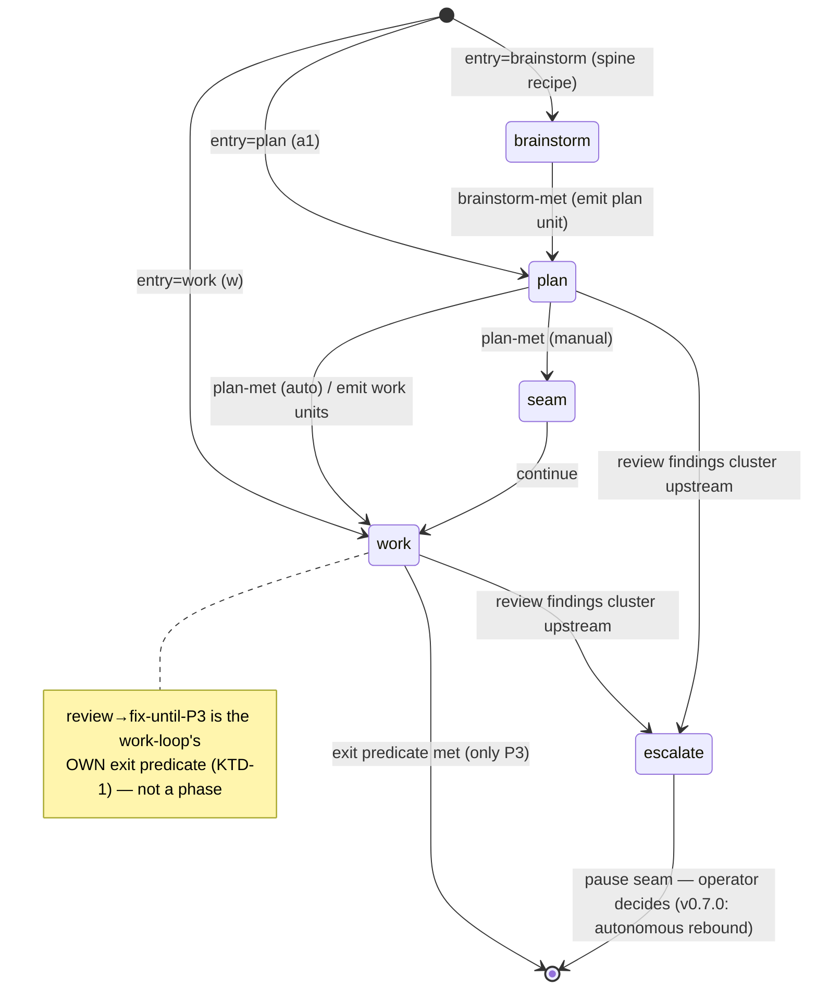
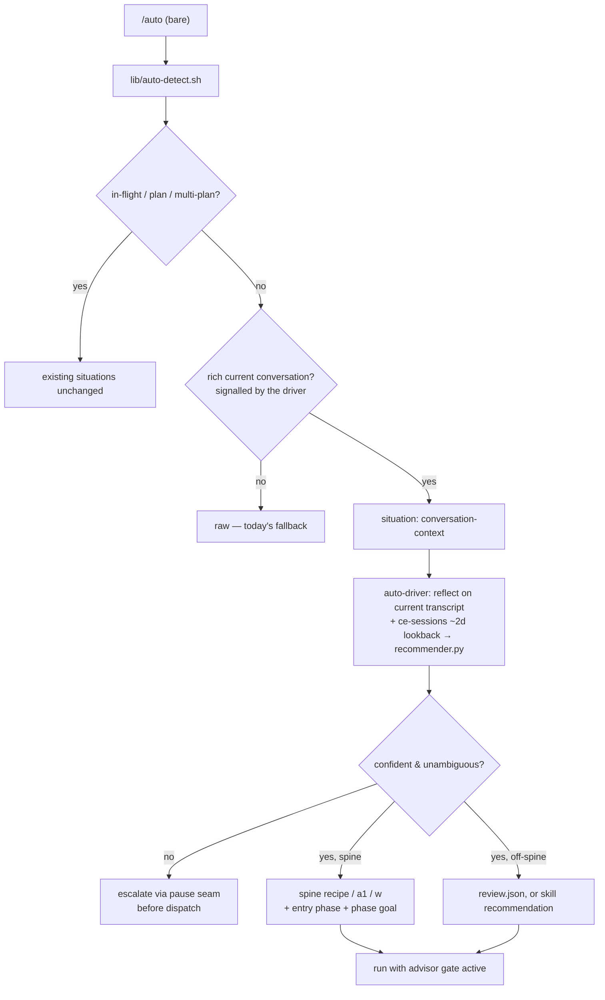
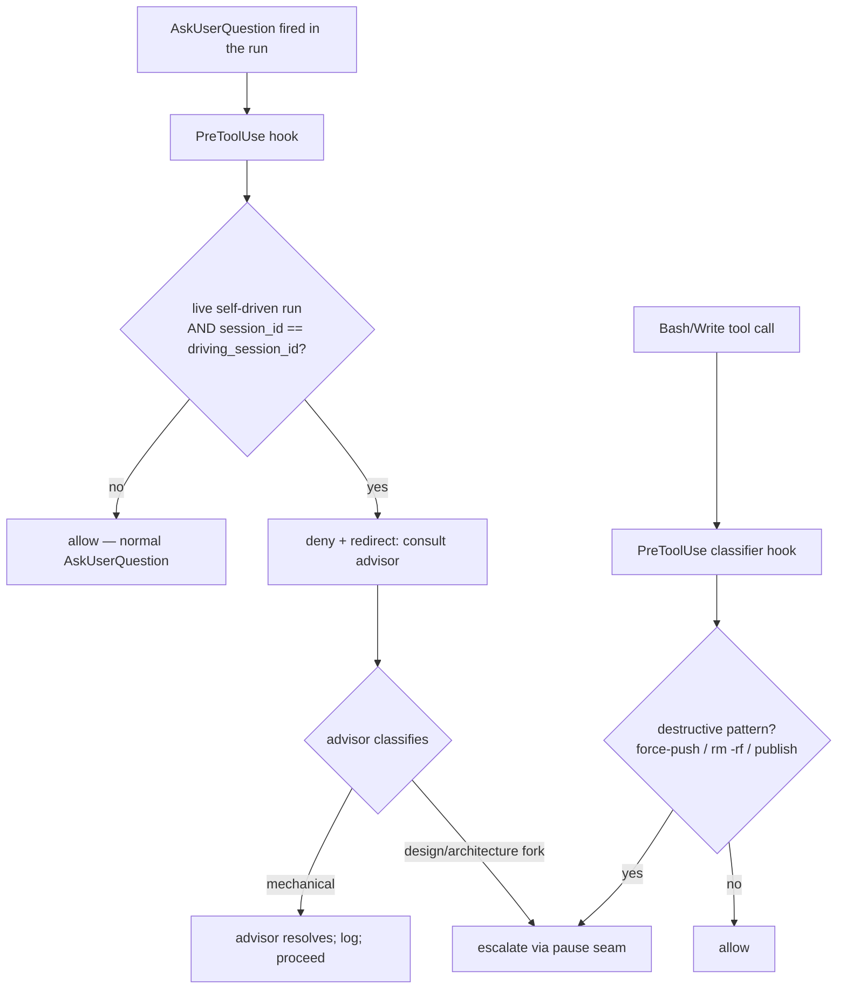

# feat: auto v0.6.0 — conversation-driven smart entry

## Summary

Make `/auto` runnable from a conversation alone — no pre-written plan or issue. The
driver assesses the current session (and recent prior sessions), recommends a
ce-family next step, and runs it inside auto's existing review→verify→fix-until-only-P3
loop with an auto-authored phase goal. During a run it is hands-off for the *mechanical*
work (the review/fix loops the operator types today): an advisor resolves routine
clarifications, while **substantive design/architecture forks and irreversible/destructive
actions still escalate to the operator**. For the creative spine (brainstorm→plan→work)
it auto-advances forward; when review findings cluster on an upstream phase it **detects
and escalates** that signal to the operator (autonomous rebound is deferred to v0.7.0).

Delivered in two independently-shippable phases. **Phase A** (conversation-driven entry
+ advisor gate) is the headline value and ships first; full brainstorm-rooted autonomy
arrives with **Phase B** (forward spine + upstream-cluster detection).

---

## Problem Frame

Bare `/auto` today forces the operator to map their situation to the right verb
(`/auto <plan>`, `/auto-resume`, `--recipe`). The unifying field ask
(`feedback_auto_should_be_context_aware_smart_entry`) is the opposite: fire `/auto`,
have it **gather context and determine where to pick up**. The richest trigger case is a
conversation that just produced enough context to start work but has no plan doc to
point `/auto` at.

Two further frictions compound this:

1. **The operator hand-types the review/verify/fix loops every time** — the exact loop
   auto already encodes as its exit predicate, but which today must be wrapped around a
   chosen step by hand.
2. **Phase progression is manual and forward-only.** `a1`'s state machine
   (`plan → seam → work`) has no arrow back; when a review surfaces a flaw inherited
   from an upstream phase, the engine can only ratchet fix passes against a gap it
   cannot close (`feedback_a1_recipe_cant_rebound_to_brainstorm`).

This plan closes the first two fully and addresses the third with **detection + operator
escalation** (the autonomous backward edge is deferred — see KTD-6): a context-aware
recommender chooses the entry, the wrap is automatic (auto's existing predicate), a
multi-phase spine adds forward auto-advance, and upstream-clustered findings are surfaced
to the operator rather than silently ratcheted against.

**In scope:** conversation-context detection + recommender; the advisor-routing gate
(run-scoped, including phase-internal questions) with a deterministic destructive-action
backstop; a brainstorm-rooted forward spine recipe; upstream-cluster detection that
escalates; reuse of `auto-author-goal` for phase goals; version 0.6.0.

**Out of scope:** autonomous backward rebound (deferred to v0.7.0 — KTD-6); the parked
workflow-substrate migration (R3 — auto keeps its own ledger fan-out; "ultracode-style"
means that fan-out + verify, not the harness `Workflow` tool); native `/goal` arming
(R4 — auto binds its own deterministic predicate); mid-run topology switching (V2);
shrimpshack publish (manual post-merge follow-up).

---

## Key Technical Decisions

### KTD-1 — Review/verify/fix is INTRA-phase, never a phase
The plan phase already loops `plan → deepen → review_plan` until `gaps_open == 0`; the
work phase's exit predicate already *is* review→fix-until-only-P3
(`exit_predicate_result.met` iff `blockers==0 AND majors==0 AND all_units_terminal`).
**The plan does NOT add a "review" phase** — that would duplicate machinery that exists.
"Auto-advance through phases" means advancing the creative spine (brainstorm→plan→work);
the review/fix at each stage is the phase's own internal loop. (The handoff's
"work→review/fix" shorthand names that internal loop, not a new phase.)

### KTD-2 — Two mechanisms: a recommender (entry) + a spine recipe (forward chain)
The routing taxonomy does not map onto one linear `phase_order`. brainstorm → plan →
work is a linear **creative spine**. debug, optimize, and code-review-only are
**off-spine** — work-like operations on existing code, not earlier stages of the same
pipeline. So:
- **The recommender picks an entry point** (which step, which recipe, which entry phase).
- **A brainstorm-rooted spine recipe** carries the forward chain for brainstorm-entry
  runs; plan-entry reuses `a1`, work-entry reuses `w` (see KTD-3).
- **Off-spine recommendations route to a single-phase recipe** (`review.json`) or to a
  plain skill recommendation — no auto-advance chain.

### KTD-3 — Entry by recipe selection (rebound deferred → no always-baked brainstorm)
With autonomous rebound deferred (KTD-6), the original "bake brainstorm into every
spine `phase_order` even for plan-entry, marked terminal-skip" cascade is **removed** —
its sole rationale was enabling rebound-to-brainstorm. Instead:
- brainstorm-entry → the new spine recipe `phase_order: ["brainstorm","plan","seam","work"]`;
- plan-entry → existing `a1` (`["plan","seam","work"]`);
- work-entry → existing `w` (`["work"]`).

`init_ledger` already accepts an arbitrary `loop_phase` member of `phase_order`
(`lib/ledger_core.py:747`, validated lines 62-64), so brainstorm-entry needs only
init-path wiring to pass `loop_phase="brainstorm"`. **Engine caveat (feasibility):**
`set_loop` validates `loop_phase` against `LOOP_PHASES = ("plan","seam","work","done")`
(`lib/ledger_mutators.py`), which does NOT include `brainstorm`. Forward spine advance
already survives this because `transition_and_emit` writes `loop_phase` by direct dict
assignment inside its locked body (`lib/ledger_emitters.py`), bypassing `set_loop`. So
**any write that sets `loop_phase` to a spine-only phase MUST go through the
direct-dict-mutation path, never `set_loop`** — OR `brainstorm` is added to `LOOP_PHASES`
(U7 decides; the direct-mutation path is preferred as it mirrors the existing forward
advance). This corrects the earlier "needs only init-path wiring, not new engine
capability" framing — init works, but the per-tick mutator vocabulary is the real
constraint.

### KTD-4 — Advisor gate: hands-off for mechanical work, escalate design forks AND destructive actions
The gate routes `AskUserQuestion` to the advisor for the whole run — including the
wrapped ce skills' own questions — via a PreToolUse hook that fires **only when a live
self-driven auto run exists AND the calling context is the auto driver** (matched by
`session_id == driving_session_id`, not ledger-state alone — see KTD-5 enforcement). On
denial, the **driving agent consults the advisor** (which returns free-form *prose* advice,
not a structured verdict — confirmed by the U0 spike, `docs/research/advisor-contract-spike.md`)
and **itself classifies** the question, using that advice as input:
- **Mechanical clarification** (which file, formatting, an unambiguous default) → the agent
  resolves, run proceeds.
- **Substantive design/architecture fork** (ce-plan "which architecture?", ce-doc-review
  "is this scope right?", a premise/positioning decision) → **escalate to the operator**
  via the pause seam. These are reversible-but-consequential and are exactly the class
  that warrants human judgment; the default for substantive forks is escalate, not
  auto-resolve.

Separately, because the `AskUserQuestion` hook only intercepts decisions to *ask* (not to
*act*), a **second PreToolUse hook matches `Bash`/`Write`** and applies a deterministic
pattern classifier for irreversible/destructive operations. The minimum pattern set is
anchored to the project's own CLAUDE.md destructive list — `push --force` / `push -f`,
`reset --hard`, `checkout .`, `restore .`, `clean -f` / `git clean -fdx`, `branch -D`,
`rm -rf`, and known external-publish endpoints. It escalates via the pause seam
**unconditionally**, independent of any question. **This hook fails CLOSED:** if the
PreToolUse `deny` contract is unverified or unsupported at deploy time, the action hook
halts the self-driven run (loud pause-seam escalation), never degrades to allow — the
opposite of the question gate, which may fail open (worst case the operator is asked
directly). Known bypass residuals (flag reorder `rm -fr`, refspec force-push
`push origin +<ref>`, compound commands `a; rm -rf`, eval/obfuscation) are explicitly
**out of scope** for the classifier — documented so implementers know the residual-risk
boundary rather than trusting it as comprehensive. This gives the "irreversible/
destructive" boundary a real enforcement mechanism rather than prose the agent might
ignore — keeping auto's deterministic-over-probabilistic identity for the safety-critical
edge.

This resolves the "don't break ce skills" tension: ce skills are intercepted only under
auto (live ledger + matching `driving_session_id`), never standalone. Honors global CLAUDE.md
"never edit CE plugin files."

### KTD-5 — Gate enforcement keys on a driving `session_id` in the ledger + a two-seam split + audit
Detection of "this question belongs to a live auto run" must verify the **driving
session**, not just `phase != "done" AND driver == "self" AND last_beat_at` fresh.
Ledger-state alone would suppress a concurrent *standalone* `/ce-plan` in the same
worktree (a real hazard given the CLAUDE.md parallel-worktree workflow). The mechanism is
a **`driving_session_id` recorded in the ledger at arm time** (NOT a run-scoped env var):
the primary conversation-entry run is armed from inside the live interactive session (the
model fires `ScheduleWakeup`, no spawn — `lib/auto.py`), so an env var set by a Bash tool
cannot reach a later-fired PreToolUse hook subprocess. Instead the hook compares the
`session_id` in its own PreToolUse stdin against `ledger.driving_session_id`: it matches
the primary session and in-session `Skill`-invoked ce-skills, and cleanly rejects a
concurrent standalone `/ce-plan` (different `session_id` → allow). **Two-seam split:**
work-loop fan-out units are dispatched as background `Agent`s that get their *own*
`session_id`, so neither hook (question OR action backstop) can reach them under any token
design — those units instead carry a **prompt-embedded** instruction covering BOTH seams:
(i) "do not call `AskUserQuestion`; consult the advisor for mechanical clarifications,
escalate substantive forks via pause" AND (ii) "do not run irreversible/destructive
operations [the CLAUDE.md-anchored set]; pause-escalate instead" — baked in by the driver
that constructs the unit prompt. Point (ii) matters because `do_unit` is the *most* likely
locus of destructive Bash (branch cleanup, file delete, force-push), and the action hook
cannot gate it. Every advisor-resolved decision AND every
action-hook denial (question/command, classification, resolution, timestamp) is appended
to a structured ledger record and surfaced in the exit report — so a wrong autonomous call
or a fired backstop is diagnosable and trust is earned through visibility.

### KTD-6 — Upstream flaws: detect-and-escalate in v0.6.0; autonomous rebound deferred to v0.7.0
R6 posed an explicit binary — forward-only-with-detect-and-halt, or a backward edge.
v0.6.0 ships the **detection half**: when a review verdict's findings cluster on an
upstream phase (weighting reviewer-role diversity — adversarial + feasibility + security
converging beats raw count, per `feedback_a1_recipe_cant_rebound_to_brainstorm`), auto
**escalates the cluster to the operator** via the existing pause seam. The **autonomous
backward edge** (rebound counter, bound block, `evaluate`/`pending` analogs, atomic
rebound mutator, predicate AND-NOT suppression, the always-baked-brainstorm/terminal-skip
cascade) is **deferred to v0.7.0** — it reaches the same terminal state (operator pulled
in) as detect-and-escalate but at far higher cost, introduces the one genuinely-new
backward-phase grammar, and leaves untraced questions (how a `terminal-skip` brainstorm
unit reactivates; what invalidates downstream units when brainstorm re-runs). Detection
is needed under either stance, so v0.6.0 builds the durable half and proves the signal
before committing to autonomy.

### KTD-7 — Phase goals reuse auto-author-goal, bound to auto's own predicate
`auto-author-goal` is a model-driven *skill*, not callable library code. The driver
*performs* its procedure to draft `<repo>/.claude/auto/goals/<slug>.md` for the entry
phase, then auto binds its own deterministic Stop-hook predicate — NOT native `/goal`
(R4; native `/goal` is model-judged, has no external seam, and auto can neither arm nor
clear it → never-met-loop risk). Goal criteria must be agent-completable.

---

## High-Level Technical Design

### The forward spine + upstream-cluster escalation (Phase B)

Solid edges are forward auto-advance on phase-predicate-met. The dashed edge is
**detection → operator escalation** (not an autonomous rebound — KTD-6).



### The conversation-driven entry decision (Phase A)



### The advisor gate (Phase A)



---

## Output Structure

New files (repo-relative); per-unit `**Files:**` remain authoritative.

```text
.claude/hooks/
  on-pretooluse-askuser.sh        # U4 — AskUserQuestion gate wrapper
  on-pretooluse-action.sh         # U4 — Bash/Write destructive-action classifier wrapper
lib/
  on-pretooluse-askuser.py        # U4 — ledger + lineage gate; advisor redirect
  on-pretooluse-action.py         # U4 — destructive-pattern classifier
  recommender.py                  # U2 — taxonomy → recommendation (state→step→entry)
  upstream-cluster.py             # U9 — role-diversity-weighted upstream-cluster detection
recipes/
  pipeline.json                   # U7 — brainstorm-rooted spine [brainstorm, plan, seam, work]
  review.json                     # U11 — off-spine single-phase (review op exists)
tests/unit/
  recommender.test.sh             # U2
  upstream-cluster.test.sh        # U9
  pipeline-recipe.test.sh         # U7
tests/integration/
  advisor-gate.test.sh            # U4/U5
  conversation-entry.test.sh      # U1-U3
  spine-forward.test.sh           # U7-U9
```

---

## Implementation Units

### Phase 0 — De-risking spike (BLOCKS Phase A)

### U0. Advisor-invocation contract spike

**Goal:** Prove the load-bearing premise under the entire advisor gate before building it:
that auto can consult the advisor with a *specific decision* and get back something it can
*deterministically act on* (resolve vs escalate).

**Requirements:** D1; KTD-4/5 (premise validation).

**Dependencies:** none — runs first.

**Files:** `docs/research/advisor-contract-spike.md` (findings), throwaway probe only.

**Approach:** The `advisor` tool is **parameterless and returns prose** (it forwards the
whole transcript; there is no structured verdict). KTD-4's gate assumes a
targeted-question-in / branchable-resolve-or-escalate-out contract the tool may not
provide. Spike three questions, concretely, before any gate code:
- **(a) Reachability:** is `advisor` callable from a **self-driven / dispatched** run, not
  just an interactive session? (It may be gated to interactive contexts.)
- **(b) Targetability:** can a specific decision be posed such that the advice is *about
  that decision*, given the tool takes no parameters and forwards the transcript?
- **(c) Branchability:** does it return something auto can deterministically branch on
  (resolve-mechanical vs escalate-substantive), or must the gate add a format/parse step —
  or a different resolver entirely?

**Outcome gates the design:** if any of (a)/(b)/(c) fails, KTD-4 reshapes (e.g. a parsed
prose contract, a structured intermediate, or a different resolver) **before** U4/U5 are
built. This is a Phase-0 spike per `feedback_doc_review_phase0_spike_for_unverified_assumptions`:
cheap to run, and it guards the most expensive units against a false premise.

**Test scenarios:** `Test expectation: none` — a spike; the deliverable is the findings doc
and a go/reshape decision on KTD-4.

**Verification:** `docs/research/advisor-contract-spike.md` answers (a)/(b)/(c) with evidence;
KTD-4 is confirmed buildable as-specified or reshaped accordingly before Phase A starts.

---

### Phase A — Conversation-driven entry + advisor gate (independently shippable)

Phase A delivers smart-entry + hands-off-for-mechanical-work using **today's** recipe set
(`a1` plan-entry, `w` work-entry); the brainstorm-rooted spine arrives in Phase B.

---

### U1. conversation-context detection in the hypothesis former

**Goal:** `lib/auto-detect.sh` emits a `conversation-context` situation plus a
`recommendation` envelope key, without breaking the always-parseable / always-exit-0 /
read-only contract.

**Requirements:** R1 (smart-entry); D2 (context boundary).

**Dependencies:** none.

**Files:** `lib/auto-detect.sh`, `tests/integration/conversation-entry.test.sh`.

**Approach:** Add `recommendation=None` to `_safe_envelope` so **every** envelope carries
the key, including the catastrophic-error fallback path (which today omits
`workspace`/`workspace_action` — add `recommendation` there too, or have downstream
tolerate absence). The detector is a subprocess with **no transcript access** (single-quote
heredoc, no conversation), so it cannot self-detect a rich conversation — the **driver**
supplies the signal. Use an **env-var signal** (`CLAUDE_AUTO_CONVERSATION_SIGNAL`), not an
argv addition: the heredoc forwards only `_det_dir` today, so an argv signal carries
unstated invocation-plumbing work, whereas an env var is read cleanly inside the heredoc.
When the signal is set and no in-flight run / no plan exist, emit
`situation: conversation-context` (empty recommendation — the driver computes it in U2);
otherwise fall through to `raw`.

**Patterns to follow:** `_safe_envelope` / `_emit` (SystemExit(0)); situation ordering
(raw is the fall-through).

**Test scenarios:**
- Envelope parses as one JSON line with all keys present when `conversation-context` fires.
- `recommendation` key present on every situation including `raw` and the error fallback.
- Read-only: detector writes nothing (hash `.claude/auto` + worktree before/after).
- Exit 0 on the conversation-context path and on a forced internal error.
- All existing situations byte-unchanged when `CLAUDE_AUTO_CONVERSATION_SIGNAL` is unset.

**Verification:** valid `conversation-context` envelope when signalled; existing situation
tests green; isolation hash unchanged.

---

### U2. ce-family recommender (taxonomy + context sources)

**Goal:** Given the current conversation and a ~2-day session lookback, recommend a
ce-family step with an entry recipe/phase and a confidence.

**Requirements:** R1 (recommend next step); D2 (context split).

**Dependencies:** U1.

**Files:** `lib/recommender.py`, `skills/auto-driver/SKILL.md`,
`tests/unit/recommender.test.sh`.

**Approach:** Context sources per D2: **current conversation** = the driver reflecting on
its own live transcript (skill prose in auto-driver; `ce-sessions` refuses the current
session); **~2-day lookback** = the `ce-sessions` discover+extract pipeline
(`discover-sessions.sh <repo> 2` → extract scripts; never whole files / thinking blocks);
**avoid raw compaction text** (`feedback_compaction_summary_may_hallucinate_apis_verify_against_git`).
`lib/recommender.py` owns the deterministic mapping (state label → recommendation tuple)
and a confidence score; it does NOT read the transcript (the agent supplies the classified
state). Low confidence sets `escalate=True` (consumed by U3's pre-dispatch escalation).

Taxonomy:

| Detected state | ce step | Recipe / entry | Spine? |
|---|---|---|---|
| Vague/exploratory, scope unclear | ce-brainstorm | `pipeline` @ brainstorm (spine; ships in this diff — U7/U8) | spine |
| Clear intent, no plan | ce-plan | `a1` @ plan | spine |
| Reviewed plan present | work-only | `w` @ work | spine |
| Code written, unreviewed | ce-code-review | `review.json` (off-spine, U11) | off |
| Bug under discussion | ce-debug | recommend `/ce-debug` (no adapter op — skill rec) | off |
| "What should I improve?" | ce-ideate | recommend `/ce-ideate` (upstream, no wrap) | n/a |
| Perf concern | ce-optimize | recommend `/ce-optimize` (no adapter op — skill rec) | off |

**debug/optimize route to plain skill recommendations** (the `ce-ideate` precedent) — the
CE adapter exposes only `plan/deepen/review_plan/enumerate_plan_units/do_unit/review`, so
`debug.json`/`optimize.json` would be non-functional stubs. Only `review.json` (the
`review` op exists) is a real off-spine recipe.

**Patterns to follow:** size-budget lint (`lib/*.py` < 1000 LOC, fns < 120 LOC);
`CLAUDE_AUTO_PYTHON3`; `_bootstrap.load_lib_module`.

**Test scenarios:**
- Each taxonomy row maps to its expected (step, recipe/entry, is_spine) tuple.
- Off-spine states never return a spine recipe or an auto-advance entry.
- Low confidence below threshold sets `escalate=True`.
- Unknown/ambiguous state degrades to a safe default (escalate), never crashes.
- ce-sessions lookback empty → current-session-only recommendation, no failure.

**Verification:** taxonomy mapping exhaustive over defined states; confidence gating
returns the escalate flag; module under size budget.

---

### U3. auto-driver routing + phase-goal authoring + pre-dispatch escalation

**Goal:** Wire `conversation-context` into the dispatch grammar: classify state, get a
recommendation, author a phase goal, and dispatch the entry recipe — or escalate before
dispatch when confidence is low.

**Requirements:** R1 (wrap chosen step); KTD-2/3/7.

**Dependencies:** U1, U2.

**Files:** `skills/auto-driver/SKILL.md`, `commands/auto.md` (NL routing note),
`tests/integration/conversation-entry.test.sh`.

**Approach:** Add a dispatch-table row: `conversation-context` → (a) reflect on the
current transcript + ce-sessions lookback to classify state, (b) call `recommender.py`,
(c) perform the `auto-author-goal` procedure to draft the entry-phase goal doc (bind
auto's own predicate, not native `/goal`), (d) dispatch the entry recipe via `lib/auto.sh`
with the entry phase. **If `escalate=True` or the state is ambiguous, escalate to the
operator via the pause seam BEFORE dispatching** — not "via the gate" (the advisor gate is
a PreToolUse hook that fires only when a live self-driven run already exists; pre-dispatch
there is no run, so the gate cannot fire). Honor the "unknown situation → treat as raw"
guard.

**Patterns to follow:** existing dispatch-table rows; argument-aware-freeform pre-check;
`auto-author-goal` template; the single `$`-bearing dispatch line in `commands/auto.md`.

**Test scenarios:**
- conversation-context + spine recommendation dispatches the correct recipe + entry phase
  and writes a goal doc under `.claude/auto/goals/`.
- conversation-context + off-spine recommendation routes to `review.json` or a skill rec.
- Low-confidence / ambiguous → pause-seam escalation, no dispatch, no run created.
- Authored goal tracks auto's exit predicate as primary criterion; no manual-only criteria.
- Native `/goal` never invoked by the driver (grep the path).

**Verification:** simulated conversation-context envelope yields a dispatched run with a
bound deterministic predicate + authored goal, or a clean pre-dispatch escalation; no
native `/goal`.

---

### U4. advisor-gate PreToolUse hooks (question gate + destructive-action backstop)

**Goal:** Two PreToolUse hooks: one on `AskUserQuestion` that redirects to the advisor
when a live self-driven auto run owns the call; one on `Bash`/`Write` that deterministically
escalates irreversible/destructive operations.

**Requirements:** D1; KTD-4/5.

**Dependencies:** U0 (the spike gates the gate units — KTD-4 must be confirmed/reshaped
before building U4). Otherwise parallel-safe with U1-U3.

**Files:** `.claude/hooks/on-pretooluse-askuser.sh`, `lib/on-pretooluse-askuser.py`,
`.claude/hooks/on-pretooluse-action.sh`, `lib/on-pretooluse-action.py`,
`.claude/hooks/hooks.json`, `tests/integration/advisor-gate.test.sh`.

**Approach:** Register two new `PreToolUse` entries in `hooks.json`:
`{matcher: "AskUserQuestion"}` and `{matcher: "Bash|Write"}` (net-new; no PreToolUse hook
exists today — only SessionStart + Stop). Both `.sh` wrappers follow the established
convention (`set -uo pipefail`, presence-gate walk-up for `<repo>/.claude/auto` → `exit 0`
if absent, `exec` into the sibling `.py`, trailing `|| true`, always exit 0).
- **askuser hook:** the `.py` reads the ledger **lock-free** (`on-stop.py`'s
  `_load_ledger_safe` model) and fires the deny only when (i) a live self-driven run exists
  (inverse of `on-stop.py` carve-outs: `phase != "done" AND driver == "self" AND last_beat_at`
  fresher than `DRIVER_SELF_STALE_SECONDS` 3900s) **AND (ii) the PreToolUse stdin
  `session_id` equals `ledger.driving_session_id`** (KTD-5 — recorded at arm time; an env
  var would not reach the hook subprocess for the in-session primary run). Deny payload
  instructs the agent to consult the advisor and apply the KTD-4 classification (mechanical
  → resolve; design/architecture fork → escalate via pause). **Fan-out units** (different
  `session_id`) are NOT covered by this hook — they carry the prompt-embedded instruction
  instead (KTD-5 two-seam split; set in U5).
- **action hook:** the `.py` matches `tool_input` command/content against the
  CLAUDE.md-anchored destructive pattern set (KTD-4) and, under the same live-run +
  `session_id` gate, emits a deny that escalates via the pause seam. **Fails closed** (see
  KTD-4): if `deny` is unverified/unsupported, halt the run rather than allow. Each denial
  is logged to the advisor/action audit record (KTD-5). Bypass residuals are documented
  out-of-scope (KTD-4).

**VERIFY before implementation (CRITICAL-PATH — the session-id parity is the load-bearing
fact for the whole gate):** (a) the PreToolUse deny contract
(`hookSpecificOutput.permissionDecision: "deny"` + `permissionDecisionReason`) against
current Claude Code docs; define the **fallback** if `deny` is unsupported — question hook
degrades to allow + loud `systemMessage`; action hook halts the run (fail-closed), never
silent. (b) **Session-id equality, not presence.** `session_id` appears nowhere in the repo
today — there is NO existing precedent (the earlier "read from Stop stdin by `on-stop.py`"
note was wrong; `on-stop.py` reads stdin only for `stop_hook_active`). Verify that the
`session_id` in the PreToolUse stdin payload **equals the same identifier** `lib/auto.py`
records at arm time (the empirically-present `CLAUDE_CODE_SESSION_ID` env var), and that the
recorded id is the **interactive driver's** session, not a spawned-child id — at arm time
`lib/auto.py` can assert `CLAUDE_CODE_CHILD_SESSION` is falsey before trusting
`CLAUDE_CODE_SESSION_ID` as the driving id (belt-and-suspenders on a spawn-free path).
**Stakes:** a
namespace mismatch silently no-ops BOTH gates — the question gate never redirects AND the
action backstop never recognizes the run, so destructive ops proceed unintercepted. This is
NOT caught by the fail-closed design (fail-closed covers only an unsupported `deny`, not a
session mismatch → "not my run → allow"). Confirm the driving-session hook also fires for
in-session `Skill`-invoked ce-skills (same `session_id`). Fan-out propagation is moot for
the hook (fan-out units have their own `session_id` and are covered by the prompt-embedded
seam, U5).

**Patterns to follow:** `.claude/hooks/on-stop.sh` wrapper; `on-stop.py` `_is_blocking`
inverse + `_load_ledger_safe`; `CLAUDE_AUTO_PYTHON3`; `CLAUDE_AUTO_TEST_NO_STALENESS_CHECK`.

**Test scenarios:**
- Live self-driven run + matching `session_id` → AskUserQuestion denied with advisor-redirect.
- Live run but **mismatched `session_id`** (concurrent standalone ce-skill) → allowed (KTD-5).
- No ledger / `phase == "done"` / `driver == "manual"` / stale (>3900s) → allowed.
- Malformed/partial ledger → allowed, never crashes (rel-001), exit 0.
- action hook: `git push --force`, `rm -rf`, `git reset --hard`, `git branch -D` under a
  live run → deny + pause escalation.
- action hook: benign `ls` / `git status` → allowed.
- action hook fail-closed: with `deny` simulated-unsupported, a destructive command halts
  the run (does NOT allow); the question hook in the same condition degrades to allow.
- Each action-hook denial appends an audit record (KTD-5).
- Deny payload shape matches the verified PreToolUse contract (or the documented fallback).

**Verification:** integration test drives both real `.sh`+`.py` with stdin event JSON
across ledger/lineage states; deny fires only for live self-driven runs with the token;
destructive patterns escalate deterministically; process always exits 0.

---

### U5. advisor-gate behavior + decision audit in the driver skills

**Goal:** Teach the driver how to behave on a denied question (consult advisor; mechanical
→ resolve, design fork → escalate via pause), and log every advisor-resolved decision.

**Requirements:** D1; KTD-4/5.

**Dependencies:** U0 (spike outcome shapes the resolver), U4.

**Files:** `skills/auto/SKILL.md` (compose with §1, §4.5), `skills/auto-driver/SKILL.md`,
`commands/auto.md` (allowed-tools), `lib/ledger_mutators.py` (advisor/action audit record
+ `driving_session_id` setter), `lib/auto.py` (record `driving_session_id` at arm time),
`docs/contracts/ledger-schema.md`, no CE plugin edits.

**Approach:** Record `driving_session_id` on the ledger at arm time (KTD-5) so the U4
hooks can match the driving session. Document the gate in `skills/auto/SKILL.md`: on a
denied `AskUserQuestion`, consult the `advisor` tool with the decision context; **resolve
autonomously only for mechanical clarifications**; for substantive design/architecture
forks, escalate via `auto-resume.py pause <run> "<the decision>"` (§4.5), one line, not a
yield. **Two-seam split (KTD-5):** for work-loop fan-out units (own `session_id`, neither hook
can reach them), bake into the dispatched unit prompt the driver constructs BOTH (i) the
question-routing instruction ("do not call `AskUserQuestion`; advisor for mechanical,
pause-escalate substantive") AND (ii) the destructive-action constraint ("do not run the
CLAUDE.md-anchored irreversible/destructive operations; pause-escalate instead") — since
the action backstop hook cannot gate fan-out `do_unit` agents, which are the most likely
locus of destructive Bash — `skills/auto/SKILL.md` work-loop fan-out section. Append each
advisor cycle AND each action-hook denial (question/command, classification, resolution,
timestamp) to a structured ledger record via a new mutator that goes through the locked
atomic-write chokepoint (`_with_locked_ledger`, so concurrent fan-out denials cannot
clobber), and surface the list in the exit report next to the P3 findings (KTD-5 audit). Confirm whether `advisor` must be added
to `commands/auto.md` allowed-tools (today `Bash, Skill, AskUserQuestion`); add it if so.
The advisor calling convention (reachable from a self-driven run; targetable; branchable)
is **proven by the U0 spike** (R-7) — U5 consumes that outcome rather than re-verifying;
if U0 reshaped KTD-4's resolver, reflect the reshaped form here. Compose with §1
(deterministic Stop-hook predicate stays the single source of truth) and §4.5 (pause is
the only sanctioned human-wall stop).

**Patterns to follow:** §4.5 pause flow; "prepare/execute, ledger-anchored, never re-derive
the predicate"; `set_bound_override` (the audit-record mutator precedent).

**Test scenarios:**
- Advisor-decision records round-trip through an atomic write and the predicate recompute
  leaves them intact (I-1).
- Smoke: `skills/auto/SKILL.md` + `commands/auto.md` parse; manifest resolves with any
  allowed-tools change.
- Doc-content check: escalation rule (design forks escalate) + pause-routing + audit
  surfacing are documented (mirrors existing SKILL doc-lint tests).
- Doc-content check: the fan-out unit-prompt instruction includes BOTH the
  question-routing AND the destructive-action constraint (the two-seam (ii) requirement).
- The audit mutator routes through the locked atomic-write path (concurrent-denial safe).

**Verification:** docs parse; allowed-tools updated if required; audit record implemented +
schema-documented; escalation routing documented; no CE plugin file modified.

---

### Phase B — Forward spine + upstream-cluster detection (depends on Phase A routing)

---

### U6. Relax the phase-order validator to a structural rule

**Goal:** Replace the literal-list membership gate with a structural rule so the spine
`phase_order` validates, keeping the safety guards.

**Requirements:** R1 (A3 unlock); KTD-2/3.

**Dependencies:** none (useful with U7).

**Files:** `lib/recipes.py`, `tests/unit/recipes.test.sh`.

**Approach:** At `lib/recipes.py:201`, replace `phase_order not in _V1_ALLOWED_PHASE_ORDERS`
with structural validation: every element a non-empty str; `terminal_phase ∈ phase_order`;
every unit/emit_template `phase ∈ phase_order`; every `phase_transitions` from/to
`∈ phase_order` (these member-checks already exist downstream — keep them). Retain the
work-only empty-units guard. Keep `_DEFAULT_PHASE_ORDER` / `_WORK_ONLY_PHASE_ORDER`
constants. `phase-grammar.py` accessors are already general — no phase-grammar change
needed.

**Patterns to follow:** existing downstream `∈ phase_order` checks; A1_BUILTIN no-drift test.

**Test scenarios:**
- The spine `["brainstorm","plan","seam","work"]` validates.
- `terminal_phase` not in `phase_order` → rejected.
- A unit whose `phase` is not in `phase_order` → rejected.
- Work-only empty-units guard still fires for `["work"]` + `units: []`.
- `a1`/`a2`/`a4`/`w` builtins still validate unchanged.
- `phase_transitions` naming an unregistered emitter still rejected.

**Verification:** spine recipe validates; existing recipe-validation tests green; guards
intact.

---

### U7. brainstorm-rooted spine recipe + entry-phase wiring

**Goal:** Add `recipes/pipeline.json` (the brainstorm-rooted spine) and plumb a
brainstorm entry phase through the init path; route plan/work entries to existing `a1`/`w`.

**Requirements:** KTD-2/3; R1.

**Dependencies:** U6 (validator), U8 (brainstorm→plan emitter).

**Files:** `recipes/pipeline.json`, the recipe-baking/init call site (where `init_ledger`
is invoked, via `lib/auto.sh`), `tests/unit/pipeline-recipe.test.sh`.

**Approach:** `pipeline.json`: `phase_order: ["brainstorm","plan","seam","work"]`,
`terminal_phase: "work"`, a structural `brainstorm` unit invoking the ce-brainstorm adapter
op, `phase_transitions: [{from:"brainstorm",to:"plan",emitter:"brainstorm_output_to_plan_unit"},
{from:"plan",to:"work",emitter:"plan_output_to_work_units"}]`. Wire brainstorm-entry:
`init_ledger` accepts `loop_phase` and validates membership (`lib/ledger_core.py:747`), so
pass `loop_phase="brainstorm"` for brainstorm-entry. **Per KTD-3**, any per-tick write that
sets `loop_phase` to `brainstorm` MUST use the direct-dict-mutation path
(`transition_and_emit` style), never `set_loop` (which rejects non-`LOOP_PHASES` values) —
OR add `brainstorm` to `LOOP_PHASES`; prefer direct-mutation as the forward advance already
uses it. No terminal-skip cascade (rebound deferred — KTD-6): plan/work entries use `a1`/`w`,
which have no brainstorm unit at all.

**Technical design (directional):** brainstorm-entry threads `loop_phase="brainstorm"` into
the existing init call; the forward `brainstorm→plan→work` advance rides the existing
emitter/`transition_and_emit` path (no `set_loop` for spine-only phases). At
`loop_phase=="brainstorm"`, `_evaluate_met` falls into the work-loop branch where
`eval_phase == terminal_phase` is False, so `met` stays False — the brainstorm phase leaves
only via forward phase-advance (the emitter path), never via predicate-met. U7/U8 must
ensure the brainstorm→plan advance is emitter-driven.

**Patterns to follow:** `recipes/a1.json` (structural unit + plan→work emitter); A1_BUILTIN
no-drift; `init_ledger` `loop_phase` validation; `transition_and_emit` direct-write.

**Test scenarios:**
- `pipeline.json` validates and resolves through the three-tier registry.
- Init at `brainstorm` bakes `loop_phase: "brainstorm"` + the full phase_order.
- Forward advance brainstorm→plan emits the plan unit (emitter-driven, not predicate-met).
- A spine-phase `loop_phase` write via the direct-mutation path succeeds; via `set_loop`
  it raises (documents the constraint).
- `terminal_phase` is `work`; predicate-met only at `work`.
- plan-entry still routes to `a1`, work-entry to `w` (no regression).

**Verification:** spine recipe bakes the correct brainstorm-entry ledger; forward advance
works; `set_loop`-rejects-brainstorm constraint is covered; no regression to `a1`/`w`.

---

### U8. brainstorm→plan emitter

**Goal:** A new emitter that materializes the plan unit on arrival at `plan` from
`brainstorm`.

**Requirements:** KTD-2; R1.

**Dependencies:** none (paired with U7).

**Files:** `lib/emitters.py`, `lib/recipes.py` (V1_EMITTER_NAMES),
`tests/unit/emitters.test.sh`.

**Approach:** Add `brainstorm_output_to_plan_unit(ledger, to_phase) -> list[dict]`: read
the brainstorm unit's output (the requirements-doc path on its `dispatch_context`) and emit
one structural plan unit (`{id, phase: to_phase, depends_on: [], invokes:
{adapter_op: "next_plan_step"}, dispatch_context: {requirements_doc: <path>}}`). Register in
**both** `emitters.REGISTRY` and `recipes.V1_EMITTER_NAMES` (the symmetry test asserts set
equality). Pure function; no ledger mutation.

**Patterns to follow:** `plan_output_to_work_units` (the model emitter); the 5-key unit
dict; REGISTRY/V1_EMITTER_NAMES symmetry.

**Test scenarios:**
- Emitter returns one plan unit with the correct phase and requirements-doc path.
- Registry symmetry: `set(REGISTRY) == V1_EMITTER_NAMES`.
- Emitter is pure (no ledger write).
- Missing brainstorm output raises a clear `RecipeError` (mirrors A2/A4 emitter failure),
  not a silent empty emit.

**Verification:** emitter unit tests pass; symmetry green; arrival at `plan` emits the unit.

---

### U9. Upstream-cluster detection → operator escalation

**Goal:** Detect when review findings cluster on an upstream phase (weighting reviewer-role
diversity) and escalate the cluster to the operator via the pause seam. No autonomous
rebound (KTD-6).

**Requirements:** R6 (detect-and-escalate half); KTD-6.

**Dependencies:** U6 (spine validates), U3/U5 (escalation path).

**Files:** `lib/upstream-cluster.py`, `lib/tick_advance.py` (detection check in the advance
flow), `tests/unit/upstream-cluster.test.sh`, `tests/integration/spine-forward.test.sh`.

**Approach:** A pure classifier in `lib/upstream-cluster.py` consumes a review verdict's
findings + their reviewer-role/lens metadata and returns whether they cluster on a single
upstream root cause, weighting **role diversity** above raw count (KTD-6 — adversarial +
feasibility + security converging is stronger than N same-role hits). When a cluster is
detected during a spine run, `tick_advance` escalates via the existing pause seam
(`auto-resume.py pause`), surfacing the upstream phase + the converging findings to the
operator — it does **not** move `loop_phase` backward and adds **no** new structured ledger
field, no rebound counter, no predicate suppression (all deferred to v0.7.0). Detection
runs as a read-only classification; escalation reuses U5's pause path.

**Patterns to follow:** `advance_iteration_loop`'s early-gate-then-route shape (but routing
to pause, not to a mutator); the pure-helper discipline; `auto-resume.py pause`.

**Test scenarios:**
- 3 diverse-role findings on one upstream root cause → detected as upstream cluster, names
  the target upstream phase.
- Many same-role findings on local issues → not flagged (count alone doesn't trigger).
- On detection, the run pauses (`driver=manual`, `blocked_on` set) with a one-line operator
  message naming the upstream phase + findings; no `loop_phase` change.
- No new ledger field is written (detection is read-only + escalate).
- Classifier is pure and degrades safely on malformed finding metadata.

**Verification:** detection unit tests pass; a spine run with an injected upstream cluster
pauses and escalates cleanly; no backward phase move; no new persisted field.

---

### U11. Off-spine review recipe

**Goal:** Add `recipes/review.json` — a single-phase off-spine recipe for the
code-review-only entry.

**Requirements:** KTD-2 (off-spine); routing taxonomy.

**Dependencies:** U2/U3 (routing).

**Files:** `recipes/review.json`, `tests/unit/recipes.test.sh`.

**Approach:** `review.json`: `phase_order: ["work"]`, `terminal_phase: "work"`, a structural
unit invoking the existing `review` adapter op; runs one review/fix loop to P3 and stops —
no auto-advance, no rebound. (debug/optimize are NOT recipes — they route to skill
recommendations per U2, as the CE adapter lacks those ops.) Confirm `review.json` does not
merely duplicate `w`'s work-loop; if it does, fold into `w` with a review-op note rather
than shipping a redundant recipe.

**Patterns to follow:** `recipes/w.json` (single-phase structural unit); A1_BUILTIN no-drift.

**Test scenarios:**
- `review.json` validates and resolves through the registry.
- Runs its single phase to P3 and stops; never auto-advances or rebounds.
- The recipe is distinct from `w` (or is consolidated into `w` if not).

**Verification:** off-spine review recipe validates and runs single-phase to P3.

*(U10 — autonomous rebound machinery — and the rebound-wiring half of the original U11 are
deferred to v0.7.0; see Scope Boundaries. U-IDs U10 and the rebound portion are intentionally
reserved/unused here to preserve stability.)*

---

### U12. Contracts, version bump, and test consolidation

**Goal:** Update the ledger-schema contract for new/undocumented fields, bump to 0.6.0, and
ensure suite + lints are green.

**Requirements:** R5 (version); contract hygiene.

**Dependencies:** all prior units.

**Files:** `docs/contracts/ledger-schema.md`, `docs/contracts/driver-reference.md`,
`.claude-plugin/plugin.json`.

**Approach:** Document in `ledger-schema.md`: the previously-undocumented `loop.blocked_on`
field (a real `set_loop` kwarg today; §2.4/§8 are stale — **sole owner of this doc fix is
U12**); the new `driving_session_id` field (from U5, KTD-5); the advisor/action audit
record (from U5). Update `driver-reference.md` for the advisor gate (KTD-4/5) and
upstream-cluster detection. Bump `.claude-plugin/plugin.json`
`version` to `0.6.0` (one-line edit — the established bump mechanism). Verify the full suite
(`bash tests/run.sh all`) green including size-budget, wikilink, doc-fence, import-topology,
and AST-lint gates. shrimpshack publish is a manual post-merge follow-up, NOT a build step.

**Patterns to follow:** `chore: bump X → Y` one-line edit; doc-fence-ledger-schema fenced
block format.

**Test scenarios:**
- `Test expectation: none` for the version bump (pure manifest edit).
- Doc-fence test passes after schema edits.
- Full suite green; `$HOME`/`.claude/auto` isolation hash unchanged.
- `plugin.json` parses; manifest resolves at `0.6.0`.

**Verification:** suite green end-to-end; schema documents `blocked_on` + the advisor-audit
record; version is 0.6.0.

---

## Parallelism Analysis

**Phase 0 (U0 spike) runs first and gates the advisor-gate units** (U4/U5). It does NOT
gate U1-U3 (entry recommender) — those can proceed in parallel with the spike, since they
don't depend on the advisor contract. **Phase A and Phase B are sequential at the routing
seam** (Phase B's spine recipe is dispatched by Phase A's U3 routing), but Phase A is fully
shippable alone.

**Within Phase A:**
- **U0 spike first** — gates U4/U5 only.
- **Parallel-safe:** U1 (detect), and U0/U4 (once U0 clears) — independent files.
- **Sequential:** U2 ← U1; U3 ← U1+U2; U4 ← U0; U5 ← U0+U4.
- Suggested fan-out: {U0, U1} → U2 → {U3}; {U4 ← U0} → U5.

**Within Phase B:**
- **Parallel-safe:** U6 (validator), U8 (emitter) — independent.
- **Sequential:** U7 ← U6+U8; U9 ← U6+U3/U5; U11 ← U2/U3; U12 ← all.
- Suggested fan-out: {U6, U8} → U7; U9; U11 in parallel; U12 last.

**Cross-phase:** U6/U8 have no dependency on Phase A and could start in parallel with
Phase A if capacity allows — but the spine is only *reachable* once U3 routing exists.

---

## Scope Boundaries

### Deferred to Follow-Up Work (v0.7.0)
- **Autonomous backward edge / rebound subsystem** (original U10 + rebound-wiring): the
  rebound counter, bound block, `evaluate`/`pending` analogs, atomic rebound mutator,
  predicate AND-NOT suppression, structured gap-origin field, and the
  always-baked-brainstorm/terminal-skip cascade. Ships when upstream-cluster detection
  (U9) proves reliable and the reactivation / downstream-invalidation questions are
  designed. v0.6.0 escalates the cluster to the operator instead (KTD-6).
- **debug/optimize off-spine recipes:** deferred until the CE adapter exposes `debug` /
  `optimize` ops; they route to skill recommendations in v0.6.0.

### Outside this product's identity
- The **workflow-substrate migration** (parked RFC) — auto keeps its own ledger fan-out;
  the harness `Workflow` tool is not adopted (R3).
- **Native `/goal` arming** — auto binds only its own deterministic predicate (R4).
- **Mid-run topology switching** — fixed-recipe-per-run stands (v0.2.0 decision).

---

## Risks & Mitigations

- **R-1 — Advisor classification (mechanical vs design-fork) is itself a model judgment.**
  Mitigation: the *default for substantive forks is escalate* (KTD-4), so a misclassification
  errs toward involving the operator, not away; destructive actions have the independent
  deterministic backstop (the Bash/Write hook); every resolution is audited (KTD-5).
- **R-2 — Fan-out sub-agents have their own `session_id`, so the hook cannot gate them.**
  Resolved by design (KTD-5 two-seam split): the top-level driving session is gated by the
  hook; fan-out units carry a prompt-embedded instruction set by the driver. No hook is
  expected to reach fan-out units.
- **R-3 — PreToolUse `deny` contract is unverified in this harness** (no existing PreToolUse
  hook to mirror). Mitigation: U4 verifies the contract + `session_id`-in-stdin against
  current docs. Fallback is asymmetric: the **question hook** degrades to allow + loud
  `systemMessage`; the **action hook fails closed** (halts the run) so a destructive op is
  never silently permitted when `deny` is unavailable.
- **R-4 — Spine `loop_phase` writes via `set_loop` would raise** (LOOP_PHASES gate).
  Mitigation: KTD-3/U7 mandate the direct-mutation path for spine-only phases and test the
  constraint explicitly.
- **R-5 — conversation-context vs raw misclassification.** Mitigation: the detector emits
  conversation-context only when the driver sets `CLAUDE_AUTO_CONVERSATION_SIGNAL`; ambiguous
  state escalates pre-dispatch, never a wrong autonomous dispatch.
- **R-6 — size-budget lint** (`lib/*.py` < 1000 LOC, fns < 120 LOC). Mitigation: new logic
  lands in new modules (`recommender.py`, `upstream-cluster.py`, the two hook `.py` files),
  not by growing existing files.
- **R-7 (Phase-A-blocking) — the advisor-invocation contract is unproven.** The `advisor`
  tool is parameterless and returns prose; KTD-4's gate assumes a targeted-question-in /
  branchable-verdict-out contract that may not exist, and reachability from a self-driven
  run is unconfirmed. If the premise fails, the gate's resolve-vs-escalate mechanism
  reshapes. Mitigation: **U0 spike runs first and gates Phase A** — KTD-4 is confirmed or
  reshaped before U4/U5 are built. This is the single premise that, if wrong, invalidates
  Phase A's hands-off value, so it is de-risked before any gate code.

---

## Dependencies / Prerequisites
- No new runtime dependencies. Pure-Python + bash, `CLAUDE_AUTO_PYTHON3`.
- `ce-sessions` skill present (compound-engineering) for the ~2-day lookback.
- `advisor` tool available in-session (harness-native, `settings.json advisorModel`) and
  callable from a dispatched run (U5 verify item).

---

## Success Criteria
- Bare `/auto` after a rich conversation dispatches a wrapped run with an authored phase
  goal and the advisor gate active — no operator verb-selection, no hand-typed review/fix
  loop.
- During a run, ce skills' mechanical questions are advisor-resolved (and audited); design/
  architecture forks and destructive actions escalate to the operator via the pause seam.
- A concurrent standalone ce-skill in the same worktree is NOT intercepted (`session_id` mismatch).
- A spine run auto-advances brainstorm→plan→work; when review findings cluster upstream,
  the cluster is detected and escalated to the operator (autonomous rebound is v0.7.0).
- Off-spine review runs execute a single review/fix loop to P3 and stop.
- Full test suite green at 0.6.0; all deterministic lints pass; no CE plugin file edited.
- **Advisor-gate session-id parity is a REQUIRED, UNPROVEN pre-release gate.** CI
  cannot certify either gate fires — every deny test injects the stdin
  `session_id` and the ledger `driving_session_id` as hand-equal strings, so the
  suite passes by construction and cannot detect a live namespace mismatch. Both
  gates are UNPROVEN in production until a live parity check is recorded green:
  capture one real PreToolUse stdin payload and the armed ledger from an `/auto`
  run and assert `stdin.session_id == driving_session_id` (procedure +
  remediation in `driver-reference.md` §12). A mismatch silently no-ops BOTH
  gates and is NOT caught by the fail-closed design.
