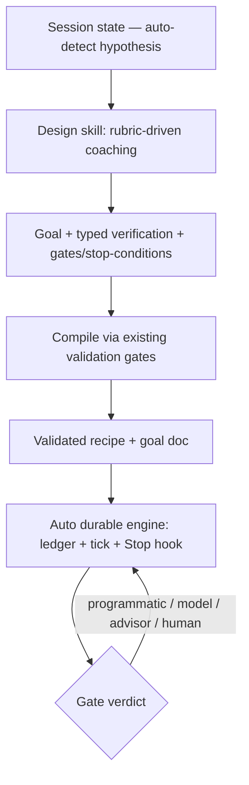
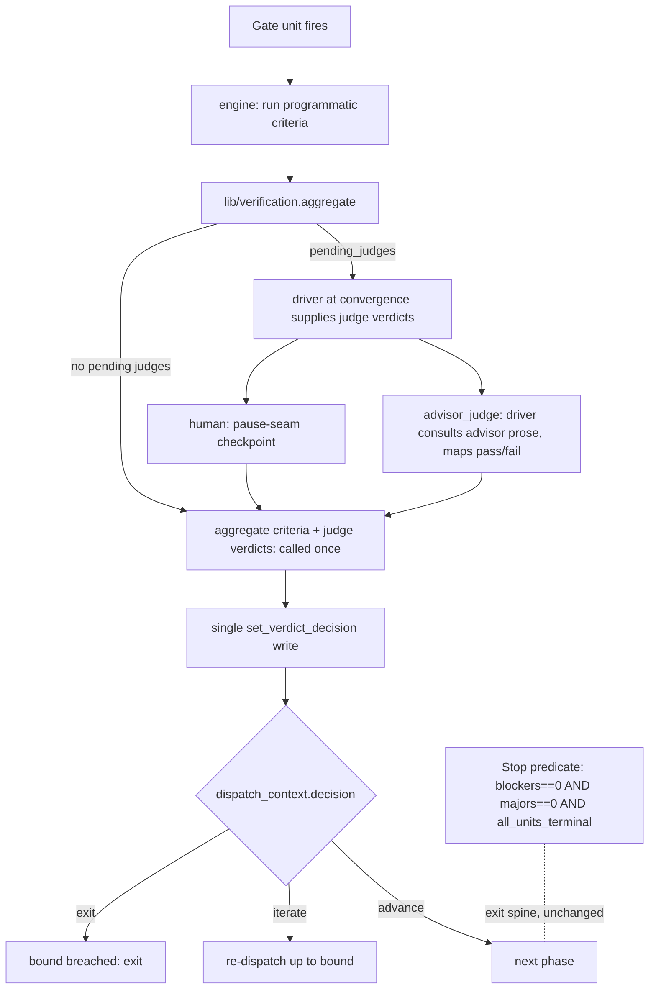

# Absorb Looper's Loop-Design Layer into Auto - Plan

## Goal Capsule

- **Objective:** Give auto a session-seeded loop-design front-end — a coaching skill that turns intent into a sharp goal plus typed, checkable verification — compiled onto auto's recipe + goal artifacts and a new typed-verification gate substrate. It absorbs looper's structuring discipline (rubrics + verification taxonomy) but runs on auto's native `/goal` + ledger, with the `advisor` tool as the stronger judge.
- **Product authority:** Shawn.
- **Open blockers:** none before planning. Both prior blockers cleared during the brainstorm — skill consolidation is deferred to planning, and `advisor` reachability was already settled by an existing spike (`docs/research/advisor-contract-spike.md`).

## Product Contract

### Summary

A new auto skill coaches a loop into shape from the current session state and compiles it to a validated recipe + goal doc that auto's durable engine runs unchanged. It vendors looper's design *front half* — four rubrics and a programmatic/judge/human verification taxonomy — and adds typed verification as a real gate concept in the ledger. Looper's execution back half is dropped; auto's `advisor` tool serves as the cross-model judge in place of looper's model registry. v1 delivers the structuring system; forking a run into parallel loop variants is deferred.

### Problem Frame

Auto already has a design surface — `auto-author-recipe` (prose→recipe), `auto-author-goal` (plan→goal doc), and `lib/auto-detect.sh` (session-state hypothesis) — but it is thin: prose→JSON compilers with no rubric discipline and no notion of *how good a loop's done-condition is*. Auto's exit verdict is its deterministic Stop predicate plus, optionally, a same-model `/goal`. There is no typed verification (a done-condition that's part programmatic check, part judged) and no cross-model second opinion. Looper solves exactly the design problem auto under-serves — coaching a concrete goal, typed verification, and disciplined stop-guards — but disclaims durable execution, which is auto's whole strength. The two are complements, and looper is MIT, so the front half can be brought in-tree and run on primitives looper itself doesn't use.

### Key Decisions

- **Absorb the front half, drop the back half.** Vendor looper's rubrics + verification taxonomy + coaching flow; drop its execution layer (`run-loop.py`, `loop.resolved.json`, host/council CLI wiring). Auto's ledger + tick + Stop hook already outperform looper's runner.
- **`advisor` is the cross-model judge.** Looper's council needs a model registry, CLI shell-out, and a privacy/consent layer *because it sends work to other vendors*. The `advisor` tool is a stronger, in-house, transcript-aware reviewer with no parameters — it delivers the "harder-to-fool second opinion" the council is for while deleting that entire surface. The trade is in-house strength over vendor-diverse blind-spots.
- **Reuse auto's existing `advisor` integration, don't reinvent it.** Auto already wires `advisor` (the §4.6 advisor gate) and already pinned its contract: `advisor` returns *prose, not a structured verdict*, so the *judging agent* consults it and itself renders the gate's decision (`docs/research/advisor-contract-spike.md`). The new typed advisor-judge extends that proven seam and inherits its rule that the deterministic predicate stays the single source of truth.
- **The deterministic Stop predicate stays the spine.** Typed verification criteria are *gate* conditions layered onto the existing iterate/advance/exit decision; they are not a second exit judge. This is the explicit guard against the double-judge/deadlock failure mode between gates, the Stop hook, and any bound `/goal`.
- **Shape: a new session-seeded skill on a typed-verification gate substrate.** The coaching skill is the front door (the named value); a real typed-verification gate concept in the ledger is the substrate it compiles onto. A wizard that emits criteria the engine can't enforce would be theater, so the substrate is not optional.
- **Seed the design from session state.** The skill opens from `auto-detect`'s hypothesis and proposes a goal and verification from what the session already shows, rather than running a blank interview.

### Requirements

**Structuring skill (the design layer)**

- R1. A new auto skill turns a session's intent into a structured loop design — a concrete goal, typed verification criteria, and gate/stop-condition settings — through rubric-driven coaching rather than a blank interview.
- R2. The skill seeds its opening from `lib/auto-detect.sh`'s session-state hypothesis, proposing goal and verification shaped to the current session.
- R3. The skill's output compiles only to auto's existing artifacts — a validated recipe and a goal doc — through the existing validation gates. It emits no parallel spec format (no `loop.yaml` / `loop.resolved.json`).
- R4. Looper's four rubrics (goal, verification, control, council) are vendored in-tree as the coaching reference, adapted to auto's vocabulary, and are the quality bar the skill coaches against.
- R5. The skill coaches explicit stop conditions (max iterations, revision caps, no-progress, budget), surfaces auto's existing bounds, and flags any the engine does not yet enforce.

**Typed verification gate substrate**

- R6. A loop gate supports typed verification criteria of four kinds: programmatic (run a command, compare output), model-judge (the dispatched agent's own verdict), advisor-judge (escalate to the stronger reviewer), and human (a checkpoint).
- R7. Typed criteria drive the existing gate iterate/advance/exit decision; they do not replace or compete with auto's deterministic exit predicate.
- R8. Programmatic criteria are checkable without a model: the engine runs the command and records a structured pass/fail verdict.

**Judge / advisor integration**

- R9. A gate can name advisor-judge as a verdict type: the **driving session** (not a dispatched work agent) consults the `advisor` tool — which returns prose, not a structured verdict — maps that prose to a per-criterion pass/fail, and feeds it into the gate's pure decision aggregation (KTD-6), the same input-to-judgment pattern auto's §4.6 advisor gate uses. No external model CLI is invoked.
- R10. The design builds none of looper's model registry, cross-vendor CLI invocation, or privacy/egress/consent layer — `advisor` replaces that surface entirely in v1.

**Reconciliation with existing auto surfaces**

- R11. Auto's deterministic Stop-hook predicate (`all_units_terminal AND P3-only`) remains the run's exit spine. Typed verification adds gate-level rigor without introducing a second exit judge that could deadlock against the Stop hook or a bound `/goal`.

### Key Flows

- F1. Design a loop from session state, then run it durably
  - **Trigger:** user invokes the new design skill, or `/auto` routes to it when the session needs structuring.
  - **Steps:** seed from the `auto-detect` hypothesis; coach the goal (goal-rubric); elicit typed verification criteria (verification-rubric); set gates and stop conditions (control-rubric), choosing a verdict source per gate including `advisor`; ASCII-preview the loop topology; compile to a validated recipe + goal doc.
  - **Outcome:** a validated recipe + goal doc that auto's durable engine runs unchanged.
  - **Covered by:** R1, R2, R3, R5, R6, R9.



### Acceptance Examples

- AE1. **Covers R6, R8, R9.** **Given** a gate with a programmatic criterion, **when** the gate fires, **then** the engine runs the command and records pass/fail with no model call. **Given** the same gate also has an advisor-judge criterion, **when** it fires, **then** the engine consults `advisor` and records the returned verdict.
- AE2. **Covers R7, R11.** **Given** all of a gate's typed criteria pass but auto's exit predicate is not yet met (e.g., P2 findings remain), **when** the gate resolves, **then** the run continues — the gate verdict advances the loop but does not declare the run done.

### Scope Boundaries

**Deferred for later**

- Forks — splitting a run into parallel loop variants (at-seam, parallel-recipe-variants-per-worktree, or git-worktree-per-branch). Revisited once a loop is well-structured; it reuses the existing fan-out + worktree + cmux machinery.
- Engine enforcement of stop-guards auto lacks today (no-progress detection, budget caps) beyond the current `max_attempts` / wall / stall bounds — unless the Outstanding Question resolves to in-v1.

**Outside this product's identity (dropped, not deferred)**

- Looper's execution layer (`run-loop.py`, `loop.resolved.json`, `RUN_IN_SESSION.md`) — auto's ledger is the orchestrator looper hands off to.
- Looper's cross-vendor council, model registry, and privacy/egress/consent — replaced by `advisor`.

### Dependencies / Assumptions

- **Confirmed (no longer a spike):** `advisor` is reachable from both the main driving session and dispatched Agent subagents, empirically established in `docs/research/advisor-contract-spike.md`. Either the driver or a work agent can consult it; planning chooses where the advisor-judge runs.
- `advisor` is a stronger *in-house* reviewer, not a different-vendor model — v1 trades vendor-diverse blind-spots for stronger, full-context review. Named so it is not later mistaken for vendor-diverse review.
- Looper is MIT-licensed; vendoring its rubrics in-tree is license-compatible (preserve attribution).

### Outstanding Questions

**Resolve before planning**

None — both prior blockers cleared during the brainstorm (see Key Decisions and Dependencies).

**Resolved during planning** (see Planning Contract → Resolved planning decisions and KTDs)

- Skill consolidation → call `auto-author-recipe` / `auto-author-goal` as backends (no absorption in v1).
- advisor-judge location → driver-evaluated, reusing the §4.6 pattern + audit.
- Programmatic-criteria schema → a validated `verification` array on the gate unit (KTD-1, KTD-2, KTD-3).

**Deferred to implementation**

- Engine enforcement of NEW stop-guards (no-progress signal, budget caps) — v1 coaches them into the spec only; enforcement is a later `lib/iteration.py` change.
- Exact evidence-truncation limits and subprocess timeout defaults for programmatic criteria — settled when `lib/verification.py` is built against real commands.

### Sources / Research

- Auto graft points: `lib/recipes.py` (recipe schema + emitter registry + iteration bound), `lib/ledger_core.py` and `lib/iteration.py` (unit state machine, gate decision, bound enforcement), `lib/on-stop.py` (deterministic Stop hook), `lib/auto-detect.sh` (session-state hypothesis), `skills/auto-author-recipe`, `skills/auto-author-goal`, `skills/auto-driver`.
- Auto fork/fan-out machinery (for the deferred forks work): `lib/auto-spawn.py`, `lib/auto-workspace.py`, `lib/orchestrator.py`.
- Existing `advisor` integration and contract (the seam this extends): `skills/auto/SKILL.md` §4.6 (advisor gate — prose advice as input to agent judgment, predicate stays single source of truth), `docs/research/advisor-contract-spike.md` (advisor returns prose not a verdict; reachable from driver and subagents).
- Looper source (vendor target): `github.com/ksimback/looper` — `SKILL.md`, `schemas/loop.v1.schema.json`, `schemas/loop.resolved.v1.schema.json`, `references/{goal,verification,control,council}-rubric.md`, `references/model-detection.md`.
- Implementation anchors (verified 2026-06-27): emitters `lib/emitters.py:372-383` + `V1_EMITTER_NAMES` `lib/recipes.py:48-65`; iteration/gate validation `lib/recipes.py:461-545`; verdict `lib/ledger_mutators.py:121-193`, decision `set_verdict_decision` `:396-438`, `DECISIONS` `lib/iteration.py:48`, `evaluate_decision` `:98-193`; exit predicate `lib/goal-status.py:45-97`; Stop hook `lib/on-stop.py:102-134`; goal-doc template `skills/auto-author-goal/SKILL.md:108-128`; test harness `tests/unit/*.test.sh` + `tests/run.sh`; no-pip-deps constraint `lib/recipes.py:1-20`; LOCKED contracts `docs/contracts/{recipe-format,ledger-schema,driver-reference,adapter-contract}.md`; skill-reference pattern `skills/auto-author-recipe/references/`; manifest `.claude-plugin/plugin.json` (v0.6.7).

---

## Planning Contract

**Product Contract preservation:** Product Contract unchanged — no R-IDs altered. Planning resolves the brainstorm's deferred questions into the decisions below and adds implementation units; product scope is untouched.

### Resolved planning decisions

- **Skill consolidation → call as backends.** The new `auto-design` skill owns coaching + compile orchestration and *calls* `auto-author-recipe` (via `recipes.validate_and_lint` + `topology-render.render`) and the `auto-author-goal` goal-doc template. Both existing skills stay; `auto-driver` routing is untouched. Lowest-disruption, keeps coach and compile separable; absorbing the two is a later consolidation.
- **advisor-judge → driver-evaluated.** An `advisor_judge` criterion is rendered by the driving session (which already calls `advisor` in §4.6), not the work-agent — even though the spike confirms subagent reachability, the driver is where the §4.6 pattern and the `advisor_audit` trail already live. The work-agent records its own findings; the driver consults `advisor` at convergence and writes the gate decision.
- **Stop-guards → coach-only in v1.** The skill coaches no-progress/budget into the spec and surfaces auto's existing bounds (`max_attempts`, `max_wall_seconds`, stall, dead-chain). Engine enforcement of NEW bounds is deferred (a separate `lib/iteration.py` change).

### Key Technical Decisions

- KTD-1. **Typed verification is a validated `verification` array on the gate's unit — not a new emitter.** It attaches to the existing `iteration.gate_unit` mechanism, so `V1_EMITTER_NAMES` is unchanged (emitter symmetry test stays green; no new topology grammar). Each criterion is `{id, type, …type-fields}`, `type ∈ {programmatic, model_judge, advisor_judge, human}`.
- KTD-2. **Programmatic criteria run pure-stdlib subprocess.** No pip dependency (install-anywhere, `lib/recipes.py:1-20`). A criterion declares `argv` + a `check` (`exit_zero` | `{stdout_contains}` | `{stdout_equals}`); `lib/verification.py` runs it and returns `{criterion_id, status, evidence}`.
- KTD-3. **One validator, two callers.** The `verification` block is validated in `lib/recipes.py::validate()` (hand-rolled), so the skill's `validate_and_lint` write-gate and the engine's load-time check enforce the same shape — mirroring the existing recipe-validation contract.
- KTD-4. **Criteria gate the decision; they don't re-derive the predicate.** `lib/verification.py` aggregates criteria into an advance/iterate signal consumed by `lib/iteration.py::evaluate_decision` and written via `set_verdict_decision` → `dispatch_context.decision`. The deterministic exit predicate (`goal-status.py`: `blockers==0 ∧ majors==0 ∧ all_units_terminal`) stays the run's exit spine (R11).
- KTD-5. **Vendored rubrics live under `skills/auto-design/references/`** (the established pattern). Looper's council-rubric is dropped (advisor replaces it); goal/verification/control rubrics are adapted to auto vocabulary with MIT attribution.
- KTD-6. **Decision aggregation is a pure function; judge verdicts are data, not live calls inside the engine.** `lib/verification.py` exposes `aggregate(criteria, programmatic_results, judge_verdicts) -> {decision, pending_judges}`. The engine runs *programmatic* criteria in-process; *model_judge / advisor_judge / human* criteria come back as `pending_judges` for the driver to satisfy and feed back as `{criterion_id, status}` data. `aggregate` is called once to produce the single `dispatch_context.decision` write. This makes the decision logic unit-testable (inject judge verdicts as data — no live `advisor` in tests), removes the U4↔U5 double-write conflict (one aggregate, one write), and keeps the live `advisor` call in the driver (§4.6) where the audit trail lives. (Resolves review P1 #1/#2/#3 + the test-harness gap.)

### High-Level Technical Design



### Sequencing

U1 (rubrics) ∥ U2 (schema) → U3 (engine) → U4 (gate wiring) → U5 (advisor-judge) → U6 (skill) → U7 (register + version) → U8 (e2e + contracts). U1 and U2 are independent; everything after chains.

---

## Output Structure

```text
skills/auto-design/
  SKILL.md
  references/
    goal-rubric.md
    verification-rubric.md
    control-rubric.md
    verification-taxonomy.md
lib/
  verification.py            (new)
docs/contracts/
  verification-contract.md   (new, LOCKED)
```

---

## Implementation Units

### U1. Vendor looper's rubrics + verification taxonomy

- **Goal:** bring looper's goal/verification/control rubrics in-tree, adapted to auto vocabulary, plus a taxonomy doc defining the four criterion types. Council-rubric dropped (advisor replaces it).
- **Requirements:** R4, R6.
- **Dependencies:** none.
- **Files:** `skills/auto-design/references/goal-rubric.md`, `verification-rubric.md`, `control-rubric.md`, `verification-taxonomy.md` (create); MIT attribution header on each.
- **Approach:** fetch looper's `references/{goal,verification,control}-rubric.md`; rewrite in auto's vocabulary (recipe/ledger/gate/predicate); strip looper execution + council framing. `verification-taxonomy.md` pins the exact criterion field shape that U2 validates.
- **Patterns to follow:** `skills/auto-author-recipe/references/visual-vocabulary.md`.
- **Test scenarios:** Test expectation: none — reference docs (no behavior). Lint: MIT attribution header present on each vendored file.
- **Verification:** the four files exist; taxonomy field shapes match U2's validator.

### U2. Recipe schema: typed `verification` block + validation

- **Goal:** add a validated `verification` array to a unit, enforced by the hand-rolled validator.
- **Requirements:** R6, R7, R8.
- **Dependencies:** none (parallel with U1).
- **Files:** `lib/recipes.py` (extend `validate()` + KNOWN-keys frozensets), `recipes/schema.json` (document shape), `docs/contracts/recipe-format.md` (update), `tests/unit/recipes.test.sh`.
- **Approach:** add `verification` to a unit's known keys; validate each criterion `{id: unique non-empty str, type ∈ {programmatic, model_judge, advisor_judge, human}}` plus type-fields — programmatic → `argv` (non-empty list[str]) + `check` (`"exit_zero"` | `{stdout_contains: str}` | `{stdout_equals: str}`) + optional `timeout_sec` (positive int); model_judge/advisor_judge → optional `rubric_ref` (str); human → optional `prompt` (str). Reject an unknown `type` value AND unknown keys within a criterion, enforced at **load time** in `validate()` (not only the skill's write-time `validate_and_lint`). Cap the `verification` array at ≤ 16 criteria to bound gate-evaluation cost.
- **Technical design (directional):** reuse the `_bad()` error idiom and frozenset KNOWN-keys pattern already in `recipes.py`.
- **Patterns to follow:** iteration-block validation `lib/recipes.py:461-545`; frozenset KNOWN keys `:129-130`.
- **Test scenarios:** valid programmatic / advisor_judge / human criteria pass; missing `type` → error; unknown `type` value → error; unknown criterion key → error; programmatic without `argv` → error; malformed `check` → error; `verification` array over the cap (17 entries) → error; a1/a2/a4/w still validate (no regression). Covers AE1 (schema half).
- **Verification:** `rec validate` accepts a typed-verification recipe and rejects each malformed shape; existing recipe tests green.

### U3. Verification engine — programmatic evaluation

- **Goal:** a pure-stdlib module that runs programmatic criteria and returns structured results.
- **Requirements:** R8.
- **Dependencies:** U2.
- **Files:** `lib/verification.py` (new), `tests/unit/verification.test.sh` (new), `tests/run.sh` (register the suite).
- **Approach:** `evaluate_programmatic(criterion, cwd) -> {criterion_id, status, evidence}` runs `argv` via `subprocess` with a per-criterion timeout (default 30s, overridable via `timeout_sec`), captures combined stdout+stderr, applies `check`, returns pass|fail + evidence truncated to an 8 KB byte cap (binary-safe: decode `errors='replace'`). The pure `aggregate(criteria, programmatic_results, judge_verdicts) -> {decision, pending_judges}` (KTD-6) also lives here: all resolved criteria pass → advance; any fail → iterate; non-programmatic criteria with no supplied verdict → `pending_judges`. Stdlib only.
- **Patterns to follow:** existing lib module + op-dispatch CLI exercised by a `.test.sh`; no-pip-deps rule `lib/recipes.py:1-20`.
- **Test scenarios:** `exit_zero` pass on `true` / fail on `false`; `stdout_contains` hit/miss; `stdout_equals` exact/mismatch; timeout → fail with evidence; nonexistent argv → fail (not crash); binary stdout → no crash, evidence truncated to the 8 KB cap; `aggregate` (pure, table-driven): all programmatic pass + no judges → advance; one programmatic fail → iterate; advisor_judge criterion with no supplied verdict → `pending_judges` (no decision yet); programmatic pass + injected advisor pass → advance.
- **Verification:** `tests/unit/verification.test.sh` green via `tests/run.sh`.

### U4. Gate-decision integration

- **Goal:** feed typed-verification results into the gate's advance/iterate/exit decision, composing with the predicate.
- **Requirements:** R6, R7, R11.
- **Dependencies:** U3.
- **Files:** `lib/iteration.py` (consume the verification signal around `evaluate_decision`), `lib/ledger_mutators.py` (persist criteria results onto the gate unit's `dispatch_context`), `docs/contracts/ledger-schema.md` + `driver-reference.md` (update), `tests/unit/iteration.test.sh`.
- **Approach:** when a gate unit carries `verification`, the engine runs its programmatic criteria via `lib/verification.py` and calls the pure `aggregate` (KTD-6). If `aggregate` returns `pending_judges` (advisor_judge/human present, verdicts not yet supplied), the engine writes **no** decision yet — it records the programmatic results + pending list on `dispatch_context` and waits for the driver (U5). When no judges are pending (programmatic-only gate), `aggregate` yields the decision, written once via `set_verdict_decision`. The deterministic predicate is untouched — criteria only steer the gate (R11); bound breach still forces iterate→exit. Exactly ONE decision write per gate resolution (no U4↔U5 clobber).
- **Patterns to follow:** `evaluate_decision` `lib/iteration.py:98-193`; `set_verdict_decision` `lib/ledger_mutators.py:396-438`.
- **Test scenarios:** programmatic-only pass gate → advance (single write); programmatic-fail → iterate (until bound) → exit on breach; gate with an advisor_judge criterion and no verdict yet → `pending_judges` recorded, NO premature decision write; criteria pass but predicate unmet → run continues, not done (Covers AE2); decision lands on `dispatch_context.decision`; existing iteration tests green.
- **Verification:** a gate recipe with a programmatic criterion drives advance/iterate/exit end-to-end in the harness.

### U5. advisor-judge verdict source (driver-evaluated)

- **Goal:** the driver supplies advisor_judge verdicts as data into the pure aggregator (KTD-6), reusing §4.6 — the engine never calls `advisor`.
- **Requirements:** R9, R10.
- **Dependencies:** U4.
- **Files:** `skills/auto/SKILL.md` (§4.6 + §7 convergence: detect a gate's `pending_judges`, consult `advisor` per advisor_judge criterion, supply verdicts), `docs/contracts/driver-reference.md` (§7 gate dispatch), `tests/unit/verification.test.sh` (aggregate-with-injected-verdict cases). Reuse existing `append_advisor_audit`.
- **Approach:** at convergence, when a gate has `pending_judges` containing advisor_judge criteria, the driver consults `advisor` (deliverable + the criterion's `rubric_ref` in context), reads the prose, maps it to `{criterion_id, status: pass|fail}`, then calls the engine `aggregate` with the collected `judge_verdicts` → a single `set_verdict_decision` write + `append_advisor_audit` (`kind="advisor"`). The decision math lives in `lib/verification.py`; only the live `advisor` consultation lives in the driver. No model registry, no CLI shell-out (R10).
- **Execution note:** the advisor_judge decision logic is unit-tested via injected verdicts (`aggregate` is pure); the live `advisor` consultation is **integration-only** — the bash+Python harness cannot stub the `advisor` tool, so that path is verified in a live session, not CI.
- **Patterns to follow:** §4.6 advisor gate; `append_advisor_audit`; `docs/research/advisor-contract-spike.md` (prose-not-verdict).
- **Test scenarios:** `aggregate` with an injected advisor verdict (pass) + programmatic pass → advance (pure unit test, NO live advisor); injected advisor fail → iterate; the driver path appends an `advisor_audit` entry; no external CLI invoked. Covers AE1 (advisor half).
- **Verification:** `aggregate` renders the right decision from injected advisor verdicts (unit); the live advisor-judge path appends an audit record (integration).

### U6. The loop-design skill (`auto-design`)

- **Goal:** the session-seeded coaching skill that compiles to a validated recipe + goal doc.
- **Requirements:** R1, R2, R3, R5.
- **Dependencies:** U1, U2, U5.
- **Files:** `skills/auto-design/SKILL.md` (new); `references/*` from U1.
- **Approach:** skill flow — (1) seed from `lib/auto-detect.sh` hypothesis; (2) coach the goal (goal-rubric); (3) elicit typed verification criteria (verification-rubric → the U2 shape); (4) set gates + stop conditions (control-rubric), surfacing auto's existing bounds; (5) ASCII-preview via `lib/topology-render.py`; (6) compile — write the recipe through `recipes.validate_and_lint` and the goal doc via the auto-author-goal template. Calls the two existing skills as backends (no consolidation). No parallel spec format (R3).
- **Patterns to follow:** `skills/auto-author-recipe/SKILL.md` (validate_and_lint + topology-render), `skills/auto-author-goal/SKILL.md` (goal-doc template), `skills/auto-driver` (hypothesis read).
- **Test scenarios:** Test expectation: none for the prose body; a fixture recipe representing the skill's output validates (asserted in U2/U8). Manual: the seeded opening references the hypothesis fields.
- **Verification:** the skill compiles a sample session into a recipe `validate_and_lint` accepts + a goal doc matching the template; ASCII preview renders.

### U7. Plugin registration + version bump

- **Goal:** ship the new skill + lib + contracts.
- **Requirements:** R1.
- **Dependencies:** U6.
- **Files:** `.claude-plugin/plugin.json` (version `0.6.7` → `0.7.0`), `marketplace.json` (shrimpshack refresh), CHANGELOG/commit message.
- **Approach:** the `./skills` dir is already auto-included; bump the minor version (new feature) and refresh the marketplace entry per the version-gated store.
- **Test scenarios:** Test expectation: none — manifest. Lint: `plugin.json` valid JSON, version bumped; `marketplace.json` version matches.
- **Verification:** version bumped in both manifests; plugin loads.

### U8. End-to-end test + contract docs

- **Goal:** prove design→compile→run and lock the new contract.
- **Requirements:** R6, R7, R8, R9, R11.
- **Dependencies:** U4, U5, U6.
- **Files:** `tests/` e2e test; `docs/contracts/verification-contract.md` (new, LOCKED); `docs/contracts/adapter-contract.md` (update only if a new adapter op is added).
- **Approach:** an e2e test loads a recipe with a typed gate (programmatic + advisor_judge) and drives it through `verification.py` + `iteration.py`, supplying the advisor verdict as injected data (per KTD-6 — no live advisor), asserting the single advance/iterate/exit write lands and the predicate stays the exit spine. `verification-contract.md` documents the criterion shape + the `aggregate` contract (`pending_judges`, single-write) as a LOCKED spec.
- **Test scenarios:** full gate cycle programmatic-pass + injected advisor-pass → advance (single write); programmatic-fail → iterate→exit on bound; advisor_judge pending with no verdict → no premature decision; predicate-unmet-after-pass → continue (AE2); all green via `tests/run.sh`.
- **Verification:** `tests/run.sh` exits 0 with the new suites; `verification-contract.md` present.

---

## Verification Contract

| Gate | Command | Applies to | Done signal |
|---|---|---|---|
| Unit tests | `bash tests/run.sh` | all units | exits 0; new verification / iteration / recipes suites green |
| Recipe validation | `rec validate` / validate-builtins | U2, U6 | typed-verification recipes accept/reject correctly; a1/a2/a4/w still valid |
| Emitter symmetry | `emitters.test.sh` registry-consistency | U2, U4 | `set(REGISTRY) == V1_EMITTER_NAMES` — unchanged, no new emitter |
| No-pip-deps | inspect imports in `lib/verification.py` | U3 | stdlib only; no third-party import |
| Manifest | `plugin.json` / `marketplace.json` | U7 | valid JSON; version bumped to 0.7.0; versions match |

---

## Definition of Done

- R1–R11 satisfied; `bash tests/run.sh` exits 0 including the new verification / iteration / recipes suites.
- A recipe with a typed `verification` gate (programmatic + advisor_judge) validates and drives advance/iterate/exit end-to-end with a stubbed advisor; the deterministic exit predicate remains the run's exit spine (AE2).
- The `auto-design` skill compiles a session into a validated recipe + goal doc, seeded from the `auto-detect` hypothesis, with no parallel spec format.
- Vendored rubrics present under `skills/auto-design/references/` with MIT attribution; council-rubric intentionally omitted.
- `docs/contracts/verification-contract.md` (LOCKED) added; `recipe-format` / `ledger-schema` / `driver-reference` updated; plugin version bumped to `0.7.0` and marketplace refreshed.
- Only P3 review findings remain (auto's exit predicate).
