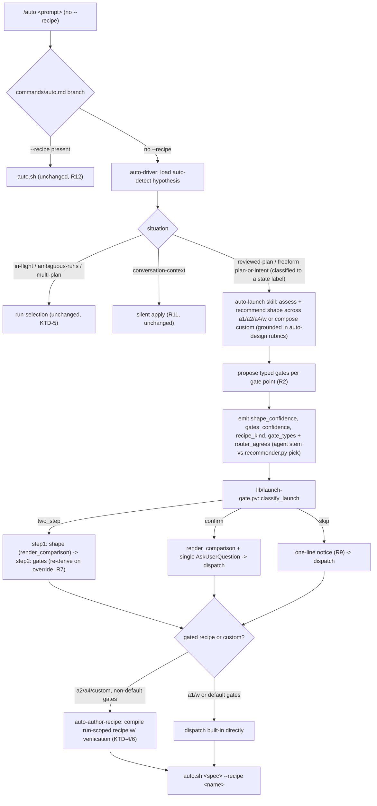
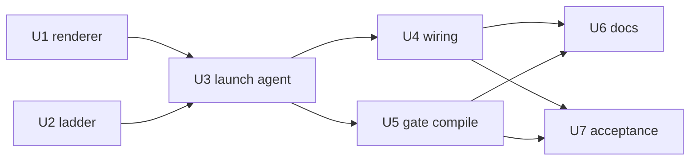

# Auto Launch Chooser - Plan

> **Product Contract preservation:** Product Contract unchanged. This pass adds
> the Planning Contract (Key Technical Decisions, Implementation Units,
> dependency graph + parallelism, test strategy, Verification Contract,
> Definition of Done) and resolves the three Deferred-to-Planning questions. The
> Goal Capsule, Product Contract, Requirements R1–R12, Acceptance Examples
> AE1–AE6, and Scope Boundaries below are carried verbatim. (The carried Goal
> Capsule names two deferred design details from brainstorm; planning surfaced
> and resolved a third — drawing delivery, KTD-3 — so the body resolves three.)

## Goal Capsule

- **Objective:** Make interactive `/auto` open with a worked-out, context-grounded loop recommendation the operator confirms — the agent picks (or composes) the loop and proposes its gating before asking — while skipping the prompt entirely when both the shape and its gates are obvious.
- **Product authority:** Shawn (operator and owner).
- **Open blockers:** None block planning. Two design details are deferred to planning: how "obvious" is computed (the bias-to-show bar) and whether the contrast drawings extend the existing renderer or get a new view.

## Product Contract

### Summary

Replace `/auto`'s silent mechanical dispatch with an agent-first launch. On interactive `/auto <prompt>`, a loop-design agent reads the session and repo, recommends a fitting built-in recipe or composes a new one, and proposes typed verification gating at each gate point. It then presents a two-step chooser (confirm the shape drawn for contrast, then confirm or edit the gates) — and skips the chooser when both shape and gates are obvious, proceeding with a one-line notice.

### Problem Frame

Today `commands/auto.md` loads `auto-driver`, which surfaces one action line and auto-dispatches. `lib/recommender.py` is state-keyed: have-a-plan routes to `w`, raw intent recommends `/ce-plan`, clear intent picks `a1` — so the recommendation only ever lands on `a1` or `w`. The `a2` (competing plans) and `a4` (adversarial pair) recipes are reachable only through an explicit menu or `--recipe`. The topology cards (`lib/topology-render.py`) are wired to the picker but render only on an explicit ambiguity, so in the common path they are dead UI the operator never sees. Nothing reads the work's shape to reason about which loop fits, and nothing reasons about gating at launch at all. The result: the operator can't see or steer the loop choice, and the richer recipes go unused.

### Key Decisions

- **Agent-first, not menu-first.** The recommendation is computed before the question. The chooser shows the agent's work — a pick with rationale and proposed gates — not a blank menu.
- **Skip-when-obvious over always-show, biased to show.** The launch skips the prompt only when confidence is high on both the shape and its gates; any uncertainty shows the chooser. The skip bar is gating-aware and high — that is the safety property against regressing to the dead-UI problem.
- **Two-step over one combined prompt.** Confirming shape and gates separately keeps each decision readable.
- **Pre-compose custom loops inline.** "Design a new one" is a first-class recommendation outcome — when no built-in fits, the agent composes the custom loop up front and presents it drawn and confirmable, not as a fallback the operator must invoke.
- **Ground on the vendored looper rubrics.** Shape and gating reasoning use the in-tree `auto-design` rubrics; no live looper dependency is introduced.

### Key Flows

F1. **Interactive launch.** **Trigger:** a human runs `/auto <prompt>` without `--recipe`. The loop-design agent assesses session and repo state, determines the next step, and produces a recommended loop (built-in or composed) with typed gating per gate point. The launch then takes one of three paths by confidence: skip and dispatch with a one-line notice; a single confirm; or the full two-step chooser. On confirm (or skip), the run dispatches the chosen loop with its gates.

### Requirements

**Recommendation engine**

R1. On interactive `/auto`, a loop-design agent runs before any dispatch — it reads session and repo state, determines the next step, and produces a recommendation: a fitting built-in recipe (`a1`/`a2`/`a4`/`w`) or a newly composed custom loop.

R2. The agent proposes typed verification gating at each gate point of the recommended loop. Each criterion is typed as `programmatic`, `model_judge`, `advisor_judge`, or `human` per the v0.7.0 taxonomy.

R3. The agent grounds its shape and gating choices in the vendored `auto-design` rubrics (goal, verification, control, and the verification taxonomy). No live looper dependency is added.

R4. When no built-in recipe fits the work, the agent composes a custom recipe up front via the `auto-design` → `auto-author-recipe` / `auto-author-goal` backends and presents it as the recommended option, drawn like the built-ins. The composed recipe must pass recipe validation before it is offered.

**Chooser UX**

R5. When the chooser is shown, it is two-step: step 1 confirms the loop shape; step 2 confirms or edits the proposed gates.

R6. Step 1 presents the candidate recipes drawn for contrast so the shape difference is visible at a glance, with the agent's recommendation highlighted and a one-line rationale. A manual "design new" option is always available as an escape hatch into `auto-design` coaching.

R7. Overriding the recommended shape at step 1 re-derives the proposed gates for the chosen shape before step 2.

**Confidence ladder**

R8. Launch follows a three-tier confidence ladder: both shape and gates obvious → skip the chooser and proceed; one dimension settled and the other quick → a single confirm showing the drawing, pick, and gates; a real choice or non-obvious gating → the full two-step chooser.

R9. On a skip, the run proceeds without a prompt but prints a one-line non-blocking notice naming the chosen recipe and its gates (for example `-> a1 · gate: tests green`), so the decision stays visible and auditable.

R10. The skip clears a high bar on both dimensions; any genuine uncertainty on either falls back to showing the chooser.

**Scope of the reshape**

R11. This reshape applies to interactive `/auto` only. Self-driven, conversation-context, and headless runs keep auto-applying the recommendation silently, since the advisor no-questions gate denies blocking prompts there.

R12. Passing an explicit `--recipe` bypasses the chooser entirely; the power-user dispatch form is unchanged.

### Acceptance Examples

AE1. **Covers R8, R9, R10.** A one-line typo fix where `a1` with a tests-pass gate is obvious → no prompt; the run dispatches and prints `-> a1 · gate: tests green`.

AE2. **Covers R8, R9.** A reviewed plan with standard tests-pass gating → skip with a one-line `w` notice rather than the current silent route.

AE3. **Covers R5, R6, R7, R8.** A high-uncertainty design task → the agent recommends `a2` with an `advisor_judge` criterion at the judge gate; the two-step chooser fires; the operator confirms the shape, then edits one gate.

AE4. **Covers R4, R6.** Work that fits no built-in (it needs a spike-before-build gate no built-in expresses) → the agent composes a custom loop and presents it as the highlighted step-1 option, drawn for contrast; the operator confirms it directly.

AE5. **Covers R7.** The operator overrides the recommended `a2` and picks `a4` at step 1 → step 2 shows gates re-derived for `a4`, not `a2`'s.

AE6. **Covers R11.** A self-driven conversation-context run → no chooser; the recommendation is applied silently.

### Scope Boundaries

- Self-driven, conversation-context, and headless runs get no chooser — interactive `/auto` only.
- The gate mechanics, the deterministic exit predicate (`blockers == 0 && majors == 0 && all units terminal`), and the verification taxonomy are not changed; this feature consumes the v0.7.0 surfaces, it does not redesign them.
- No new built-in recipe topologies; the four built-ins plus agent-composed customs are the set.
- Persisting or re-editing agent-composed custom recipes beyond the launch moment stays with `auto-author-recipe`; this feature needs only inline compile-and-run.

#### Deferred to Follow-Up Work

- A dedicated no-progress / budget guard on the launch-proposed gates (the `auto-design` control rubric already names this as engine-deferred; this feature does not close it).
- Persisting a launch-composed custom recipe past the run (left to `auto-author-recipe`'s explicit save flow).
- Extending the chooser to the run-selection situations (`in-flight`, `ambiguous-runs`, `multi-plan`) — those choose a *run*, not a loop shape, and are out of scope (KTD-5).

---

## Planning Contract

### Key Technical Decisions

#### KTD-1. The "obvious" confidence signal is a deterministic predicate, not a model vibe (resolves Deferred Q1)

The skip-vs-confirm-vs-two-step decision is split exactly like `lib/recommender.py` already splits classification: the **fuzzy** step (how confident am I in the shape, and in the gates) stays in the model; the **crisp** step (which tier that maps to) is code, in a new `lib/launch-gate.py::classify_launch(...)`. This honors the repo's deterministic-over-probabilistic discipline (`feedback_deterministic_over_probabilistic_v1`) and makes the load-bearing safety bar unit-testable.

The launch agent emits two self-assessed confidences in `[0,1]` — `shape_confidence` and `gates_confidence` — plus the structural facts `recipe_kind ∈ {builtin, custom}` and `gate_types` (the list of proposed criterion `type`s). `classify_launch` returns one of `skip` / `confirm` / `two_step` by these rules, evaluated in order:

1. `recipe_kind == "custom"` → **`two_step`**. A composed loop is always drawn and confirmed (R4); it never skips and never single-confirms.
2. Any `gate_type ∈ {advisor_judge, human, model_judge}` → never `skip`. A non-deterministic gate is by definition not "obvious" and (for `human`) needs interaction. With a settled shape it may still single-`confirm`; otherwise `two_step`.
3. `skip` iff `shape_confidence ≥ SKIP_BAR` **and** `gates_confidence ≥ SKIP_BAR` **and** `recipe_kind == "builtin"` **and** `gate_types ⊆ {programmatic}` (empty allowed) **and** `router_agrees` (the deterministic agreement gate — see below). `SKIP_BAR = 0.85`.
4. `confirm` iff (not skip) **and** `recipe_kind == "builtin"` **and** exactly one dimension clears `SKIP_BAR` while the other clears `CONFIRM_BAR = 0.70`.
5. Otherwise → **`two_step`** (the bias-to-show default: any genuine uncertainty on either dimension shows the full chooser).

Thresholds are module constants with the same rationale comment style as `recommender.py::CONFIDENCE_THRESHOLD` (a wrong autonomous skip costs more than one extra operator question).

**The skip inputs are model-self-assessed — that is the safety risk, and the agreement gate is the mitigation.** `shape_confidence`, `gates_confidence`, `recipe_kind`, and `gate_types` are all emitted by the launch agent; `classify_launch` is pure and cannot verify them. LLM self-confidence is uncalibrated and biased high, so the structural guards (`builtin ∧ programmatic-or-no-typed-gates ∧ not custom`) are **necessary, not sufficient** — they block custom recipes and judge/human gates but cannot catch a *confidently wrong shape* inside the builtin+programmatic envelope (work that truly needs `a2` misjudged as `a1` at `shape_confidence=0.9`). The floats remain the discriminator. So skip carries a fourth, **deterministic** precondition, `router_agrees`: the agent's recommended stem must equal the existing in-tree router's pick — `lib/recommender.py::recommend(state_label).recipe_or_entry` for the launch's classified state (KTD-5 produces the label). The boolean is precomputed by the caller (U3) and passed in, so `classify_launch` stays IO-free. Because skip already collapses to `a1`/`w`, the router is exactly authoritative there (`reviewed-plan`→`w`, `clear-intent-no-plan`→`a1`), and it is a real discriminator: an agent that picks `a2` on a `reviewed-plan` state disagrees with the router's `w`, so the chooser fires instead of skipping. This converts `shape_confidence` from the agent's sole word into a fact partially corroborated by deterministic code for the only shapes that can skip — hardening the dead-UI safety property (R10) with no new mechanism. `SKIP_BAR` is a calibration target backed by a deterministic cross-check, not a proven bound; the residual calibration risk is recorded under Assumptions.

Consistency check: skip still collapses to `a1`/`w` in practice (a2/a4 are non-default shapes whose `shape_confidence` rarely clears `SKIP_BAR` and which also fail the agreement gate; any judge/human gate is forbidden; custom never skips), which is exactly what AE1/AE2 (skip = a1/w) and AE3/AE5 (chooser = a2/a4) require.

#### KTD-2. The contrast drawings extend the one renderer, they do not get a new view (resolves Deferred Q2)

Extend `lib/topology-render.py` with a thin composing wrapper `render_comparison(recipes, *, highlight=None, width=60)` that calls the existing `render(recipe, width_hint=width)` once per candidate (the real param is `width_hint`, positionally compatible) and stacks the cards with a separator and a `► recommended` marker on the highlighted one. The per-card art logic is **not** duplicated — the comparison function only composes single-sourced cards, so KTD-10's "one renderer = the surfaces can't drift" invariant holds (the comparison is just N invocations of the same `render`). A separate parallel renderer is rejected: it would reintroduce exactly the two-validators / two-renderers drift KTD-10 guards against. The "extend unless infeasible" default holds — extension is both feasible and cheaper.

#### KTD-3. Drawings are delivered as stdout cards above the question, not crammed into an option field (resolves Deferred Q3)

The contrast block (all candidate cards via `render_comparison`, recommendation highlighted, each with a one-line rationale) is **printed to stdout/transcript immediately before** the `AskUserQuestion`, then the question's options are terse labels (`a2 — recommended`, `a4`, `design new`) whose `description` carries the one-line rationale and the proposed-gate summary. This is grounded in the existing picker pattern: `lib/recipes-list.sh --render <name>` already prints the full ASCII card to stdout and its header calls that "the picker's preview surface" (KTD-10); the multi-line cards are far too large for an `AskUserQuestion` option label. No new `AskUserQuestion` "preview field" is invented (none is confirmed to exist). The shell surface for the contrast block is a new `lib/recipes-list.sh --compare <name>... [--highlight <name>]` mode that calls `render_comparison`.

#### KTD-4. Typed gates attach only where a declared gate unit exists; a1/w surface the exit predicate as their gate (the load-bearing wiring decision)

The v0.7.0 typed `verification` array rides on `iteration.gate_unit`, which must name a **declared** unit (`recipe-format.md` §6; the `id_prefix` form is "forward-looking, not V1-canonical"). `a2`/`a4` declare structural gate units (`judge`, `compare`); `a1`/`w` do not — their work units are emitted at runtime by `plan_output_to_work_units` with dynamic ids that can't be enumerated. Adding an iteration block + structural gate unit to a1/w would be a new built-in topology, explicitly out of scope ("No new built-in recipe topologies"). Therefore:

- **a1 / w** — no iteration gate point. What the chooser/notice shows for these is a **description of the inherent review-to-P3 exit predicate** (`blockers==0 ∧ majors==0 ∧ all_units_terminal`), surfaced for visibility — **not** a new `verification` block. R2's "at each gate point" is vacuously satisfied (a1/w have no iteration gate point). The actual notice string names that predicate (e.g. `-> a1 · gate: review-clean to P3`), not a literal programmatic check; AE1's preserved "gate: tests green" wording is **illustrative shorthand** for the exit predicate, so the auditable R9 notice does not misrepresent what gates the run.
- **a2 / a4 / custom** — a declared gate unit exists, so typed `verification` attaches via the existing mechanism. When the operator's confirmed gates differ from the built-in default (or it is a custom recipe), the launch agent compiles a **run-scoped workspace recipe** through `auto-author-recipe` (its `validate_and_lint` write gate) carrying the `verification` array on the gate unit, then dispatches `--recipe <run-scoped-name>`. When the gates are the built-in default, it dispatches the built-in directly.

This keeps the feature clear of the "plan documents a behavior the code never wires" bug class the repo AST-lints against, and adds no new gate mechanism. See **ESCALATE** in the handoff: this is the one substantive fork — a1/w gates are the exit predicate, genuine typed gating lands only where a declared gate unit exists.

#### KTD-5. The chooser intercepts the loop-shape dispatch path, keyed on a classified state label

The chooser fires for interactive `/auto` exactly where the driver today picks a *loop shape* and dispatches it. The detector (`lib/auto-detect.sh`) emits one of `{in-flight, ambiguous-runs, reviewed-plan, multi-plan, conversation-context, raw}` — **`clear-intent` is not a detector situation**; it is a `lib/recommender.py` state label (`clear-intent-no-plan`). The chooser keys on a **classified state label**, not the raw situation, so it can feed that same label to KTD-1's agreement gate:

- **`reviewed-plan` situation** (today: silent `auto.sh --recipe w`) → state label `reviewed-plan` → router pick `w`.
- **Freeform plan-or-intent** — a human typed `/auto <sentence>` that is not a plan file (today: `auto-driver` shells to `/ce-plan <ARGUMENTS>` and ends the turn *before loading the hypothesis*). The launch agent classifies this intent into a recommender state label (`clear-intent-no-plan` → router pick `a1@plan`, or `reviewed-plan` if it resolves to an existing reviewed plan). **This is an intended behavior change:** the freeform route now runs the chooser and dispatches a loop (recommend `a1`, the plan-loop) instead of running `/ce-plan` and stopping — exactly F1's "produces a recommended loop … dispatches the chosen loop." U4/U7 test this replacement explicitly.
- **`raw` situation** is not a direct case: it asks "what should we work on?" then re-routes the answer as freeform text, which reaches the chooser through the freeform path above.

It does **not** fire for:

- `in-flight`, `ambiguous-runs`, `multi-plan` — these select a *run*, not a loop shape (run-selection, deferred).
- `conversation-context` — self-applied silently (R11).
- `--recipe` — bypassed entirely (R12), unchanged in `commands/auto.md` branch 2.

**Deterministic interactive-only entry (R11/AE6).** The chooser must never reach an `AskUserQuestion` on a self-driven or headless run. The advisor gate is a PreToolUse hook keyed on `driving_session_id` (`commands/auto.md`) that *deterministically* denies such a prompt — but the chooser does not lean on a mid-question denial. At chooser entry the launch agent checks that same `driving_session_id` ownership signal and, when a self-driven run owns the session (or no interactive operator is present), routes straight to silent-apply **by construction**. So a self-driven `reviewed-plan` run silent-applies without ever entering the question path; AE6 asserts this.

**Interception point:** the launch agent runs at the point the driver would otherwise shell out to `auto.sh`/`/ce-plan` — after the situation/state label is classified, before the silent dispatch line. Wired in `skills/auto-driver/SKILL.md` (U4).

#### KTD-6. Run-scoped variant recipes use a distinct name, then tear down after init

A compiled run-scoped recipe is written to the **workspace** tier (`<repo>/.claude/auto/recipes/<name>.json`), which wins first over the built-in (`lib/recipes.py` three-tier resolver, `resolve`/`list_available`). The anti-shadow guard is the **distinct stem** `<builtin>-<run-slug>` (e.g. `a2-fix-checkout`) plus the first-wins resolver — *not* a description check. (`validate_and_lint` only **warns** on a workspace recipe whose description matches a built-in verbatim — it appends a lint string, it does not raise; hard rejection is reserved for format errors via the inner `validate`. The launch agent treats that warning as blocking and uses a distinct provenance description.) `auto-author-recipe` owns the atomic write + read-back.

**Teardown (honors the "inline compile-and-run" scope boundary).** The engine reads the recipe at `init_ledger` time and is **recipe-blind thereafter** — `recipe-format.md` §1 states tick, dispatch, predicate, and *resume* all operate off the ledger, not the recipe file. So the run-scoped recipe is deleted once the run's ledger is initialized; nothing accumulates in the workspace tier across runs. This keeps the feature within "needs only inline compile-and-run" and out of `auto-author-recipe`'s persistent save flow (Deferred to Follow-Up Work).

### High-Level Technical Design

The launch path gains one agent step and one deterministic gate between situation-detection and dispatch. Run-selection and self-driven paths are untouched.



### Output Structure

New files this plan introduces (per-unit `**Files:**` remain authoritative):

```
lib/launch-gate.py                         # U2 — deterministic confidence-ladder
skills/auto-launch/SKILL.md                # U3 — the loop-design launch agent
tests/unit/launch-gate.test.sh             # U2 — ladder predicate tests
tests/unit/topology-render-comparison.test.sh   # U1 — comparison renderer tests
tests/unit/launch-recipe-compile.test.sh   # U5 — run-scoped compile/resolve/teardown
tests/integration/launch-chooser.test.sh   # U7 — AE1–AE6 acceptance harness
```

### Implementation Units

#### U1. Comparison mode on the one renderer

- **Goal:** Add a composing `render_comparison` to the single topology renderer and a shell surface for it, so the chooser can draw candidate shapes side-by-side without a second renderer.
- **Requirements:** R6 (drawn for contrast, recommendation highlighted); KTD-2; KTD-3.
- **Dependencies:** none.
- **Files:**
  - `lib/topology-render.py` (add `render_comparison(recipes, *, highlight=None, width=60)`; keep `render` unchanged).
  - `lib/recipes-list.sh` (add `--compare <name>... [--highlight <name>]` mode that resolves each recipe and calls `render_comparison`).
  - `skills/auto-author-recipe/references/visual-vocabulary.md` (document the comparison composition and reaffirm the KTD-10 one-renderer rule).
  - `tests/unit/topology-render-comparison.test.sh` (test file).
- **Approach:** `render_comparison` iterates candidates, calls `render` per card, joins with a blank-line + rule separator, and prefixes the highlighted recipe's card with a `► recommended` marker line. Pure stdlib, deterministic ordering (preserve input order) so tests assert exact output. The shell mode mirrors the existing `--render` branch in `recipes-list.sh` (resolve via `recipes.resolve`, load `topology-render` via `_bootstrap.load_lib_module`).
- **Patterns to follow:** the existing `render()` and the `--render` branch in `lib/recipes-list.sh`; `_bootstrap.load_lib_module("topology-render")`.
- **Test scenarios:**
  - Happy path: two built-ins (a1, a4) → output contains both cards in order, separated, neither marked when `highlight=None`.
  - `Covers AE3.` `highlight="a2"` among [a2, a4] → only the a2 card carries the `► recommended` marker; a4 does not.
  - Edge: single-recipe list → renders one card, no separator artifacts.
  - Edge: `highlight` naming a recipe not in the list → no marker emitted, no crash.
  - Determinism: identical inputs produce byte-identical output across two calls.
  - Shell: `recipes-list.sh --compare a1 w --highlight w` exits 0 and prints both cards with w marked.

#### U2. Deterministic launch confidence ladder

- **Goal:** A pure `classify_launch` function mapping the agent's two confidences + structural facts to `skip` / `confirm` / `two_step`, with the high, gating-aware skip bar.
- **Requirements:** R8, R10; KTD-1.
- **Dependencies:** none.
- **Files:**
  - `lib/launch-gate.py` (new; `classify_launch(shape_confidence, gates_confidence, recipe_kind, gate_types, router_agrees)`, `SKIP_BAR`, `CONFIRM_BAR`, a tiny `_cli` mirroring `recommender.py`).
  - `tests/unit/launch-gate.test.sh` (test file).
- **Approach:** Mirror `lib/recommender.py` structure exactly — module constants with rationale comments, a pure function (no IO, never crashes on bad input: non-numeric confidence coerced to 0.0 via the `recommender._coerce_confidence` pattern, unknown `recipe_kind` treated as `custom` → safe `two_step`), and a one-JSON-line CLI for bash tests. Rules in KTD-1 order; the structural guard (`builtin ∧ gate_types ⊆ {programmatic} ∧ router_agrees`) is the safety property. `router_agrees` is a precomputed boolean (the caller U3 compares the agent's stem to `recommender.recommend(state_label).recipe_or_entry`) so the function stays IO-free.
- **Patterns to follow:** `lib/recommender.py` (constant style, `_coerce_confidence`, `_cli`, size-budget comment, `feedback_deterministic_over_probabilistic_v1`).
- **Execution note:** Implement the skip/confirm boundary test-first — the safety bar is the load-bearing property and a deliberate-fail check on it is cheap.
- **Test scenarios** (args: `shape_conf, gates_conf, recipe_kind, gate_types, router_agrees`):
  - `Covers AE1.` `(0.95, 0.95, "builtin", [], True)` and `(0.9, 0.9, "builtin", ["programmatic"], True)` → `skip`.
  - `Covers AE2.` reviewed-plan-shaped `(0.9, 0.88, "builtin", [], True)` → `skip` (a1/w emit no typed gate per KTD-4; empty `gate_types`).
  - Agreement gate: `(0.95, 0.95, "builtin", [], False)` → never `skip` (router disagreement); resolves to `confirm`/`two_step`, asserted.
  - `Covers AE3.` `(0.7, 0.6, "builtin", ["advisor_judge"], True)` → `two_step` (judge gate forbids skip; both dims short of single-confirm).
  - Safety: `(0.99, 0.99, "builtin", ["human"], True)` → never `skip` (rule 2); resolves to `confirm` or `two_step`, asserted explicitly.
  - Safety: `(0.99, 0.99, "custom", [], True)` → `two_step` (rule 1, R4).
  - Single-confirm: `(0.9, 0.72, "builtin", ["programmatic"], True)` → `confirm`; `(0.72, 0.9, "builtin", [], True)` → `confirm`.
  - Bias-to-show: `(0.6, 0.6, "builtin", [], True)` → `two_step`.
  - Robustness: non-numeric / out-of-range confidence and unknown `recipe_kind` degrade to `two_step`, no exception.

#### U3. The loop-design launch agent

- **Goal:** A new skill that, at interactive launch, assesses session+repo, recommends a shape across all four built-ins (or composes a custom), proposes typed gates per gate point grounded in the `auto-design` rubrics, computes the two confidences, and drives the ladder + chooser.
- **Requirements:** R1, R2, R3, R4 (compose path), R5, R6, R7, R8, R9.
- **Dependencies:** U1, U2.
- **Files:**
  - `skills/auto-launch/SKILL.md` (new).
- **Approach:** The skill seeds from `lib/auto-detect.sh` (the same hypothesis `auto-driver` and `auto-design` read), then reasons over the four built-in shapes — this is the model judgment that `recommender.py` cannot express (it only reaches a1/w). **Interactive-only entry (R11):** before anything, it checks the `driving_session_id` ownership signal; a self-driven/headless run silent-applies the recommendation and never enters the question path (KTD-5). It reads the four `auto-design` rubrics (`goal`/`verification`/`control`/`verification-taxonomy`) as the quality bar for both the shape pick and the gate proposal. It proposes typed gates per the taxonomy (deterministic-first). It computes `router_agrees` by classifying the launch into a recommender state label and comparing its own recommended stem to `python lib/recommender.py <state>`'s `recipe_or_entry` (KTD-1/KTD-5). It calls `lib/launch-gate.py` (U2) with its self-assessed `shape_confidence`/`gates_confidence` + structural facts + `router_agrees`, then:
  - `skip` → print the R9 one-line notice (`-> <recipe> · gate: <summary>`; for a1/w the summary names the review-to-P3 exit predicate, not a literal programmatic check — KTD-4) and dispatch.
  - `confirm` → print the `render_comparison` block (U1) and fire one `AskUserQuestion` showing drawing+pick+gates; on confirm, dispatch.
  - `two_step` → step 1 `AskUserQuestion` over the drawn candidates (recommendation highlighted, "design new" option always present, R6); on shape override re-derive gates for the chosen shape (R7); step 2 confirm-or-edit gates; dispatch.
  - Gate attachment per KTD-4: a1/w surface the exit predicate as their gate; a2/a4/custom with non-default gates go through U5's compile step. The "design new" option and the custom-compose path hand off to `auto-design` (R6, R4).
- **Patterns to follow:** `skills/auto-design/SKILL.md` (seed-don't-interview, rubric-as-quality-bar, the topology-preview invocation), `skills/auto-driver/SKILL.md` (one-action-line discipline, dispatch grammar), the discriminated-union option-payload shape in `docs/contracts/driver-reference.md` §9.
- **Test scenarios:** behavioral coverage lands in U7 (the skill is prose orchestration). Contract checks here:
  - `Covers AE6.` The skill checks `driving_session_id` at entry and silent-applies for self-driven / headless runs (R11) — assert the SKILL prose states the interactive-only entry guard and never issues `AskUserQuestion` on those paths.
  - The skill computes `router_agrees` against `lib/recommender.py` before allowing a skip (KTD-1) — grep-assert the recommender comparison is present.
  - The skill reads all four `auto-design` rubric files by path (R3) — grep-assert the references are present.
  - The "design new" escape hatch is always offered in the two-step shape question (R6).

#### U4. Wire the chooser into the interactive launch path

- **Goal:** Route the in-scope interactive situations through `auto-launch` instead of the silent dispatch, leaving run-selection, conversation-context, and `--recipe` untouched.
- **Requirements:** R1, R11, R12; KTD-5.
- **Dependencies:** U3.
- **Files:**
  - `skills/auto-driver/SKILL.md` (the `reviewed-plan` row and the freeform-not-a-plan path load `auto-launch` at the point they would otherwise dispatch `auto.sh`/`/ce-plan`; the routing table gains the chooser hop; run-selection rows and `conversation-context` unchanged).
  - `commands/auto.md` (branch 1 prose notes the interactive launch now runs the chooser via `auto-launch`; branch 2 `--recipe` unchanged; preserve the single `$`-bearing dispatch-line invariant — no new `$ARGUMENTS` interpolation in the `.md`).
- **Approach:** Keep `commands/auto.md`'s "all routing lives in the skill" invariant (`feedback_slash_command_arg_substitution`). Re-order the freeform-not-a-plan path so the chooser runs once the intent is classified into a recommender state label (KTD-5), before the silent shell-out — **replacing the old `/ce-plan`-and-end with a chooser-driven loop dispatch** (the intended F1 behavior change). At chooser entry, gate on the `driving_session_id` ownership signal so self-driven/headless runs silent-apply by construction (KTD-5); the classified state label also feeds KTD-1's `router_agrees`. `--recipe` (branch 2) and run-selection/conversation-context paths must be provably unchanged.
- **Patterns to follow:** the existing `auto-driver` routing table and dispatch grammar; the branch split in `commands/auto.md`.
- **Test scenarios:**
  - `Covers AE6 / R11.` A self-driven `reviewed-plan` run (the `driving_session_id` owns the session) silent-applies at chooser entry — no `AskUserQuestion`. Conversation-context routing in the SKILL still dispatches silently (no chooser hop on that row).
  - Freeform behavior change: a freeform non-plan `/auto <sentence>` now classifies to `clear-intent-no-plan` → recommends `a1@plan` and enters the chooser, replacing the old bare `/ce-plan`-and-end route.
  - `Covers R12.` `--recipe` argument string still routes to branch 2's `auto.sh` dispatch with no chooser.
  - Run-selection rows (`in-flight`, `ambiguous-runs`, `multi-plan`) are byte-unchanged in the routing table (grep/diff assertion).
  - The `reviewed-plan` and freeform rows now name the `auto-launch` hop.

#### U5. Inline gate compilation for gated recipes

- **Goal:** When confirmed gates differ from a built-in's default, or the recipe is custom, compile a validated run-scoped workspace recipe carrying the typed `verification` array and dispatch it.
- **Requirements:** R2, R4; KTD-4, KTD-6.
- **Dependencies:** U3.
- **Files:**
  - `skills/auto-launch/SKILL.md` (the compile-and-dispatch step: call `auto-author-recipe` with the chosen draft + `verification` on `iteration.gate_unit`, run-scoped name `<builtin>-<run-slug>`, then `auto.sh "<spec> --recipe <run-scoped-name>"`, then delete the run-scoped recipe after ledger init).
  - `tests/unit/launch-recipe-compile.test.sh` (test file: validate/resolve/teardown of a run-scoped recipe — independent of `AskUserQuestion`).
- **Approach:** Reuse `auto-author-recipe`'s write gate (`lib/recipes.py::validate_and_lint`, atomic write, read-back) — never hand-write JSON; treat a verbatim-description lint **warning** as blocking (KTD-6). The verification array attaches to the existing `iteration.gate_unit` (a2→`judge`, a4→`compare`, custom→its declared gate). The workspace-tier write wins over the built-in via the first-wins resolver; the distinct stem `<builtin>-<run-slug>` is the anti-shadow guard (KTD-6). After the run's ledger is initialized, delete the run-scoped recipe (engine is recipe-blind post-init). a1/w take the no-compile branch (KTD-4) — dispatch the built-in directly with the exit-predicate gate surfaced in the notice only.
- **Patterns to follow:** `skills/auto-design/SKILL.md` §6 (compile via backends, never hand-write), `skills/auto-author-recipe/SKILL.md` Write section, `docs/contracts/recipe-format.md` §11 (verification shape) + §6 (gate_unit) + §1 (recipe-blind-after-init).
- **Test scenarios:**
  - `Covers AE3.` An a2 recommendation with an edited `advisor_judge` gate compiles to `a2-<slug>.json` in the workspace tier; `lib/recipes.py::validate` accepts it; `resolve("a2-<slug>", repo)` returns it at tier `workspace`.
  - `Covers AE4.` A custom spike-before-build loop compiles and `validate` passes before it is offered (R4).
  - a1/w with default gates take the no-compile branch — no workspace recipe is written; dispatch names the built-in stem.
  - The run-scoped recipe uses a distinct stem `<builtin>-<run-slug>` and resolves over the built-in at the workspace tier (the anti-shadow guard); a verbatim-built-in description triggers only a `validate_and_lint` *warning*, which the agent treats as blocking.
  - After ledger init the run-scoped recipe file is deleted and a subsequent resume still drives the run (engine recipe-blind post-init) — nothing persists in `.claude/auto/recipes/`.

#### U6. Document the launch chooser in the driver reference and contracts

- **Goal:** Record the new launch step, the confidence ladder, the gate-attachment rule, and the run-scoped-variant pattern where the other consumers read.
- **Requirements:** R8, R9; KTD-1, KTD-4, KTD-6.
- **Dependencies:** U4, U5.
- **Files:**
  - `docs/contracts/driver-reference.md` (new section "§14 Interactive launch chooser" — the ladder, the interception point, the a1/w-vs-a2/a4/custom gate split, the skip notice format).
  - `docs/contracts/recipe-format.md` (a one-paragraph note under the registry/§5 that a launch run-scoped variant is a normal workspace-tier recipe carrying `verification`, addressed by a distinct stem).
- **Approach:** Prose only; cite `lib/launch-gate.py`, `skills/auto-launch/SKILL.md`, and the KTDs. Keep the driver-reference voice (theory + edge cases, "load only when not covered inline").
- **Patterns to follow:** existing driver-reference sections (§11 conversation-context, §9 multi-plan).
- **Test expectation: none — documentation only.**

#### U7. Acceptance harness: AE1–AE6 end-to-end

- **Goal:** A scenario harness that exercises the ladder + chooser routing for the six acceptance examples against the real renderer, recommender, gate, and recipe-validation surfaces.
- **Requirements:** AE1–AE6 (R4–R11).
- **Dependencies:** U4, U5.
- **Files:**
  - `tests/integration/launch-chooser.test.sh` (test file).
- **Approach:** Drive the deterministic seams directly (the model-judgment step is stubbed by feeding fixed `shape_confidence`/`gates_confidence`/`recipe_kind`/`gate_types` into `lib/launch-gate.py`, and fixed candidate sets into `render_comparison`), then assert the tier + dispatch shape each AE requires. For AE3/AE4/AE5 assert the compiled run-scoped recipe validates and resolves. This proves the wiring without a live `AskUserQuestion` (which can't run head­less) — the chooser prose is asserted structurally in U3/U4.
- **Patterns to follow:** existing `tests/unit/*.test.sh` and `tests/integration/*` harness conventions (the `iteration-ast-lint` and recipe-validation tests).
- **Test scenarios:**
  - `Covers AE1.` typo-fix inputs (router agrees on `a1`) → `skip`, notice names the a1 exit predicate (`-> a1 · gate: review-clean to P3`).
  - `Covers AE2.` reviewed-plan inputs (router agrees on `w`) → `skip`, `w` notice.
  - `Covers AE3.` design-task inputs → `two_step`; a2 with `advisor_judge` compiles + validates.
  - `Covers AE4.` no-built-in-fits inputs → custom composed, validates, presented (tier `two_step`, custom highlighted).
  - `Covers AE5.` shape override a2→a4 → gates re-derived for a4 (the compiled recipe is `a4-<slug>`, gate_unit `compare`, not a2's `judge`).
  - `Covers AE6.` self-driven / headless ownership signal (`driving_session_id`) → chooser silent-applies by construction, no question path entered (asserts the U4 entry guard).
  - Single-confirm tier: builtin `a1` with one dimension at `SKIP_BAR` and the other at `CONFIRM_BAR`, router agreeing → `confirm`; asserts the `render_comparison` block prints and dispatch fires on confirm.
  - Freeform behavior change: a freeform non-plan `/auto <sentence>` classifies to `clear-intent-no-plan` → enters the chooser recommending `a1@plan`, not a bare `/ce-plan`-and-end.

### Dependency Graph & Parallelism



- **Wave 1 (parallel):** U1, U2 — independent, no shared files (`lib/topology-render.py`/`recipes-list.sh` vs new `lib/launch-gate.py`).
- **Wave 2 (sequential):** U3 — needs both U1 and U2 to exist (it calls them).
- **Wave 3 (parallel):** U4 and U5 — both gated on U3 but touch disjoint files (U4: `auto-driver`/`commands/auto.md`; U5: extends `auto-launch/SKILL.md`'s compile step). Parallel-safe; if one agent owns the SKILL file for both, run them serially instead.
- **Wave 4 (parallel):** U6 (docs) and U7 (acceptance harness) — both gated on U4+U5, disjoint files.

Critical path: U1/U2 → U3 → U4/U5 → U7. Two independent agents can run Wave 1; the path is otherwise width-1 through U3.

### Test Strategy

- **Unit (deterministic seams):** U1 (`render_comparison` exact-output + highlight + determinism) and U2 (the full ladder truth table, including the safety rows that must never `skip`). These two carry the load-bearing safety property and are the deliberate-fail-first targets.
- **Contract (prose/wiring):** U3 and U4 are asserted by grepping the SKILL/command/routing-table text for the required invariants (interactive-only, rubric references, the chooser hop on the right rows, run-selection rows unchanged, `--recipe` bypass).
- **Validation (compile path):** `tests/unit/launch-recipe-compile.test.sh` (U5) asserts a compiled run-scoped recipe passes `lib/recipes.py::validate`/`validate_and_lint`, resolves at the workspace tier over the built-in via the distinct stem (the anti-shadow guard — *not* the description warning), and is torn down after ledger init.
- **Integration (acceptance):** U7 maps AE1–AE6 onto the real renderer/ladder/validation surfaces with the model-judgment step stubbed by fixed inputs (a live `AskUserQuestion` can't run headless, so the chooser is exercised at its deterministic boundaries).
- **Posture:** new tests must be able to fail before they pass — apply the deliberate-fail smoke check (`feedback_new_tests_need_deliberate_fail_smoke_check`), especially on the U2 skip-bar rows.

### Verification Contract

- `lib/launch-gate.py` returns the KTD-1 tier for every truth-table row; the safety rows (`human`/`advisor_judge`/`model_judge` gate, `custom`, or `router_agrees == False`) never return `skip`.
- Skip is permitted only when `router_agrees` — the agent's recommended stem matches `lib/recommender.py`'s deterministic pick for the classified state; a disagreement falls back to the chooser (the dead-UI safety cross-check).
- Self-driven / headless runs never reach an `AskUserQuestion`: the chooser silent-applies by construction on the `driving_session_id` signal (R11/AE6).
- `lib/topology-render.py::render_comparison` produces deterministic, single-sourced cards with the recommendation marked; `render` output is byte-unchanged for existing callers.
- A launch-compiled run-scoped recipe validates via `lib/recipes.py::validate_and_lint`, resolves at the workspace tier by its distinct stem, and is torn down after ledger init; a1/w take the no-compile branch.
- `--recipe` (R12), `conversation-context` (R11/AE6), and the run-selection situations are provably unchanged in `auto-driver`/`commands/auto.md`.
- The skip notice matches the R9 one-line `-> <recipe> · gate: <summary>` shape; for a1/w the summary names the exit predicate, not a literal programmatic check.
- All four `auto-design` rubrics are referenced by the launch agent (R3); no live looper dependency is added.

### Definition of Done

- U1–U7 landed; the U1, U2, U5 (`launch-recipe-compile`), and U7 tests are green and shown to fail before the implementation.
- Interactive `/auto` on a reviewed plan and on a typo-fix skips with the correct one-line notice (AE1, AE2); a design task fires the two-step chooser with a drawn contrast and an editable `advisor_judge` gate (AE3); a no-built-in-fits task composes and presents a validated custom loop (AE4); an a2→a4 override re-derives gates for a4 (AE5); a self-driven run shows no chooser (AE6).
- The single-confirm tier (R8 middle rung) is exercised — its classification by U2's truth-table and its end-to-end render+confirm+dispatch by the U7 confirm scenario.
- A skip never fires when the agent's shape pick disagrees with `lib/recommender.py` (the `router_agrees` cross-check).
- `--recipe` and the run-selection / conversation-context paths are unchanged.
- `docs/contracts/driver-reference.md` and `recipe-format.md` document the launch chooser, the ladder, and the gate-attachment rule.
- No new built-in recipe topology; the deterministic exit predicate and verification taxonomy are unchanged.

---

## Outstanding Questions

**Resolved in this plan**

- ~~The "obvious" confidence signal.~~ → **KTD-1**: deterministic `lib/launch-gate.py::classify_launch`, high skip bar (`SKIP_BAR=0.85`) on both dimensions plus the structural guard (`builtin ∧ programmatic-or-no-typed-gates ∧ not custom`).
- ~~Renderer mode.~~ → **KTD-2**: extend `lib/topology-render.py` with a composing `render_comparison` (honors the KTD-10 one-renderer rule); no separate view.
- ~~Drawing delivery in the prompt.~~ → **KTD-3**: stacked cards printed to stdout above the `AskUserQuestion` (the existing `recipes-list.sh --render` "preview surface" pattern), terse options + rationale/gate in the option description; new `--compare` shell mode.

**Carried for the operator (see ESCALATE in handoff)**

- **Gate attachment on a1/w (KTD-4).** a1/w have no declared `iteration.gate_unit`, so typed gates cannot attach without adding a new built-in topology (out of scope). The plan's default: a1/w surface the inherent review-to-P3 exit predicate as their "gate" (visibility only), and genuine typed gating lands only on a2/a4/custom. If the operator wants real typed gates on a1/w, that is a separate change to the built-in topologies and re-opens "No new built-in recipe topologies."

---

## Dependencies / Assumptions

- Depends on v0.7.0 surfaces: the verification taxonomy, `auto-design` plus `auto-author-recipe` / `auto-author-goal`, `lib/topology-render.py`, `lib/recommender.py`, and the `auto-driver` smart-entry path.
- Assumes interactive launch can run a blocking question (true for a human-typed `/auto`). Self-driven/headless runs are kept out of the question path **deterministically** at chooser entry via the `driving_session_id` signal (KTD-5), not solely by the advisor gate's mid-question denial.
- **The launch agent's `shape_confidence`/`gates_confidence` are model-self-assessed and may be overconfident; `SKIP_BAR` is a calibration target, not a proven bound.** The deterministic `router_agrees` cross-check (KTD-1) is what keeps a confidently-wrong shape from skipping for the only shapes that can skip (a1/w). Residual calibration risk is accepted for v1; a log-and-confirm burn-in over the first N skips is possible follow-up.
- Assumes inline recipe compilation at launch is acceptable latency for the custom-loop / gated case (no measurement; `auto-author-recipe`'s validate+atomic-write+read-back runs synchronously in the launch path).
- Assumes `auto-author-recipe` can write a workspace-tier recipe and the first-wins resolver picks it up over the built-in (verified: `lib/recipes.py` §3-tier registry `resolve`/`list_available`, lines 752-796).

## Sources / Research

- `commands/auto.md` → `skills/auto-driver/SKILL.md` — the launch surfaces one action line and auto-dispatches (the dead-UI cause); the branch split and the `$ARGUMENTS` invariant.
- `lib/recommender.py` — state-keyed routing that only ever reaches `a1` or `w`; the model/code split and `CONFIDENCE_THRESHOLD` pattern KTD-1 mirrors.
- `lib/topology-render.py` + `skills/auto-author-recipe/references/visual-vocabulary.md` — the single topology-card renderer (KTD-10) and its card contract; `render(recipe, width_hint)` is the function KTD-2 composes.
- `lib/recipes-list.sh` — the `--render` "preview surface" pattern KTD-3 extends with `--compare`.
- `skills/auto-design/SKILL.md` + `references/{goal,verification,control}-rubric.md`, `verification-taxonomy.md` — the looper-grounded rubrics the launch agent reasons from; the compile-via-backends discipline U5 reuses.
- `docs/contracts/recipe-format.md` §6 (iteration block / `gate_unit`) and §11 (typed `verification`), `docs/contracts/ledger-schema.md` (the unit `verification` field) — the gate substrate and the KTD-4 attachment constraint.
- `lib/recipes.py` — the three-tier first-wins resolver and `validate_and_lint` (incl. the verbatim-description lint) underpinning KTD-6.
- The four built-in recipes `recipes/{a1,a2,a4,w}.json` — a2/a4 carry declared gate units (`judge`/`compare`); a1/w do not (the KTD-4 split).
