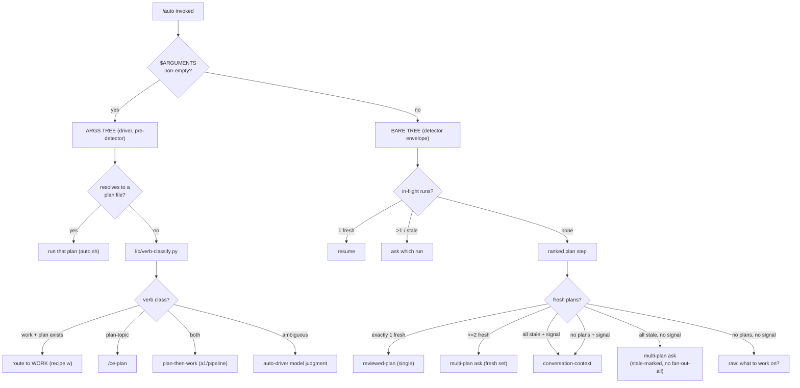

# fix: /auto entry-routing priors — match real usage

`/auto`'s deterministic entry detection is mechanically sound but its priors are
wrong: instruction-style args, a freshly-reviewed plan, and a cluttered
`docs/plans/` all pointed one way while routing went another. An expert agent had
to override the router on every entry. This plan fixes the routing priors so they
match how `/auto` is actually used. Issue #4 (self-describing recipe capabilities)
is deferred to a follow-up plan; it now has to integrate with the recipe schema +
verification contract that landed in v0.7.0 and is the heaviest, most entangled
piece — see Scope Boundaries.

**Product Contract preservation:** N/A — no upstream brainstorm. Origin is
`docs/handoff.md` (a directional field report), validated against the code during
Phase 0 research; several of its claims were corrected (see Problem Frame).

---

## Problem Frame

Field report from an agent driving `/auto` v0.6.7 to build and ship a feature
(reinforces memory `auto_should_be_context_aware_smart_entry`). Six issues were
reported; Phase-0 research validated each against the current code. Three of the
six were **corrected** by reading the source — recording the corrections here so
the plan builds on reality, not the report:

| # | Reported | Validated verdict |
|---|----------|-------------------|
| 1 | Freeform/arg rule misroutes imperatives to `/ce-plan` (no verb awareness) | **Confirmed.** `skills/auto-driver/SKILL.md:37-39`: args that don't resolve to a plan file → `/ce-plan`. No verb reading. Bit twice in the field (highest real-usage impact). |
| 2 | Multi-plan detection is filesystem-blind, outranks live intent | **Confirmed.** `lib/auto-detect.sh:354` `_discover_plans` is a bare `glob`+sort; `:513-545` always offers "Fan out all N". No recency/git-status ranking. |
| 3 | conversation-context never fires; "precedence is backwards" | **Corrected.** Precedence is *not* an accident — v0.6.0 deliberately made any plan outrank conversation-context (`auto-detect.sh:562` Step 2.5 fires only when `plans==0`; the v0.6.0 plan designed it as a no-plan fallback). The real defects are two: (a) `CLAUDE_AUTO_CONVERSATION_SIGNAL` has **zero production setters** — set only in `tests/integration/conversation-entry.test.sh`, so the branch is dead; (b) the deliberate precedence means a live, just-reviewed plan loses to stale siblings. Fixing (a) alone leaves the lived problem unsolved — which is why this plan couples #3 with #2. |
| 4 | Recipe→capability mapping illegible | **Confirmed but rescoped + deferred.** No capability fields exist. But v0.7.0 added `recipes/schema.json` (locked, `additionalProperties:false`), `docs/contracts/recipe-format.md` (locked prose contract), and a unit-level typed `verification` block. Self-describing capabilities must now integrate with that surface — out of scope here (see Scope Boundaries). |
| 5 | Single `bash auto.sh` dispatch is a SPOF | **Confirmed.** `lib/auto.py::run` (the logic behind the `auto.sh` shim) is a fail-fast linear chain; only the default `a1` recipe has a built-in fallback (`lib/recipes.py:139-152`). The field stall was the upstream `bash auto-detect.sh` classifier call being momentarily unavailable — the driver has no degrade path for "detector subprocess won't run." |
| 6 | Tension: multi-plan ALWAYS asks vs "never ask, infer/advisor" ethos | **Confirmed (design tension).** Resolved as a consequence of #2: ranking lets the detector *infer* the live plan instead of asking, shrinking the hard-ask to the genuinely-ambiguous all-stale case. No separate unit. |

**Two precedence trees, not one ranking.** The args path short-circuits the
detector entirely (`SKILL.md:37`, "before loading the hypothesis"), so it never
sees the situation enum. #1 lives on the **args tree**; #2/#3/#6 live on the
**bare-`/auto` detector tree**. The plan keeps them separate.

---

## Scope Boundaries

**In scope (this plan):**
- #1 — verb-aware args routing (args tree).
- #2 — recency/git-status plan ranking; suppress fan-out-all when most plans are stale.
- #3 — wire the dead conversation signal AND change v0.6.0 precedence so a live conversation preempts an all-stale plan set (couples with #2).
- #5 — degrade-safe entry: a fallback when the detector subprocess or dispatch line can't run.
- #6 — resolved as a consequence of #2 (inference replaces the hard-ask in the common case).

**Out of scope / non-goals:**
- Loop/tick/seam mechanics, recipe *execution* semantics, the goal-binding model — only the routing that selects among them changes.
- The advisor gate / pause-seam internals (only depended on, see Risks).

### Deferred to Follow-Up Work
- **#4 — self-describing recipe capabilities.** Now a v0.7.0-integration task: extend `recipes/schema.json` + `lib/recipes.py::validate()` + the locked `recipe-format.md` + the 6 recipe JSONs to advertise capability flags (opens-PR / review-loop / verify-gate), and surface them at decision time (picker + `recommender.py`). Heavy and entangled with just-landed code; gets its own plan on the fresh v0.7.0 base.
- **README + recipe-catalog freshness** (`README.md` still says v0.3.0 / 4 recipes / 427 tests) — adjacent cleanup, not entry-routing.

---

## Requirements

- **R1** — An imperative args string about existing work (verbs: execute, implement, ship, review, verify, "open a PR", build, fix) routes to WORK, not `/ce-plan`, when a plan exists. (#1)
- **R2** — A plan-topic args string (no work verbs) still routes to `/ce-plan`. (#1)
- **R3** — "plan and implement"-style args (both plan- and work-verbs) route to a plan-then-work recipe, not plan-only. (#1)
- **R4** — Genuinely ambiguous args are resolved by the model (auto-driver), not silently defaulted. (#1, honors deterministic-over-probabilistic)
- **R5** — Discovered plans are ranked by freshness; a plan authored/edited this session is distinguishable from stale siblings. (#2)
- **R6** — When exactly one fresh plan sits among stale siblings, the detector routes to that plan (reviewed-plan / single) instead of the multi-plan ask. (#2, #6)
- **R7** — When most/all discovered plans are stale, the multi-plan ask marks staleness and suppresses the "Fan out all N" footgun option. (#2)
- **R8** — `CLAUDE_AUTO_CONVERSATION_SIGNAL` is set by the auto-driver in production when the live transcript is rich, before the detector runs. (#3)
- **R9** — When the conversation signal is set AND all discovered plans are stale, the detector emits `conversation-context` instead of the multi-plan ask — a live conversation preempts an all-stale plan set. (#3, the precedence change)
- **R10** — When the detector subprocess cannot be invoked at all, the auto-driver degrades to a `raw`-style "what should we work on?" rather than stalling; a failed dispatch surfaces a clear error, not a silent hang. (#5)
- **R11** — Every change preserves the load-bearing invariants: detector stays READ-ONLY + degrade-safe + exit-0; the JSON envelope carries all keys on every path; no CE plugin file is edited. (all)

---

## Key Technical Decisions

**KTD-1 — Plan against v0.7.0; rebase is an execution prerequisite.** `origin/main`
advanced to v0.7.0 (`115f302`, PR #4) after the handoff was written; this worktree
sits on the older `82ce19c`. v0.7.0 added `recipes/schema.json`, `lib/verification.py`,
unit-level `verification` blocks, and bumped `plugin.json`. The worktree branch has
0 local commits, so the refresh is a clean fast-forward (`git -C ... merge --ff-only
origin/main` or reset) — "stay on this worktree" holds; only the base moves. **Do
this before Phase-1 implementation.** Nothing in *this* plan touches the v0.7.0
recipe/verification files, so the rebase is low-risk for these units (it matters most
for the deferred #4).

**KTD-2 — Two-tree precedence model.** Document and implement routing as two
disjoint trees, mirroring how the code already splits:
- *Args tree* (driver, before the detector): plan-file path → run it; imperative-about-existing-work → WORK; plan-topic → `/ce-plan`; both → plan-then-work.
- *Bare-`/auto` tree* (detector envelope): in-flight → ambiguous-runs → **ranked plans / conversation** → raw.

**KTD-3 — Verb routing = deterministic classifier + model residual.** The
deterministic-over-probabilistic mandate (`auto-detect.sh:5-7`, the single
most-cited learning) assigns *detection* to deterministic code and *classification*
to the model. Mirror the existing detector↔`recommender.py` split: a new
deterministic `lib/verb-classify.py` returns `{work | plan | both | ambiguous}`
over the args string (unit-testable like the detector); the auto-driver consults it
and only escalates the `ambiguous` residual to model judgment. *Rejected
alternative:* pure driver prose (model reads every args string) — loses
determinism + testability for the common, unambiguous cases, and the field
failures ("execute …", "implement …") are unambiguous.

**KTD-4 — Freshness signal = working-tree status + commit recency, mtime
tiebreak.** A plan is **fresh** if it is uncommitted (shows in `git status
--porcelain` — i.e. authored/edited this session) OR its last commit is within a
recency window (`CLAUDE_AUTO_PLAN_FRESH_SECONDS`, default ~1 day, mirroring the
in-flight TTL knob); **stale** otherwise. Ranking: uncommitted > recent-commit >
old-commit, ties broken by mtime-desc. This is deterministic, reuses git probes
the detector already runs (with the existing timeout guard), and directly captures
"the plan this conversation is about" — you just wrote it, so it's uncommitted or
just-committed. *Rejected alternatives:* mtime-only (a `git checkout`/clone
restamps mtimes — false freshness); a `status:` frontmatter field (requires
authoring discipline the field case shows doesn't happen).

**KTD-5 — Conversation preempts stale; a lone fresh plan is inferred, not
asked.** Fold ranking into the detector's plan step:
- Exactly one fresh plan (stale siblings ignored) → `reviewed-plan` (single, recipe `w`). Resolves the field case directly: 6 plans, 1 fresh → run the fresh one, no footgun ask.
- ≥2 fresh plans → multi-plan ask over the **fresh** set only.
- All stale + conversation signal set → `conversation-context` (the precedence change, R9).
- All stale + no signal → multi-plan ask, staleness-marked, fan-out-all suppressed (R7) — the safe current behavior, made safer.

**KTD-6 — The auto-driver sets the conversation signal inline.** The detector is
transcript-blind by design (single-quoted heredoc). The auto-driver judges its own
live transcript (per `driver-reference.md` §11: own transcript + ~2-day
`ce-sessions` *extracts*, never raw compaction — honors
`compaction_summary_may_hallucinate_apis`) and sets
`CLAUDE_AUTO_CONVERSATION_SIGNAL=1` inline on the `auto-detect.sh` invocation when
rich. This is the U3 wiring the v0.6.0 commit specified only as prose and never
shipped. (A parallel candidate fix existed in the now-absorbed `loop-planning-opt`
worktree; this plan supersedes it on the v0.7.0 base.)

**KTD-7 — Degrade-safe entry (#5).** Keep resilience modest and on-identity: the
detector already fall-closes to `raw` on *internal* errors. The gap is the
*subprocess itself* failing to run. The auto-driver wraps the `bash auto-detect.sh`
call so a non-zero/empty result degrades to a `raw`-style ask rather than stalling;
the single dispatch line surfaces a clear failure message instead of a silent hang.
No retry storms, no new daemon — a fallback branch, not a redundancy layer.

**Invariants honored (R11):** detector stays READ-ONLY, degrade-safe, exit-0 on
every path; the JSON envelope keeps all nine keys on every path including the
catastrophic-error fallback (`auto-detect.sh:604-619`); no CE plugin file is
edited (the v0.6.0 ship constraint); new tests get a deliberate-fail smoke check
(`new_tests_need_deliberate_fail_smoke_check`).

---

## High-Level Technical Design

### The two precedence trees

### Detector plan-step decision (KTD-5), replacing the flat `len(plans)` branch

The current `if len(plans)==1 → reviewed-plan` / `if len(plans)>1 → multi-plan
ask` becomes: rank → partition into fresh/stale → branch on the **fresh** count
and the conversation signal, per the flowchart above. Directional only; the
implementer owns the exact Python.

---

## Implementation Units

### U1. Plan freshness ranking in the detector

**Goal:** Replace the bare `_discover_plans` glob with a ranked, freshness-classified
plan list. Pure data layer — no routing-behavior change yet.
**Requirements:** R5. **Dependencies:** none (do after the KTD-1 rebase).
**Files:**
- `lib/auto-detect.sh` (the embedded Python: extend `_discover_plans`, add a `_classify_plan_freshness` helper using `git status --porcelain` + `git log -1 --format=%ct <path>` with the existing `_GIT_TIMEOUT_SECONDS` guard; add `CLAUDE_AUTO_PLAN_FRESH_SECONDS` env knob, floor-guarded like the in-flight TTL).
- `tests/unit/plan-ranking.test.sh` (new).
**Approach:** Return a list of `(rel_path, freshness, sort_key)` where freshness ∈
`{fresh, stale}`. Uncommitted (untracked/modified) → fresh; committed within the
window → fresh; else stale. Sort uncommitted > recent-commit > old-commit, mtime-desc
tiebreak. Degrade: any git failure → treat as stale (conservative — avoids false
"run this" inference) but keep the plan in the list.
**Patterns to follow:** the in-flight TTL knob + floor guard (`auto-detect.sh:110-117`);
the timeout-guarded git probe (`_git_worktree_root`, `:141-165`); the
single-stat-before-sort discipline (`_read_in_flight`, `:323-329`).
**Test scenarios** (`tests/unit/plan-ranking.test.sh`, bash harness, hermetic temp
`git init` repo per case, mirroring `hypothesis-shape.test.sh`):
- Uncommitted plan file (untracked) → classified fresh.
- Committed-just-now plan → fresh; committed-long-ago plan → stale.
- Mixed set (1 uncommitted + 3 old-committed) → ranking puts the uncommitted first; exactly one fresh.
- `CLAUDE_AUTO_PLAN_FRESH_SECONDS=0` → every committed plan stale (knob honored); negative value floored.
- git unavailable / not a repo → all plans present, all classified stale, no crash.
- Empty `docs/plans/` → empty list, no error.
**Verification:** `bash tests/run.sh unit` green; the helper is read-only (no writes to the temp repo beyond the test's own git setup).

### U2. Multi-plan branch routes on freshness (#2, #6)

**Goal:** Use U1's ranking so a lone fresh plan is inferred (reviewed-plan) and the
stale multi-plan ask drops the fan-out-all footgun.
**Requirements:** R6, R7. **Dependencies:** U1. **Files:**
- `lib/auto-detect.sh` (the Step-2 plan branch, `:495-545`).
- `tests/unit/hypothesis-shape.test.sh` (extend the existing multi-plan cases).
**Approach:** Branch on the fresh-plan count (KTD-5): exactly 1 fresh → emit
`reviewed-plan` with that plan; ≥2 fresh → multi-plan ask over the fresh set; all
stale → multi-plan ask with each option description marked stale (e.g. "stale —
committed 35d ago") and the "Fan out all N" option omitted. Preserve `multi_plan.paths`
for a confirmed per-plan run. Keep the envelope shape invariant.
**Patterns to follow:** the existing option-array construction (`:524-533`); the
ambiguity `choice` shape; the summary-string style.
**Test scenarios:**
- 1 uncommitted + 5 old-committed (the field case) → `situation==reviewed-plan`, `single_plan.path` is the uncommitted one, `ambiguity==None`.
- 3 uncommitted plans → `multi-plan`, options = the 3 fresh only, fan-out-all present over fresh set.
- 4 all-stale plans, no conversation signal → `multi-plan`, options stale-marked, **no** "Fan out all" option, `multi_plan.paths` still populated.
- Single plan, uncommitted → `reviewed-plan` (unchanged behavior preserved).
- Envelope invariant: all nine keys present on each branch (assert against the canonical key list at `hypothesis-shape.test.sh:372-383`).
- Deliberate-fail check: temporarily invert the fresh/stale test and confirm the new assertions fail.
**Verification:** `bash tests/run.sh unit` green; existing multi-plan tests still pass or are updated in-place with rationale.

### U3. Conversation signal wiring + stale-preemption (#3)

**Goal:** Make `conversation-context` reachable in production and let it preempt an
all-stale plan set.
**Requirements:** R8, R9. **Dependencies:** U1, U2. **Files:**
- `lib/auto-detect.sh` (read `CLAUDE_AUTO_CONVERSATION_SIGNAL` inside the plan step, not only at Step 2.5; emit `conversation-context` when all plans stale + signal set).
- `skills/auto-driver/SKILL.md` (set the signal inline on the detector call when the transcript is rich; ≤70-line budget per the smoke test).
- `commands/auto.md` (the prose at `:55` already describes this — align it with the now-real behavior; keep the single `$ARGUMENTS` line).
- `tests/integration/conversation-entry.test.sh` (extend).
**Approach:** In the detector, the all-stale case checks the signal: set →
`conversation-context` (recommendation null, driver fills via `recommender.py`);
unset → the U2 stale multi-plan ask. Keep the existing no-plan Step-2.5 branch. In
the driver, add the one mechanical step the v0.6.0 commit omitted: judge transcript
richness, then `CLAUDE_AUTO_CONVERSATION_SIGNAL=1 bash …/auto-detect.sh`. The driver
classify→`recommender.py`→`auto-author-goal` handoff already exists in §11/SKILL.md
and is unchanged.
**Execution note:** Start with a failing integration test for the
all-stale-plans + signal → `conversation-context` contract before touching the detector.
**Patterns to follow:** the existing Step-2.5 emit (`:562-568`); the integration
test's "real detector + real recommender, nothing mocked" style; the env-var-gated
branch documented at `:60-71`.
**Test scenarios** (`tests/integration/conversation-entry.test.sh`):
- Signal set + 3 all-stale plans → `situation==conversation-context` (preemption; the new precedence).
- Signal set + 1 fresh plan among stale → `reviewed-plan` (fresh plan still wins over conversation — U2 precedence preserved).
- Signal **unset** + all-stale plans → `multi-plan` ask (no preemption without the signal — R9 is signal-gated).
- Signal set + no plans → `conversation-context` (existing Step-2.5 behavior preserved).
- Driver smoke (`tests/smoke/auto-driver.test.sh`): SKILL.md contains an executable inline `CLAUDE_AUTO_CONVERSATION_SIGNAL=` setter on the detector call (not just prose); ≤70 lines; cites `driver-reference.md`.
**Verification:** `bash tests/run.sh integration smoke` green; grep confirms a production setter now exists (`git grep CLAUDE_AUTO_CONVERSATION_SIGNAL -- skills/ commands/` returns an executable line, closing the dead-code gap).

### U4. Verb-aware args routing (#1)

**Goal:** Imperatives about existing work route to WORK, not `/ce-plan`.
**Requirements:** R1, R2, R3, R4. **Dependencies:** U1 (consults plan discovery for
"a plan exists"). **Files:**
- `lib/verb-classify.py` (new — deterministic `{work|plan|both|ambiguous}` over the args string; tiny CLI emitting one JSON line, mirroring `recommender.py`'s `_cli`).
- `skills/auto-driver/SKILL.md` (replace the `:37-39` rule: call verb-classify; route per KTD-2 args tree; `ambiguous` → model judgment).
- `tests/unit/verb-classify.test.sh` (new); `tests/integration/recipe-smart-entry.test.sh` (extend with the args-tree routing contract).
**Approach:** Maintain a small work-verb set (execute, implement, ship, review,
verify, "open a pr", build, fix, finish, land) and plan-verb/topic markers (plan,
design, explore, figure out, scope). Both present → `both`; only work → `work`; only
plan/topic → `plan`; none/conflicting → `ambiguous`. The driver combines `work` with
plan-existence (from U1 discovery): work + plan exists → recipe `w`; work + no plan →
`ambiguous` (nothing to work on) → model. `both` → plan-then-work (`a1`/`pipeline`).
**Patterns to follow:** `recommender.py` as the template for a deterministic
stdlib-only classifier + JSON CLI + the deterministic-over-probabilistic citation;
the existing args resolution at `SKILL.md:37`.
**Test scenarios** (`tests/unit/verb-classify.test.sh`):
- "execute, code-review and verify the plan, then open a PR" → `work` (field case #2).
- "develop and implement a plan to add X" → `both` (field case #1 — plan + implement).
- "a faster image cache" / "dark mode for settings" (topic, no verbs) → `plan`.
- "make it better" (improvement verb only, no plan/work signal) → `ambiguous`.
- Empty / whitespace args → `ambiguous` (driver falls through to bare-tree).
- Case-insensitive; multi-clause; verb inside a longer sentence still detected.
- Integration (`recipe-smart-entry.test.sh`): work-verbs + a discovered plan → WORK routing; topic + no plan → `/ce-plan`.
- Deliberate-fail check on the new unit file.
**Verification:** `bash tests/run.sh unit integration` green; the classifier is pure
(no IO beyond reading argv), stdlib-only.

### U5. Degrade-safe entry (#5)

**Goal:** A detector subprocess that won't run, or a dispatch that fails, degrades
gracefully instead of stalling.
**Requirements:** R10. **Dependencies:** none (independent; can land in parallel).
**Files:**
- `skills/auto-driver/SKILL.md` (wrap the `bash auto-detect.sh` load: non-zero exit or empty stdout → treat as `raw`, ask what to work on).
- `lib/auto.sh` and/or `lib/auto.py` (surface a clear one-line failure on dispatch error rather than a silent abort; no behavior change to the success path).
- `tests/integration/` (new or extend: detector-unavailable degrade; dispatch-failure surface).
**Approach:** Modest, on-identity. The driver already trusts the envelope; add one
guard: if the detector can't be invoked (command failure / empty output), synthesize
the `raw` open-question path. For dispatch, ensure `auto.py::run`'s non-zero returns
reach the operator as a legible message (they mostly do — audit and close any silent
gap). No retries, no daemon.
**Test scenarios:**
- Detector script made non-executable / returns non-zero → driver degrades to a raw-style ask (assert the fallback path is taken, not a hang). Simulate via a stub `auto-detect.sh` on PATH returning exit 1 / empty stdout, in the harness style that stubs `cmux` (`hypothesis-shape.test.sh:385-502`).
- Dispatch with a missing plan file → `auto.py` returns non-zero with a message naming the missing file (already `:360-362`; assert it's surfaced).
- Test expectation for the SKILL.md prose change: covered by the integration degrade test, not a separate unit.
**Verification:** `bash tests/run.sh integration` green; a forced detector failure produces an actionable prompt, not a stall.

### U6. Contracts, docs, and version bump

**Goal:** Make the new two-tree precedence the documented contract and bump the version.
**Requirements:** R11 (legibility of the contract). **Dependencies:** U1–U5. **Files:**
- `docs/contracts/driver-reference.md` (rewrite the precedence description as the two trees; update §9 multi-plan for ranking/preemption; update §11 to note the signal is now set inline).
- `commands/auto.md` (align the conversation-signal prose with the shipped behavior).
- `.claude-plugin/plugin.json` (version bump from the v0.7.0 baseline — e.g. 0.7.0 → 0.7.1 or 0.8.0 per the maintainer's semver call).
- `skills/auto-driver/SKILL.md` (final pass: confirm ≤70-line budget after U3/U4/U5 edits).
**Approach:** Documentation + version only; no logic. Keep the LOCKED-contract tone
of `driver-reference.md`. Do **not** touch `recipe-format.md` / `recipes/schema.json`
(that's the deferred #4).
**Patterns to follow:** existing §-numbered structure of `driver-reference.md`; the
version line at `.claude-plugin/plugin.json:4`.
**Test scenarios:** `Test expectation: none — docs + version only.` Covered
indirectly by `tests/smoke/auto-driver.test.sh` (size budget, citation presence) and
`tests/unit/size-budget.test.sh`.
**Verification:** `bash tests/run.sh all` green end-to-end; smoke budget passes;
`driver-reference.md` describes both trees and the preemption rule.

---

## Parallelism Analysis

- **Sequential spine:** U1 → U2 → U3. U2 needs U1's ranking; U3 needs U2's stale partition + the reviewed-plan/multi-plan branches.
- **Parallel-safe alongside the spine:**
  - **U4** (verb routing) — depends only on U1's plan-discovery helper, not on U2/U3's routing changes. Can start once U1 lands. Touches `lib/verb-classify.py` (new) + `SKILL.md`.
  - **U5** (resilience) — fully independent; touches `SKILL.md` + `auto.sh`/`auto.py`. Can start immediately.
- **Shared-file contention:** U3, U4, U5 all edit `skills/auto-driver/SKILL.md`. If
  run as parallel worktrees they will collide on that one file — serialize the
  SKILL.md edits (or land U3/U4/U5 on one branch) rather than three concurrent
  worktrees. The `lib/auto-detect.sh` edits (U1/U2/U3) are already sequential.
- **U6** is a convergence step — runs last, after U1–U5, and finalizes the SKILL.md
  budget + docs + version.
- **Recommended execution:** the rebase (KTD-1) first; then the U1→U2→U3 spine on
  one branch with U4 and U5 folded into the same branch's SKILL.md edits to avoid the
  contention above; U6 closes out. Given the SKILL.md contention and the modest unit
  count, a single sequential branch is lower-risk than a fan-out here.

---

## System-Wide Impact

- **Operators:** bare `/auto` in a repo with a freshly-reviewed plan now Just Works
  (runs it) instead of asking; imperative `/auto execute the plan` works instead of
  re-planning. Fewer overrides.
- **The auto-driver skill** gains a transcript-richness judgment + a verb-classify
  call — both before dispatch. Keep within the 70-line budget (U6 audit).
- **Downstream consumers of the envelope:** only the auto-driver consumes the
  hypothesis JSON; the shape contract (all keys, every path) is preserved, so no other
  consumer is affected.
- **No CE plugin files touched** (ship constraint preserved).

---

## Risks & Dependencies

- **Advisor-gate / pause-seam is documented UNPROVEN in production**
  (`driver-reference.md:517-579`: session-parity check non-functional until
  `tests/verify-session-parity.sh` is recorded green against a real run). Activating
  `conversation-context` *dispatch* (U3) leans on the pause-seam for pre-dispatch
  escalation. **Mitigation:** U3 only makes the *situation* reachable + routing
  correct; it must not silently assume the gate works. Add a verification prerequisite
  — run a real bare-`/auto` conversation-context entry once and confirm the
  escalation/seam behaves — before declaring #3 done. Treat as a release gate, not a
  unit.
- **Base rebase (KTD-1):** must land before implementation. Clean fast-forward (0
  local commits), low conflict risk for these files; the risk is *forgetting* it and
  planning/coding against the stale base.
- **Freshness false-negatives:** a legitimately-active plan that was committed long
  ago and not re-touched reads as stale → falls to the multi-plan ask (safe degrade,
  not a wrong silent run). Acceptable; the knob (`CLAUDE_AUTO_PLAN_FRESH_SECONDS`)
  lets operators widen the window.
- **SKILL.md three-way edit contention** (U3/U4/U5) — see Parallelism Analysis;
  serialize.
- **`recommender.py` taxonomy is a second source of recipe identity** (hard-coded,
  separate from recipe JSON). This plan doesn't change it, but the deferred #4 will
  have to reconcile the two — noted so #4's planner sees it.

---

## Open Questions (deferred to implementation)

- Exact work-verb / plan-verb lexicon for `verb-classify.py` — start from the R1/R3
  lists; expand against real `/auto` invocations during implementation. Edge phrasings
  ("wrap up the plan", "get this shipped") resolve to the `ambiguous` → model path, so
  the lexicon need not be exhaustive on day one.
- Default value for `CLAUDE_AUTO_PLAN_FRESH_SECONDS` — proposed ~86400 (1 day, mirrors
  the in-flight TTL); tune after dogfooding.
- Whether "≥2 fresh plans" is common enough to warrant ranking *within* the fresh set
  (vs. a flat ask) — defer until observed.
- Version bump magnitude (0.7.1 vs 0.8.0) — maintainer's semver call at U6.

---

## Sources & Research

- Origin: `docs/handoff.md` (field report; claims validated/corrected in Problem Frame).
- Detector + driver source: `lib/auto-detect.sh`, `skills/auto-driver/SKILL.md`, `lib/recommender.py`, `lib/auto.py`/`lib/auto.sh`, `lib/auto-spawn.py`, `lib/recipes.py`.
- Original conversation-entry design: `docs/plans/2026-06-11-001-feat-auto-conversation-entry-plan.md`; `docs/contracts/driver-reference.md` §11/§13.
- v0.7.0 surface (deferred #4 context): `recipes/schema.json`, `docs/contracts/recipe-format.md`, `docs/contracts/verification-contract.md`, `lib/verification.py`, `skills/auto-design/`.
- Conventions: deterministic-over-probabilistic (`auto-detect.sh:5-7`); JSON-envelope contract (`auto-detect.sh:83-85`); no-CE-edit ship constraint (v0.6.0 plan); test harness `bash tests/run.sh all`; deliberate-fail smoke check.
- Memory: `auto_should_be_context_aware_smart_entry`, `auto_dx7_algorithm_picker`, `native_goal_is_model_judged_not_externally_settable_predicate`, `deterministic_over_probabilistic_v1`, `compaction_summary_may_hallucinate_apis_verify_against_git`.
- Branch collision check: `feature/auto-drive-fixes` (no entry-surface overlap), `feature/loop-planning-opt` (absorbed into v0.7.0 main).
