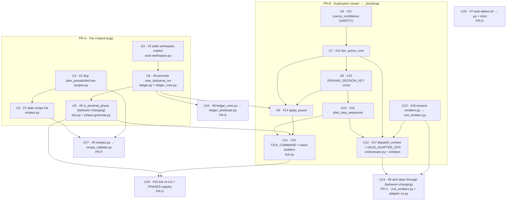

# refactor: auto loop-engine codebase-health backlog

## Summary

Work through the 18-item structural backlog from a thermo-nuclear (deep
maintainability) audit of the whole `auto` loop-engine. Three kinds of work:
(1) six latent bugs, (2) a recurring "reinvented-instead-of-canonical
helper" duplication class, (3) four oversized/concept-mixing file splits. Behavior
is preserved everywhere except two deliberately behavior-changing units — U5
(`is_terminal_phase`) and U14 (wire the dependency engine through) — each of which
ships with a deliberate-fail test.

The engine is architecturally healthy; this is concentrated debt, not a rewrite.
Leave the healthy parts alone (the ledger DAG + atomicity, the verification/iteration
split, the adapter strategy boundary, the classification family, the destructive-
patterns table + its import-time drift assert, the PreToolUse fail-mode asymmetry,
the `.sh` shim pattern).

**Target repo:** this repo (`auto`), worktree `auto-codebase-health`, based on
`origin/main` @ `a0004c3` (v0.9.0 — launch-chooser merged). All paths repo-relative.

---

## Problem Frame

The audit (6 subsystem reviewers) found the debt is **concentrated, not diffuse**:

- **Six latent bugs** dormant only because of current recipe shapes — they become live
  as soon as a non-`work`-terminal recipe, a `pipeline`/`review` recipe, an unvalidated
  adapter op, or a stale workspace marker exercises them. (The duplicate frozenset key,
  U1, is separate source hygiene, not one of the six.)
- **A duplication class**: verbal "keep in sync" comments across ~8 sites where a
  helper was re-implemented instead of centralized in `lib/_bootstrap.py`. Each is a
  latent drift bug. The launch-chooser review already fixed one instance
  (`driving_session.driving_session_id` + `iter_worktree_ledgers` in `launch-mode.py`);
  there are more.
- **Four files** that mix concepts or exceed the 1000-LOC budget: `auto-detect.sh`
  (699), `ledger_core.py` (1055, over budget), `recipes.py` (981), and the
  `tick.py`/`tick_advance.py` pair (769/805) whose split is a verbatim LOC cut rather
  than a conceptual seam.

The engine's own dependency graph is **live but starved**: emitter-materialized work
units are all born with `depends_on: []`, so a fan-out of emitted siblings has no
ordering, and the driver hand-sequences waves by hand. (Static recipe edges in
`a2.json`/`a4.json` *are* enforced — the no-op is specifically the emitter path.)

---

## Requirements

- **R1** — Fix the six latent bugs (U2, U3, U4, U5, U12, U14) so they are correct under
  recipe shapes that don't ship today (non-`work` terminal, `pipeline`/`review`
  spoofing, stale workspace markers, unvalidated adapter ops). U1 is source hygiene
  (R2), not a latent bug.
- **R2** — Shipped-recipe behavior is preserved by every unit. The latent-bug units
  U2, U3, U5, U12, and U14 change behavior only for the *non-shipped* recipe shapes they
  fix, and each carries a RED-before (deliberate-fail) test proving the old code was
  wrong — U5 and U14 are the largest such changes, but the discipline is not exclusive
  to them. U1 and U4 are pure hygiene / canonicalization with no behavior change.
- **R3** — Canonicalize the duplication cluster into `lib/_bootstrap.py` (or the
  topology-correct home), preserving each site's load-bearing rationale as a comment
  where safety intent differs (notably U6's SAFETY gate).
- **R4** — Split the four structural files, each as its own PR with its own tests,
  following the `adapter-*.sh` → `.py` + shim precedent and the existing lazy-load
  idiom. Remove any size-budget waiver that decomposition retires.
- **R5** — Resolve the #6 dependency-engine fork by **wiring deps through** (engine
  owns ordering); do not delete the readiness machinery.
- **R6** — Every new/changed test emits its summary line in the exact
  `<name>.test.sh: N passed, M failed` form the harness tallies (an indented or
  prefixless summary silently reports pass=0 as green).
- **R7** — Any extracted module that carries a single-source-of-truth string literal
  (`loop_phase`, `decision`) is added to the corresponding AST-lint allowlist, or the
  lint goes RED.

---

## Key Technical Decisions

- **KTD-1 (the #6 fork — decided): wire deps through, don't delete.** The readiness
  graph (`orchestrator.ready_units`/`_is_ready`/`_ancestor_ids`/`_dependency_satisfied`)
  is live (consumed by the `ready` CLI subcommand) but starved by emitter
  `depends_on: []`. Emitters gain edge passthrough; the enumerate step emits per-item
  edges. This commits `auto` to engine-owned ordering and removes the driver's manual
  wave-sequencing. Rationale + rejected alternative recorded in memory
  `project_auto_dep_engine_wire_through`.
- **KTD-2 — `lib/_bootstrap.py` is the canonical helper home** for pure, no-IO
  helpers (U6, U7, U10, and the U11 constants). Helpers that wrap a ledger mutator go
  to the ledger facade (`lib/ledger.py`) for import-topology correctness (U9). The
  frozenset that gates `dispatch_batch` lives next to it in `orchestrator.py` (U12).
- **KTD-3 — Splits follow the shipped `adapter-ce.sh`/`adapter-ce.py` precedent**: a
  pure `.sh` shim that pins `CLAUDE_AUTO_PYTHON3="${CLAUDE_AUTO_PYTHON3:-/usr/bin/python3}"`,
  resolves `script_dir` via `BASH_SOURCE`, execs the sibling `.py` forwarding `"$@"`,
  with a `BASH_SOURCE==$0` direct-invocation guard. Reach back for shared logic via
  `_bootstrap` (`resolve_repo`, `iter_worktree_ledgers`) rather than re-inlining.
- **KTD-4 — Split by concept, not by line range.** `recipes.py` and `ledger_core.py`
  are not cleanly line-ordered; the cut is by function-concern (validation vs registry;
  predicate evaluator vs I/O/lock core), using the existing `ledger_core._lazy_load`
  idiom to avoid import cycles.
- **KTD-5 — The `PHASES` registry (U18) is gated on a precondition.** The three
  phase-advance functions return three different shapes (`(dict, None)` for plan, bare
  `dict` for work/brainstorm, `Optional[dict]` for iteration). Normalize to one shape
  (plan → bare dict is the low-risk direction; its tuple's second element is always
  `None` at the shown sites) **before** collapsing the three if/elif ladders. If
  normalization proves risky, ship the seam re-cut + dead-alias deletion and defer the
  registry.
- **KTD-6 — PR boundaries.** Tier A is one PR; the duplication cluster is one PR; #6
  is its own PR (behavior-changing); each of the four splits is its own PR. Seven PRs
  total, dependency-ordered below.

---

## High-Level Technical Design

### Dependency graph (waves are driven by file-ownership serialization)

Same-file serialization chains (collision-avoidance for the edge-driven work-loop —
every unit pair that edits a shared file has an ordering edge so `ready_units` never
returns two same-file units at once):
`_bootstrap.py` via U6→U7→U8→U10→U11; `unit_emitters.py` via U13→U12→U14; `tick.py`
via U4→U5→U11→U18; `tick_advance.py` via U4→U13→U12→U18 (see Execution model — U4/U18
are cross-PR, held apart by sequential PR landing); `auto-resume.py` via U7→U9→U11;
`on-pretooluse-*.py` via U8→U9; `adapter-ce.py` via U10→U12; `auto-status.py` via
U7→U12; `auto-workspace.py`/`auto-spawn.py` via U3→U4; `recipes.py` via U1→U2→U17;
`ledger*.py` via U4→U9 and U4→U16.

---

## Execution Model

How the `/auto` `w` run turns this 18-unit plan into seven PRs — a load-bearing
contract, because the work-loop is edge-driven and the plan's collision-safety
depends on it.

- **Engine (edge-driven, single-branch fan-out).** SKILL §4: each wave computes
  `ready_units` (units whose `depends_on` is satisfied), the driver picks a cap, and
  `dispatch_batch` launches a `/ce-work <unit-id>` agent per ready unit. The engine is
  **not** PR-aware and creates no PRs — `depends_on` edges are the only structural
  ordering the engine enforces.
- **Driver sequences the seven PR-groups in dependency order** (PR-A → PR-B → {PR-C,
  PR-D, PR-E, PR-F} → PR-G, honoring the cross-PR edges U4→U16, U1/U2→U17, U5/U11→U18,
  U13→U14). For each PR-group: dispatch its ready units (low cap, since same-file
  overlap is pervasive) → `converge` → run `/ce-code-review` to green (the goal's
  review+verify gate) → land the PR → rebase the next group. This PR-grouping is the
  **driver's** job, not the engine's — at wave 1 `ready_units` would otherwise return
  every no-dep unit across all PRs (U1, U3, U4, U6, U13, U15…).
- **Collision safety has two layers.** *Within a PR:* the `depends_on` edges (Risks
  section) guarantee `ready_units` never returns two same-file units at once, and the
  driver still caps to 1 if a wave's ready set shares a file. *Across PRs:* sequential
  landing + rebase separates same-file edits that live in different PRs (e.g.
  `tick_advance.py` touched by U4/PR-A and U18/PR-G).
- **Driver-sequenced until U14, engine-ordered after.** The `w` recipe materializes
  work units through the a1-style plan→work emitter — the exact path that drops
  `depends_on` edges today (memory `feedback_auto_a1_workloop_manual_wave_sequencing`).
  So early waves are hand-sequenced; landing U14 (PR-C) early lets the engine order
  later emitter fan-outs. The driver contract is unchanged either way — U14 just moves
  ordering from the driver's cap-tuning into the engine.
- **Engine ≠ target.** The driving engine is the plugin-cache copy
  (`~/.claude/plugins/cache/shrimpshack/auto/<ver>/lib/`), resolved from its own
  `BASH_SOURCE` dir — separate from this worktree's `lib/*.py` being rewritten. A
  half-applied intermediate state (e.g. mid-U16 or mid-U18) cannot wedge the running
  loop.

---

## Scope Boundaries

**In scope:** all 18 audit items (U1–U18) plus a light duplication pass over the two
newly-merged launch files U6 actually touches (`launch-gate.py` and the `recommender.py`
delta) that the audit predates. `launch-mode.py`'s duplication
(`driving_session_id` + `iter_worktree_ledgers`) was already resolved by the
launch-chooser review (see Problem Frame), so it needs no new owner here.

**Explicitly healthy — leave alone:** the ledger layering DAG + atomicity, the
verification/iteration split, the adapter strategy boundary, the classification family
(recommender/launch-gate/launch-mode), the destructive-patterns table + its import-time
drift assert, the PreToolUse fail-mode asymmetry, the `.sh` shim pattern (except
`auto-detect.sh`).

### Deferred to Follow-Up Work

- The `PHASES` registry half of U18 if KTD-5's return-shape normalization proves risky
  — ship the seam re-cut + dead-alias deletion, defer the registry.

---

## Implementation Units

### U1. Delete duplicate `plan_presatisfied` key

- **Goal:** Remove the second, redundant `plan_presatisfied` entry in the
  `_KNOWN_TOPLEVEL` frozenset.
- **Requirements:** R2. **Dependencies:** none.
- **Files:** `lib/recipes.py` (delete lines 114–121, keep 106–113).
- **Approach:** It's a frozenset, so the two literals already collapse — zero
  behavioral effect; this is source hygiene. Keep the first block (its closing line
  cross-references `_validate_plan_presatisfied`, the real coherence validator at
  line 214); drop the second.
- **Test scenarios:** `Test expectation: none — comment/dead-literal removal, no
  behavior change.` Existing `tests/unit/recipes.test.sh` validate coverage must stay
  green.
- **Verification:** `bash tests/run.sh unit` green; `plan_presatisfied` appears once
  in `_KNOWN_TOPLEVEL`.

### U2. Replace stale hardcoded recipe list with a dynamic built-in scan

- **Goal:** The description-spoofing guard in `validate_and_lint` must cover every
  built-in recipe, not the stale `("a1","a2","a4","w")` tuple (misses
  `pipeline`/`review`).
- **Requirements:** R1, R2. **Dependencies:** U1 (same file, sequence to avoid churn).
- **Files:** `lib/recipes.py` (the loop at lines 965–980; reuse `_BUILTIN_DIR` at 754
  and the scan idiom from `list_available` at 804–818), `tests/unit/recipes.test.sh`.
- **Approach:** Replace the literal tuple at line 968 with
  `sorted(fn[:-5] for fn in os.listdir(_BUILTIN_DIR) if fn.endswith(".json") and fn != "schema.json")`.
  `validate_and_lint` takes no `repo_root`, so scan `_BUILTIN_DIR` directly (keeps the
  guard built-in-scoped). Optionally factor a `_builtin_names()` helper shared with
  `list_available`.
- **Test scenarios:**
  - Happy path: a workspace recipe copying `a1`'s description verbatim → flagged
    (regression guard, still works).
  - **New coverage:** a workspace recipe copying `pipeline`'s (and `review`'s)
    description verbatim → now flagged (was silently allowed).
  - Edge: a recipe whose `name` equals the built-in it matches → not flagged
    (self-match exemption preserved).
- **Verification:** the two new cases fail on current code, pass after the fix; U5
  anti-shadow story now covers all six built-ins.

### U3. Return a distinct status for a stale workspace marker

- **Goal:** `detect()` must not report a stale marker as `"unmarked"` — the
  stale→recreate path currently fails silently because `create()` raises on the marker
  that's still on disk.
- **Requirements:** R1. **Dependencies:** none.
- **Files:** `lib/auto-workspace.py` (stale branch 165–174; docstring enum line 143;
  align with the module docstring's already-documented `recreate` state at 13–17),
  `lib/auto-spawn.py` (correct the misleading comment at 361–365),
  `tests/unit/workspace-detection.test.sh`, `tests/unit/workspace-creation.test.sh`.
- **Approach:** Return `status: "recreate"` (or `"stale"`) from the stale branch instead
  of `"unmarked"`; update the detect() docstring enum. Then make the recreate path
  succeed: either `create()` treats a stale marker as overwrite-eligible, or the caller
  passes `force=True` when `status == "recreate"`. Preserve the existing safe-degrade
  behavior in `auto-spawn.py` (it branches only on `status == "project"`).
- **Test scenarios:**
  - `detect()` with a marker whose cmux workspace is gone → `status == "recreate"`,
    `marker_stale == True`, `marker_path` non-null.
  - Truly unmarked repo → `status == "unmarked"`, `marker_path == None` (unchanged).
  - `create()` on a stale marker via the recreate path → succeeds (does not raise).
- **Verification:** stale-marker recreate no longer raises `WorkspaceError`; the
  `auto-spawn.py` comment matches the real status set.

### U4. Promote `now_iso()`/`parse_iso()` to public; repoint consumers

- **Goal:** Stop leaking `_now_iso`/`_parse_iso` privates through the `ledger.` facade
  to 6 consumers, and kill the hand-rolled `_now_iso` copies.
- **Requirements:** R1, R3. **Dependencies:** U3 (same files `auto-workspace.py` /
  `auto-spawn.py` — U3's bug fix lands before U4's parity-copy collapse). Precedes U5,
  U9, U16 (shared files).
- **Files:** `lib/ledger_core.py` (defs at 270/278 → public `now_iso`/`parse_iso`),
  `lib/ledger.py` (facade re-exports 82–83), consumers: `lib/tick_advance.py:72`,
  `lib/on-pretooluse-askuser.py:97`, `lib/tick_guidance.py:279`, `lib/on-stop.py:126`,
  `lib/orchestrator.py:105`, and `lib/tick.py:272` (the sixth consumer —
  `now_iso = ledger._now_iso()`); duplication collapse in `lib/auto-workspace.py:311–317`
  and `lib/auto-spawn.py:110–113`; `tests/unit/ledger.test.sh`,
  `tests/unit/import-topology.test.sh`. Note `tick.py` is also edited by U5/U11/U18, so
  U4's one-line repoint at `tick.py:272` lands first in that file's chain (U4→U5→U11→U18).
- **Approach:** Rename to public in `ledger_core`, re-export publicly from `ledger`.
  Keep `_`-aliases only if any caller can't be repointed in-PR. Repoint the four
  `_parse_iso` consumers + the two `_now_iso` sites (orchestrator.py:105 re-export and
  tick.py:272). Have `auto-workspace`
  and `auto-spawn` import `ledger.now_iso()` instead of their parity copies. **Leave
  `_with_locked_ledger` private** — `ledger_mutators` reaches it via `ledger_core`
  inside the package (intended DAG, not a leak).
- **Test scenarios:**
  - `ledger.now_iso()` / `ledger.parse_iso()` are public and round-trip an ISO stamp.
  - Import-topology guard stays green (no new cross-layer import).
  - `auto-workspace` marker `created_at` still matches the ISO-Z format.
- **Verification:** no consumer imports `ledger._now_iso`/`_parse_iso`; the two parity
  copies are gone.

### U5. Route both terminal-phase guards through `is_terminal_phase()` (behavior-changing)

- **Goal:** The two divergent hand-rolled terminal-phase guards in `tick.py` must both
  delegate to the canonical `phase_grammar.is_terminal_phase()` (which has zero call
  sites today).
- **Requirements:** R1, R2. **Dependencies:** U4 (same file, `tick.py` — U4's
  `tick.py:272` repoint lands first).
- **Files:** `lib/tick.py` (Guard A denylist 537–539; Guard B allowlist 672–673),
  `lib/phase-grammar.py` (`is_terminal_phase` at 61–70),
  `tests/unit/tick.test.sh`, `tests/unit/phase-grammar.test.sh`,
  `tests/unit/phase-grammar-ast-lint.test.sh` (assert `is_terminal_phase` now referenced).
- **Approach:** Guard A (`phase != "plan" and phase != "seam"`) and Guard B
  (`phase == "work"`) agree only because every shipped recipe's `terminal_phase == "work"`.
  Route both through `is_terminal_phase(led, phase)`; Guard A keeps its
  `not iteration_pending` sub-clause. This is behavior-changing for any non-`work`
  terminal recipe.
- **Execution note:** Start with the failing test below (deliberate-fail).
- **Test scenarios (deliberate-fail):**
  - Fixture: a ledger with `phase_order: ["plan","seam","brainstorm"]`,
    `terminal_phase: "brainstorm"`, `exit_predicate_result.met = true`, current
    `phase == "brainstorm"`. Assert both stop paths route to `loop_phase="done"`. On
    **current code** Guard B fails to stop (`brainstorm != "work"`) — that failing
    assertion is the deliberate-fail; after the fix both stop.
  - Converse: brainstorm is NOT terminal (mid-run) with predicate met → neither guard
    stops (proves Guard A's old denylist over-fired).
  - Regression: every shipped `work`-terminal recipe still stops exactly as before.
- **Verification:** `is_terminal_phase` has ≥2 call sites; the deliberate-fail test is
  RED before the code change and GREEN after.

### U6. Centralize `coerce_confidence()` (SAFETY gate)

- **Goal:** One shared confidence clamp instead of byte-identical copies in a SAFETY
  gate and the recommender.
- **Requirements:** R3. **Dependencies:** none.
- **Files:** `lib/_bootstrap.py` (add public `coerce_confidence`),
  `lib/launch-gate.py` (107–123; callers 160/161/235/236), `lib/recommender.py`
  (164–178; caller 192), `tests/unit/_bootstrap.test.sh`.
- **Approach:** Move the clamp to `_bootstrap`; both call sites import it. **Preserve
  both rationales as call-site comments** — launch-gate's "safe direction is low
  confidence → bias-to-show, never an accidental skip" is safety-load-bearing and must
  not be lost. This is the light-pass touch on the newly-merged launch files.
- **Test scenarios:** bool → 0.0; non-numeric → 0.0; clamp `<0` → 0.0; clamp `>1` →
  1.0; passthrough of a valid `0.0–1.0`.
- **Verification:** `_coerce_confidence` no longer defined in either module; existing
  `recommender-check-agrees` and launch-gate compile guards stay green.

### U7. `iter_active_runs()` in `_bootstrap`

- **Goal:** Collapse the two divergent `_active_runs` implementations.
- **Requirements:** R3. **Dependencies:** U6 (same file, `_bootstrap.py` append chain).
- **Files:** `lib/_bootstrap.py` (add `iter_active_runs`, next to `iter_worktree_ledgers`
  at 295), `lib/auto-resume.py` (350–361), `lib/auto-status.py` (51–54),
  `tests/unit/_bootstrap.test.sh`.
- **Approach:** Yield `(run_id, led)` tuples filtering `current_phase(led) != "done"`
  (the richer shape). `auto-resume` adapts via `run_id for run_id, _ in ...` and drops
  its unused `ledger` param; `auto-status` uses the tuples directly.
- **Test scenarios:** fixture with mixed done/active ledgers → only active yielded, in
  sorted order; empty dir → empty.
- **Verification:** both callers delegate; `auto-status`/`auto-resume-advance` tests green.

### U8. `DRIVING_SESSION_KEY` constant in `_bootstrap`

- **Goal:** One definition of the ledger key both advisor-gate hooks match on.
- **Requirements:** R3. **Dependencies:** U7 (same file, `_bootstrap.py` append chain).
- **Files:** `lib/_bootstrap.py` (add public `DRIVING_SESSION_KEY = "driving_session_id"`),
  `lib/on-pretooluse-action.py` (81), `lib/on-pretooluse-askuser.py` (64), and the
  arm-side writer (grep `driving_session_id` — likely the session-start/U5 arm path) so
  the writer imports the same constant, `tests/unit/_bootstrap.test.sh`.
- **Approach:** Define once; import in both hooks and the writer. Grep the raw string
  before finalizing to catch every site.
- **Test scenarios:** assert the constant value; existing `arm-session-guard` /
  `advisor-gate` integration tests stay green.
- **Verification:** the string literal `"driving_session_id"` is defined in exactly one
  place.

### U9. `apply_pause(..., backstop_latched=False)` shared core

- **Goal:** Collapse the `_pause_run` (backstop) / `_cmd_pause` (operator) "keep in
  sync" duplication into one helper, preserving the `backstop_latched` semantics.
- **Requirements:** R3. **Dependencies:** U4 (both touch the ledger facade), U7 and U8
  (all three edit `auto-resume.py` / the PreToolUse hooks — serialize as U7→U8→U9).
- **Files:** `lib/ledger.py` (new `apply_pause` — topology-correct home since it wraps
  `set_loop`), `lib/on-pretooluse-action.py` (411–434, passes `backstop_latched=True`),
  `lib/auto-resume.py` (`_cmd_pause` 221–253, passes default `False`),
  `tests/unit/auto-resume-advance.test.sh`.
- **Approach:** Shared core is the single
  `set_loop(driver="manual", blocked_on=..., backstop_latched=...)` call. The
  backstop path latches (keeps firing on a second destructive command same-turn); the
  operator path does not (operator runs their own cleanup). Keep the operator-only bits
  in `_cmd_pause`: the already-done guard, `reason or None` normalization, user-facing
  stdout (incl. the `/goal clear` reminder), int return.
- **Test scenarios:** operator pause → `backstop_latched` False and run stays resumable;
  backstop pause → `backstop_latched` True; already-done run → operator path no-ops.
- **Verification:** the "keep in sync" comment is gone; both paths call `apply_pause`.

### U10. `plan_step_sequencer(ledger, *, sequence=[...])` shared

- **Goal:** Collapse the duplicated `_next_plan_step` skeleton (incl. the identical
  livelock-hazard coherence guard) across the two adapters.
- **Requirements:** R3. **Dependencies:** U8 (same file, `_bootstrap.py` append chain).
- **Files:** `lib/_bootstrap.py` (pure sequencer), `lib/adapter-ce.py` (74–98),
  `lib/adapter-native.py` (80–99), `tests/unit/_bootstrap.test.sh` (or new
  `tests/unit/adapter-plan-step.test.sh`).
- **Approach:** Share the coherence guard (`plan_step in ("review_plan","done") and
  gaps_open == 0 → "done"`; `plan_step is None → first step`) and the transition logic;
  pass the per-adapter `sequence`: CE `["plan","deepen","review_plan"]` (loop-back to
  `deepen`), native `["plan","review_plan"]` (no `deepen`, loop-back to `review_plan`).
  Note: `plan_step` is already a validated *ledger* field (`ledger_core.PLAN_STEPS`) read
  identically by both adapters, and native's sequencer already tolerates `None` — so
  there is **no** native-specific schema gap; the shared sequencer needs no new field.
  Keep the `None`-tolerance native already implements and correct the stale
  `adapter-native.py:86` comment that claims `plan_step` "is not yet a schema field."
- **Test scenarios:** CE sequence full walk; native sequence full walk (never emits
  `deepen`); coherence-guard livelock case (`review_plan` + `gaps_open==0` → `done`);
  `plan_step is None` → `"plan"`.
- **Verification:** both adapters delegate; no divergence except the injected sequence.

### U11. `TICK_COMMAND` + intent-envelope builders

- **Goal:** One source for the `/auto:auto-tick` command string and the re-arm/stop
  intent envelope, replacing ~7 hand-built sites and 3 command-string copies.
- **Requirements:** R3. **Dependencies:** U5 (same file, `tick.py`), U10 (same file,
  `_bootstrap.py` append chain — U11 adds `TICK_COMMAND`/`build_tick_prompt`), and U9
  (same file, `auto-resume.py`).
- **Files:** `lib/_bootstrap.py` (`TICK_COMMAND = "/auto:auto-tick"`,
  `build_tick_prompt(run_id)`, `build_arm_intent(...)`), `lib/tick.py`
  (`rearm`/`stop`/`noop` constructors + sites 262/270/389/487/546/613/650/678/703),
  `lib/auto.py` (315/319), `lib/auto-resume.py` (99–107/103),
  `tests/unit/tick.test.sh`, `tests/unit/rearm-command-exists.test.sh`,
  `tests/unit/auto-resume-stdout-contract.test.sh`.
- **Approach:** `TICK_COMMAND` + `build_tick_prompt` in `_bootstrap` (the three arm
  sites are non-`tick` modules). Reconcile the `arm-tick` vs `rearm` envelope split:
  both mean "schedule the next tick" — `arm-tick` carries `run`+`note`, `rearm` carries
  `delay`. `build_arm_intent()` covers the arm sites; `rearm`/`stop`/`noop` live next to
  the tick logic. Keep `advance`/`iterate` (tick_advance.py:533/569) as a **separate**
  decision channel — the tick contract (tick.py:16–21) lists only `rearm`/`stop`/`noop`
  as its public envelope.
- **Test scenarios:** every emitted envelope matches the constructor shape; the
  plugin-qualified command string is preserved (the reason it must be centralized);
  stdout-contract test asserts the reconciled key sets.
- **Verification:** `/auto:auto-tick` appears once; no hand-built envelope literals remain.

### U12. Type the `dispatch_context` bag + validate `adapter_op`

- **Goal:** Stop typo-swallowing `(dc or {}).get()` reads and reject unknown
  `invokes.adapter_op` at dispatch.
- **Requirements:** R1, R3. **Dependencies:** U13 (touches the renamed `unit_emitters.py`
  + `tick_advance.py`), U10 (same file `adapter-ce.py`), and U7 (same file
  `auto-status.py`).
- **Files:** `lib/orchestrator.py` (`VALID_ADAPTER_OPS` frozenset next to
  `dispatch_batch` at 286; reject unknown ops via the existing per-unit
  `results.append((uid, "rejected:..."))` path), the dispatch_context key declaration +
  named accessors (generalize the existing `iteration.py:78 read_decision` pattern),
  consumers across `tick_advance.py`/`iteration.py`/`unit_emitters.py`/`tick_guidance.py`/
  `adapter-ce.py`/`auto-status.py`, `tests/unit/orchestrator.test.sh`,
  `tests/unit/recipes.test.sh`.
- **Approach:** Declare the real key set once (grep surfaces ~11 keys, not 8 — reconcile:
  `decision`, `decision_payload`, `winner_unit_id`, `judge_verdicts`,
  `enumerated_units`, `bound_override`, `requirements_doc`, `plan_path`,
  `cluster_findings`, `bias`, `plan_items`). Add named accessors; keep them thin.
  `VALID_ADAPTER_OPS = {"brainstorm","do_unit","next_plan_step","review"}`.
- **Test scenarios:** `dispatch_batch` with an unknown `adapter_op` → `rejected:bad-adapter-op`;
  every shipped recipe's declared op ∈ `VALID_ADAPTER_OPS`; a misspelled key via an
  accessor raises/returns a typed miss instead of silent `None`.
- **Verification:** unknown ops are rejected, not launched; recipe op-set test green.

### U13. Rename `emitters.py` → `unit_emitters.py`

- **Goal:** End the `emitters.py` (phase-boundary unit generators) vs
  `ledger_emitters.py` (ledger write-path) naming collision.
- **Requirements:** R3. **Dependencies:** none (but precedes U12 and U14 — same file).
- **Files:** rename `lib/emitters.py` → `lib/unit_emitters.py`; update the only live
  importer `lib/tick_advance.py:44` (`import emitters` → `import unit_emitters as ...`
  or repoint the four `emitters.*` uses at 461/462/559/561/690); doc/comment references
  in `ledger_core.py:866`, `ledger_mutators.py:24`, `recipes.py:46/55/61/223/520`;
  rename `tests/unit/emitters.test.sh` → `tests/unit/unit-emitters.test.sh` (+ its
  internal `import emitters`); re-run `tests/unit/import-topology.test.sh` and
  `tests/unit/size-budget.test.sh`.
- **Approach:** Mechanical rename. `ledger_emitters.py` (loaded via
  `load_lib_module("ledger_emitters")`) is untouched.
- **Test scenarios:** `Test expectation: none — rename; behavior unchanged.`
  Import-topology guard green post-rename. R6: the renamed `unit-emitters.test.sh` must
  keep the exact `<name>.test.sh: N passed, M failed` summary line so its asserts stay in
  the tally.
- **Verification:** no `import emitters` remains; both test files pass under new names.

### U14. Wire the dependency engine through (behavior-changing)

- **Goal:** Emitter-materialized work units carry real `depends_on` edges so the
  readiness engine orders them (KTD-1 / R5).
- **Requirements:** R1, R2, R5. **Dependencies:** U13 (edits the renamed
  `unit_emitters.py`) and U12 (same file — U12's `dispatch_context` accessors land
  first).
- **Files:** `lib/unit_emitters.py` (Sites 1 & 3 — `plan_output_to_work_units` ~78–83
  and `judge_winner_to_work_units` ~186–191: `depends_on: []` → `item.get("depends_on") or []`;
  Sites 2 & 4 stay `[]` — no per-unit source), `lib/adapter-ce.py`
  (`enumerate_plan_units` ~121–142 — extend the enumerate invocation string so the model
  emits a `depends_on` list per enumerated item) **and** its native counterpart in
  `lib/adapter-native.py`, `lib/ledger_mutators.py` (`set_enumerated_units` at ~319 stores
  open dicts and `_normalize_unit` preserves `depends_on` — verify passthrough),
  `tests/unit/unit-emitters.test.sh`, `tests/unit/orchestrator.test.sh`.
- **Approach:** Two-part change, and BOTH parts must land or production still ships
  edgeless fan-outs: (i) **originate** — extend the enumerate op's invocation string in
  both adapters to instruct the model to emit a `depends_on` per enumerated item (the op
  is prepare-only today, so without this the model is never told to produce edges); (ii)
  **pass through** — Sites 1 & 3 propagate `item.get("depends_on") or []`. The static
  recipe edges in `a2.json`/`a4.json` already flow and are enforced — this extends
  enforcement to the emitter fan-out. Note: `dispatch_batch` does NOT re-gate readiness;
  enforcement is "the work-loop dispatches only what `ready_units` returns."
- **Execution note:** Start with the failing test below (deliberate-fail).
- **Test scenarios (deliberate-fail):**
  - **Passthrough (deliberate-fail):** run the emitter over an `enumerated_units` list
    where one item carries `"depends_on": ["w1"]`; assert the materialized ledger unit
    has that non-empty `depends_on`. On **current code** it is `[]` — that assertion is
    the deliberate-fail.
  - **Origination (closes the F1 gap):** a real enumerate round — not an injected
    fixture — produces at least one item carrying a non-empty `depends_on`, proving the
    op contract instructs the model to emit edges. Injection tests alone can pass while
    production still ships `depends_on: []`; this test exercises part (i).
  - Ordering fixture: three pending work units `w1,w2,w3` with `w3.depends_on=["w1","w2"]`
    and `w1` left `verdict-returned` with an open gating finding → `ready_units` returns
    `["w2"]` only; then transition `w1` → satisfied and assert `w3` appears (edge-driven,
    not incidental).
  - Regression: a1/pipeline fan-out with no declared edges still materializes
    `depends_on: []` and all siblings are immediately ready.
- **Verification:** emitted units carry declared edges; `ready_units` orders them; the
  deliberate-fail test is RED before and GREEN after.

### U15. Split `auto-detect.sh` → `auto-detect.py` + shim (PR-D)

- **Goal:** Move the ~590-line Python heredoc body out of the bash file; kill its three
  duplications.
- **Requirements:** R4. **Dependencies:** none.
- **Files:** new `lib/auto-detect.py`; `lib/auto-detect.sh` becomes a ~40-line shim;
  `tests/unit/auto-detect.test.sh` (or the existing detector tests).
- **Approach:** Follow the `adapter-ce.sh`/`.py` precedent (KTD-3). Move heredoc body
  (auto-detect.sh 104–693) into `auto-detect.py`; the shim pins `CLAUDE_AUTO_PYTHON3`,
  resolves `script_dir`, execs `auto-detect.py "$script_dir"`. Replace the three
  duplications: `_repo_root` → `_bootstrap.resolve_repo`; the twice-inlined importlib
  auto-workspace hack (256–265, 375–378) → a real import via `_bootstrap.load_lib_module`;
  `_read_in_flight` ledger scan → `_bootstrap.iter_worktree_ledgers`.
- **Test scenarios:** detector emits the same JSON envelope for each situation
  (in-flight/multi-plan/reviewed-plan/raw/conversation-context) as before the split;
  the `<<'PYEOF'` no-substitution behavior is preserved via argv passing. R6: the new
  `auto-detect.test.sh` must emit the exact `<name>.test.sh: N passed, M failed` summary
  line.
- **Verification:** `auto-detect.sh` is a pure shim; the three dups are gone; detector
  golden-output tests green.

### U16. Extract `ledger_predicate.py` from `ledger_core.py` (PR-E)

- **Goal:** Pull the pure predicate evaluator (~345 LOC, lines 294–645) into
  `lib/ledger_predicate.py`; drop `ledger_core` from 1055 → ~710 (under budget).
- **Requirements:** R4, R7. **Dependencies:** U4 (same file region — time helpers /
  predicate).
- **Files:** new `lib/ledger_predicate.py` (`gating_severities`, `unit_is_terminal`,
  `_count_severities_by_unit`, `_read_cached_gaps_open`, `_compute_terminality`,
  `_evaluate_met`, `recompute_predicate`, `_compute_iteration_pending`, `is_orphaned`);
  `lib/ledger_core.py` (remove those, lazy-load the new module where needed);
  `tests/unit/size-budget.test.sh` (**delete the `lib/ledger_core.py:1055` waiver**);
  `tests/unit/phase-grammar-ast-lint.test.sh` / `tests/unit/iteration-ast-lint.test.sh`
  (allowlist `ledger_predicate.py` **only if** it carries the raw `loop_phase`/`decision`
  literals — the predicate range currently reaches `phase_grammar`/`iteration` via
  `_lazy_load`, which is the lint-clean path).
- **Approach:** Use the existing `ledger_core._lazy_load(name)` idiom (162–182) for
  cross-module reach-back (cycle-safe). Core keeps the enum, error classes, path/lock/IO
  core, `init_ledger`, `_normalize_unit`, `read_ledger`, `_find_unit`.
- **Test scenarios:** `recompute_predicate` / `is_orphaned` / iteration-pending behavior
  identical pre/post extraction (move existing assertions to a `ledger-predicate.test.sh`
  or keep in `ledger.test.sh`); size-budget lint green with the waiver removed. R6: if a
  new `ledger-predicate.test.sh` is created, it must emit the exact
  `<name>.test.sh: N passed, M failed` summary line.
- **Verification:** `ledger_core.py` ≤ 1000 LOC; no `:1055` waiver; predicate tests green.

### U17. Split `recipes.py` → `recipe_validate.py` + registry facade (PR-F)

- **Goal:** Separate the ~700-LOC validation concern from the ~280-LOC registry facade;
  collapse the doubled `ctype` if/elif in `_validate_verification`.
- **Requirements:** R4. **Dependencies:** U1, U2 (Tier A recipes.py changes land first).
- **Files:** new `lib/recipe_validate.py` (the `_validate_*` family + `_bad`,
  `validate`, `_lint_verification_placement`, `validate_and_lint`); `lib/recipes.py`
  keeps the registry facade (`_tier_dirs`, `workspace_recipe_path`, `resolve`,
  `list_available`, `load_and_validate`, `unit_for`) and `RecipeError` (shared — importable
  by both); `tests/unit/recipes.test.sh` (may split into a validate test).
- **Approach:** Split by concern, not contiguous line range (the file is interleaved —
  `unit_for`/`validate_and_lint` sit after the registry funcs). Add
  `_VERIFICATION_DISPATCH = {ctype: (allowed_keyset, validator_fn)}` collapsing Ladder A
  (allowed-key selection, 408–413) and Ladder B (body validation, 420–435), with
  `model_judge`/`advisor_judge` aliasing the same tuple. Voluntary split (recipes.py is
  under the 1000 budget and its validate waiver is already retired) — readability, not
  lint-forced.
- **Test scenarios:** every existing recipe-validation case passes against the moved code;
  the dispatch table produces identical accept/reject verdicts per `ctype`; `RecipeError`
  importable from both modules.
- **Verification:** validation lives in `recipe_validate.py`; registry facade thin; all
  recipe tests green.

### U18. Re-cut `tick.py`/`tick_advance.py` on the conceptual seam (PR-G)

- **Goal:** Re-cut the pair on pure-phase-advance vs I/O-orchestration, delete the
  test-only alias block, and (gated) collapse the three phase-keyed if/elif ladders into
  a `PHASES` registry.
- **Requirements:** R4. **Dependencies:** U5, U11 (both land in `tick.py` first).
- **Files:** `lib/tick.py`, `lib/tick_advance.py`, `lib/tick_guidance.py`,
  `tests/unit/tick.test.sh`, `tests/unit/tick-advance.test.sh`,
  `tests/unit/size-budget.test.sh`.
- **Approach:** (1) Delete **only** the test-only aliases at lines 99–105 — after
  repointing the tests that reach `t.advance_plan_loop` etc. to the sibling module.
  **Keep** 106–108 (`advance_to_phase` is a production re-export `auto-resume.py`
  depends on) and 109 (guidance re-export). (2) **KTD-5 precondition:** normalize the
  advance-return contract — `advance_plan_loop` returns `(dict, None)` (423/453) while
  `advance_work_loop`/`advance_brainstorm_loop` return bare dicts and
  `advance_iteration_loop` returns `Optional[dict]`. Normalize plan → bare dict (its
  tuple's second element is always `None` at the shown sites). (3) Only then introduce
  `PHASES = {phase: {advance_fn, guidance_fn, terminal_on_met}}` collapsing the advance
  ladder (tick.py 572–618), the guidance ladder (tick_guidance.py 78/97/125), and the
  predicate-routing (`terminal_on_met`, tick.py 673). If normalization proves risky,
  ship (1)+(2) and defer the registry (see Deferred).
- **Test scenarios:** every advance path returns the normalized shape; guidance/advance/
  predicate-routing behavior identical pre/post; deleting the test aliases does not break
  any test (tests repointed); `auto-resume` seam→work resume still finds
  `tick.advance_to_phase`.
- **Verification:** the pair splits on a real seam; dead aliases gone; production
  re-exports intact; registry present only if the return contract is uniform.

---

## Risks & Dependencies

- **Same-file parallel collisions (load-bearing — the engine is edge-driven).** The
  work-loop fans out `/ce-work` unit agents by `ready_units` up to a driver cap (SKILL
  §4), so two ready units editing the same file would collide. Shared-file groups and
  their serializing chains: `_bootstrap.py` (U6/U7/U8/U10/U11) via U6→U7→U8→U10→U11;
  `unit_emitters.py` (U12/U13/U14) via U13→U12→U14; `tick.py` (U4/U5/U11/U18) via
  U4→U5→U11→U18; `tick_advance.py` (U4/U12/U13/U18) via U4→U13→U12→U18;
  `auto-resume.py` (U7/U9/U11) via U7→U9→U11; `on-pretooluse-*.py` (U8/U9) via U8→U9;
  `adapter-ce.py` (U10/U12) via U10→U12; `auto-status.py` (U7/U12) via U7→U12;
  `auto-workspace.py`/`auto-spawn.py` (U3/U4) via U3→U4; `recipes.py` (U1/U2/U17) via
  U1→U2→U17; `ledger*.py` (U4/U9/U16) via U4→U9 and U4→U16
  (memory `dirty_shared_file_same_line_collision_blocks_autonomous_exec`). Cross-PR
  same-file pairs where an in-plan edge would cross a PR boundary (e.g. `tick_advance.py`
  U4∈PR-A / U18∈PR-G) are held apart instead by sequential PR landing + rebase (see
  Execution model). Belt-and-suspenders: the driver caps fan-out to 1 whenever a wave's
  ready set still shares a file.
- **Test-tally silent-green.** The harness only counts lines matching
  `<name>.test.sh: N passed, M failed` exactly. Any new/renamed test file must emit that
  exact summary form or its asserts vanish from the total and report a false green
  (memory `feedback_auto_test_runner_summary_line_tally`) — R6.
- **AST-lint RED on extraction.** U16 (and any split carrying `loop_phase`/`decision`
  literals) must update the AST-lint allowlists — R7.
- **U18 registry may not be viable.** If the advance-return contract can't be safely
  normalized, the `PHASES` registry is deferred; the seam re-cut still ships.
- **Behavior-changing units need the deliberate-fail discipline.** U5 and U14 must show a
  RED test on current code before the fix (memory
  `feedback_new_tests_need_deliberate_fail_smoke_check`).

---

## Verification Contract

- **Gate 1 — full suite:** `bash tests/run.sh` green (smoke + unit + integration) at
  every PR boundary.
- **Gate 2 — deliberate-fail proof:** for U5 and U14, the new test is demonstrated RED
  against pre-change code and GREEN after (revert-via-edit, not in-script).
- **Gate 3 — lints:** `tests/unit/size-budget.test.sh`,
  `tests/unit/import-topology.test.sh`, and both AST-lints green; the `ledger_core.py:1055`
  waiver is removed after U16.
- **Gate 4 — review:** `/ce-code-review` clean (P0/P1/P2 resolved) per PR — this is the
  work-loop's typed iteration gate (adapter-ce maps its P0/P1/P2/P3).

## Definition of Done

All 18 units landed across the seven dependency-ordered PRs (Tier A → duplication
cluster → #6 → the four splits); every behavior-preserving unit green against the full
suite; U5 and U14 proven by deliberate-fail tests; every duplication site delegates to
its canonical home with safety rationale preserved; `ledger_core.py` under the 1000-LOC
budget with its waiver removed; the three other splits landed with their tests; the #6
dependency engine wired through and enforcing emitter-materialized edges.

---

## Sources & Research

- `docs/handoff.md` — the spinoff brief (audit conclusions, tiering, the #6 fork).
- Thermo-nuclear audit transcript (6 subsystem reviews with file:line citations),
  linked from the handoff's Source session.
- Three implementation-recon passes (Tier A bugs, Tier B duplication cluster, Tier C
  splits + #6 wiring) — corrected LOC figures, the #6 emitter-vs-static-edge nuance, and
  the U18 return-contract non-uniformity.
- Memory: `project_auto_dep_engine_wire_through` (KTD-1),
  `feedback_auto_test_runner_summary_line_tally` (R6),
  `feedback_auto_a1_workloop_manual_wave_sequencing` (execution ordering),
  `feedback_new_tests_need_deliberate_fail_smoke_check` (U5/U14).
