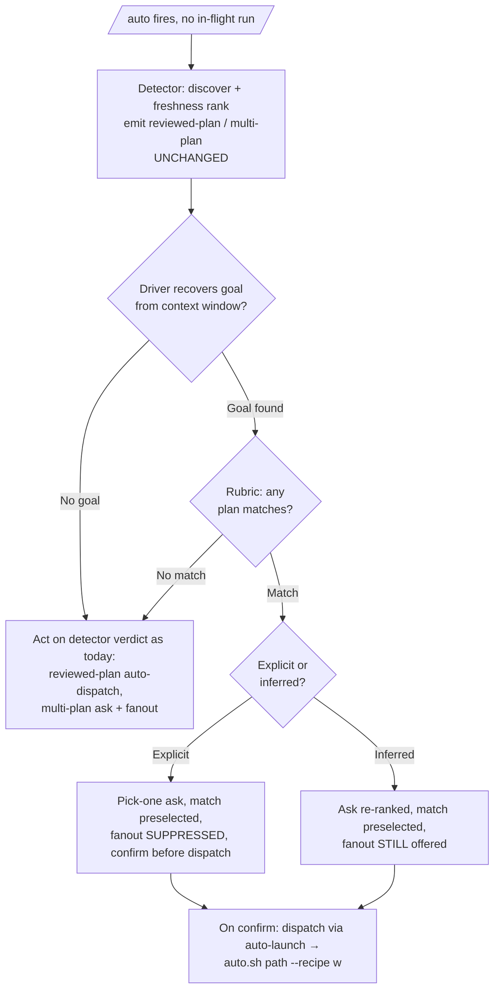

# Goal-Aware /auto Detector - Plan

## Goal Capsule

- **Objective:** Make `/auto`'s plan routing goal-aware. When a goal is present, plan selection collapses to the plan the goal points at instead of surfacing a blind N-way worktree fanout over whatever sits in `docs/plans/`.
- **Product authority:** Shawn.
- **Product Contract preservation:** unchanged — this enrichment adds HOW (Planning Contract, Implementation Units, Verification) without altering any product requirement.
- **Open blockers:** none. The two prior open questions (rubric scoring dimensions, recovery plumbing) are resolved in Key Technical Decisions below.

---

## Product Contract

### Summary

Give `/auto`'s plan-routing path a goal. The driver recovers the operative goal from the current context window — the typed `/auto` intent or a bound native `/goal`'s text (explicit), or an inference from the session (advisory) — then weights the discovered plans against it using a documented relevance rubric and preselects the match. An explicit goal suppresses the fanout; an inferred goal only re-ranks; no goal leaves today's freshness path untouched.

### Problem Frame

Firing `/auto` with a sharp, well-defined goal still surfaces a `multi-plan` fanout over every plan file on disk. The detector's strongest plan-selection signal is freshness (which plan was touched most recently), and freshness is not goal-relevance: a goal that clearly names one target loses to whichever plans happen to be fresh, and the highest-blast-radius path — auto-spawning one worktree per plan — fires when it should have routed to the one thing the goal points at. The goal signal the operator already expressed goes unused in exactly the path where it matters most.

### Requirements

**Goal sources and recovery**

- R1. The driver recovers the operative goal for the **current `/auto` invocation** by inspecting the context window from three sources: the typed `/auto` prompt intent, the text of a bound native `/goal` invocation *made in the current session for this invocation* (not a prior completed run's binding), and — when neither explicit source is present — an inference from the session context. If a bound `/goal`'s text cannot be reliably located in-context, the driver degrades to inferred/no-goal handling rather than silently claiming an explicit goal.
- R2. The two explicit sources (typed `/auto` intent, recovered `/goal` text) carry full routing authority; an inferred goal is advisory. When an explicit and an inferred goal both exist, the explicit goal wins.
- R3. The driver only reads the `/goal` invocation text already in the transcript. It never queries the native `/goal` predicate and never runs, binds, or clears `/goal`.

**Relevance weighting**

- R4. The driver weights the detector's discovered plans against the recovered goal using a documented relevance rubric applied by the agent, yielding a per-plan relevance judgment and a match / no-match determination.
- R5. The relevance rubric extends the precedent of `skills/auto-design/references/goal-rubric.md` rather than introducing a parallel scoring scheme.

**Routing behavior**

- R6. When an explicit goal matches one or more plans, the driver routes to a pick-one ask over the goal-ranked plans, the top-ranked match preselected, with the fan-out-all option suppressed — never an N-way worktree fanout.
- R7. The ask fires even when an explicit goal matches exactly one plan: the driver confirms before starting the work-loop rather than auto-dispatching.
- R8. When an inferred (advisory) goal matches plans, the driver re-ranks the ask to preselect the top match but leaves the fan-out-all option offered.
- R9. When a goal is present but matches no plan — and when no goal is present at all — routing falls back to today's freshness-only behavior unchanged, including offering fan-out-all over two or more fresh plans.
- R10. The deterministic detector's discovery, freshness ranking, and no-goal emit paths are unchanged; goal weighting is additive in the driver.
- R12. Goal-aware routing (R6–R8: fanout suppression, preselect, single-match confirm) applies only to **interactive** runs — where the launch chooser would ask the operator (`driving_session_id` null). Self-driven and headless runs, which silent-apply by construction and cannot surface the always-ask confirm, fall through to today's unchanged path; they get no goal-conditioned fanout suppression.

**Packaging**

- R11. Bump the plugin version so a marketplace install pulls the change (the plugin is version-gated).

### Acceptance Examples

- AE1. Explicit goal, one match among stale siblings.
  - **Given:** operator types `/auto <sharp goal>`; `docs/plans/` holds one plan the rubric matches plus several it does not.
  - **Then:** a pick-one ask with the matched plan preselected, no fan-out-all option, and a confirm step before the work-loop starts. **Covers R6, R7.**
- AE2. Explicit goal, multiple matches.
  - **Given:** an explicit goal that the rubric matches to two or more plans.
  - **Then:** a goal-ranked pick-one ask over the matches with fan-out-all suppressed. **Covers R6.**
- AE3. Explicit goal, no match.
  - **Given:** an explicit goal that matches no plan, with two or more fresh plans present.
  - **Then:** today's multi-plan ask with fan-out-all offered — unchanged. **Covers R9.**
- AE4. Inferred goal, one match.
  - **Given:** no typed intent and no bound `/goal`; the driver infers a goal from the session that the rubric matches to one plan.
  - **Then:** the ask preselects the match but still offers fan-out-all. **Covers R8.**
- AE5. Explicit and inferred goals both present.
  - **Given:** a bound `/goal` text is recoverable and the session also implies a different goal.
  - **Then:** the recovered `/goal` text (explicit) governs routing; the inferred goal is discarded. **Covers R2.**
- AE6. No goal signal, single fresh plan.
  - **Given:** no goal from any source; exactly one fresh plan.
  - **Then:** reviewed-plan auto-dispatch, unchanged from today. **Covers R9, R10.**
- AE7. Self-driven run with an explicit goal and a match.
  - **Given:** a self-driven/headless `/auto` (`driving_session_id` set) recovers an explicit goal that matches one plan.
  - **Then:** goal-aware routing does not engage; today's unchanged silent-apply path runs — no fanout suppression driven by the goal, no confirm. **Covers R12.**
- AE8. Prior-run `/goal` still visible in the window.
  - **Given:** a bare `/auto` where the context window still shows a `/goal <text>` line bound for an earlier, completed run.
  - **Then:** that stale `/goal` is not treated as the operative explicit goal; routing uses the current invocation's intent (or falls to inferred/no-goal). **Covers R1.**

### Scope Boundaries

- Querying the native `/goal` predicate (met / not-met) — no external seam exists; only the invocation text is read.
- Deterministic lexical goal↔plan matching — rejected in favor of rubric-based agent judgment.
- Auto-dispatching under any recovered goal — goal presence always confirms first.
- Changing the no-goal freshness path or the deterministic detector's discovery/ranking.

---

## Planning Contract

### Key Technical Decisions

- KTD-1. **Goal weighting is agent-judged in the driver, not deterministic code.** The detector (`lib/auto-detect.py`) and `lib/plan-rank.py` stay goal-blind and unchanged. Rationale: goal↔plan matching is interpretation, which belongs in the agent layer; it honors the user directive that weighting need not be deterministic but must follow a clear rubric; and it keeps the deterministic *envelope* (unchanged detector + always-ask gate) as the load-bearing safety, satisfying the deterministic-over-probabilistic mandate for the parts that auto-act.
- KTD-2. **Goal recovery is an in-agent context scan by the driver, scoped to the current invocation — no env-var round-trip.** The driver recovers the goal directly from the current invocation's context: the `/auto` prompt intent, and a `/goal <text>` line bound in the current session *for this invocation* (explicit), else a session inference (advisory). Crucially, the driver's existing `~2-day ce-sessions` lookback (`skills/auto-driver/SKILL.md`) is reused only for **session classification** (conversation-context), **not** for goal recovery — a `/goal` from a prior, already-completed run in that window must never be treated as the operative explicit goal, or a later bare `/auto` would suppress its fanout under a stale intent. Recovery is also best-effort: the driver's transcript capability today classifies the session rather than extracting a slash-command argument, so if a bound `/goal`'s text is not reliably recoverable in-context, the driver degrades to inferred/no-goal handling (keep fanout) rather than silently asserting an explicit goal. Unlike `CLAUDE_AUTO_CONVERSATION_SIGNAL` — which exists because the *detector* needed the signal — the detector never sees the goal here. Rationale: smallest plumbing; the detector's no-transcript constraint is irrelevant when weighting is driver-side; and scoping to the current invocation prevents a stale goal from wrongly narrowing.
- KTD-3. **The rubric is a new reference doc extending `goal-rubric.md`.** It defines the three goal sources and their authority split (explicit narrows, inferred nudges), the relevance judgment (does a plan advance the goal's named outcome?), and the match / no-match bar. The bar is anchored to an **observable predicate** — a plan matches when its stated Objective/summary names the goal's target artifact or named outcome — rather than a "would two competent agents agree" agreement heuristic, which is the exact phrasing `goal-rubric.md` itself flags as too fuzzy to be a checkable criterion. Rationale: consume/extend the existing rubric precedent (R5) while avoiding an unstable bar that could suppress fanout on one run and offer it on the next from identical inputs.
- KTD-4. **Goal-aware routing is a pre-step layered over the detector's existing verdict, not a contract change.** The detector still emits `multi-plan` / `reviewed-plan` with the same JSON envelope; the driver recovers the goal and reshapes the routing *before* it acts on the situation. Rationale: preserves the detector JSON contract and every consumer (`auto-launch`, `auto-spawn.py`), keeping blast radius to driver prose + one new doc.
- KTD-5. **The routing DECISION is deterministic code; only the match JUDGMENT is agent-side.** The fuzzy half — "does plan P advance goal G's outcome?" — stays in the model (rubric). The crisp half — given those verdicts + authority + interactivity, which route fires and may it suppress the fanout — lives in `lib/goal-route.py` (the `recommender.py` precedent: model classifies, code decides). This makes the routing branches (R6/R7/R8/R9/R12) a bash-testable truth table (`tests/unit/goal-route.test.sh`) and **enforces the guardrails in code**: `goal-route.py` refuses to emit a fanout suppression unless the goal is `explicit` AND the run is interactive, so a self-driven run or an inferred goal can never bypass the confirm gate — a wrong model verdict can only mis-order a confirmable menu, never turn into an un-gated auto-suppress. Verification: (a) detector/entry regression proving the no-goal path is byte-unchanged (R10); (b) `goal-route.test.sh` truth table over the branches; (c) a doc-contract test that the driver wires the rubric + router. Only the match judgment itself is inherently untested (no LLM-in-the-loop tests in this repo) — and its worst case is bounded by the always-ask gate that the code enforces.

### High-Level Technical Design

Two layers: the deterministic detector is untouched; the driver gains a goal-aware pre-routing step that reshapes the plan situations before dispatch.

The driver's existing situation table (`skills/auto-driver/SKILL.md`) gains this pre-step for the `reviewed-plan` and `multi-plan` rows only; `in-flight`, `ambiguous-runs`, `conversation-context`, and `raw` are unaffected. The `B` branch also gates on the run being interactive (`driving_session_id` null, per R12): a self-driven/headless run skips the goal-aware pre-step entirely and acts on the detector verdict as today.

### Assumptions

- The driver can locate the current invocation's `/auto` intent and a current-session `/goal <text>` line within its context window. This reuses the transcript-reading it does for session classification, but is a distinct extraction (a slash-command argument, not a session classification) — so U2 verifies recoverability at implementation time, and the recovery path degrades to inferred/no-goal handling (keep fanout) if a bound `/goal`'s text is not reliably present (KTD-2).
- `skills/auto-launch` remains the dispatch path for a confirmed single plan; a goal-ranked pick-one selection reuses it after confirmation and needs no rubric logic of its own. The launch chooser's `driving_session_id` gate is also the seam that scopes goal-aware routing to interactive runs (R12).
- Skill-prose and a new markdown rubric doc do not trip `tests/unit/size-budget.test.sh` (that lint budgets `lib/` LOC, not skill markdown) or `tests/unit/wikilink-check.test.sh` (the new doc uses valid links).

---

## Implementation Units

### U1. Author the goal↔plan relevance rubric

- **Goal:** A documented rubric the driver applies to weight plans against a recovered goal.
- **Requirements:** R4, R5.
- **Dependencies:** none.
- **Files:** `skills/auto-driver/references/goal-plan-relevance-rubric.md` (new).
- **Approach:** Mirror the shape and attribution style of `skills/auto-design/references/goal-rubric.md`. Cover: the three goal sources and their authority (explicit `/goal` text and `/auto` intent → narrows/suppresses; inferred session goal → nudges/re-ranks only); the per-plan relevance judgment (does the plan advance the goal's named outcome — matched against the plan's title, summary, and requirements); and the match / no-match bar phrased as a two-competent-agents-agree test. State explicitly that this is agent-judged, not a deterministic score.
- **Patterns to follow:** `skills/auto-design/references/goal-rubric.md` (structure, critique-prompts, anti-patterns, better-examples sections).
- **Test scenarios:** `Test expectation: none -- new reference doc; behavior is exercised by U2. Covered by the U5 doc-contract test (file exists, referenced by the driver, passes wikilink-check).`
- **Verification:** the doc exists, reads as a usable rubric, and is linked from the driver skill (checked in U5).

### U2. Add goal-aware pre-routing to the driver

- **Goal:** The driver recovers the goal (scoped to the current invocation, interactive runs only), applies the rubric, and reshapes `reviewed-plan` / `multi-plan` routing per the three-tier authority.
- **Requirements:** R1, R2, R3, R6, R7, R8, R9, R10, R12.
- **Dependencies:** U1.
- **Files:** `skills/auto-driver/SKILL.md`, `docs/contracts/driver-reference.md`.
- **Approach:** In `SKILL.md`, insert a goal-aware pre-step before the situation table acts on `reviewed-plan` / `multi-plan`, **gated on `driving_session_id` being null** (interactive; self-driven/headless skip it — R12). Steps: (1) recover the goal from the *current invocation's* context — the `/auto` intent and a current-session `/goal <text>` (explicit; ignore a `/goal` bound for a prior completed run), else infer from the session (advisory); if a bound `/goal`'s text is not reliably recoverable, degrade to inferred/no-goal (R1, KTD-2); (2) load and apply `references/goal-plan-relevance-rubric.md` against `multi_plan.paths` / `single_plan.path`, using the observable match bar (plan Objective/summary names the goal's target outcome — KTD-3); (3) route using these **exact branch marker phrases** (shared with the U5 doc-contract test): `explicit-suppress` (explicit + match → goal-ranked pick-one ask, top match preselected, fan-out-all suppressed, confirm even on a single match), `inferred-re-rank` (inferred + match → same ask but keep fan-out-all), `no-match-unchanged`, `no-goal-unchanged`. Explicitly note R3 (never run/bind/clear `/goal`; read text only), R12 (interactive-only), and R10 (detector untouched). Add matching detail to `driver-reference.md` (near the §11 conversation-context section, which already documents transcript-reading — and clarify there that the ~2-day lookback is for classification, not goal recovery).
- **Execution note:** prose/behavioral change; no code. Verify at implementation time that a bound `/goal`'s text is actually recoverable in the driver's live context (vs. an opaque slash-command expansion); if not, the explicit path falls back to advisory per R1. Keep edits within the driver skill's existing structure so the size and wikilink lints stay green.
- **Patterns to follow:** the existing `CLAUDE_AUTO_CONVERSATION_SIGNAL` transcript-classification prose in `skills/auto-driver/SKILL.md`; the situation-table format already there.
- **Test scenarios:**
  - `Covers R10.` Detector regression: `lib/auto-detect.py` and `lib/plan-rank.py` are unmodified, so `tests/unit/plan-ranking.test.sh`, `tests/integration/recipe-smart-entry.test.sh`, `tests/integration/launch-chooser.test.sh`, `tests/integration/recipe-picker.test.sh`, and `tests/integration/conversation-entry.test.sh` remain green with no edits.
  - `Covers R6, R7, R8, R9.` Doc-contract (U5): the SKILL.md pre-step documents all four routing branches (explicit-match → suppress+confirm; inferred-match → re-rank+fanout; no-match → unchanged; no-goal → unchanged).
  - `Test expectation: agent-judged routing itself is not bash-testable; verified by the deterministic envelope (detector unchanged) plus the always-ask gate — see KTD-5.`
- **Verification:** the driver skill carries the pre-step with the three-tier behavior and the R3/R10 guards; all detector/entry regression tests pass unchanged.

### U3. Thread the goal-ranked pick-one ask through dispatch

- **Goal:** A confirmed selection from the goal-ranked ask dispatches via the existing path; a single explicit match asks rather than auto-dispatching on interactive runs; self-driven runs are explicitly out of scope.
- **Requirements:** R6, R7, R12.
- **Dependencies:** U2.
- **Files:** `skills/auto-driver/SKILL.md`, `skills/auto-launch/SKILL.md`.
- **Approach:** Confirm that the goal-ranked ask maps onto the existing `multi-plan` AskUserQuestion options shape (each option `path` → `auto.sh "<path>"`; fan-out-all option omitted when suppressed). Ensure the driver routes an explicit single-match through the ask path rather than the silent `reviewed-plan` → `auto-launch` auto-dispatch — **on interactive runs only**. State explicitly in `auto-launch/SKILL.md` that the launch chooser's self-driven silent-apply path (`driving_session_id` set) does **not** apply goal-aware suppression/confirm — it is the R12 boundary — so the safety gate (KTD-5) is never silently bypassed. `auto-launch` needs no rubric logic; it receives a single confirmed path exactly as today.
- **Execution note:** verify the reuse holds before adding any new option-shaping; prefer reusing the existing `multi-plan` options contract over inventing a new envelope. The self-driven boundary is a required statement, not an optional note.
- **Patterns to follow:** the `multi-plan` and `reviewed-plan` rows of the driver situation table; `auto-launch`'s `driving_session_id` gate (self-driven silent-apply vs interactive confirm).
- **Test scenarios:**
  - `Covers R7.` Doc-contract: the driver prose states that an explicit single match routes to the ask (confirm), not the silent reviewed-plan dispatch.
  - `Covers R6.` Doc-contract: a suppressed-fanout ask omits the fan-out-all option.
- **Verification:** the dispatch path for a confirmed goal-ranked selection is the unchanged `auto.sh`/`auto-launch` path; single explicit match asks.

### U4. Version bump and changelog

- **Goal:** A marketplace install pulls the change.
- **Requirements:** R11.
- **Dependencies:** U2, U3.
- **Files:** `.claude-plugin/plugin.json`, `docs/handoff.md`.
- **Approach:** Bump `.claude-plugin/plugin.json` `version` from `0.10.0` to the next minor (`0.11.0` — new user-facing capability). Record a one-line version/feature note in `docs/handoff.md` (the repo keeps no `CHANGELOG.md` and no changelog convention, so `handoff.md` is the durable note location).
- **Test scenarios:** `Test expectation: none -- packaging. Covered by any existing version/manifest lint if present.`
- **Verification:** `plugin.json` version is `0.11.0`; `docs/handoff.md` carries the feature/version note.

### U5. Doc-contract test for rubric wiring

- **Goal:** Lock the rubric's existence and its wiring into the driver so the feature can't silently regress to goal-blind.
- **Requirements:** R2, R3, R4, R5 (wiring), R6–R9, R12 (documented branches/guards).
- **Dependencies:** U1, U2.
- **Files:** `tests/unit/goal-aware-routing.test.sh` (new).
- **Approach:** A bash test mirroring the existing doc-lint pattern (e.g., `tests/unit/wikilink-check.test.sh`, `tests/unit/size-budget.test.sh`): assert `skills/auto-driver/references/goal-plan-relevance-rubric.md` exists; assert `skills/auto-driver/SKILL.md` references it; assert the SKILL.md pre-step contains the four exact branch marker phrases U2 writes — `explicit-suppress`, `inferred-re-rank`, `no-match-unchanged`, `no-goal-unchanged` (the test greps for these literal strings, so U2 must use the same phrasing — see U2 step 3); assert the R3 read-only-`/goal` guard, the R12 interactive-only (`driving_session_id`) scope, and the R2 explicit-over-inferred precedence are each stated. Emit the exact `goal-aware-routing.test.sh: N passed, M failed` final summary line the runner tallies.
- **Execution note:** follow the repo's test-runner summary-line convention — the last line must match `^goal-aware-routing.test.sh: N passed, M failed` or `tests/run.sh` won't tally the file. See the new test fail once (grep for a marker string before it exists in SKILL.md) before it passes. The grep strings must be the literal phrases U2 writes, not paraphrases, or the test guards nothing.
- **Patterns to follow:** `tests/unit/wikilink-check.test.sh` structure and the `tests/run.sh` summary-line contract.
- **Test scenarios:**
  - Rubric file absent → test fails.
  - SKILL.md missing any of the four marker phrases, or the R2/R3/R12 guard strings → test fails.
  - All wiring present → test passes.
- **Verification:** `bash tests/run.sh` tallies the new file and it passes; deliberately removing a marker string makes it fail.

---

### U6. Deterministic routing seam + truth-table test

- **Goal:** Move the routing DECISION (not the match judgment) out of driver prose into deterministic, tested code that enforces the guardrails.
- **Requirements:** R6, R7, R8, R9, R12 (branch logic + enforcement).
- **Dependencies:** U2 (the driver prose that calls it).
- **Files:** `lib/goal-route.py` (new), `tests/unit/goal-route.test.sh` (new), `skills/auto-driver/SKILL.md` (wire the call).
- **Approach:** `lib/goal-route.py` is a pure function of `{authority, matches, all_plans, interactive}` → `{action, reason, suppress_fanout, preselect, ranked}`, mirroring `lib/recommender.py` (model classifies, code decides). It refuses `suppress_fanout: true` unless `authority == explicit` AND `interactive` — the mechanical R12/R8 enforcement. Degrade-safe: malformed input → passthrough, never suppress, exit 0. The driver's pre-step (U2 step 3) produces the match verdicts, calls `goal-route.py`, and executes the returned `reason` (the four branch markers become the router's `reason` values, plus `self-driven-unchanged`).
- **Execution note:** truth-table proof-first. See `goal-route.test.sh` fail once by breaking the R12 guard before it passes.
- **Patterns to follow:** `lib/recommender.py` (pure deterministic mapping + CLI + degrade), `lib/plan-rank.py` (CLI/JSON idiom).
- **Test scenarios:**
  - explicit × interactive × ≥1 match → `explicit-suppress`, `suppress_fanout: true`, preselect top.
  - inferred × interactive × match → `inferred-re-rank`, `suppress_fanout: false`, full set re-ranked matches-first.
  - no match / no goal → passthrough, no suppress.
  - self-driven (`interactive: false`) × explicit × match → `self-driven-unchanged`, **never** suppress (R12 control).
  - malformed input / `matches` not a list → passthrough, never suppress (degrade).
  - invariant sweep: `suppress_fanout: true` occurs **only** for explicit × interactive.
- **Verification:** `bash tests/unit/goal-route.test.sh` green; breaking the R12 guard turns the R12 case + invariant sweep red.

---

## Verification Contract

| Gate | Command | Applies to | Done signal |
|---|---|---|---|
| Full suite | `bash tests/run.sh` | all units | Green, including the new `goal-aware-routing.test.sh` tally line |
| Detector regression | `bash tests/run.sh` (subset: plan-ranking, recipe-smart-entry, launch-chooser, recipe-picker, conversation-entry) | U2 | Pass unchanged — proves the no-goal path (R10) is byte-stable |
| Routing truth table | `bash tests/unit/goal-route.test.sh` | U6 | Every branch (R6/R7/R8/R9/R12) correct; suppress emitted only for explicit × interactive |
| Doc-contract | `bash tests/unit/goal-aware-routing.test.sh` | U1, U2, U5, U6 | Rubric exists, driver references it + the router, all four branches documented |
| Wikilink + size lints | `bash tests/unit/wikilink-check.test.sh`, `bash tests/unit/size-budget.test.sh` | U1, U2 | Green — new doc links valid, no lib budget crossed |
| Deliberate-fail check | Remove a branch string / the rubric file, run `goal-aware-routing.test.sh` | U5 | Test goes red, confirming it actually guards the wiring |

The routing DECISION is bash-tested by `goal-route.test.sh` (U6) — every branch and the R12/R8 guardrail. Only the fuzzy match JUDGMENT (does a plan advance the goal's outcome?) is agent-side and inherently untested here (no LLM-in-the-loop tests in this repo); its worst case is bounded because `goal-route.py` will not emit a suppression off the explicit × interactive path, so a wrong verdict only mis-orders a confirmable menu. The doc-contract test (U5) additionally guards that the driver keeps wiring the rubric + router so it can't silently drift to goal-blind.

---

## Definition of Done

- `skills/auto-driver/references/goal-plan-relevance-rubric.md` authored, extending `goal-rubric.md`, with the observable match bar (KTD-3) not the "two agents agree" heuristic (R4, R5).
- `skills/auto-driver/SKILL.md` (+ `docs/contracts/driver-reference.md`) carry the goal-aware pre-routing with the three-tier authority, current-invocation recovery scoping, the R3 read-only-`/goal` guard, the R12 interactive-only scope, and the R10 detector-untouched guard (R1, R2, R3, R6–R10, R12).
- Goal recovery is scoped to the current invocation and degrades to inferred/no-goal when a bound `/goal`'s text is not recoverable; a prior completed run's `/goal` is never treated as operative (R1, KTD-2).
- `skills/auto-launch/SKILL.md` states that the self-driven silent-apply path does not apply goal-aware suppression/confirm (R12), so the always-ask safety gate is never bypassed.
- A confirmed goal-ranked selection dispatches via the unchanged `auto.sh`/`auto-launch` path; an explicit single match asks rather than auto-dispatching on interactive runs (R6, R7).
- `lib/goal-route.py` owns the routing decision + guardrail enforcement (suppress only for explicit × interactive), truth-tested by `tests/unit/goal-route.test.sh`; the driver calls it (R6–R9, R12).
- `lib/auto-detect.py` and `lib/plan-rank.py` are unmodified; detector/entry regression tests pass unchanged (R10).
- Plugin version bumped to `0.11.0`, with a feature/version note in `docs/handoff.md` (R11).
- `bash tests/run.sh` is green, including the new `goal-aware-routing.test.sh` (whose grep markers match the phrasing U2 wrote), which was seen to fail once before passing.

---

## Sources & Research

- `lib/auto-detect.py` — `_route_plans_or_raw` (freshness-only reviewed-plan vs multi-plan decision), `_emit_multi_plan`, `_discover_plans`, `_rank_plans_safe`; stays unchanged. `lib/auto-detect.sh` is the thin shim.
- `lib/plan-rank.py` — deterministic freshness ranking (`rank()`/`classify()`); the no-goal signal, unchanged.
- `skills/auto-driver/SKILL.md` — situation table + the `CLAUDE_AUTO_CONVERSATION_SIGNAL` transcript-classification prose; the insertion point for goal-aware pre-routing.
- `docs/contracts/driver-reference.md` — §11 conversation-context (transcript reading) is the natural home for the recovery detail.
- `skills/auto-launch/SKILL.md` — the launch chooser that dispatches a confirmed single plan; reused, not reworked.
- `skills/auto-design/references/goal-rubric.md` — the existing "sharp goal" rubric to extend for goal↔plan relevance.
- `skills/auto/SKILL.md` — documents that auto never runs native `/goal` and that its predicate is model-judged with no external seam (grounds R3).
- `tests/unit/wikilink-check.test.sh`, `tests/unit/size-budget.test.sh`, `tests/run.sh` — patterns and the summary-line contract for the new doc-contract test (U5).
