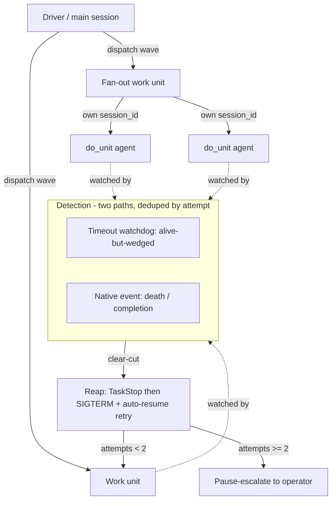
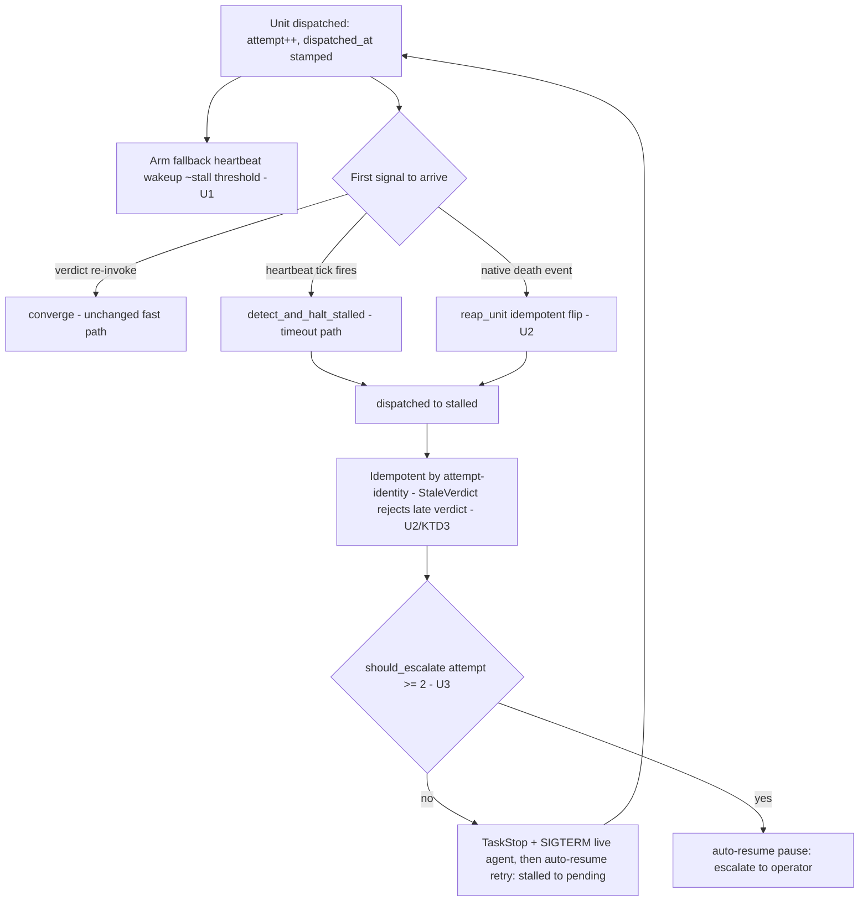

# Auto Agent-Tree Supervision - Plan

## Goal Capsule

- **Objective:** Close the silent-hang class in `/auto` — a hung-but-alive work agent that produces no verdict and no completion event currently hangs a run forever — and give the driver a legible, self-healing view of the agent tree it dispatches.
- **Product authority:** Shawn.
- **Execution profile:** deterministic-first. The recovery spine (U1→U2→U3) is the must-ship core; the watch view (U4), self-termination (U5), and translation skill (U6) are independent tracks. Land the recovery spine test-first — see each new test fail once before implementing.
- **Stop conditions:** the inverted carve-out is closed (a wedged in-flight unit is reaped within its stall threshold with no verdict and no "nothing in flight" precondition), `bash tests/run.sh` is green, and the self-written-verdict / I-1 write chokepoint is intact.
- **Tail ownership:** LFG pipeline (this run) owns implement → simplify → review → PR → CI.
- **Open blockers:** none. The one architectural unknown — whether the launch primitive surfaces a *death* signal to the driver — is U2's opening spike, not a gate: if no distinct death signal exists, R2 degrades to U1's timeout path without changing the plan's shape.
- **Product Contract preservation:** unchanged — this enrichment adds only the Planning Contract downward; R1–R12 and all AEs are carried verbatim.

---

## Product Contract

### Summary

A supervision-and-composition layer for `/auto` in three parts: (1) work dispatches through a primitive that natively signals completion *and* death, backed by a slim timeout watchdog for the alive-but-wedged case native events can't catch; (2) a watch-the-tree surface that renders the driver→unit→`do_unit` tree and autonomously reaps + retries a wedged or dead node, escalating to the operator after N attempts; (3) a translation skill that turns a designed loop or recipe into an execution tree — choosing workflow-script vs native subagent-tree and sizing parallelism. The ledger spine is untouched.

### Problem Frame

auto already has correct stall detection: `detect_and_halt_stalled` (`lib/tick_advance.py:95`) marks any unit dispatched longer than the stall threshold (default 600s, `lib/ledger_core.py:61`) as stalled, halts it and its dependents, and `auto-resume retry` recovers it. The detection is not the gap.

The gap is that detection only runs when a tick fires, and the work-phase contract (`skills/auto/SKILL.md:67`; `docs/contracts/driver-reference.md` §7) forbids the only mechanism that would fire one while work is in flight: the long fallback `ScheduleWakeup` is armed *only when no work is in flight*. So for a hung-but-alive agent — no verdict, no completion event, process still up — nothing re-invokes the driver, the fallback wakeup is excluded because work *is* in flight, no tick fires, and the 600s threshold is never checked. The carve-out is inverted: the dangerous case is precisely the one the rule excludes. This is a real incident, not a hypothetical — the `lr-U1-registry` agent stayed alive but produced zero files and no verdict for hours until a human noticed.

The tempting fix — "run work on Workflow/Subagent primitives so it's natively supervised" — only half-solves it. Native completion notification fires on process *death*, not on *alive-but-wedged*, which is the exact failure that happened. And a Workflow script cannot host its own wall-clock timeout (`Date.now`/`setTimeout` throw in workflow scripts by design), so a wedged `await agent()` just blocks its stage. The substrate move genuinely fixes the *death* class (including the auth-churn silent-death pattern) and gives supervision a cleaner home — but a timeout-based external watchdog survives every substrate choice and stays load-bearing.

Nesting compounds it. Fan-out work units (`SKILL.md:189`, SKILL.md's own KTD-5 — distinct from this plan's KTD5) spawn `do_unit` agents with their own `session_id`, which neither PreToolUse hook can reach — so supervision must traverse a tree, not scan a flat in-flight list.

### Key Decisions

- **Hybrid, not full cutover.** Keep the ledger, orchestrator, and self-written-verdict property; reshape dispatch and add supervision on top. The parked workflow-substrate RFC (`docs/plans/2026-05-29-002-rfc-workflow-substrate-migration.md`) would delete the engine (~2,425 LOC), but its own re-entry gate has three conditions and only one (Workflow tool now exists) is met — run volume (~2 vs ≥20) and accumulated off-script shapes (0 vs ≥3) are not. Full cutover is premature by the RFC's own discipline.
- **The timeout watchdog is irreducible.** Native death events do not catch the wedge; a workflow script cannot time itself out. Every point on the design spectrum keeps an external, timeout-based watchdog for the alive-but-wedged case. This is the essence of the original "fix A."
- **Dual detection paths, deduped by design.** After this change a unit can be flagged by *both* a native death event and the timeout watchdog. Idempotent reaping is a designed-in property from the start, keyed on the unit's current `attempt`, not a race patched later.
- **The translation skill targets both substrates.** It picks workflow-script vs native subagent-tree per the loop's shape and sizes parallelism — but because neither target can host the wedge-timeout internally, its output is *always* supervised from outside. The skill is authored knowing external supervision is a given.
- **Preserve the ledger spine.** The self-written-verdict / session-death-survival property (`lib/orchestrator.py:22-35`) is the crux of auto's correctness — a resumed session reads completed verdicts straight off the ledger and never re-dispatches them. Nothing in this plan changes it.

### Requirements

**Detection and recovery**

- R1. A dispatched work unit that stays alive but emits no verdict is detected and halted within the stall threshold, without depending on a verdict landing or a manually-armed "nothing in flight" wakeup.
- R2. Work dispatch surfaces a native completion-and-death signal to the driver, so an agent that dies (crash, auth churn) is detected event-driven rather than by polling.
- R3. When both the timeout watchdog and the native death signal apply to the same unit, reaping is idempotent — the unit is reaped and retried at most once per attempt regardless of which path fires first.
- R4. Recovery reuses the established reap sequence (TaskStop, then SIGTERM) and `auto-resume retry`; a recovered unit's dependents are halted and resumed with it.
- R5. The ledger's self-written-verdict and session-death-survival behavior is preserved unchanged.

**Watch-the-tree supervision**

- R6. The driver can render a legible view of the live agent tree — driver → work unit → `do_unit` fan-out agent — including nested agents that carry their own `session_id`, showing each node's age against the stall threshold and its attempt count.
- R7. Supervision is autonomous for clear-cut cases: a wedged or dead node anywhere in the tree is auto-reaped and auto-retried without operator involvement.
- R8. After 2 failed attempts on the same unit, the driver stops retrying and pause-escalates to the operator instead of looping.

**Loop/recipe to execution-tree translation**

- R9. A skill translates a designed loop (from `auto-design`) or a recipe (from `auto-author-recipe`) into an execution tree, sizing parallel, sequential, and nested structure from the loop's dependency graph and the active fan-out cap.
- R10. The translation skill can target either a workflow script or a native subagent-tree dispatch, choosing per the loop's shape, and produces output that is externally supervised in either case.
- R11. Translation composes with the existing dependency engine (`ready_units` / `dispatch_batch`) and the two-seam `do_unit` split rather than replacing them.

**Agent self-termination (defense-in-depth)**

- R12. Work-agent prompts instruct the agent to record a blocker verdict and return if it cannot make progress within a bounded time, catching soft-stalls from the inside — accepting that a truly wedged process cannot self-report (R1 is the backstop for that case).

### Supervision structure

### Acceptance Examples

- AE1. Wedged agent, no verdict.
  - **Given:** a dispatched unit whose agent is alive but has produced nothing past the stall threshold.
  - **When:** the run has no verdict landing and no other in-flight signal.
  - **Then:** the timeout watchdog fires, the unit is halted and reaped, and `auto-resume retry` re-dispatches it. **Covers R1, R4.**
- AE2. Agent dies mid-run.
  - **Given:** a dispatched agent that crashes or dies to auth churn before writing a verdict.
  - **Then:** the native death signal reaches the driver and the unit is reaped event-driven, without waiting out the stall threshold. **Covers R2.**
- AE3. Both paths apply.
  - **Given:** a unit that both trips the timeout and emits a death event close together.
  - **Then:** it is reaped and retried exactly once for that attempt; the second path is a no-op. **Covers R3.**
- AE4. Repeated failure.
  - **Given:** a unit that has been auto-retried and fails again to the same terminal state twice.
  - **Then:** the driver stops retrying and pause-escalates to the operator rather than looping. **Covers R8.**
- AE5. Wedged nested agent.
  - **Given:** a `do_unit` fan-out agent (own `session_id`) wedges under a parent work unit.
  - **Then:** the watch-tree view surfaces it as a distinct node and it is reaped like any top-level unit. **Covers R6, R7.**

### Scope Boundaries

**Deferred to a follow-on**

- D — narrowing the rm -rf destructive backstop to exempt tmp-scoped deletes (`$TMPDIR` / `mktemp -d` / job tmp). The watch-tree surface will *see* the `do_unit` agents that evade the destructive hook today, but changing the hook's policy is out of this plan.

**Outside this plan's identity**

- Full Workflow-substrate cutover and recipe-as-markdown compilation (the parked RFC's Path A) — rejected here; revisit only if the RFC's remaining re-entry conditions are met.
- Reworking the ledger family — the ledger keeps its shape.

### Dependencies and Assumptions

- Assumes the native dispatch primitive delivers a completion-and-death signal observable by the driver (the R2 blocker in the Goal Capsule — verify before planning).
- Assumes work-loop dispatch can move onto that primitive while keeping the self-written-verdict write chokepoint (`ledger.record_verdict`, the I-1 contract) intact.
- Reuses the existing `attempt` counter (incremented per `pending → dispatched`) as the retry-budget and stale-verdict key.
- Reap sequence and pause-escalation reuse established mechanisms (`auto-resume.py pause`, TaskStop → SIGTERM).

### Outstanding Questions

**Deferred to planning**

- First spike: does the chosen dispatch primitive give the driver a death signal, or only the absence of a verdict? Determines whether R2 is event-driven or degrades to a faster poll. Does not block planning — it is the plan's opening unit.
- Exact watchdog delay (600 vs 900s) and whether the heartbeat re-arms per dispatch or once per in-flight wave; must clamp to `ScheduleWakeup`'s `[60, 3600]s`.
- Whether the watchdog tick needs a distinct prompt (e.g. `/auto:auto-tick <run>`) so the driver knows it is a heartbeat vs a verdict re-invoke.
- The translation skill's substrate-selection heuristic (what loop shapes route to workflow-script vs subagent-tree).
- Self-termination time bound for R12.

### Sources / Research

- `lib/tick_advance.py:95` — `detect_and_halt_stalled` (the detection that exists but never runs in the hang case).
- `lib/ledger_core.py:61` — `DEFAULT_STALL_THRESHOLD_SECONDS = 600`.
- `lib/orchestrator.py:22-35` — the self-written-verdict / session-death-survival correctness property.
- `skills/auto/SKILL.md:67` and `docs/contracts/driver-reference.md` §7 — the inverted work-phase wakeup carve-out (the contract to amend).
- `skills/auto/SKILL.md:189` (KTD-5) — the two-seam `do_unit` fan-out split and its separate `session_id` (the nesting supervision must traverse; also why the destructive hook can't reach do_unit agents).
- `docs/plans/2026-05-29-002-rfc-workflow-substrate-migration.md` — the parked full-cutover RFC and its three-condition re-entry gate.
- Prior art / memories: the watchdog-gap diagnosis, the reap sequence (TaskStop → SIGTERM), the silent-death-on-auth-churn class, and the rm -rf backstop false-pause pattern.

---

## Planning Contract

### Key Technical Decisions

- **KTD1. Fix A is a contract change plus a deterministic delay helper, not a new event loop.** The watchdog stays the existing `detect_and_halt_stalled` (`lib/tick_advance.py:95`). The only change is arming a fallback `ScheduleWakeup` at dispatch time so a tick fires while work is in flight. The event-driven verdict fast path is untouched.
- **KTD2. Reaping the live agent is model-side; the ledger flip is existing Python.** No reaping primitive exists in the repo — `detect_and_halt_stalled` only flips `dispatched → stalled`, and grep finds no `TaskStop`/`SIGTERM`/`kill` in `lib/`. So the driver owns the kill (TaskStop then `kill -TERM`, per the reap-sequence memory) via contract; Python owns only the idempotent state transition.
- **KTD3. Idempotency is attempt-gated, reusing existing attempt-identity.** `record_verdict`'s `StaleVerdict` check rejects a verdict whose `attempt` is older than the unit's current attempt (`lib/ledger_mutators.py:163-169`), and the `attempt` counter bumps mechanically on `pending → dispatched` (`lib/ledger_mutators.py:89-92`). But `StaleVerdict` only gates the *verdict* write, not the reap path — so `reap_unit` must carry its own attempt gate: it no-ops unless the unit is `dispatched` AND its current `attempt` equals the attempt being reaped. Without that gate, a late death event from a driver-killed attempt-1 agent would stall a fresh, healthy attempt-2 retry. The attempt gate on reap plus `StaleVerdict` on the verdict together close the death-then-retry race.
- **KTD4. Escalation reuses `attempt` + `auto-resume pause` — no new counter.** `should_escalate(unit, max_attempts=2)` reads the existing counter; at attempt 2 the driver calls `auto-resume.py pause <run> "<why>"` (flips `driver → manual`, `lib/auto-resume.py:220`) instead of `retry`.
- **KTD5. The watch tree is ledger-structure plus task-liveness.** Parent→`do_unit` nesting comes from the ledger `depends_on` DAG; live-agent status comes from `TaskList`/`Monitor` (model-side). Nested `do_unit` agents carry their own `session_id` and are not ledger rows, so the skill maps them from the task tools by unit id.
- **KTD6. Translation derives parallelism from the `depends_on` DAG — no recipe-format change.** Recipe parallelism is already implicit (units sharing a phase with independent deps run concurrently; a multi-dep unit is a fan-in). Reuse the readiness-frontier logic (`lib/orchestrator.py::ready_units` / `_is_ready`) to walk waves; the fan-out `cap` bounds each wave. Emitter-produced units must be expanded first: recipes like `recipes/a4.json` declare paired builders in `expected_emit_outputs` (materialized at runtime by an emitter), not in `units[]`, and `_is_ready` treats an absent dependency as unsatisfied — so the derivation synthesizes placeholder nodes from `emit_templates` / `expected_emit_outputs` before the frontier walk. `recipes/a2.json`'s parallel units are static and need no expansion.
- **KTD6b. The native subagent-tree is the only executable translation target this run.** It has a live runtime (`dispatch_batch`). The workflow-script target is a **routing decision plus a `topology-render` preview** — an inert annotation, not a runnable compiled script — because the parked RFC's `pipeline()`/`parallel()` compiler and runtime are unbuilt and its re-entry gates are unmet. Executable workflow-script compilation is deferred to the RFC's re-entry; R10's "target either substrate" is satisfied by the routing decision, with native as the sole executable output.
- **KTD7. Preserve the I-1 write chokepoint and self-written-verdict property (R5).** Every ledger write stays funneled through `transition` / `record_verdict` / `_atomic_write`; nothing writes verdicts from the driver, and the resumed-session-reads-verdicts-off-disk guarantee (`lib/orchestrator.py:22-35`) is invariant across all units.

### High-Level Technical Design

The recovery lifecycle: a dispatched unit is resolved by whichever signal arrives first — the existing verdict re-invoke (fast path, unchanged), the new dispatch-time heartbeat wakeup (catches the wedge), or a native death event (catches the crash). All three funnel into idempotent detect-and-reap, then retry-or-escalate keyed on `attempt`.

### Assumptions

- The launch primitive surfaces a completion/death signal the driver can act on. U2's spike verifies it; if absent, R2 collapses into R1's timeout path and U2 narrows to the idempotent-reconciliation helper.
- `TaskList` / `Monitor` expose per-agent liveness for the watch tree (U4). If unavailable, U4 degrades to a ledger-only view (structure + age, no live-process status).
- The Workflow tool now exists in-session (resolving the parked RFC spike's condition #1), but the RFC's run-volume and off-script-shape re-entry gates remain unmet — so U6 ships native subagent-tree as the default target and workflow-script as an optional one, not a full cutover.
- Escalation budget N=2 is a settled decision (Shawn), not an open assumption.

### Sequencing

One sequential recovery track (U1 → U2 → U3) plus three independent standalone units (U4, U5, U6) that can land in parallel. The recovery spine is the priority increment — it closes the live incident and gates nothing else — so if a smaller first PR is preferred, ship U1–U3 alone and follow with U4/U5/U6; U6 is the largest surface and the natural thing to defer.

---

## Implementation Units

### U1. Watchdog heartbeat — dispatch-time fallback wakeup

- **Goal:** Close the inverted carve-out — arm a long fallback `ScheduleWakeup` (~stall threshold) whenever a unit is dispatched, so the watchdog tick fires even while work is in flight.
- **Requirements:** R1.
- **Dependencies:** none.
- **Files:** `skills/auto/SKILL.md` (dispatch table §4, lines ~64-69 and the "YIELD silently" rule ~109-134), `docs/contracts/driver-reference.md` (§7 lines ~241-321 and the §4 mirror ~182-196), `lib/tick.py` (new `watchdog_wakeup_delay` helper), `tests/unit/tick.test.sh` (test).
- **Approach:** Amend the `rearm`/`work` row and the "YIELD silently after dispatch" rule so that after `dispatch_batch` the driver arms ONE long fallback wakeup at the watchdog delay *in addition to* yielding for verdicts — removing the "ONLY when no work in flight" precondition that inverts the carve-out. The verdict-first fast path is unchanged; if a verdict lands first, the heartbeat tick finds nothing past-threshold and returns `rearm`/`noop` (self-cancelling). Add `lib/tick.py::watchdog_wakeup_delay(ledger)` returning the minimum in-flight `stall_threshold_seconds` clamped to `[60, 3600]`, giving the driver a deterministic delay; the heartbeat reuses the existing `/auto:auto-tick <run>` prompt.
- **Execution note:** Mirror `tests/unit/tick.test.sh` scenario 3 (stall + transitive halt); see the new test fail once before implementing.
- **Patterns to follow:** the intent constructors `_rearm_intent`/`_stop_intent`/`_noop_intent` (`lib/tick.py:234-266`); the `[60,3600]` clamp noted at `lib/tick.py:80`.
- **Test scenarios:** `watchdog_wakeup_delay` returns the default 600 when no per-unit override; returns the min across differing per-unit `stall_threshold_seconds`; clamps a 30s override up to 60; clamps a 4000s override down to 3600; returns a no-op sentinel when nothing is `dispatched`. Covers R1.
- **Verification:** with the heartbeat armed, a unit dispatched longer than its threshold is flipped to `stalled` by `detect_and_halt_stalled` when the tick fires — with no verdict and no "nothing in flight" precondition.

### U2. Native death detection + idempotent reap primitive

- **Goal:** Detect an agent that *dies* (not just goes silent) event-driven, and make reaping idempotent so the death event and the timeout watchdog cannot double-reap one unit.
- **Requirements:** R2, R3.
- **Dependencies:** U1.
- **Files:** `lib/tick_advance.py` (new `reap_unit` helper), `skills/auto/SKILL.md` (driver contract for the death path), `tests/unit/tick.test.sh` (test).
- **Approach:** Add `reap_unit(repo_root, run_id, unit_id, attempt)` that idempotently flips `dispatched → stalled` and no-ops unless the unit is `dispatched` AND its current `attempt` equals the passed `attempt` (guard on state and attempt; swallow `InvalidTransition`). On a death signal the driver reconciles the dead unit through `reap_unit` with the dispatched attempt; a later heartbeat tick that also sees it is a no-op because it is already `stalled`. The attempt gate prevents a late death event from an already-retried (superseded) attempt from stalling the fresh retry — so the two detection paths converge on exactly one stall + one retry per attempt.
- **Execution note (spike first):** Before wiring the death path, verify the launch primitive's notification semantics — does the harness re-invoke the driver on background-agent death, or only on verdict/completion? If there is no distinct death signal, R2 degrades to U1's timeout path and this unit narrows to `reap_unit` + its dedup test.
- **Patterns to follow:** `detect_and_halt_stalled` state handling (`lib/tick_advance.py:95-128`); `ALLOWED_TRANSITIONS` and the `dispatched → stalled` edge (`lib/ledger_core.py:121-128`); `StaleVerdict` (`lib/ledger_mutators.py:163-169`).
- **Test scenarios:** `reap_unit` flips a `dispatched` unit at the matching attempt to `stalled`; is a no-op on an already-`stalled` unit; is a no-op on a `verdict-returned` unit; is a no-op when the passed attempt is older than the unit's current attempt (late death event after a retry). Double detection (unit past-threshold AND flagged dead) yields exactly one `stalled` and, after retry, one attempt bump. A late verdict carrying the reaped attempt is rejected as stale. Covers R3, AE2, AE3.
- **Verification:** AE2 (death → reaped event-driven, no threshold wait) and AE3 (both paths → one reap) hold.

### U3. Autonomous reap → retry → escalate over the tree

- **Goal:** Give the driver an explicit "you have a stalled node → reap the live agent → `auto-resume retry`; after 2 attempts, pause-escalate" policy applied to every stalled node in the tree, so a wedged/dead unit self-heals without the operator and independent siblings keep advancing.
- **Requirements:** R4, R7, R8.
- **Dependencies:** U2.
- **Files:** `skills/auto/SKILL.md` (new dispatch-table row + §4 supervision policy), `docs/contracts/driver-reference.md` (§7), `lib/orchestrator.py` (new `should_escalate` helper), `tests/unit/orchestrator.test.sh` (test).
- **Approach:** Add the dispatch-table row for a stalled unit: reap the live agent (TaskStop then `kill -TERM`, per the reap-sequence memory — model-side), then `auto-resume.py retry <run> <unit>` (`stalled → pending`, clears `last_error`). Add `lib/orchestrator.py::should_escalate(unit, max_attempts=2)` returning true at `attempt >= 2`; when true the driver calls `auto-resume.py pause <run> "<unit> wedged after 2 attempts"` instead of retrying. `detect_and_halt_stalled` already halts transitive dependents, so the policy applies per stalled node while independent siblings advance.
  - **Nested `do_unit` reap (R7/AE5):** because a `do_unit` agent is not its own ledger row (KTD5), a wedged nested agent is reaped through its **parent** fan-out unit — the parent flips to `stalled` and its whole fan-out wave is reaped and re-dispatched together (coarse-grained; accepts sibling-wide re-dispatch as the v1 mechanism). Node-level reap of a single nested agent is deferred. The watch view (U4) still surfaces the individual wedged node for visibility, so AE5's "reaped like any top-level unit" holds at the parent-unit granularity.
  - **Kill verifiability (defense against a forgotten model-side kill):** the `dispatched → stalled` transition records a `reap_pending` marker that the driver clears only after issuing TaskStop/SIGTERM. An unfilled marker on a later tick means "kill requested but unconfirmed" — an assertable state that keeps a forgotten kill (and its zombie agent) from being invisible to the test suite, since Python owns the marker even though the kill itself is model-side.
- **Patterns to follow:** the retry edge and `last_error` clearing (`lib/auto-resume.py:324`); pause (`lib/auto-resume.py:220`); the transitive-dependent halt (`lib/tick_advance.py:78`).
- **Test scenarios:** `should_escalate` is false at attempt 1 and true at attempt 2. A stalled unit at attempt 1 routes to retry (`stalled → pending`); at attempt 2 routes to escalate (no transition; pause path). A two-node tree with one wedged node produces one retry while the independent sibling advances. Covers R4, R7, R8, AE1, AE4.
- **Verification:** AE1 (wedged → reaped → retried) and AE4 (repeated failure → escalate at N=2) hold; independent siblings are unaffected.

### U4. Agent-tree watch view + skill

- **Goal:** Render a legible driver→unit→`do_unit` tree with each node's age-vs-threshold and attempt count, including nested agents that carry their own `session_id`.
- **Requirements:** R6.
- **Dependencies:** none.
- **Files:** `lib/watch_tree.py` (new render helper), `skills/auto-watch/SKILL.md` + `skills/auto-watch/references/` (new skill), `tests/unit/watch-tree.test.sh` (test).
- **Approach:** `render_agent_tree(ledger, now)` walks `ledger["units"]` in declaration order, nests fan-out `do_unit` children under their emitter parent (via `depends_on` / emitted ids), and annotates each `dispatched` node with `age = now − dispatched_at` against its `stall_threshold_seconds` plus its `attempt`. Output is a deterministic string (mirror `lib/topology-render.py`). The skill wraps the helper and overlays live-agent status from `TaskList`/`Monitor` (model-side), mapping nested `do_unit` session_ids to unit ids — structure from the ledger, liveness from the task tools.
- **Patterns to follow:** `lib/topology-render.py::render` (deterministic topology string); the `do_unit`/session_id split (`skills/auto/SKILL.md:189-205`, KTD-5).
- **Test scenarios:** render nests a `do_unit` child under its parent; flags a past-threshold node as over-age; shows the attempt count; produces byte-identical output for a fixed ledger + `now`; renders an empty tree for a ledger with no dispatched units. Covers R6, AE5.
- **Verification:** AE5 (a wedged nested `do_unit` surfaces as a distinct over-age node) holds.

### U5. Agent self-termination in `do_unit` prompts

- **Goal:** Catch soft-stalls from the inside — instruct work agents to record a blocker verdict and return if they cannot progress within a bounded time.
- **Requirements:** R12.
- **Dependencies:** none.
- **Files:** `skills/auto/SKILL.md` (the `do_unit` fan-out prompt construction, §4 block ~189-205 — SKILL.md's own KTD-5 two-seam split, not this plan's KTD5).
- **Approach:** Extend the two existing baked-in `do_unit` prompt constraints (question routing, destructive-action avoidance) with a third: "if you cannot make progress within N minutes, record a blocker verdict via `ledger.record_verdict` and return rather than spinning." This is defense-in-depth — it will not save a truly wedged process (U1/U3 is the backstop for that), so it is prose-only with no new Python surface.
- **Patterns to follow:** the existing constraint wording at `skills/auto/SKILL.md:193-205`.
- **Test scenarios:** none — pure prompt/contract change with no behavioral Python surface. `Test expectation: none — the self-report path is a model-side prompt constraint; U1/U3 carry the tested backstop for genuine wedges.`
- **Verification:** the `do_unit` prompt constructed at dispatch carries the self-termination clause alongside the two existing constraints.

### U6. Translation skill — loop/recipe → execution tree with sized parallelism

- **Goal:** Translate a designed loop (from `auto-design`) or a recipe (from `auto-author-recipe`) into an execution tree — deriving parallel/sequential/nested structure from the `depends_on` DAG and the active fan-out cap — targeting a native subagent-tree or a workflow-script per the loop's shape.
- **Requirements:** R9, R10, R11.
- **Dependencies:** none.
- **Files:** `lib/execution_tree.py` (new derivation helper), `skills/auto-translate/SKILL.md` + `skills/auto-translate/references/` (new skill), `tests/unit/execution-tree.test.sh` (test).
- **Approach:** `derive_execution_tree(recipe, cap)` first expands emitter-produced units (synthesize placeholder nodes from `emit_templates` / `expected_emit_outputs` via the emitter id math, so a recipe whose builders/`do_unit` children live in `expected_emit_outputs` has them present), then walks the `depends_on` DAG frontier-by-frontier (reusing the readiness logic in `lib/orchestrator.py::_is_ready` / `ready_units`) to produce ordered waves; within a wave, units sharing a phase with independent deps are parallel, bounded by `cap`; fan-out `do_unit` units nest under their emitter parent. Substrate selection (R10, KTD6b) is a heuristic returning a routing decision: a self-contained bounded parallel-fan-in loop → `workflow-script` (an inert routing label + `topology-render` preview, non-executable until the RFC's compiler lands); everything else → native subagent-tree (today's `dispatch_batch`), the default and only executable target. The skill consumes `auto-design`/`auto-author-recipe` output (composes, does not replace them, R11) and reuses `topology-render` for the ASCII preview. Both routings are externally supervised (U1's wedge-timeout lives outside either).
- **Patterns to follow:** `recipes.load_and_validate` / `validate` (facade `lib/recipes.py`, impl `lib/recipe_validate.py:728`); the readiness frontier (`lib/orchestrator.py:188-228`); `lib/topology-render.py::render`; the recipe fixtures `recipes/a2.json`, `recipes/a4.json`.
- **Test scenarios:** `derive_execution_tree(a2, cap=16)` yields wave 1 `{plan-1, plan-2, plan-3}` then wave 2 `{judge}` (fan-in — a2's units are static, no expansion needed); `derive_execution_tree(a4, …)` yields the paired-builder wave then `compare` *after emit-template expansion* synthesizes `build-clarity`/`build-perf` from `expected_emit_outputs`; `cap=1` serializes a 3-wide parallel wave into three ordered waves; a fan-out unit nests its expanded `do_unit` children; the substrate heuristic returns `workflow-script` (routing label) for a bounded parallel-fan-in loop and `subagent-tree` for a `ce-work` dispatch loop. Covers R9, R10, R11.
- **Verification:** for `recipes/a2.json` (static units) the derived wave order round-trips against `ready_units`' frontier order directly; for `recipes/a4.json` it matches after emit-template expansion (a raw `ready_units` walk over a4 yields only `{plan}` because the builders are emitter-produced, so the round-trip is against the expanded tree, not raw `ready_units`); the `topology-render` preview matches the derived tree.

---

## Verification Contract

| Gate | Command | Applies to |
|---|---|---|
| Full test suite | `bash tests/run.sh` | all units |
| Recovery-spine tests | `bash tests/unit/tick.test.sh`, `bash tests/unit/orchestrator.test.sh` | U1, U2, U3 |
| New-file tests | `bash tests/unit/watch-tree.test.sh`, `bash tests/unit/execution-tree.test.sh` | U4, U6 |

- Every new/edited test file's LAST summary line must match `^<name>.test.sh: N passed, M failed` or `bash tests/run.sh` silently drops its tally (the harness quirk at `tests/run.sh:126`).
- Deliberate-fail smoke check: run each new test once and see it fail before implementing, then make it pass.
- Do not weaken the I-1 write chokepoint: all ledger writes stay funneled through `transition` / `record_verdict` / `_atomic_write` (KTD7 / R5).

---

## Definition of Done

**Global**

- Every requirement R1–R12 is advanced by at least one unit — R5 as the cross-cutting preserved invariant (KTD7), the rest each mapped to a U-ID — and Acceptance Examples AE1–AE5 pass. R5 and R9–R12 carry no AE by design; AE1–AE5 cover the behavioral-conditional requirements.
- `bash tests/run.sh` is green, with each new test file tallied (summary-line convention honored).
- The inverted carve-out is closed: a unit dispatched past its stall threshold with no verdict is reaped and retried without any "nothing in flight" precondition — verified against the reproduction in AE1.
- The self-written-verdict / session-death-survival property (R5, `lib/orchestrator.py:22-35`) is intact; no verdict is written from the driver.
- No abandoned experimental code from spike U2 remains in the diff.

**Per-unit**

- U1: `watchdog_wakeup_delay` clamps correctly and the heartbeat tick reaps a wedged in-flight unit.
- U2: `reap_unit` is idempotent; double detection yields one stall + one retry; stale verdicts rejected.
- U3: `should_escalate` fires at N=2; stalled units retry then escalate; siblings advance.
- U4: `render_agent_tree` nests `do_unit` children, flags over-age nodes, is deterministic.
- U5: the `do_unit` prompt carries the self-termination clause.
- U6: `derive_execution_tree` produces cap-bounded waves that round-trip against `ready_units`; substrate heuristic routes both targets.
