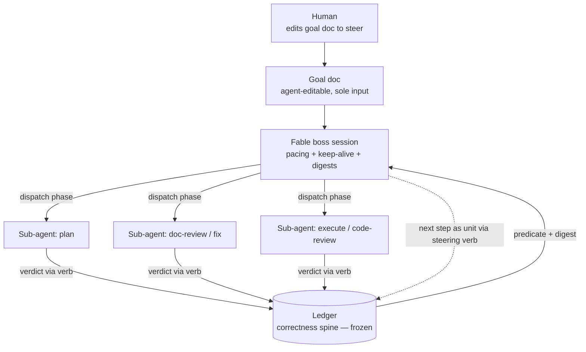
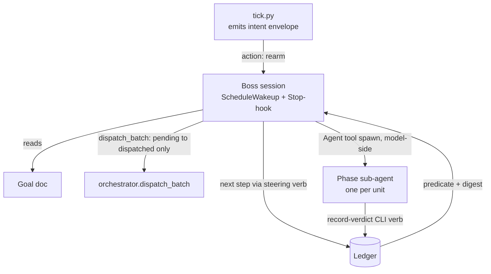
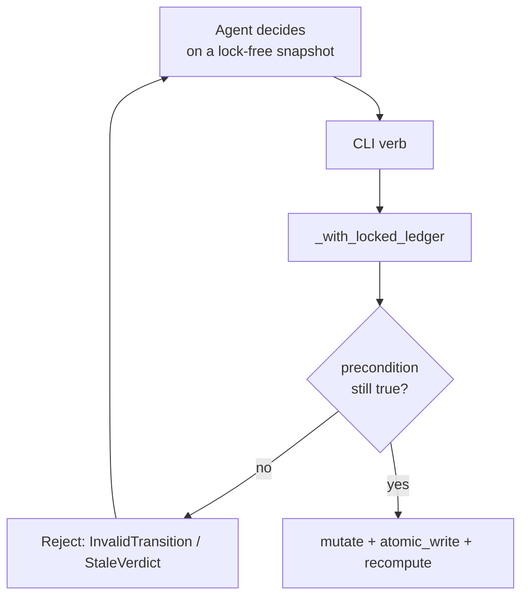

# Auto Agent-Native Runtime - Plan

## Goal Capsule

- **Objective:** Rebalance `/auto` so a capable agent holds the reins — driving from a single editable goal doc, operating the bookkeeping through tools, and running the loop as a sub-agent tree beneath a light, context-preserved fable "boss" session.
- **Product authority:** Shawn (owner of the `auto` plugin).
- **Open blockers:** None. Three product blockers surfaced in review and were resolved: force-skip may clear the predicate but requires a recorded reason (R20), the done-floor narrows to "no open gating findings" (R16), and PreToolUse ownership becomes a set so the destructive backstop follows the loop into the tree (R21, U8). The thrust-3 spike is green on tool capability (`docs/research/2026-07-10-subagent-runtime-capability-spike.md`) but did not exercise the production dispatch path — U5's first deliverable closes that (RISK-10).
- **Product Contract preservation:** Changed — R16 narrowed (done-floor = no open gating findings, not work-completion) and R20, R21, AE5–AE7 added, after document review proved the original R16 false: `unit_is_terminal` short-circuits on `terminal-skip` before the findings check (`lib/ledger_predicate.py:107`), so the proposed force-skip verb could clear the predicate on un-run work. Both changes were confirmed with the product authority.
- **Target version:** `0.13.0` (minor — additive verbs, new runtime path, no removal of the ledger family).

---

## Product Contract

### Summary

Give the driving agent three things it lacks: a real tool surface over auto's bookkeeping (read freely; write through validated, rejectable verbs), a cheap self-describing orientation surface, and a sub-agent-tree runtime that keeps the boss session light. The boss operates from **one editable goal doc and nothing else**, driving toward it while the next step is clear and handing back when it isn't. The deterministic ledger stays untouched as the correctness spine — reframed as infrastructure that gives the agent guarantees the harness doesn't, not a cage on it.

### Problem Frame

Auto runs a multi-step coding loop (plan → doc-review → fix → execute → code-review → fix) as a hands-off cycle. Three harness-shaped costs make it worse than it should be, and the framing correction matters: the problem is the **harness's limitations**, not that the engine is "too rigid." A capable agent in charge can get the job done — it just hasn't been equipped.

First, the driving agent is fenced out of its own controls. The only mid-run steering surface is `lib/auto-resume.py` (continue / pause / advance / abort / retry / skip) — it cannot add, remove, or reshape units, edit dependencies, or force a unit terminal. An agent that judges a task obsolete has to *contrive a stall* because the state grammar only allows `stalled → terminal-skip` (`lib/ledger_core.py`). Steering that should be a tool call becomes ledger surgery or an abort.

Second, every run pays an orientation tax. Driving auto correctly requires holding ~2,000 lines of skill prose plus a 1,031-line driver reference in context, re-derived each session — working memory spent re-learning what auto is instead of doing the work.

Third, long runs go foggy. The loop today runs in one session whose context accumulates the play-by-play of every tick; on a long run, quality degrades as the window fills.

The cost of shipping nothing: the owner's field experience is agents getting stuck and runs that lose coherence, pushing him back to driving by hand.

### Key Decisions

- **Harness-limitation workaround, not a rigidity fix.** The target is what the harness denies a capable driver (self-pacing in sub-agents, an editable goal, a wide human channel, clean context), not the engine's determinism. The rigidity diagnosis from the parked escape-hatch plan is set aside as over-emphasis.
- **Determinism is agent infrastructure, not a cage.** The ledger spine gives the agent guarantees the harness itself won't: durable state across session death and rate-limits, atomic read-modify-write across concurrent sub-agents, and an un-fakeable done signal. It serves the in-charge agent rather than policing it.
- **Policy vs invariant — read freely, write through rejectable verbs.** The model never holds the lock and never does raw read-then-write. Every mutation commits through a verb that revalidates under the lock and can reject (grammar, attempt-identity, staleness). This is compare-and-set for slow deciders: a superseded decision is rejected, not merged. It is how auto's dispatch path already behaves.
- **Goal-as-editable-doc over native `/goal`.** Native `/goal` is model-judged, opaque, and cannot be edited or cleared by the agent. A goal doc is transparent and agent-owned. The agent has **full authority** over the whole doc, including the done-definition; changes are visible in the doc's history and are not gated — the done-guarantee is protected by the ledger predicate, not by locking the prose.
- **New runtime, ledger family frozen; supersede plan 002, don't revive it.** The boss issues phase sub-agent spawns itself, in-turn, while `dispatch_batch` performs only the `pending → dispatched` ledger transition; `tick.py`, `orchestrator.py`, and the ledger family all stay intact — nothing is gutted. Inherit plan 002's two hard-won contracts (single-lock transactional verbs; the heartbeat contract) and drop its compile-recipes-to-JS bet, which pre-enumerates deviations — the opposite of letting a live agent handle the unanticipated.
- **Thrust 3 was spike-gated; the spike is green.** A background sub-agent cannot self-pace but can operate the ledger and nest, so pacing and keep-alive stay in the main session and the loop's work descends into the tree. See `docs/research/2026-07-10-subagent-runtime-capability-spike.md`.

### Requirements

**Agent tool surface (bookkeeping as tools)**

- R1. The driving agent has unrestricted read access to ledger state.
- R2. Every ledger write the agent makes commits through a verb that revalidates the change under the lock and rejects it if illegal, stale, or attempt-superseded — the agent never holds the lock and never writes raw.
- R3. The verb set gains the steering operations auto lacks today: add a unit, reshape dependencies, and force a unit terminal — each built as an R2 validated-rejectable verb.
- R4. A run and its units can be created from the tool surface (closing the current gap where creation is Python-API-only).
- R5. The verb set is exposed as a single discoverable tool surface, not scattered bash invocations.

**Orientation surface**

- R6. The agent can obtain auto's stable operating contract — ledger location and read path, the tick intent-envelope grammar, the result-feedback verbs, and the steering verbs — from a self-describing surface on demand, without loading the full skill corpus.
- R7. Driving auto no longer requires holding the edge-case prose in context by default; edge-case guidance is retrievable on demand rather than resident.

**Sub-agent-tree runtime**

- R8. The fable boss session stays the run's anchor: it holds the pacing and the keep-alive, and its resident context is limited to the goal doc and phase-level digests.
- R9. Each loop phase (plan, doc-review, fix, execute, code-review) is delegated to a sub-agent that does the context-heavy work and self-writes its verdict to the ledger; the boss reads the digest and advances.
- R10. The ledger family remains unchanged and is the shared state the whole tree reads and writes through the verb surface.
- R11. The runtime survives boss-session death: run state lives on disk, and a resumed session re-attaches to the same ledger.

**Boss goal-doc contract**

- R12. The boss operates from a single goal doc as its sole required input.
- R13. The boss drives while it can extract a clear next step from the goal doc, and stops and hands back to the human when it cannot.
- R14. The boss may edit any part of the goal doc, including the done-definition, as its understanding evolves.
- R15. A next step read from the goal doc is materialized as a ledger unit through a steering verb (R3) before it is worked — the goal doc and the ledger stay coupled through the verbs.
- R16. The done-floor is **no open gating findings**: the boss cannot make a run "done" by editing goal-doc prose, and any unit that produced a blocker or major finding continues to block the predicate even if force-skipped. An agent that owns the work-set necessarily owns what "done" means, so the floor guarantees findings-resolution, not work-completion.
- R20. Force-skipping a unit requires a recorded reason, stored on the unit and surfaced in `/auto-status`. A skip is auditable, never silent.
- R21. Deterministic PreToolUse protection follows the loop into the sub-agent tree: a dispatched sub-agent registers its own `session_id` on the ledger, and the hooks match set-membership rather than a single driving session, so the destructive-command backstop fires wherever the loop's work runs.
- R17. The human steers a running boss by editing the goal doc, which the boss re-reads each pulse — this is auto's human-in-the-loop channel, replacing the driving session's denied `AskUserQuestion`.

**Invariant preservation (cross-cutting)**

- R18. The single-lock read-modify-write-recompute chokepoint and the state-transition grammar are preserved unchanged; no new path bypasses them.
- R19. The heartbeat contract that lets the Stop hook distinguish a live driver from a dead chain is preserved by whatever drives the runtime.

### Key Flows

- F1. Boss drive pulse
  - **Trigger:** The boss session wakes (self-paced tick or a sub-agent completion event).
  - **Steps:** Read the goal doc → judge whether the next step is clear → if clear, materialize it as a ledger unit (R15) and dispatch a sub-agent for the phase → on the sub-agent's verdict, update the goal doc and re-arm → recompute the predicate.
  - **Outcome:** Progress advances with the boss context staying light; the loop continues until the predicate is met or the next step stops being clear.
  - **Covered by:** R8, R9, R12, R13, R15, R16.

- F2. Next step unclear — hand back
  - **Trigger:** The boss cannot extract a clear next step from the goal doc.
  - **Steps:** The boss writes a pause (crisp `driver: manual` state) and stops; the Stop hook treats a manual-driver run as a valid stop point.
  - **Outcome:** Clean hand-back to the human, who edits the goal doc to unblock and resumes.
  - **Covered by:** R13, R17.

- F3. Mid-run steering by the agent
  - **Trigger:** The agent judges a unit obsolete, discovers new work, or needs to reshape dependencies.
  - **Steps:** It calls the relevant steering verb (R3); the verb revalidates under the lock and either commits or rejects.
  - **Outcome:** The run is reshaped without ledger surgery or an abort; an illegal reshape is rejected, not silently applied.
  - **Covered by:** R2, R3.

### Visualizations

Runtime shape — boss holds pacing/keep-alive; work descends into the tree; the ledger is the shared spine.

### Acceptance Examples

- AE1. Agent reshapes a run mid-flight.
  - **Given** a run with a unit the agent judges obsolete, **when** the agent calls the force-terminal verb, **then** the unit goes terminal through the grammar and dependents are handled — no contrived stall, no ledger file edit.
  - **Covers R2, R3.**
- AE2. Agent edits the done-definition but findings remain open.
  - **Given** the boss rewrites the goal doc's done-definition to "done", **when** the ledger predicate still shows gating findings from real verdicts, **then** the Stop hook keeps the session held — prose cannot fake completion.
  - **Covers R14, R16.**
- AE3. Stale write is rejected.
  - **Given** a sub-agent decided a minute ago on now-superseded state, **when** its write reaches the verb, **then** the verb rejects it and the agent can re-read and retry — no lost update.
  - **Covers R2, R18.**
- AE4. Next step unclear.
  - **Given** the goal doc's next step is ambiguous, **when** the boss cannot resolve it, **then** it pauses (manual driver) and hands back rather than guessing.
  - **Covers R13, F2.**
- AE5. Force-skip cannot bury a finding.
  - **Given** a unit in `verdict-returned` carrying a blocker finding, **when** the boss force-skips it, **then** the finding still counts and `met` stays false — the unit is terminal but the run is not done.
  - **Covers R16.**
- AE6. Force-skip of un-run work is permitted and audited.
  - **Given** a `pending` unit the boss judges obsolete, **when** it force-skips with a reason, **then** the unit reaches `terminal-skip`, the reason is stored and rendered in `/auto-status`, and the predicate may clear. **When** no reason is supplied, **then** the verb rejects the skip.
  - **Covers R3, R20.**
- AE7. The backstop follows the loop into the tree.
  - **Given** a dispatched `fix` sub-agent that has registered its `session_id`, **when** it attempts a destructive command, **then** the fail-closed PreToolUse backstop pauses the run exactly as it does for the boss session.
  - **Covers R21.**

### Scope Boundaries

- Plan 002's markdown→compiled-JS recipe substrate is not revived; recipes stay as they are for this work.
- Plan 001's never-shipped recovery surface (stuck view, `retry-stuck`) is not a prerequisite — the architecture proceeds without first testing that hypothesis.
- The "rigidity" diagnosis is not re-litigated; the driver is harness limits.
- No changes to the ledger family's internal shape (grammar edges are added, not restructured).

### Dependencies / Assumptions

- The `Workflow`, `Agent`, and `SendMessage` tools are live in the current Claude Code — verified this session. This resolves the sole blocker that parked plan 002's substrate work.
- Sub-agents cannot self-pace (no `ScheduleWakeup`/`CronCreate`) but can operate the ledger via CLI verbs and can nest — established by the spike.
- The ledger's single-lock RMW and grammar remain the correctness guarantee for concurrent sub-agent writes.

### Outstanding Questions

**Deferred to planning**
- Exact signatures of the new steering verbs and the create verb, and where the self-describing surface lives (a verb vs. a command).
- Whether the boss dispatches phases via the `Agent` tool directly, via an adapter, or uses the `Workflow` tool for the invariant spine segments only.
- Whether the boss keeps `ScheduleWakeup` pacing or moves to purely event-driven re-invocation on sub-agent completion.
- How (or whether) `driving_session_id` ownership chains into the tree for PreToolUse gating, versus continuing today's ride-in-the-prompt approach for sub-agents.
- Nested reap semantics and how multi-plan batch topology maps onto the tree.

### Sources / Research

- `docs/research/2026-07-10-subagent-runtime-capability-spike.md` — the thrust-3 spike (this session).
- `docs/plans/2026-05-29-002-rfc-workflow-substrate-migration.md` — parked substrate RFC; source of the inherited single-lock-verb (KTD-3) and heartbeat (KTD-7) contracts.
- `docs/plans/2026-05-29-001-feat-auto-v0.5.0-workflow-substrate-plan.md` — parked escape-hatch plan; source of the anticipation argument and the never-shipped recovery surface.
- `lib/ledger.py`, `lib/ledger_core.py`, `lib/ledger_mutators.py` — the verb surface, the lock/predicate spine, and the grammar the steering verbs extend.
- `lib/tick.py`, `lib/tick_advance.py`, `lib/orchestrator.py` — the control flow the boss drives; `_default_launch_fn` (`lib/orchestrator.py:311`) is a no-op recorder and the spawn is model-side.
- `skills/auto/SKILL.md:248-271` — documented fan-out session-scoping (why hooks don't reach sub-agents).
- `docs/contracts/driver-reference.md`, `docs/contracts/ledger-schema.md` — the contracts the runtime must keep satisfying.

---

## Planning Contract

### Assumptions

Recorded because pipeline mode resolved these without a blocking question:

- The boss keeps `ScheduleWakeup` pacing rather than moving to purely event-driven re-invocation. Pacing already exists, the spike proved sub-agents cannot self-pace, and an event-only runtime would need a new keep-alive story. Event-driven convergence is additive later.
- The boss dispatches phase sub-agents through the existing injected `launch_fn` seam rather than the `Workflow` tool. `Workflow` scripts are deterministic orchestration — hosting the loop there re-creates the determinism this plan is moving away from.
- `driving_session_id` becomes an ownership *set*, not a single owner (resolved decision, U8). Prompt-carried constraints remain as defense-in-depth but are no longer the only protection for sub-agent work.
- Steering verbs are added to the existing `lib/ledger.py` `_cli` dispatcher rather than a new binary — the surface the spike proved works from a sub-agent.

### Key Technical Decisions

- KTD-1. **The boss issues the spawns; `dispatch_batch` only transitions the ledger.** Spawning a sub-agent is a model-side `Agent` tool call, and `dispatch_batch` runs in a `python3` subprocess with no access to that tool — `_default_launch_fn` is a no-op recorder (`lib/orchestrator.py:311`) and the CLI dispatch path uses it. So the boss (a model session) issues the `Agent` spawns itself in-turn, exactly as the current work-loop spawn and the model-side reap already operate, while `dispatch_batch` performs only the `pending → dispatched` transition. This matches auto's standing "the tick PREPARES, YOU EXECUTE" contract (`docs/contracts/driver-reference.md`). `lib/orchestrator.py` needs no dispatch change; U5's deliverable is a skill/prompt contract, not a Python `launch_fn`. Satisfies R8, R9 without touching the engine.
- KTD-2. **Every steering verb is a single-lock transactional verb.** Each new verb performs precondition-check + mutate + predicate-recompute inside one `_with_locked_ledger` call (`lib/ledger_core.py:385`), matching the existing `transition` (`lib/ledger_mutators.py:38`) and `record_verdict` (raises `StaleVerdict`) pattern. No verb reads then writes across two invocations. This is R2/R18 and the inherited KTD-3 contract from the parked RFC.
- KTD-3. **New grammar edges must be added in all four places, or the predicate silently lies.** A new state or edge touches `ALLOWED_TRANSITIONS` (`lib/ledger_core.py:120-127`), `_normalize_unit` (`lib/ledger_core.py:643`), `unit_is_terminal` (`lib/ledger_predicate.py:91` — note: not in `ledger_core`), and the predicate recompute. Forgetting `unit_is_terminal` flips `exit_predicate.met` true with units still actionable — a false "done."
- KTD-4. **Force-skip is a new edge, not a new state — and it carries a reason.** Today only `stalled → terminal-skip` exists (produced solely by the human `auto-resume.py skip`), which is why an agent must contrive a stall. Add `pending → terminal-skip` and `verdict-returned → terminal-skip`, both requiring a non-empty reason (R20). Reusing the existing terminal sink avoids a new state and its four-place blast radius. The `verdict-returned` edge is safe by construction: `_count_severities_by_unit` (`lib/ledger_predicate.py:117`) counts findings across *all* units regardless of state, so a skipped unit's blocker still blocks `met`. Only the `pending` edge can clear the predicate, and it does so legitimately — dropping obsolete work is the capability being bought.
- KTD-7. **PreToolUse ownership is a set, not a scalar.** Both hooks currently gate on `ledger.driving_session_id == stdin session_id`; a sub-agent has its own `CLAUDE_CODE_SESSION_ID`, so neither fires inside the tree. A dispatched sub-agent registers its session id on the ledger through a transactional verb; the hooks test membership. This preserves the fail-closed destructive backstop (`lib/on-pretooluse-action.py`) for the `fix` phase, which moves out of the boss session and writes code. Registration is a ledger write, which the spike proved sub-agents can perform.
- KTD-5. **The self-describing surface is a `describe` verb on the existing CLI**, emitting the stable contract as JSON. It reuses the pattern of `tick.py`'s intent envelope, which already ships `operator_guidance` inline (`lib/tick.py:265-276`) precisely because agents mis-drove without it.
- KTD-6. **The goal doc is read, never locked.** The boss reads it each pulse and writes it freely. Coupling to the ledger happens only when a next step is materialized through a steering verb (R15). No goal-doc content is mirrored into the ledger.

### High-Level Technical Design

Dispatch seam — where the tree attaches to the existing engine:

No new code lands on the dispatch path. `ready_units`, `dispatch_batch`, stall detection, and reap are unchanged; the boss's `Agent` spawns replace what a Python `launch_fn` cannot do.

Steering-verb commit path — why a slow agent is safe:

---

## Implementation Units

### U1. Steering grammar edges

- **Goal:** Make agent-driven reshaping expressible in the state grammar.
- **Requirements:** R3, R18. Enables AE1.
- **Dependencies:** none.
- **Files:** `lib/ledger_core.py`, `lib/ledger_predicate.py`, `docs/contracts/ledger-schema.md`, `tests/unit/ledger-mutators.test.sh`
- **Approach:** Add `pending → terminal-skip` and `verdict-returned → terminal-skip` to `ALLOWED_TRANSITIONS`. Per KTD-3, audit `_normalize_unit` and `unit_is_terminal` in the same commit. No new state.
- **Execution note:** Write the terminal-classification assertion first and watch it fail before adding the edge — this is the exact class of bug that silently flips `met`.
- **Test scenarios:**
  - Covers AE1. A `pending` unit force-skipped reaches `terminal-skip` and `unit_is_terminal` returns true for it.
  - A `verdict-returned` unit force-skipped reaches `terminal-skip`.
  - An illegal edge (e.g. `terminal-skip → pending`) still raises `InvalidTransition`.
  - After a force-skip, `exit_predicate.met` is recomputed and does not become true while another unit is `pending`.
- **Verification:** `bash tests/run.sh unit` green; the new terminal edge appears in the schema doc's state grammar.

### U2. Steering verbs (add-unit, reshape-deps, force-skip)

- **Goal:** Give the agent the mid-run controls it lacks.
- **Requirements:** R2, R3, R20. Enables F3, AE1, AE3, AE5, AE6.
- **Dependencies:** U1.
- **Files:** `lib/ledger_mutators.py`, `lib/ledger.py`, `lib/auto-status.py`, `tests/unit/ledger-mutators.test.sh`, `tests/unit/ledger-cli-feedback.test.sh`
- **Approach:** One mutator per verb, each wrapping precondition + mutate + recompute in a single `_with_locked_ledger` call (KTD-2). `add_unit` sanitizes `depends_on` inside the lock as `set_enumerated_units` already does. `reshape_deps` rejects a change that would introduce a cycle. `force_skip` requires a non-empty reason, stores it on the unit, and rejects the call without one (R20); `/auto-status` renders skipped units with their reason. Expose each through `_cli` (`lib/ledger.py:167`) beside the existing verbs.
- **Execution note:** Add the AST-style assertion that each new mutator routes through `_with_locked_ledger` exactly once and performs no read or write outside that closure.
- **Test scenarios:**
  - Covers AE3. A stale-attempt write through a steering verb is rejected, not merged; the ledger is unchanged.
  - `add-unit` with a dependency on an unknown unit is rejected.
  - `reshape-deps` introducing a cycle is rejected.
  - `force-skip` on a unit with dependents halts or re-parents them per the existing stall-halt semantics, and does not orphan them.
  - Covers AE6. `force-skip` without a reason is rejected; with a reason, the reason persists and renders in `/auto-status`.
  - Covers AE5. `force-skip` of a `verdict-returned` unit carrying a blocker leaves `met` false — the finding still counts.
  - Two concurrent verb invocations against the same ledger serialize; no lost update.
- **Verification:** `bash tests/run.sh unit` green; each verb rejects its illegal case with a typed error.

### U3. Run/unit creation verb

- **Goal:** Close the spike's gap — a run can be created from the tool surface.
- **Requirements:** R4.
- **Dependencies:** U2.
- **Files:** `lib/ledger.py`, `tests/unit/ledger.test.sh`
- **Approach:** Expose `init_ledger` (`lib/ledger_core.py:414`) as an `init` CLI verb. Validate adapter (`ce`/`native`) and recipe at the boundary; fail closed on an existing run-id rather than clobbering.
- **Test scenarios:**
  - `init` creates a readable ledger whose predicate is unmet and whose phase is `plan`.
  - `init` against an existing run-id fails without modifying the existing ledger.
  - An invalid adapter is rejected with a clear error.
- **Verification:** A sub-agent can create and then drive a run end-to-end using only CLI verbs.

### U4. Agent tool surface + `describe` verb

- **Goal:** Make the verb set discoverable and cut the orientation tax.
- **Requirements:** R1, R5, R6, R7.
- **Dependencies:** U2, U3.
- **Files:** `lib/ledger.py`, `docs/contracts/agent-tool-surface.md`, `skills/auto/SKILL.md`, `commands/auto-status.md`
- **Approach:** Add a `describe` verb emitting one JSON object: ledger path, the read verb, the intent-envelope grammar, the feedback verbs, and the steering verbs, each with its argument shape and its rejection modes (KTD-5). Write `docs/contracts/agent-tool-surface.md` stating the read-freely / write-through-rejectable-verbs contract (R2). Trim `skills/auto/SKILL.md` by moving edge-case prose behind `describe` and `references/`. Give `commands/auto-status.md` a one-line pointer to `describe` for the full operating contract, so an operator reading status can reach the verb surface.
- **Test scenarios:**
  - `describe` emits a single valid JSON object on stdout.
  - Every verb reachable in `_cli` appears in `describe` output — a verb added without documenting it fails this test.
  - `skills/auto/SKILL.md` is under its size budget (`tests/unit/size-budget.test.sh`).
- **Verification:** An agent given only `describe` output can drive a run without reading the skill.

### U5. Phase sub-agent dispatch (boss-issued spawns)

- **Goal:** Push the loop's context-heavy work into the sub-agent tree, and prove the dispatch path end-to-end before anything builds on it.
- **Requirements:** R6, R7, R8, R9, R10, R19. Enables F1.
- **Dependencies:** U1. (No code dependency on U2–U4 — U5 touches no ledger-verb code and can run in parallel with the verb-surface track.)
- **Files:** `skills/auto/SKILL.md`, `docs/contracts/driver-reference.md`, `tests/integration/tree-dispatch.test.sh`
- **Approach:** Per KTD-1 the boss spawns each phase sub-agent itself via the `Agent` tool; `dispatch_batch` supplies only the `pending → dispatched` transition and its `launch_fn` stays the no-op. The sub-agent's prompt carries the unit, the adapter invocation, the constraint set, and the instruction to self-write its verdict via the `record-verdict` verb. The prompt-builder sources its operating contract from U4's `describe` output rather than embedding a `SKILL.md` line-range citation, so R6/R7 are load-bearing where the driving agent actually runs. Convergence reads verdicts from the ledger, never from sub-agent return text. `lib/orchestrator.py` is unchanged.
- **Execution note:** U5's FIRST deliverable is an end-to-end proof — dispatch one real phase sub-agent, have it do real work, self-write a verdict, and converge after the boss's turn ended. The spike only proved a two-call CLI round-trip; this is the first real exercise of the production path. Do not start U6 until it passes.
- **Test scenarios:**
  - End-to-end: a dispatched phase sub-agent performs real adapter work, self-writes its verdict, and the boss converges it on a later pulse.
  - `dispatch_batch` transitions each ready unit `pending → dispatched`, capped, without spawning anything itself.
  - A sub-agent that self-writes a verdict is converged even when the boss's turn ended before it finished.
  - A launch that raises marks its unit `stalled` with a `launch-failed` `last_error` and continues the wave (the existing Bug #8 guard), leaving the rest of the batch unaffected.
  - A long-running-but-alive sub-agent is not reaped before its phase completes (stall-threshold recalibration; see RISK-7).
  - The heartbeat (`last_beat_at`) is stamped by the boss on every pulse (R19).
  - The phase sub-agent prompt is built from `describe` output; a verb missing from `describe` fails this test.
- **Verification:** A run drives to predicate-met with all phase work performed in sub-agents; boss context stays flat across pulses.

### U6. Boss goal-doc contract

- **Goal:** The boss operates from one editable goal doc and hands back when the next step is unclear.
- **Requirements:** R12, R13, R14, R15, R16, R17. Enables F1, F2, AE2, AE4.
- **Dependencies:** U2 (add-unit, per R15) and U5 (the dispatch path). This is the join point of the two tracks.
- **Files:** `skills/auto/SKILL.md`, `lib/auto-resume.py`, `docs/contracts/driver-reference.md`, `tests/unit/goal-doc-contract.test.sh`
- **Approach:** Each pulse the boss re-reads the goal doc, extracts the next step, and either materializes it as a unit through a steering verb (U2) or hands back. Hand-back reuses the existing `lib/auto-resume.py pause` path, which already writes `driver: manual` — the field the Stop hook's seam carve-out keys on (`lib/on-stop.py`); ordinary drive pulses keep `driver: self` so AE2's block holds. The fuzzy "is the next step clear" judgment stays in the model; the crisp outcome is a unit-create or a `driver: manual` pause — the split that makes it testable. Note `lib/goal-status.py` is a name collision, not a dependency: it reads the ledger's exit predicate for the Stop hook and has nothing to do with the prose goal doc. It is exercised, not modified, by the AE2 test.
- **Execution note:** Test the crisp seam, not the fuzzy judgment. Assert on what the boss *wrote*, not on how it decided.
- **Test scenarios:**
  - Covers AE4. Given a goal doc whose next step is unresolvable, the boss writes a `driver: manual` pause and the Stop hook permits the stop.
  - Covers AE2. Given a goal doc rewritten to claim "done" while the ledger predicate is unmet, the Stop hook still blocks — prose cannot fake completion.
  - A next step read from the goal doc appears in the ledger as a unit with the expected `depends_on`.
  - A human edit to the goal doc between pulses is picked up on the next pulse (R17).
- **Verification:** `bash tests/run.sh unit` green; a run driven from a goal doc alone reaches predicate-met.

### U8. PreToolUse ownership chain

- **Goal:** Make the deterministic destructive-command backstop fire inside the sub-agent tree.
- **Requirements:** R21. Enables AE7.
- **Dependencies:** U2 (the transactional-verb pattern), U5 (there is a tree to gate).
- **Files:** `lib/ledger_mutators.py`, `lib/ledger.py`, `lib/on-pretooluse-action.py`, `lib/on-pretooluse-askuser.py`, `docs/contracts/ledger-schema.md`, `tests/unit/pretooluse-ownership.test.sh`
- **Approach:** Per KTD-7, add a `register-session` transactional verb that appends the caller's `CLAUDE_CODE_SESSION_ID` to an owner set on the ledger. Each dispatched phase sub-agent registers on start (its prompt carries the call). Both hooks change their ownership predicate from `driving_session_id == session_id` to set-membership, preserving every other conjunct (phase != done, `driver == "self"`, `last_beat_at` freshness). The boss remains the primary owner; registration is additive and expires with the run.
- **Execution note:** The action hook fails **closed** — a bug here pauses runs spuriously rather than allowing a destructive command. Assert the fail-closed direction explicitly, and see the new test fail once before implementing.
- **Test scenarios:**
  - Covers AE7. A registered sub-agent session attempting `rm -rf` / a force-push pauses the run (`driver: manual` + `blocked_on`), exactly as the boss session does.
  - An *unregistered* session in the same repo is not gated (no cross-session capture of an unrelated Claude session).
  - A benign command from a registered sub-agent is allowed.
  - The question gate still fails **open** and the action gate still fails **closed** after the predicate change.
  - Set-membership survives a ledger round-trip and a boss-session change (resume re-registers).
- **Verification:** `bash tests/run.sh unit` green; a `fix` sub-agent cannot run a destructive command undetected.

### U7. Contracts, version, and regression guard

- **Goal:** Land the docs and freeze the spike as a regression.
- **Requirements:** R11, R18, R19.
- **Dependencies:** U6.
- **Files:** `.claude-plugin/plugin.json`, `docs/contracts/ledger-schema.md`, `docs/contracts/driver-reference.md`, `tests/spike/subagent-capability.test.sh`
- **Approach:** Bump to `0.13.0`. Update the schema doc's state grammar (U1's edges) and the driver reference for the tree runtime. Add a guard asserting the sub-agent capability assumptions the runtime depends on, so a harness change that grants sub-agents `ScheduleWakeup` — or revokes ledger CLI access — surfaces loudly.
- **Test scenarios:**
  - Resuming a run after boss-session death re-attaches to the same ledger and continues (R11).
  - `docs/contracts/ledger-schema.md` state grammar matches `ALLOWED_TRANSITIONS` (`tests/unit/doc-fence-ledger-schema.test.sh` already enforces this shape).
- **Verification:** `bash tests/run.sh all` green.

---

## Risks & Mitigations

- RISK-1. **A new grammar edge silently flips `met` to true.** If `unit_is_terminal` (`lib/ledger_predicate.py:91`) is not updated alongside `ALLOWED_TRANSITIONS`, a force-skipped unit can make `all_units_terminal` true while work remains, producing a false "done" and releasing the Stop hook. *Mitigation:* KTD-3's four-place rule; U1 ships the terminal-classification assertion in the same commit and watches it fail first.
- RISK-2. **A steering verb splits the lock.** A verb that reads, decides, then writes across two calls reopens the lost-update window `_with_locked_ledger` exists to close. *Mitigation:* U2's assertion that each mutator enters `_with_locked_ledger` exactly once and touches the ledger nowhere else; the concurrent-verb test.
- RISK-3. **The boss's context grows anyway.** If phase digests are verbose, or sub-agent output is read back into the boss, thrust 3 delivers nothing. *Mitigation:* convergence reads verdicts from the ledger, never from sub-agent return text (U5); the boss's resident context is asserted to be goal doc + digests.
- RISK-4. **Force-skip orphans dependents.** Skipping a unit others depend on can strand them as permanently unready, hanging the run. *Mitigation:* U2 routes dependents through the existing stall-halt semantics and tests the orphan case explicitly.
- RISK-5. **Full goal-doc authority plus a shrinkable work-set means the boss owns "done."** Accepted deliberately. The floor guarantees findings-resolution, not work-completion: open blocker/major findings always block `met` regardless of skips (R16, AE5). Every skip carries a recorded reason and renders in `/auto-status` (R20, AE6); goal-doc history is the audit trail. *Residual:* a boss that skips liberally can finish early — this is visible, not silent.
- RISK-6. **Harness assumptions change.** If a future release grants sub-agents `ScheduleWakeup`, or revokes their ledger CLI access, the runtime's shape is wrong. *Mitigation:* U7's spike regression guard fails loudly rather than degrading quietly.
- RISK-7. **The stall threshold was tuned for inline work, not opaque sub-agents.** A phase sub-agent is invisible to the boss between pulses and may legitimately run for many minutes; the v0.12.0 per-unit dispatch timeout could reap a working agent. *Mitigation:* U5 tests the long-running-but-alive case and recalibrates the threshold for tree dispatch.
- RISK-8. **PreToolUse safety gating does not reach the tree.** Sub-agents carry their own `session_id` and the gates match a single `driving_session_id`. Today `plan`/`deepen`/`review_plan` run inline in the gated boss session while work fan-out is already ungated; this change moves `fix` — which writes code and runs Bash — out of the gated session. *Mitigation:* U8 turns ownership into a set so the fail-closed destructive backstop fires inside the tree (R21, AE7). Prompt-carried constraints remain as defense-in-depth.
- RISK-9. **The cheaper hypothesis was never tested.** Parked plan 001 concluded the felt problem was probably recovery-ergonomics + observability and that its cheap fix "helps regardless of which diagnosis is dominant" — that fix never shipped, so there is no evidence it is insufficient. This plan builds a larger runtime against the same symptoms on the same ~2-ledger evidence base. Accepted deliberately by the owner. *Mitigation:* instrument U4's orientation surface to capture whether get-stuck and coherence complaints actually drop, so the runtime bet is falsifiable post-ship rather than assumed.
- RISK-10. **Thrust-3 confidence exceeds its evidence.** The spike proved a two-call CLI round-trip and a tool-registry introspection, not a real phase sub-agent doing heavy work, self-writing a verdict, and converging after the boss's turn ended. *Mitigation:* U5's first deliverable is that end-to-end proof, and U6/U7 do not start until it passes.

---

## Verification Contract

| Gate | Command | Applies to |
|---|---|---|
| Unit suite | `bash tests/run.sh unit` | U1–U7 |
| Full suite | `bash tests/run.sh all` | U7 (release gate) |
| Deliberate-fail smoke | Watch each new assertion fail once before implementing it | U1, U2, U6 |
| Lock discipline | Every new mutator routes through `_with_locked_ledger` exactly once | U2 |

Test-harness constraint: `tests/run.sh` tallies a file only when its **last** matching line is `<name>.test.sh: N passed, M failed` (or `<name>.test.sh results: …`) — see `tests/run.sh:126`, which takes `tail -1`. A new test file that prints anything matching after its summary, or omits the summary, is silently miscounted.

---

## Definition of Done

- Every requirement R1–R21 is satisfied or explicitly deferred in this doc.
- An agent can add, reshape, force-skip, and re-threshold units mid-run through verbs; no path requires editing the ledger file.
- Every new write path revalidates under the lock and rejects stale or illegal changes (AE3).
- `describe` emits the full verb surface, and every `_cli` verb is present in it.
- The loop's phase work runs in sub-agents; the boss's resident context is the goal doc plus digests.
- A run drives to predicate-met from a goal doc alone, and pauses cleanly when the next step is unclear (AE4).
- Rewriting the goal doc's done-definition does not release the Stop hook while the predicate is unmet (AE2).
- `bash tests/run.sh all` is green and the plugin version is `0.13.0`.
