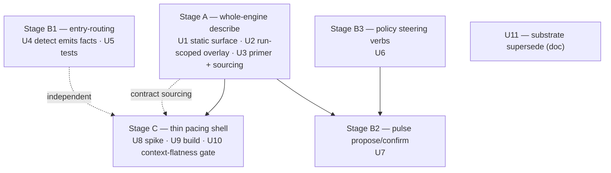
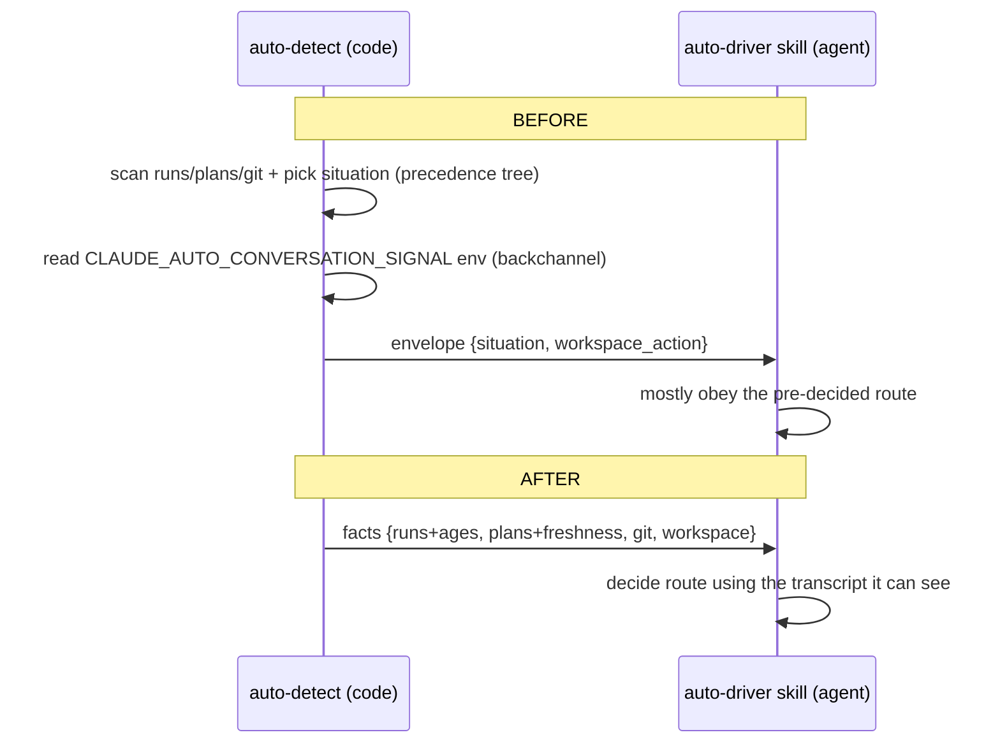

# Agent-Native /auto - Plan

## Summary

Finish the half-built agent-native charter of the `/auto` plugin: hand agents the
*decisions and control flow* while keeping the deterministic *reads and invariants*
as mechanism. Three staged deliverables — a whole-engine orientation surface
(Stage A), the remaining policy-in-code control-point conversions (Stage B), and a
context-sacred runtime for a `fable` main session (Stage C).

**Product Contract preservation:** Product Contract unchanged — this run adds the
Planning Contract, Implementation Units, Verification Contract, and Definition of
Done to the requirements-only artifact in place.

**Target repo:** this worktree (`feature/agent-native`, post concept-vocabulary
rename — `CONCEPTS.md` is canonical vocabulary). All paths repo-relative.

---

## Goal Capsule

**Objective.** Convert the remaining deterministic control points of `/auto` into
agent-steerable tools, consolidate the orientation surface into one `describe`, and
run the loop under a context-flat `fable` main session — without touching any
determinism-bar seam.

**Product authority.** Shawn (owner of the `/auto` plugin).

**Open blockers.** None. Stage C carries an inherent execution-time unknown
(the pacing-shell mechanism), gated behind a spike unit rather than resolved on paper.

**Grounding.** A read-only fable exploration classified every `lib/` and `skills/`
component; its load-bearing claims were verified directly against this worktree
(see Sources & Research). The reframe below rests on `agent-tool-surface.md:71-77`.

---

## Problem Frame

`/auto`'s design principle — *the agent supplies judgment; the correctness spine
stays mechanism* — is documented (`docs/contracts/agent-tool-surface.md`) and live
at ~6 seams. But three gaps remain: (1) an agent re-derives "what is auto?" every
session from a 466-line skill + a 1180-line reference; (2) a handful of control
points still pre-decide policy in code where an agent could steer better —
sharpest is entry-routing, where `auto-detect` picks a route over facts it reads
worse than the driver (it structurally can't see the transcript and has grown an
env-var backchannel to compensate); (3) the loop's "boss" IS the pulse-driven
session, so its context grows across beats even though phase work already descends
into a disposable sub-agent tree (v0.13.0).

This plan finishes the charter. It is **not** an architectural inversion.

---

## Product Contract

### The reframe this plan rests on

Deterministic-sensing / agent-deciding is **already** `/auto`'s documented design
principle. `docs/contracts/agent-tool-surface.md:71-77` states it verbatim: *"The
agent supplies judgment; the correctness spine stays mechanism… The agent decides
what to do; the verbs guarantee the decision is recorded legally and losslessly."*
This plan finishes that charter — it does not invert the architecture.

### Primary actor

An agent driving an `/auto` run — the interactive driver skill or a `fable` main
session supervising a loop. Secondary actor: Shawn, steering a live run by editing
the goal doc or calling steering verbs.

### Requirements

- **R1** — An agent orients to the whole engine from one `describe` call, without
  citing a `SKILL.md` line range for the contract.
- **R2** — Entry-routing decisions are made by the driver using transcript context;
  the closed `situation` precedence vocabulary and its env-var backchannel retire.
- **R3** — The driver can steer per-run policy constants (retry/escalation budget,
  per-step stall thresholds) mid-run through locked steering verbs.
- **R4** — The driver picks the in-loop next advance from a grammar-legal candidate
  set; the engine validates the pick.
- **R5** — Under a multi-beat run, the `fable` main session's resident context does
  not grow with beat count (flat, not bounded-slow-growth).
- **R6** — The parked v0.5.0 substrate plans are marked superseded, not restored.

### The determinism bar (hard non-goals — nothing here converts these)

Per `deterministic_over_probabilistic_v1`, these stay mechanism and never become
agent-operable: the run-record atomic write chokepoint + in-lock predicate
recompute (I-1); the state grammar + attempt identity (I-2); the `met` exit
predicate and the Stop-hook block decision; the gating-severity scale map; the
PreToolUse fail-closed backstops; iteration-bound *enforcement*; the stall *clock*;
the read-shim; and every detection *read*. A probabilistic substitute at any of
these corrupts state, loses writes, exits spuriously, or proceeds unsafely.

### Success criteria

1. One `describe` call fully orients an agent; no `SKILL.md` line-range citations
   remain in sub-agent contract sourcing.
2. Entry-routing is driver-decided with transcript context; the `situation` tree is
   retired; entry tests pass asserting facts + driver routing (not code-picked routes).
3. A measured flat main-session context curve across a multi-beat run.
4. No regression at any determinism-bar seam.

---

## Planning Contract

### Key Technical Decisions

- **KTD-1 — `describe` splits static + run-scoped.** Today `describe` is
  deliberately stateless (`_describe_surface()`, `lib/run_record.py:270` — "No repo,
  no mutation"). The whole-engine surface keeps that static core (the one rule, the
  intent-envelope grammar, the verb table) and adds a *run-scoped* `describe <run>`
  overlay that reads the run-record to add the phase model (from `phase_order`) and
  the current next-action. The overlay is a pure read — no mutation, no lock.
- **KTD-2 — Every new tool follows the locked-steering pattern.** New agent-operable
  verbs (Stage B) mutate only through `run_record_core._with_locked_run_record`
  (precondition + mutate + predicate-recompute in one lock), mirroring
  `lib/run_record_steering.py`. This is the mechanism that keeps agent decisions
  legal and lossless under a stale snapshot.
- **KTD-3 — `auto-detect` becomes emit-only; routing moves to the driver skill.**
  The read scans stay in `lib/auto-detect.py`; the `situation` precedence routing
  (`_route_in_flight`, `_route_plans_or_raw`) and the `CLAUDE_AUTO_CONVERSATION_SIGNAL`
  env backchannel are removed. Route selection moves into `skills/auto-driver/SKILL.md`,
  which has the transcript.
- **KTD-4 — Stage C is spike-gated.** The pacing-shell mechanism is an execution-time
  unknown: the pulse rearm contract (`skills/auto/SKILL.md:108-112`) yields the *same*
  session to hold `ScheduleWakeup` + the Stop-hook, so "spawn a driver sub-agent each
  beat" must be validated against the harness (a sub-agent cannot self-pace) before
  it is built. U8 is that spike; U9 builds only what U8 validates.
- **KTD-5 — Drift stays fenced.** Each surface extension adds/extends a doc-fence
  test in the existing style (`tests/unit/doc-fence-agent-tool-surface.test.sh`,
  `tests/unit/run-record.test.sh`) that derives the required set from `describe` so
  the registry, the machine-readable mirror, and the human doc can never drift.

### Execution direction

The run-record surface is contract-fenced; work test-first there — extend the fence
test to require the new surface, watch it fail, then implement (U1, U6). Stage C
leads with a spike (U8), not production code.

---

## High-Level Technical Design

### Stage dependency graph

### Entry-routing: before → after (KTD-3)

---

## Output Structure

No new directory hierarchy. New files are a primer doc and per-surface fence tests;
everything else extends existing modules. New/changed files are listed per unit.

---

## Implementation Units

Grouped by stage. Land in stage order; within Stage B, U6 precedes U7.

### U1. Whole-engine static `describe` surface

- **Goal.** Extend the stateless `describe` payload to compose the full engine
  operating contract — the one rule, the intent-envelope grammar, and the complete
  verb table — as one JSON object, so an agent orients without the skill corpus.
- **Requirements.** R1.
- **Dependencies.** None.
- **Files.** `lib/run_record.py` (`_describe_surface`, ~`:270`);
  `tests/unit/doc-fence-agent-tool-surface.test.sh` (extend); `tests/unit/run-record.test.sh` (extend set-equality).
- **Approach.** Keep the stateless core (no repo, no mutation). Add the pulse
  intent-envelope grammar and phase-model *schema* (not a specific run's values) to
  the payload. Preserve the `describe`-derives-the-required-set fence discipline
  (KTD-5): the fence test derives its assertions from `describe` output, never a
  hand-maintained list.
- **Patterns to follow.** `lib/run_record_steering.py` docstrings for the contract
  language; `tests/unit/doc-fence-agent-tool-surface.test.sh` header for the
  fence-derivation pattern.
- **Execution note.** Test-first: extend the fence to require the new surface keys,
  watch it fail, then implement.
- **Test scenarios.**
  - `describe` emits the one-rule string, the intent-envelope grammar, and the full
    verb table in one JSON object. Covers R1.
  - Fence test derives the required doc-section set from `describe` and fails when a
    surface key is present in the payload but absent from `agent-tool-surface.md`.
  - Set-equality between `_VERBS` and the `describe` verb table still holds.
- **Verification.** `python3 lib/run_record.py describe` returns the composed surface;
  the two unit fence tests pass.

### U2. Run-scoped `describe <run>` overlay

- **Goal.** Add a run-scoped variant that overlays this run's phase model (from
  `phase_order`) and the current-phase next-action onto the static surface.
- **Requirements.** R1.
- **Dependencies.** U1.
- **Files.** `lib/run_record.py` (new `_h_describe` run-arg branch + a
  `_describe_run_overlay` reader); `tests/unit/run-record.test.sh` (add cases).
- **Approach.** Pure read: load the run-record, project `phase_order` + terminal
  phase + the current-phase next-action into the payload. No lock, no mutation.
  When no run arg is given, behavior is exactly U1's static surface (back-compat).
- **Patterns to follow.** `_h_read` (`lib/run_record.py:278`) for the read-only
  run-arg handler shape; `lib/phase-grammar.py` for phase-order projection.
- **Test scenarios.**
  - `describe <run>` includes the run's `phase_order` and a current-phase next-action.
  - `describe` with no run arg is byte-identical to the U1 static surface.
  - `describe <run>` performs no write (run-record mtime unchanged after the call).
    Covers the determinism bar (read-only).
- **Verification.** `describe <run>` on a fixture run-record shows the phase overlay;
  no mutation occurs.

### U3. Stable primer + sub-agent contract sourcing

- **Goal.** Provide a ≤100-line stable primer and route sub-agent contract sourcing
  through `describe` instead of `SKILL.md` line ranges.
- **Requirements.** R1.
- **Dependencies.** U1, U2.
- **Files.** `docs/contracts/agent-tool-surface.md` (trim/confirm ≤100 lines, or a
  new `docs/contracts/auto-primer.md`); `skills/auto/SKILL.md` (§4.8 dispatch
  guidance to source contract from `describe <run>`).
- **Approach.** Decide primer home at implementation (Open Question OQ-1). Update the
  §4.8 sub-agent prompt guidance so spawned agents fetch `describe <run>` for their
  contract — removing hardcoded line-range citations, "the orientation tax this
  runtime removes."
- **Test scenarios.**
  - `Test expectation: none — docs + skill guidance change.` Guard: the existing
    `tests/unit/vocabulary-audit.test.sh` and the U1 fence still pass against the
    trimmed primer.
- **Verification.** Primer ≤100 lines; §4.8 cites `describe`, no `SKILL.md:NN-MM`
  contract citations remain in dispatch guidance.

### U4. Entry-routing: `auto-detect` emits facts, retire the situation tree

- **Goal.** Reshape `auto-detect` to emit facts only; remove the `situation`
  precedence routing and the `CLAUDE_AUTO_CONVERSATION_SIGNAL` backchannel. Move
  route selection into the driver skill.
- **Requirements.** R2.
- **Dependencies.** None (independent of Stage A).
- **Files.** `lib/auto-detect.py` (`main` `:585`, `_route_in_flight` `:374`,
  `_route_plans_or_raw` `:449`, `_safe_envelope` `:82`); `lib/auto-detect.sh`;
  `skills/auto-driver/SKILL.md` (add the routing decision the code drops).
- **Approach.** Keep every read scan (in-flight runs + ages, plan discovery +
  freshness, git state, workspace status) — all fail-safe degrading (determinism
  bar: detection reads stay deterministic). Drop the closed `situation` vocabulary
  and its precedence; drop the env-var read at `lib/auto-detect.py:475-512`. The
  envelope becomes a facts object; the driver skill, which has the transcript,
  decides resume/start/ask.
- **Patterns to follow.** `_safe_envelope`'s fail-safe slot construction; the
  auto-driver skill's existing "one action line per branch" terseness.
- **Execution note.** Characterize current entry behavior (U5 updates the tests) —
  land the fact-emitting detector and the driver-side routing together so no entry
  path regresses.
- **Test scenarios.**
  - Detector emits facts (runs+ages, plans+freshness, git, workspace) with no
    `situation` key. Covers R2.
  - `CLAUDE_AUTO_CONVERSATION_SIGNAL` is neither read nor required; the detector
    behaves identically with and without it set.
  - A stale/anomalous in-flight run appears in the facts (not silently resumed) so
    the driver can decide. (Closes the 15-day-stale-run silent-resume class.)
  - Detector degrades safely when a scan target is missing (no crash, partial facts).
- **Verification.** `lib/auto-detect.py` output is a facts envelope; grep confirms no
  `situation`/`CLAUDE_AUTO_CONVERSATION_SIGNAL` references remain in the routing path.

### U5. Entry-routing tests: facts + driver routing

- **Goal.** Update the entry test suite to assert the fact envelope and the driver's
  route decisions rather than code-picked situations.
- **Requirements.** R2.
- **Dependencies.** U4.
- **Files.** `tests/integration/conversation-entry.test.sh`,
  `tests/integration/entry-resilience.test.sh`,
  `tests/integration/workflow-smart-entry.test.sh`,
  `tests/smoke/auto-driver.test.sh`.
- **Approach.** Re-point assertions from `situation=<x>` to the presence/shape of
  facts and the driver's resulting action. Preserve every resilience case (stale
  runs, dirty tree, multi-plan, no-plan) as a fact-shape assertion.
- **Test scenarios.**
  - Each prior `situation` case has an equivalent fact-shape + driver-route assertion.
  - Resilience cases (stale run, missing scan target, multi-plan) still pass.
  - No test references `CLAUDE_AUTO_CONVERSATION_SIGNAL`.
- **Verification.** `bash tests/run.sh` entry + smoke suites green.

### U6. Per-run policy steering verbs

- **Goal.** Add locked steering verbs letting the driver set the retry/escalation
  budget and per-step stall thresholds mid-run.
- **Requirements.** R3.
- **Dependencies.** U1 (verbs must appear in `describe`).
- **Files.** `lib/run_record_steering.py` (new `set_retry_budget`,
  `set_stall_threshold`); `lib/run_record.py` (CLI handlers + `_VERBS` registration);
  `docs/contracts/agent-tool-surface.md` (verb rows); `tests/unit/run-record.test.sh`.
- **Approach.** Mirror `force_skip`/`reshape_deps` exactly (KTD-2): precondition +
  mutate + predicate-recompute in one `_with_locked_run_record` call. `should_escalate`
  reads the per-run budget where set, else the default 2; the stall clock reads the
  per-step threshold where set. The *enforcement* (bound checks, stall clock) stays
  mechanism — only the *constant* becomes agent-set (determinism bar preserved).
- **Patterns to follow.** `lib/run_record_steering.py:69-113` (`force_skip`).
- **Execution note.** Test-first via the fence: adding the verb wires its doc
  requirement automatically.
- **Test scenarios.**
  - `set-retry-budget <run> <step> <n>` persists; `should_escalate` honors it; absent
    → default 2. Covers R3.
  - `set-stall-threshold <run> <step> <seconds>` persists; the stall clock reads it.
  - A set against a stale snapshot is rejected in-lock, not merged. Covers the
    determinism bar.
  - New verbs appear in `describe` and in `agent-tool-surface.md` (fence passes).
- **Verification.** New verbs round-trip through the CLI; `tests/unit/run-record.test.sh`
  and both fence tests pass.

### U7. `pulse propose/confirm` for in-loop next-advance

- **Goal.** Expose the grammar-legal candidate-advance set so the driver picks the
  next advance; the engine validates the pick against the grammar and ordering.
- **Requirements.** R4.
- **Dependencies.** U6 (shares the steering surface), U1 (appears in `describe`).
- **Files.** `lib/pulse.py` / `lib/pulse_advance.py` (candidate-set producer +
  pick-validation); `lib/dispatcher.py` (`pick_next_plan_step_to_advance` becomes a
  candidate enumerator); `docs/contracts/driver-reference.md`;
  `tests/integration/pulse-alias-inflight.test.sh` or a new pulse-propose test.
- **Approach.** `pulse propose <run>` returns the ready plan steps / applicable
  fixes / phase-advance eligibility as a candidate set. The driver selects one; the
  engine validates the selection against `phase-grammar` and the one-advance-per-pulse
  ordering invariant, rejecting an illegal pick. The *ordering* and *one advance per
  pulse* remain code invariants (determinism bar).
- **Patterns to follow.** The prepare/execute envelope contract (`lib/pulse.py:11-23`);
  the reject-illegal discipline in `dispatch_batch`.
- **Execution note.** Highest-risk conversion — keep the ordering invariant and
  grammar validation strictly mechanism; only *which* legal advance fires is the
  driver's.
- **Test scenarios.**
  - `pulse propose` returns only grammar-legal candidates for the current phase.
  - A driver pick outside the candidate set is rejected, not executed. Covers the
    determinism bar.
  - One-advance-per-pulse still holds: proposing does not advance; confirming
    advances exactly one. Covers R4.
  - Phase-advance eligibility appears only when the predicate/phase grammar allows it.
- **Verification.** Propose/confirm round-trips; existing pulse + workflow integration
  tests stay green.

### U8. Stage C spike — validate the thin-pacing-shell mechanism

- **Goal.** Determine whether a `fable` main session can hold only pacing +
  Stop-hook while spawning a driver sub-agent per beat, and resolve the per-beat-spawn
  vs. long-lived-driver fork.
- **Requirements.** R5 (validates feasibility).
- **Dependencies.** U1, U2 (the spawned driver sources its contract from `describe`).
- **Files.** `tests/spike/` (new spike harness, alongside
  `tests/spike/subagent-capability.test.sh`); notes into
  `docs/contracts/driver-reference.md`.
- **Approach.** Exercise the real harness constraints: a sub-agent cannot
  `ScheduleWakeup` (self-pace); native `/goal` is model-judged with no external
  predicate handoff. Confirm the main session can (a) hold the pulse heartbeat +
  Stop-hook, (b) spawn a driver sub-agent that decides/dispatches a beat, (c) read
  back only the run-record digest without absorbing sub-agent prose. Decide the fork:
  spawn-per-beat vs. one long-lived driver sub-agent steered via goal-doc edits.
- **Execution note.** This is a spike: observe real harness behavior before building
  U9. The long-lived-driver fallback is *also* a sub-agent bound by the same
  no-self-pace constraint, so it is not automatically an independent escape hatch —
  U8 must confirm at least one variant genuinely holds flat context under real
  pacing. If neither does, R5 is unreachable in this harness: record that and
  escalate to Shawn rather than forcing a shape that cannot meet the bar.
- **Test scenarios.**
  - `Test expectation: spike — the deliverable is a validated mechanism + a fork
    decision recorded in driver-reference.md, not production code.`
- **Verification.** A written spike outcome: which variant holds, with the harness
  behavior that decided it.

### U9. Build the thin pacing shell

- **Goal.** Implement the pacing shell per U8's validated variant: main session holds
  pulse heartbeat + Stop-hook; each beat spawns/steers the driver; reads back only
  the digest.
- **Requirements.** R5.
- **Dependencies.** U8.
- **Files.** `skills/auto/SKILL.md` (§4.8 — the boss-spawns-driver contract);
  `docs/contracts/driver-reference.md` (§16); possibly `lib/pulse.py` digest
  read-back shape (OQ-2). No change to the pulse lock, predicate, or Stop-hook.
- **Approach.** Formalize the boss→driver spawn (or long-lived-driver steering) and
  the digest the shell reads each beat. All loop state stays on disk; the shell's
  resident context is the goal doc + digests. Pacing and the deliberate-stop decision
  stay with the shell (the session holding the Stop hook) — only deciding/dispatching
  descends.
- **Patterns to follow.** `skills/auto/SKILL.md:363-426` (the v0.13.0 tree runtime —
  boss issues spawns itself; convergence reads the run-record not prose).
- **Test scenarios.**
  - The shell spawns a driver that decides/dispatches a beat; convergence reads the
    run-record digest, never the sub-agent's returned prose. Covers R5.
  - The Stop-hook and predicate `met` decision remain in the shell/engine, unchanged.
    Covers the determinism bar.
  - A driver sub-agent death mid-beat is handled by the existing watchdog/reap path
    (no new failure mode).
- **Verification.** `tests/integration/tree-dispatch.test.sh` + `tree-ownership.test.sh`
  stay green; a multi-beat run drives via the shell.

### U10. Context-flatness verification gate

- **Goal.** Measure that the main session's resident context does not grow with beat
  count under the pacing shell.
- **Requirements.** R5.
- **Dependencies.** U9.
- **Files.** `tests/integration/` (new context-flatness test) or
  `tests/verify-session-parity.sh` extension.
- **Approach.** Drive a multi-beat run under the shell and assert the boss's resident
  context (goal doc + digests) is bounded and flat across beats — not proportional to
  beat count. Use the run-record + digest sizes as the deterministic proxy — but
  the proxy is necessary, not sufficient: a bounded digest does not prove the shell's
  *resident* context stayed flat (it could still accumulate spawn results). Pair the
  proxy with a direct per-beat resident-context observation so the gate cannot go
  green while actual context grows.
- **Test scenarios.**
  - Across N beats, boss resident-context size is flat (within a fixed bound), not
    O(N). Covers success criterion 3.
  - All loop state (verdicts, phase, attempts) is present on disk, not in the shell's
    context.
- **Verification.** The flatness gate passes for a ≥3-beat run.

### U11. Substrate supersede (docs)

- **Goal.** Mark the parked v0.5.0 substrate plans superseded by this direction.
- **Requirements.** R6.
- **Dependencies.** None.
- **Files.** `docs/plans/2026-05-29-002-rfc-workflow-substrate-migration.md`,
  `docs/plans/2026-05-29-003-spike-workflow-primitive-surface.md` (status header
  pointing here); optionally answer plan 001's open direction question inline.
- **Approach.** A doc edit, not a migration. Add a superseded-by pointer to this
  plan; leave the parked content intact for provenance.
- **Test scenarios.** `Test expectation: none — doc-only change.`
- **Verification.** Both parked plans carry a superseded-by header referencing this
  plan.

---

## Scope Boundaries

**In scope.** The three staged deliverables (A/B/C) and the substrate doc edit.

**Non-goals (the determinism bar).** Every seam listed under "The determinism bar"
in the Product Contract — no conversion, no probabilistic substitute.

### Deferred to Follow-Up Work

- Simplifying the interactive launch-chooser ladder (`auto-launch`/`launch-gate`/
  `recommender`) — the fable pass flagged it as possibly over-built, but it is
  correct under the current center of gravity and is not required for R1–R6.
- Backend `next_plan_step` sequencing conversion — low urgency; the sequence is the
  CE contract and the `auto-resume advance` escape already exists.

---

## Open Questions

- **OQ-1** — Is the ≤100-line primer a trimmed `agent-tool-surface.md` (already 77
  lines) or a new `auto-primer.md`? Resolve at U3.
- **OQ-2** — Exact digest shape the pacing shell reads each beat. Resolve at U9,
  informed by U8.
- **OQ-3** — Does `pulse propose` (U7) ship in this plan or defer to a follow-up if
  U8/U9 prove larger than estimated? Decide after U6.

---

## System-Wide Impact

- **Agents driving `/auto`** — orientation becomes one `describe` call; entry routing
  and in-loop next-advance become steerable.
- **Shawn** — a `fable` main session can supervise a long run without context bloat.
- **Existing runs / run-records** — no schema change to the correctness spine; the
  run-scoped `describe` overlay and new steering verbs are additive. Format-compat
  read-shim untouched.

---

## Risks & Dependencies

- **Stage C mechanism (highest).** The pacing-shell shape may not hold against the
  harness (sub-agent can't self-pace). Mitigation: U8 spike gates U9; long-lived-driver
  fallback recorded as the alternative.
- **Entry-routing regression.** Removing the `situation` tree could drop a resilience
  case. Mitigation: U5 re-expresses every prior case as a fact-shape assertion before
  U4 lands.
- **Surface drift.** New verbs/surfaces could desync doc and registry. Mitigation:
  KTD-5 fence tests derive from `describe`.

---

## Definition of Done

- R1–R6 met; all four success criteria demonstrated.
- Stages A, B, C and U11 landed in order; U9 built only on U8's validated variant.
- No determinism-bar seam changed; existing `tests/run.sh` suites green, including
  `tree-dispatch`, `tree-ownership`, entry, and the fence tests.
- New surfaces (`describe` composition, run-scoped overlay, steering verbs, `pulse
  propose`) appear in `describe` and are fence-bound to their docs.
- Context-flatness gate (U10) passes for a multi-beat run.

---

## Sources & Research

- **Verified fable exploration** (component-by-component classification, file:line
  citations): session scratchpad `fable-exploration.md`. Load-bearing claims
  re-verified directly against this worktree.
- **The design principle:** `docs/contracts/agent-tool-surface.md:71-77`.
- **`describe` today (stateless):** `lib/run_record.py:270-275`.
- **Locked-steering pattern:** `lib/run_record_steering.py:69-325`.
- **Situation tree + env backchannel:** `lib/auto-detect.py:374-546`, `:475-512`.
- **Tree runtime (v0.13.0) + pulse rearm contract:** `skills/auto/SKILL.md:363-426`,
  `:108-112`; `lib/pulse.py:11-23`.
- **Fence pattern:** `tests/unit/doc-fence-agent-tool-surface.test.sh`,
  `tests/unit/run-record.test.sh`.
- **Substrate parking + open direction question:**
  `docs/plans/2026-05-29-001-feat-auto-v0.5.0-workflow-substrate-plan.md`,
  `-002`, `-003`.
