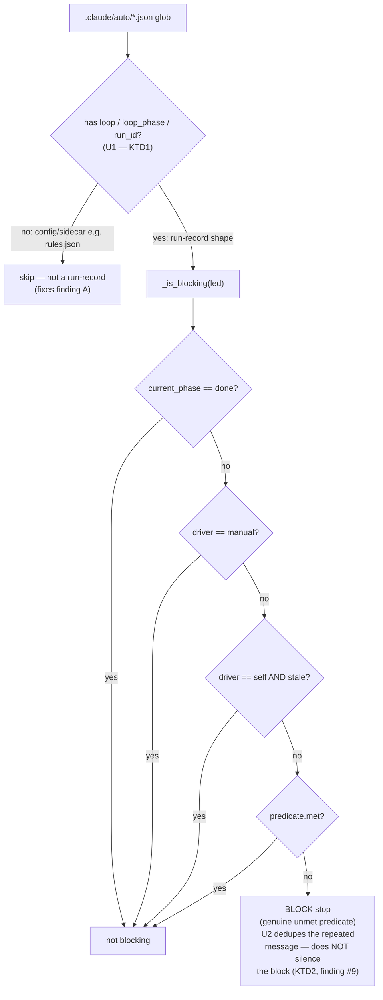

# fix: /auto run-reliability batch — Stop-hook shape guard + `w`-run engine bugs

## Summary

Land a batch of discrete reliability fixes in the `/auto` engine (v0.14.0), drawn from
two debriefs: a **proven** Stop-hook bug that false-blocks stop from any session under
`~` because it treats auto's own `rules.json` config as a run-record, and ten field-notes
findings from driving a real `w` (work-only) run largely by hand. Each finding is a
separate, surgical change. The two genuine design calls — a canonical dispatch-prompt
primitive and splitting implement-from-verify — are their own units and may spin off, but
`fix it all` keeps them in scope here.

The through-line: the loop's **spine is the verdict write**, and several bugs silently
corrupt or strand it (verdict written via `bash` against a python file; agents dying
mid-verification with no verdict; no canonical dispatch primitive that self-writes one).
The Stop hook — the deliberate-stop guard — both cries wolf on a config file (finding A)
and nags while correctly yielding for live work (finding #9). Fix these and an unattended
`w` run gets substantially more reliable.

**Product Contract preservation:** N/A — solo/direct plan (no upstream `ce-brainstorm`
Product Contract). Requirements below are extracted from the two source debriefs.

---

## Problem Frame

`/auto` drives a plan→work loop where sub-agents self-write verdicts to a durable
run-record, and a deliberate-stop Stop hook blocks a turn from ending while a run's exit
predicate is unmet. Two independent debriefs surfaced concrete defects:

1. **Stop-hook false-block (finding A, PROVEN).** `iter_worktree_run_records`
   (`lib/_bootstrap.py:407`) yields *every* parseable JSON dict under `<repo>/.claude/auto/`
   as a run-record — with no shape check. `rules.json` (auto's own persona-rules config)
   lives in that dir, survives `load_run_record_safe`, and is yielded as a run whose
   `run_id` is `"rules"`. It has no `loop_phase` (→ `current_phase` defaults to `"plan"`,
   non-terminal), no `loop` (no carve-out applies), and no met predicate → `_is_blocking`
   blocks stop **forever**, from any session whose cwd resolves `repo_root` to `~`. Proven
   by execution: the glob yields `run_id='rules' phase='plan' met=None keys=['format','rules']`.

2. **`w`-run engine bugs.** A hand-driven 7-unit `w` run completed but exposed real
   defects that would bite the intended armed-chain flow too: the emitted verdict-write
   guidance runs a python file under `bash` (corrupting the loop's spine); agents die
   mid-verification without recording a verdict; `ready_steps` surfaces the `plan` step
   during `work` phase; the exit report reads self-contradictory (`all_steps_terminal:false`
   next to `met:true`); the pulse has no cleanly-nameable runnable; `dispatch_batch`'s
   `launch_fn` is a no-op with no canonical wrapper; `dispatcher.sh digest` errors; zombie
   agents are invisible to the run-record; the Stop hook nags while correctly yielding; and
   there is no baseline-health precheck.

**Who is affected:** anyone running `/auto` (verdict-write and dispatch reliability), and
anyone running *any* Claude session under `~` with `~/.claude/auto/rules.json` present
(finding A false-block). The fixes are engine-internal — no user-facing API changes.

---

## Requirements

Extracted from the two source debriefs. IDs are stable within this plan.

| ID | Requirement | Source |
|----|-------------|--------|
| R1 | `iter_worktree_run_records` must yield only run-record–shaped dicts; a `.claude/auto/` containing only `rules.json` yields zero runs and does not block stop. | Finding A |
| R2 | The Stop hook must not fire the *identical* blocking re-prompt repeatedly across turns for an unchanged blocking state — it should de-duplicate the message. It must **not** silence the block itself (no per-agent liveness signal exists yet; the true live-vs-wedged downgrade waits on U9). | Finding #9 |
| R3 | Emitted verdict-write / run-record guidance must never instruct running `lib/run_record.py` directly under `bash`; it must route through the interpreter-pinned `run_record.sh` shim (or `python3`). | Finding #1 (Top-3) |
| R4 | After `plan→work`, the plan step must not appear in `ready_steps`, and the exit report must not read `all_steps_terminal:false` alongside `met:true`. | Findings #3, #4 |
| R5 | `dispatcher.py digest`/`propose` CLI must not error when invoked with only `<run>` (repo auto-resolved from cwd), matching the driver-reference documented usage and the `run_record.sh` convention. | Finding #7 |
| R6 | The `arm-pulse` intent must name the exact runnable string (`bash lib/pulse.sh "<run> --auto"`) in a field, not only a slash-command prompt the model may be unable to invoke. | Finding #5 |
| R7 | Ship a canonical dispatch-prompt template (unit packet + verdict-write contract + attempt tag) as a library asset that a driver fills in, so `dispatch unit U3` wires identically every time. | Finding #6 (Top-3) |
| R8 | The dispatch contract must mandate "record your verdict BEFORE any long-running background wait," and implement should be split from verify so a flaky verifier cannot strand the implementation verdict. | Finding #2 (Top-3) |
| R9 | Document the reap sequence (TaskStop → SIGTERM) in the death-path, and record spawned agent-ids on the run-record so cleanup is auditable. | Finding #8 |
| R10 | Add a baseline-health precheck before a run starts (so a baseline-RED typecheck/test surfaces before U1, not inside U1's verdict), plus an engine notion of "verification deferred to CI." | Finding D |

**Explicitly out of this plan's code scope** (see Scope Boundaries): the publish/re-vendor
rollout (R-none), and finding #10 (reverse-engineering tax — mitigated indirectly by U6/U7,
not a direct fix).

---

## Key Technical Decisions

**KTD1 — Fix finding A by run-record *shape*, not filename.** Do not special-case
`rules.json` by name; other non-run-record files will land in `.claude/auto/` later
(`recipes/` already does, as a dir). Require a run-record shape in
`iter_worktree_run_records`: skip a loaded dict that has *none* of `loop` / `loop_phase` /
`run_id`. A real run-record always carries loop/phase machinery; a config never does. This
is the shared enumerator, so the single change fixes `on-stop.py`, `auto-status.py`,
`auto-resume.py`, `on-pretooluse-action.py`, and `launch-mode.py` at once
(`feedback_fix_the_class_not_the_cited_instance`). *Rationale over the alternative* (name
blocklist): a blocklist re-breaks the moment a second config file appears.

**KTD2 — #9 is nag de-duplication, NOT a liveness-keyed silent pass.** *(Revised after
review — the original design keyed on a run-record field that does not exist.)* There is **no
per-agent liveness heartbeat** on the run-record. The only heartbeat is run-level
`loop.last_beat_at`, which *every* pulse re-stamps — including the watchdog `ScheduleWakeup`
that fires while a step is `dispatched` — so a fresh beat proves the *driver* pulsed, not that
the spawned *agent* is alive. Per-step there is only `dispatched_at` (a stall timeout, not a
heartbeat), which a dead-agent-wedged step also satisfies. Keying a silent pass on beat
freshness would therefore suppress the Stop block in **exactly** finding #2's strand scenario
(agent dead, step still `dispatched`, driver still pulsing). So #9's fix is scoped to
**collapsing the repeated identical blocking re-prompt** (the ~10x nag) — dedupe the message,
do not silence the block — and to **fail closed** (keep blocking) whenever liveness is
indeterminate. The genuine "live work vs wedged dispatch" distinction is deferred until U9
captures a real per-agent liveness signal (spawned-agent-id + agent-written beat); U2 depends
on U9 for that stronger behavior. Do **not** invent a second blocking machinery, and do **not**
claim a `driver == "self"` stale run "still blocks" — the existing carve-out at
`on-stop.py:122–130` already returns None (does not block) for a stale self-chain by design
(it surfaces for resume via SessionStart, not by blocking).

**KTD3 — #1 routes through the existing shim, no new interpreter logic.** `run_record.sh`
already pins `/usr/bin/python3` (overridable via `CLAUDE_AUTO_PYTHON3`) and exists precisely
for this. The fix is a *guidance* change — repoint every emitted `bash lib/run_record.py …`
string to `bash lib/run_record.sh …` (the `$CLAUDE_PLUGIN_ROOT/lib/run_record.sh` form
already used in `pulse_guidance.py:73`). No code path changes; the corruption was operators
copy-pasting the wrong emitted string.

**KTD4 — #3 and #4 share one root fix: terminalize the plan step at the phase flip.** Both
stem from the `plan` step never reaching a terminal state after `plan→work`. Prefer
terminalizing the plan step at the flip (single write) over defensively filtering
`ready_steps` by `phase != current_phase` in one consumer — terminalization fixes the fact,
filtering fixes one symptom. Confirm at implementation that terminalization also clears the
`all_steps_terminal` contradiction; if a residual phase-scoping issue remains in the exit
report, scope `all_steps_terminal` to the eval phase as a secondary change. Reproduce both
symptoms first.

**KTD5 — #7: default repo to cwd in the `digest`/`propose` CLI.** The root cause is a
positional-arg contract mismatch: `dispatcher.py` does `repo, run = argv[1], argv[2]` (two
positionals) while `driver-reference.md:1139` documents `bash lib/dispatcher.sh digest <run>`
(one). Align the CLI with the rest of the surface (`run_record.sh` already auto-resolves repo
from cwd, "pass only `<run>`") by making `<repo>` optional and resolving from cwd when only
`<run>` is given. Apply to both `digest` and `propose` (identical bug).

**KTD6 — #6/#2 land as a library *template asset*, not engine control flow.** The canonical
dispatch-prompt template is a fill-in-the-blanks asset (unit packet + verdict-write contract
+ attempt tag + the record-before-yield mandate), consumed by the driver to build each
Agent's prompt. `launch_fn` stays injected by the driver (the engine's no-op default is
correct — `dispatcher.py:396`). The impl/verify split (R8) is the deeper change: it lets a
flaky verifier fail without stranding the implementation verdict. Sequence the split
(U8) after the template (U7) so the split reuses the template's verdict contract.

**KTD7 — Every new test must fail once before it passes**
(`feedback_new_tests_need_deliberate_fail_smoke_check`,
`mutation_test_not_inject_fail_proves_assertions`), and the test runner only tallies a file
whose LAST line matches `^<name>.test.sh: N passed, M failed`
(`auto_test_runner_summary_line_tally`). Finding A already has an execution repro to mirror.

---

## High-Level Technical Design

### Stop-hook blocking decision (findings A + #9)

The two Stop-hook fixes are both refinements to *what counts as a blocking run*. A is an
enumeration-shape gate (before the predicate); #9 is a carve-out (inside the predicate,
beside the existing staleness carve-out).



### Plan-step lifecycle across the phase flip (findings #3 + #4)

```mermaid
stateDiagram-v2
    [*] --> plan_dispatched: run armed
    plan_dispatched --> plan_terminal: plan→work flip (U4 — KTD4)
    note right of plan_terminal
        Today the plan step stays non-terminal after the flip, so:
        • ready_steps returns ['plan', 'U1']  (finding #3)
        • exit report: all_steps_terminal=false beside met=true  (finding #4)
        Terminalizing at the flip removes the plan step from ready_steps
        and clears the all_steps_terminal contradiction.
    end
    plan_terminal --> work_steps: U1..Un dispatch
    work_steps --> [*]: predicate met
```

*Diagrams render authoritative design intent; prose governs on any disagreement.*

---

## Implementation Units

Grouped into thematic phases (Phase 1–9 below are theme labels, **not** landing order).
**Priority-1 first wave = U1, U3, U4, U5** (per handoff sequencing). The
dispatch-primitive and impl/verify-split units (U7, U8) are the largest and may spin off,
but are in scope per `fix it all`.

### Phase 1 — Stop-hook correctness (A + #9)

### U1. Run-record shape guard in the shared enumerator

- **Goal:** `iter_worktree_run_records` yields only run-record–shaped dicts; `rules.json`
  and future config/sidecar files are skipped, fixing finding A across all consumers.
- **Requirements:** R1
- **Dependencies:** none (do first — highest impact, has a proven repro)
- **Files:** `lib/_bootstrap.py` (`iter_worktree_run_records`, ~line 418–423);
  `tests/unit/_bootstrap.test.sh`; new fixture under `tests/fixtures/` (a `.claude/auto/`
  containing only `rules.json`)
- **Approach:** after `load_run_record_safe`, skip a loaded dict lacking all of
  `{"loop", "loop_phase", "run_id"}` (KTD1). Add the guard in the one shared enumerator so
  `on-stop.py`/`auto-status.py`/`auto-resume.py`/`on-pretooluse-action.py`/`launch-mode.py`
  all inherit it.
- **Execution note:** reproduce first by mirroring the research doc's execution repro
  (glob against a dir containing only `rules.json` currently yields `run_id='rules'`); see
  the new test fail once before the guard.
- **Patterns to follow:** the existing `led is None` skip immediately above; the
  research doc's proposed snippet (`docs/research/2026-07-21-stop-hook-blocks-on-rules-json.md`).
- **Test scenarios:**
  - A `.claude/auto/` containing only `rules.json` (keys `format`, `rules`) → enumerator
    yields **zero** runs. *(fails today — yields `run_id='rules'`)*
  - A dir with one real run-record (has `loop_phase`) + `rules.json` → yields exactly the
    one real run, `rules` absent.
  - A dict with `run_id` but no `loop`/`loop_phase` → still yielded (single-key shape match
    holds; guard is OR not AND).
  - Integration: `on-stop.py` decide() against the rules-only fixture → **not blocking**
    (no `loop exit condition not met — rules` message).
- **Verification:** new bootstrap test passes; a session in a dir whose only `.claude/auto`
  content is `rules.json` can end its turn.

### U2. Stop hook de-duplicates the repeated blocking re-prompt

- **Goal:** stop the Stop hook from firing the *identical* blocking message ~10x across a run
  while the boss correctly yields for live work — **without** silencing the block itself
  (finding #9). The message is deduped; a genuinely-unmet predicate still blocks.
- **Requirements:** R2
- **Dependencies:** U1 (same `on-stop.py`/enumeration surface); the stronger live-vs-wedged
  distinction depends on **U9** landing a per-agent liveness signal — U2 ships nag-dedup now
  and gains the true downgrade once U9 exists.
- **Files:** `lib/on-stop.py` (`_is_blocking`/`_reason_for`/`decide`, ~line 102–316);
  `tests/unit/` (extend the on-stop / batch-stop-discovery coverage — e.g.
  `tests/unit/batch-stop-discovery.test.sh` or a new `on-stop` unit)
- **Approach:** collapse the repeated identical blocking re-prompt to fire once per unchanged
  blocking state (dedupe on the reason/run signature), rather than re-emitting it every
  turn-end. Do **not** add a liveness-keyed silent pass (KTD2 — no per-agent heartbeat exists;
  keying on the run-level `loop.last_beat_at` would suppress the block in finding #2's strand
  scenario). Fail closed: when in doubt, block.
- **Execution note:** reproduce the ~10x repeat first (a run yielding for a live Agent emits
  the block each turn). Confirm the dedupe carries no state that would suppress a *changed*
  blocking reason (a new unmet predicate must still surface).
- **Patterns to follow:** the existing `_reason_for` message construction (`on-stop.py:244`)
  and `decide` return shape (`on-stop.py:283`).
- **Test scenarios:**
  - Same blocking reason across N consecutive turn-ends → the message is emitted once, not N
    times. *(fails today — repeats every turn)*
  - A genuinely unmet predicate (no in-flight work) → still blocks, message emitted. *(the
    block is preserved — dedup ≠ silence)*
  - The blocking reason *changes* between turns (different run / different unmet predicate) →
    the new reason is emitted (dedupe keys on reason, not a blanket suppress).
  - `driver == "self"` stale chain → not blocking (unchanged existing carve-out; U2 does not
    touch it).
- **Verification:** a run yielding for a live Agent no longer spams an identical block each
  turn; every genuinely-unmet predicate still blocks at least once.

### Phase 2 — Verdict-write spine (#1, Top-3)

### U3. Repoint emitted verdict-write guidance off `bash lib/run_record.py`

- **Goal:** no emitted guidance instructs running `run_record.py` directly under `bash`
  (which interprets Python as shell and silently corrupts the verdict write).
- **Requirements:** R3
- **Dependencies:** none
- **Files:** `skills/auto/SKILL.md` (lines ~390, 393, 403 — `record-verdict`,
  `register-session`, `describe`); `docs/contracts/driver-reference.md` (~line 1108);
  audit `lib/pulse_guidance.py` and any other emitter for the same string; a doc-fence /
  guidance test (extend `tests/unit/doc-fence-run-record-schema.test.sh` or add a guard test
  that greps emitted guidance for `bash .*run_record\.py`)
- **Approach:** replace `bash lib/run_record.py <verb>` with `bash lib/run_record.sh <verb>`
  (the shim pins the interpreter — KTD3), or the `$CLAUDE_PLUGIN_ROOT/lib/run_record.sh` form
  already used in `pulse_guidance.py:73`. Keep `python3 lib/run_record.py describe`
  references (already correct) as-is.
- **Execution note:** this is a correctness-of-guidance fix — add a regression test that
  **fails** on any `bash <path>/run_record.py` occurrence in shipped guidance, so the class
  can't reappear; see it fail once against the current strings.
- **Test scenarios:**
  - Grep guard over `skills/`, `docs/`, `lib/` emitted-guidance strings finds **zero**
    `bash …/run_record.py` occurrences. *(fails today — SKILL.md:390/393/403,
    driver-reference.md:1108)*
  - `bash lib/run_record.sh record-verdict <run> <step> '<json>' <attempt>` on a temp
    run-record writes the verdict (shim resolves python3). Covers the spine.
  - `run_record.sh` honors `CLAUDE_AUTO_PYTHON3` override (unchanged behavior, guard against
    regressing the shim).
- **Verification:** every emitted verdict-write example runs the python via the shim; the
  grep guard is green.

### Phase 3 — Phase/step terminalization (#3 + #4, one root)

### U4. Terminalize the plan step at the `plan→work` flip

- **Goal:** after the phase flip the plan step is terminal — it disappears from
  `ready_steps` (#3) and the exit report no longer reads `all_steps_terminal:false` beside
  `met:true` (#4).
- **Requirements:** R4
- **Dependencies:** none
- **Files:** `lib/phase-grammar.py` (phase-flip / terminalization); `lib/pulse_advance.py`
  (where the flip is applied) and/or `lib/dispatcher.py` (`ready_steps` ~line 218,
  `all_steps_terminal` producer ~line 612); `tests/unit/phase-grammar.test.sh`,
  `tests/unit/dispatcher.test.sh`
- **Approach:** at the `plan→work` transition, transition the plan step to a terminal
  **state** (KTD4). Note the lever: step terminality is a *state* property
  (`run_record_predicate.py` `step_is_terminal` — `verdict-returned`/`fixed` with no gating
  findings, or `terminal-skip`), **not** a phase predicate — and the plan step is `dispatched`
  at the flip, so `ALLOWED_TRANSITIONS` (`run_record_core.py`) permits only
  `dispatched → {verdict-returned, stalled}`. Use the legal terminal edge
  `dispatched → verdict-returned` (no gating findings) at the flip. Confirm this single change
  removes it from `ready_steps` and clears the `all_steps_terminal` contradiction — grounded:
  the reported `all_steps_terminal` is the *global* value while `met` is *phase-scoped*
  (`run_record_predicate.py`), which is precisely why they contradict; terminalizing the plan
  step flips the global on predicate recompute. If a residual issue remains, additionally scope
  the reported `all_steps_terminal` to the eval phase.
- **Execution note:** reproduce both symptoms first on a `w`-shape run-record fixture
  (`ready_steps` returns `['plan','U1']`; exit report shows the contradiction), then fix. See
  the read-side alternative in Risks & Dependencies before committing to the write-side edge.
- **Patterns to follow:** the legal-transition table in `run_record_core.py`
  (`ALLOWED_TRANSITIONS`) and `step_is_terminal` in `run_record_predicate.py` — NOT the phase
  predicates `is_terminal_phase`/`terminal_phase` (wrong lever for step state).
- **Test scenarios:**
  - A `w`-shape run-record post-flip → `ready_steps` returns work steps only, no `plan`.
    *(fails today — includes `plan`)*
  - Post-flip exit report with all work steps terminal + predicate met → `all_steps_terminal`
    is `true`. *(fails today — `false` beside `met:true`)*
  - Pre-flip (still in `plan` phase) → plan step remains dispatchable (no premature
    terminalization).
  - Regression: a multi-plan (A2) run-record still round-robins its plan steps correctly
    pre-flip (terminalization only at the flip, not mid-plan).
- **Verification:** `ready_steps` and the exit report agree with `met` across the flip; no
  self-contradictory summary.

### Phase 4 — Pacing/digest CLI (#7)

### U5. `digest`/`propose` CLI resolves repo from cwd when only `<run>` is given

- **Goal:** `bash lib/dispatcher.sh digest <run>` (the documented usage) no longer errors
  with `list index out of range`.
- **Requirements:** R5
- **Dependencies:** none
- **Files:** `lib/dispatcher.py` (`_cli` digest/propose arg parse, ~line 650–662);
  `lib/dispatcher.sh` (if it forwards positionally); `tests/unit/dispatcher.test.sh`
- **Approach:** make `<repo>` optional for `digest` and `propose` — when a single positional
  is supplied, treat it as `<run>` and resolve repo from cwd (mirror `run_record.sh`'s
  "repo auto-resolved from cwd, pass only `<run>`"); keep the two-positional form working
  (KTD5).
- **Execution note:** reproduce with a `w`/work-phase run-record fixture and the exact
  documented invocation before fixing.
- **Test scenarios:**
  - `digest <run>` (one positional) from a repo cwd → valid digest JSON, no IndexError.
    *(fails today — `argv[2]` IndexError)*
  - `digest <repo> <run>` (two positionals) → unchanged, still works.
  - `propose <run>` (one positional) → valid propose surface (same fix, second subcommand).
  - `digest` with no positionals → a clean usage error (exit 2), not a stack trace.
- **Verification:** the documented `bash lib/dispatcher.sh digest <run>` returns the bounded
  digest; the thin-pacing-shell design no longer falls back to full-JSON reads.

### Phase 5 — Pulse discoverability (#5)

### U6. `arm-pulse` intent names the exact runnable

- **Goal:** the `arm-pulse` result carries the exact shell runnable
  (`bash lib/pulse.sh "<run> --auto"`) so a driver need not reverse-engineer it from command
  markdown or fall into the circular `auto:auto` re-invoke.
- **Requirements:** R6
- **Dependencies:** none
- **Files:** `lib/_bootstrap.py` (`build_arm_intent` ~line 330, `build_pulse_prompt` ~line 320);
  callers `lib/auto.py`, `lib/auto-resume.py`, `lib/pulse.py`; `tests/unit/pulse.test.sh` and
  the stdout-contract tests (`tests/unit/auto-resume-stdout-contract.test.sh`)
- **Approach:** add a `runnable` field to the `arm-pulse` intent envelope alongside `prompt`
  (keep `prompt` for backward-compat). Build the runnable once (a sibling to
  `build_pulse_prompt`) so all three emitters stay byte-identical.
- **Execution note:** the stdout-contract tests assert exact key order — add `runnable` in a
  position that keeps existing assertions updatable in one place; see them fail once, then
  update the expected envelopes.
- **Test scenarios:**
  - `build_arm_intent(...)` output includes `runnable == 'bash lib/pulse.sh "<run> --auto"'`
    for the given run. *(fails today — field absent)*
  - All three emitters (new run / re-arm / pulse) produce the same `runnable` string for the
    same run id.
  - Existing `prompt` field and key order for the other keys unchanged (stdout-contract
    tests updated in lockstep, not broken).
- **Verification:** a driver reading the `arm-pulse` intent can fire the pulse from the named
  field without consulting command markdown.

### Phase 6 — Canonical dispatch primitive (#6, Top-3) — design call

### U7. Canonical dispatch-prompt template as a library asset

- **Goal:** ship a fill-in-the-blanks dispatch-prompt template (unit packet + verdict-write
  contract + attempt tag + record-before-yield mandate) so `dispatch unit U3` wires
  identically every time instead of the boss hand-building the whole ce-work↔verdict wiring.
- **Requirements:** R7, R8 (the record-before-yield mandate)
- **Dependencies:** none (but U8 builds on it)
- **Files:** new library asset (e.g. `lib/dispatch_prompt.py` producing the template, or a
  template doc under `lib/`/`skills/auto/` referenced by the driver); wire into the driver
  guidance in `skills/auto/SKILL.md` (§4) and `docs/contracts/driver-reference.md`; keep
  `dispatcher.py`'s injected-`launch_fn` contract unchanged (KTD6); `tests/unit/` (new
  template-shape test)
- **Approach:** the template renders, for a given unit, a prompt that (a) carries the unit
  packet (id, goal, files, verdict contract), (b) instructs the spawned agent to call
  `bash lib/run_record.sh record-verdict <run> <step> '<json>' <attempt>` on completion
  (uses U3's corrected form), (c) carries the attempt tag (Bug #6 generation), and (d)
  mandates "record your verdict BEFORE any long-running background wait." The driver fills
  the packet and passes the rendered prompt to its injected `launch_fn`.
- **Execution note:** this is the crux that nearly triggered an abort in the field run —
  design the template so the verdict-write contract is impossible to omit. Standard `/ce-work`
  has no run-record awareness, so the template must carry the whole contract.
- **Patterns to follow:** the `launch_fn(step_id, attempt)` signature and Bug #6 attempt
  semantics documented at `dispatcher.py:396–413`; `pulse_guidance.py`'s guidance-string style.
- **Test scenarios:**
  - Rendered template for a unit contains the run/step ids, the attempt tag, and a
    `record-verdict` call using `run_record.sh` (not `bash …run_record.py`). *(new — fail once)*
  - Rendered template contains the explicit record-before-yield mandate string.
  - Template is parameterized (two different units → two prompts differing only in packet
    fields), proving it's a reusable asset, not a one-off.
  - The verdict-write command in the template is copy-runnable against a temp run-record and
    writes a verdict.
- **Verification:** a driver can turn "dispatch U3" into a verdict-writing agent prompt by
  filling the template — no hand-built wiring.

### Phase 7 — Verdict durability under long verification (#2, Top-3) — design call

### U8. Split implement from verify *(gated — build only if the strand still reproduces)*

- **Goal:** a flaky/slow verifier can no longer strand the implementation verdict — the
  implementation verdict is durable independent of the verification step.
- **Decision gate (do this FIRST):** U8 is the batch's largest, highest-ripple change, and its
  motivating failure (agents dying on a >120s Karma suite) is largely closed by **U7**
  (record-before-yield mandate) + **U10** (verification-deferred-to-CI). Before writing any U8
  code, reproduce the mid-verification strand *with U7 and U10 active*. **Only proceed with the
  structural split if the strand still occurs.** If it does not, demote U8 to a follow-up and
  record U7+U10 as the primary mechanism. This honors the handoff's "defer the bigger
  redesigns" guidance while keeping the structural guarantee available if still needed.
- **Requirements:** R8
- **Dependencies:** U7 (reuses the template's verdict contract), U10 (its deferred-to-CI mode
  is part of the gate condition)
- **Files:** `lib/dispatcher.py` and/or `lib/phase-grammar.py` / `lib/step_producers.py`
  (whichever owns the step/verdict shape for a dispatched unit); the dispatch template
  (U7); `skills/auto/SKILL.md` (§4 death-path); `tests/unit/dispatcher.test.sh`,
  `tests/unit/run-record-mutators.test.sh`
- **Approach:** separate a unit's `implement` verdict from its `verify` verdict so the
  implement verdict persists even if the verifier dies mid-run (the field failure: two agents
  ran the >120s Karma suite, yielded to the monitor, and ended at `dispatched` with no
  verdict → death-path re-ran a ~350k-token unit). The record-before-yield mandate (U7)
  covers the common case; this split is the structural guarantee. Decide at implementation
  whether the split is two verdict channels on one step or two steps — reproduce the
  strand first, then pick the minimal shape.
- **Execution note:** this is the larger design change in the batch. Reproduce the
  mid-verification strand (agent dies after implement, before verify) on a fixture before
  committing to a shape; keep it minimal.
- **Test scenarios:**
  - A unit whose verify step dies after a recorded implement verdict → the implement verdict
    persists; the death-path re-runs only verify, not the full unit. *(new — fail once)*
  - A unit that completes both implement and verify → single terminal outcome, unchanged
    happy path.
  - A unit where implement itself fails → no verify attempted; verdict reflects the impl
    failure.
  - Regression: the exit predicate still aggregates blockers/majors/minors correctly across
    the split verdicts.
- **Verification:** killing a verifier mid-run does not lose the implementation work; re-runs
  are scoped to verification.

### Phase 8 — Reap ergonomics (#8)

### U9. Document the reap sequence and record spawned agent-ids

- **Goal:** zombie sub-agents are auditable and reapable — the death-path documents
  TaskStop → SIGTERM, and spawned agent-ids are recorded on the run-record.
- **Requirements:** R9
- **Dependencies:** none (U7's template is the natural place agent-ids get captured, but not
  required)
- **Files:** `skills/auto/SKILL.md` (§4 death-path — reap sequence);
  `docs/contracts/driver-reference.md`; `lib/run_record_mutators.py` / `lib/run_record.py`
  (a `record-spawned-agent` verb or a field on the dispatched step);
  `tests/unit/run-record-mutators.test.sh`
- **Approach:** document reap as TaskStop then `kill -TERM`, verify via `ps`
  (`feedback_stop_background_agents_taskstop_then_sigterm`). Add a run-record field/verb to
  record the spawned agent-id on dispatch so cleanup is auditable against the run-record.
- **Test scenarios:**
  - Recording a spawned agent-id on a dispatched step persists it and reads back off disk.
    *(new — fail once)*
  - The death-path guidance in SKILL.md names the TaskStop → SIGTERM → `ps`-verify sequence
    (doc-fence/grep guard).
  - Recording an agent-id is idempotent / additive (re-dispatch on retry records the new id
    without losing history, or overwrites per the chosen shape — assert the decided shape).
- **Verification:** a died agent can be reaped by the documented sequence and correlated to
  its run-record step.

### Phase 9 — Baseline health (D)

### U10. Baseline-health precheck before a run

- **Goal:** a baseline-RED typecheck/test surfaces before U1 dispatches, not inside U1's
  verdict; add an engine notion of "verification deferred to CI."
- **Scope note:** U10 bundles two things — the **baseline-health precheck** (directly
  requested, cheap) and the **"verification deferred to CI" mode**. The CI-defer mode is *not*
  speculative: it is load-bearing as U8's off-ramp (the decision gate uses it to test whether
  the structural impl/verify split is still needed), in addition to serving the known
  flaky-Karma repo. If the U8 gate is dropped, re-evaluate whether the CI-defer mode should
  split into its own follow-up.
- **Requirements:** R10
- **Dependencies:** none (U8's decision gate consumes this unit's CI-defer mode)
- **Files:** the run-arm path (`lib/auto.py` / `lib/launch-gate.py`); `lib/verification.py`
  (a baseline-health check + the "deferred to CI" flag); `skills/auto/SKILL.md`;
  `tests/unit/launch-gate.test.sh`, `tests/unit/verification.test.sh`
- **Approach:** before the first dispatch, run the repo's baseline health signal (typecheck
  and/or the configured gate) and, if baseline-RED, surface it as an arm-time blocker rather
  than letting every unit's "typecheck passes" gate read meaninglessly (the field run's
  ungenerated env file). Add a "verification deferred to CI" mode so a repo with known-flaky
  local suites (e.g. Karma) can mark verification as CI-owned rather than stranding agents on
  a >120s local run (`feedback_no_local_karma_use_ready_pr_for_ci`).
- **Execution note:** baseline-first — measure DELTA against the pre-existing baseline, not
  zero-absolute (`no_hacks_make_it_a_deterministic_gate`). A baseline-RED repo should fail
  the precheck, not every unit.
- **Test scenarios:**
  - Arm a run in a baseline-RED fixture (failing typecheck) → precheck surfaces the blocker
    at arm time; no unit dispatched. *(new — fail once)*
  - Arm a run in a baseline-GREEN fixture → precheck passes, run proceeds normally.
  - "verification deferred to CI" flag set → a >120s local suite is not run inline; the unit
    verdict records deferred-to-CI rather than a strand.
  - Baseline-RED with the deferred flag → precheck still distinguishes baseline breakage from
    deferred verification (they are different signals).
- **Verification:** a broken baseline is caught before U1; a flaky-local repo can defer
  verification to CI without stranding agents.

---

## Scope Boundaries

**In scope:** findings A and #1–#9 as the first nine units above (#3 and #4 share one unit,
U4), plus finding D (baseline health) as U10 — ten units total.

### Deferred to Follow-Up Work
- **Publish / re-vendor rollout.** Bump `plugin.json` (0.14.0 → next) + the marketplace
  entry, then re-vendor the published snapshot into `~/projects/shrimpshack/plugins/auto/`
  (per the publish workflow — edit/PR in `~/projects/auto`, never edit the shrimpshack
  vendored copy). This is landing/rollout, tracked in Operational Notes, not a code unit.
- **Finding #10 (reverse-engineering tax)** — the ~12-file prepare/execute learning curve is
  *mitigated indirectly* by U6 (nameable runnable) and U7 (canonical dispatch template); it
  is not a discrete code fix. Re-evaluate after U6/U7 land whether residual tax warrants a
  dedicated docs unit.
- **Bring the field-notes debrief into `~/projects/auto/docs/`** (it currently lives only in
  the shrimpshack copy) — optional housekeeping, do as part of the publish step if desired.

**Not in scope (non-goals):** any change to the intended armed-chain pulse flow beyond U6;
re-architecting the plan/work backend contracts; the environmental Karma flakiness itself
(U10 gives the engine a way to *tolerate* it, not fix the web-app's tests).

---

## Open Questions

Two genuine design forks — **both now RESOLVED during implementation** (kept here for the
decision trail):

- **OQ1 — U4: write-side terminalization vs read-side filter → RESOLVED: read-side.** The code
  proved the plan step is *deliberately* left `pending` after plan-done (its advance lives in
  `run_record["plan_step"]`, not a step state transition — `run_record_predicate._compute_terminality`
  docstring), and `dispatched → verdict-returned` isn't even a legal edge from `pending`. So the
  write-side edge KTD4 preferred would fight the engine's intentional design. Implemented the
  read-side pair: phase-gated `_is_ready`/`ready_steps` (#3) + phase-scoped reported
  `all_steps_terminal` with the global retained under `all_steps_terminal_global` (#4). No A2
  regression surface. `tests/unit/plan-step-phase-scope.test.sh`.
- **OQ2 — U8: does the impl/verify split survive its gate? → RESOLVED: deferred.** U7's
  record-before-yield mandate makes agents write their verdict BEFORE any long-running
  background wait, and U10's `defer_to_ci` removes the >120s suite from the agent's critical
  path — together they close finding #2's strand. So U8's structural impl/verify split is **not
  needed for the proven failure** and becomes a follow-up (matches the handoff's "defer the
  bigger redesigns"). Reopen only if a strand reproduces with U7 + U10 active.

---

## Risks & Dependencies

- **U2 must not silence the block while the strand it hides is still possible.** There is no
  per-agent liveness signal today (only the run-level `loop.last_beat_at`, which the driver
  re-stamps regardless of agent aliveness), so a liveness-keyed silent pass would suppress the
  Stop block in finding #2's exact strand scenario. Mitigation (adopted): U2 is nag-*dedup*
  only + fail-closed; the true live-vs-wedged downgrade is deferred until U9 lands a real
  per-agent liveness signal, and U2 lands after U9.
- **U4 write-side terminalization carries an A2 round-robin regression the read-side fix does
  not.** The rejected alternative — phase-filter `_is_ready` for #3 (`step.phase ==
  current_phase`) + phase-scope the reported `all_steps_terminal` for #4 — is purely additive
  on the read path and touches no state, so it avoids the A2 exposure entirely. Mitigation:
  reproduce first, and if terminalization is kept, justify it against the A2 risk with a
  pre-flip round-robin regression test; otherwise adopt the read-side pair. This is a genuine
  open design fork — see Open Questions.
- **U6 touches stdout-contract tests** that assert byte-exact envelopes. Mitigation: add the
  `runnable` key in one shared builder and update all expected envelopes in lockstep.
- **U8 (impl/verify split) is the largest change** and could ripple into the exit-predicate
  aggregation. Mitigation: reproduce the strand first, pick the minimal shape (two channels
  vs two steps), and assert predicate aggregation across the split. If it grows, it can spin
  off into its own PR without blocking U1–U7.
- **Cross-cutting shared enumerator (U1).** Because `iter_worktree_run_records` feeds five
  consumers, verify none *relied* on the old permissive behavior (e.g. a consumer that
  intentionally read a non-run-record JSON). Grep the consumers before landing.

---

## System-Wide Impact

- **U1** changes behavior for five consumers (`on-stop`, `auto-status`, `auto-resume`,
  `on-pretooluse-action`, `launch-mode`) — all should *stop* seeing config files as runs.
  This is a net correction, but verify each consumer's tests still pass.
- **U3** changes shipped guidance strings in `skills/auto/SKILL.md` and
  `docs/contracts/driver-reference.md` — user-visible driver documentation.
- **U6/U7** change the driver contract surface (how a pulse is fired, how a unit is
  dispatched) — coordinate the SKILL.md §4 and driver-reference updates so docs and the
  emitted intents agree.

---

## Verification Contract

- Every new/changed test file ends with the tallied summary line
  `^<name>.test.sh: N passed, M failed` (`auto_test_runner_summary_line_tally`) so `run.sh`
  counts it.
- Each new test is seen to **fail once** before it passes (KTD7) — and for U1/U4/U5/U8,
  reproduce the bug at runtime first (`reproduce_before_you_plan`).
- The full `tests/` suite (`bash tests/run.sh`) is green after each unit.
- Finding A's fix is verified end-to-end: a session whose only `.claude/auto` content is
  `rules.json` can end its turn (no `loop exit condition not met — rules` block).

## Definition of Done

- R1–R10 satisfied, each by its unit's passing tests.
- Findings A and #1–#9 no longer reproduce; finding D has an arm-time precheck.
- `bash tests/run.sh` green; no new `bash …/run_record.py` guidance strings (U3 guard green).
- Publish/re-vendor (deferred) is queued as a follow-up, not blocking merge.

---

## Operational / Rollout Notes

- **Landing order:** Priority-1 wave (U1, U3, U4, U5) first — highest reliability payoff,
  smallest surface. Then U6, U7, U9, U10, then U2 (nag-dedup lands *after* U9 so it can key on
  a real per-agent liveness signal), and U8 **only if its decision gate says the strand still
  reproduces** (else U8 becomes a follow-up).
- **Publish (post-merge):** bump `plugin.json` version + marketplace entry in
  `~/projects/auto`, open/merge the PR, then re-vendor the published snapshot into
  `~/projects/shrimpshack/plugins/auto/` (never hand-edit the vendored copy — see the auto
  publish-workflow memory).
- **Target repo:** canonical dev repo `~/projects/auto` (github.com/shawnroos/auto), based on
  `origin/main`. This worktree/branch is already on that base.

---

## Sources & Research

- `docs/research/2026-07-21-stop-hook-blocks-on-rules-json.md` — finding A, full diagnosis +
  proposed shape-guard fix + execution repro.
- `shrimpshack: plugins/auto/docs/field-notes-2026-07-21-w-run-debrief.md` — findings #1–#10
  + environmental (D), with Top-3 by impact (#1, #2, #6).
- `docs/handoff.md` — spinoff brief and suggested sequencing.
- Grounding reads (this plan): `lib/_bootstrap.py:407`, `lib/on-stop.py:102`,
  `lib/dispatcher.py:218/335/396/416/650`, `lib/phase-grammar.py`, `lib/run_record.sh`,
  `skills/auto/SKILL.md:390`, `docs/contracts/driver-reference.md:1108/1139`.
- Memories applied: `feedback_fix_the_class_not_the_cited_instance`,
  `feedback_new_tests_need_deliberate_fail_smoke_check`,
  `feedback_mutation_test_not_inject_fail_proves_assertions`,
  `auto_test_runner_summary_line_tally`, `feedback_reproduce_before_you_plan`,
  `feedback_stop_background_agents_taskstop_then_sigterm`,
  `feedback_no_local_karma_use_ready_pr_for_ci`, `no_hacks_make_it_a_deterministic_gate`,
  the auto publish-workflow memory.
</content>
</invoke>
